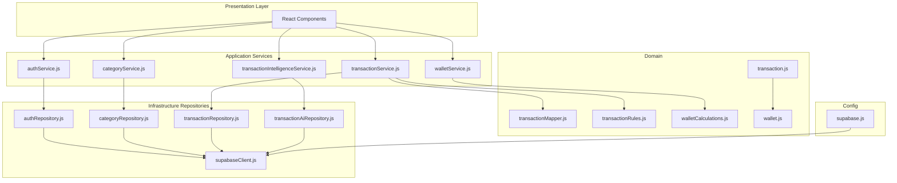
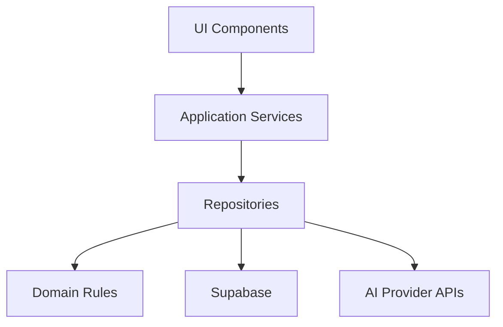
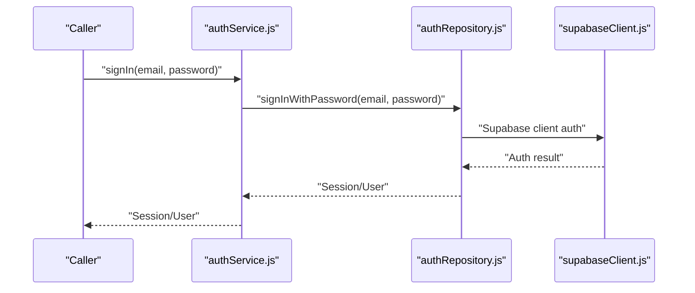
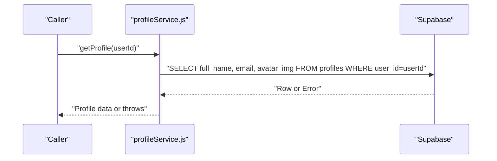
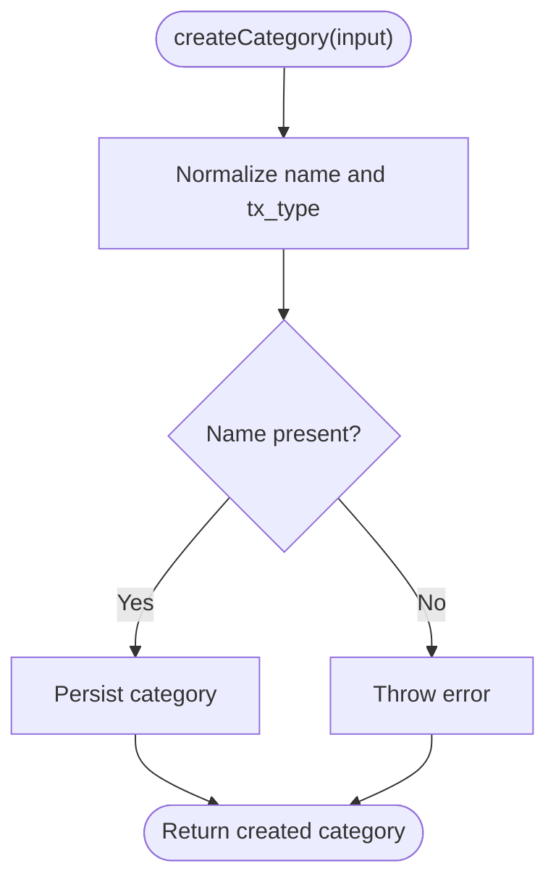
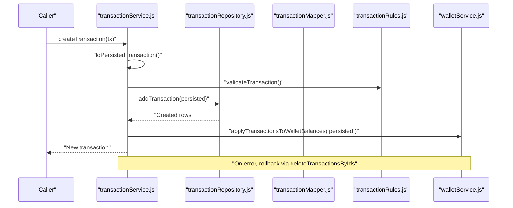
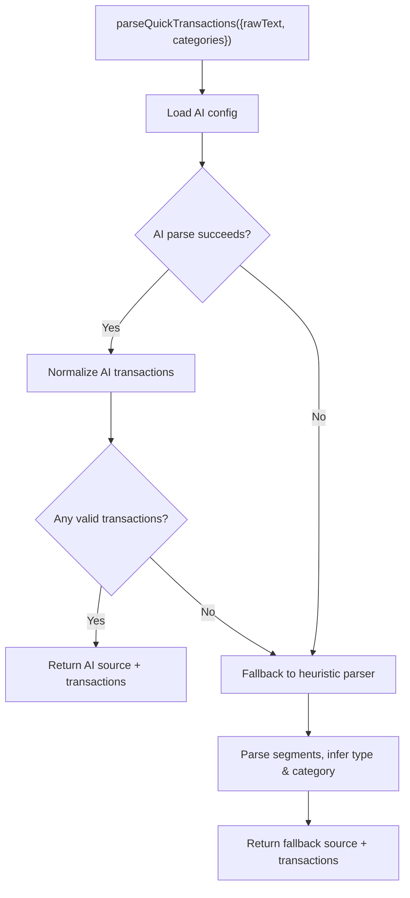
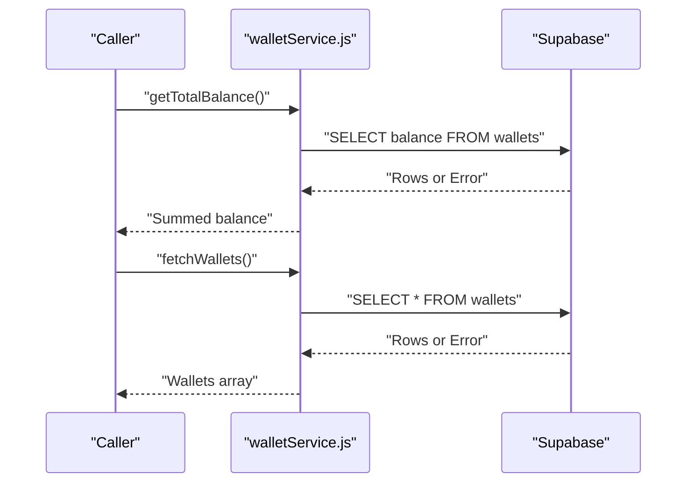
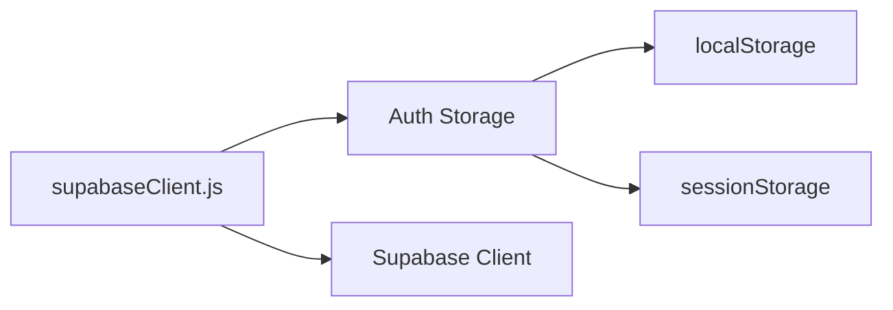
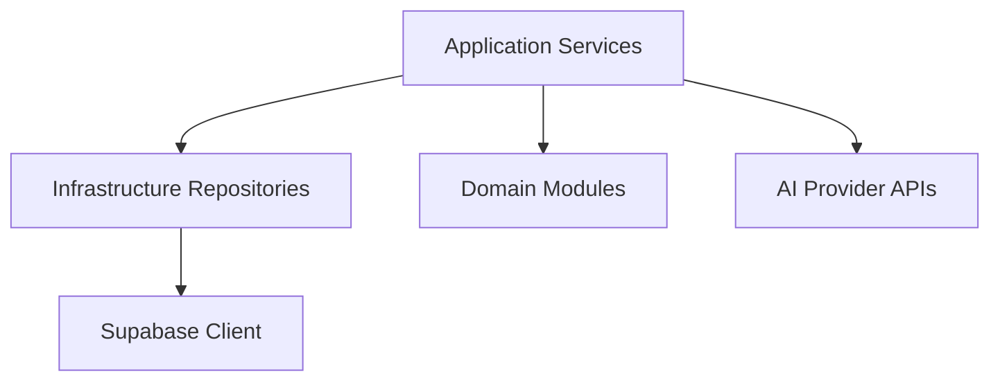

# API Services and Integration

<cite>
**Referenced Files in This Document**
- [authService.js](file://MoneyHey/src/application/services/authService.js)
- [categoryService.js](file://MoneyHey/src/application/services/categoryService.js)
- [transactionService.js](file://MoneyHey/src/application/services/transactionService.js)
- [transactionIntelligenceService.js](file://MoneyHey/src/application/services/transactionIntelligenceService.js)
- [walletService.js](file://MoneyHey/src/application/services/walletService.js)
- [authRepository.js](file://MoneyHey/src/infrastructure/repositories/authRepository.js)
- [categoryRepository.js](file://MoneyHey/src/infrastructure/repositories/categoryRepository.js)
- [transactionRepository.js](file://MoneyHey/src/infrastructure/repositories/transactionRepository.js)
- [transactionAiRepository.js](file://MoneyHey/src/infrastructure/repositories/transactionAiRepository.js)
- [supabaseClient.js](file://MoneyHey/src/infrastructure/supabaseClient.js)
- [supabase.js](file://MoneyHey/src/config/supabase.js)
- [transactionMapper.js](file://MoneyHey/src/domain/transactions/transactionMapper.js)
- [transactionRules.js](file://MoneyHey/src/domain/transactions/transactionRules.js)
- [walletCalculations.js](file://MoneyHey/src/domain/wallets/walletCalculations.js)
- [transaction.js](file://MoneyHey/MoneyHey/src/domain/transaction.js)
- [wallet.js](file://MoneyHey/MoneyHey/src/domain/wallet.js)
- [categoryRepo.js](file://MoneyHey/MoneyHey/src/api/categoryRepo.js)
- [transactionRepo.js](file://MoneyHey/MoneyHey/src/api/transactionRepo.js)
- [authService.js](file://MoneyHey/MoneyHey/src/services/authService.js)
- [categoryService.js](file://MoneyHey/MoneyHey/src/services/categoryService.js)
- [profileService.js](file://MoneyHey/MoneyHey/src/services/profileService.js)
- [transactionService.js](file://MoneyHey/MoneyHey/src/services/transactionService.js)
- [walletService.js](file://MoneyHey/MoneyHey/src/services/walletService.js)
</cite>

## Table of Contents
1. [Introduction](#introduction)
2. [Project Structure](#project-structure)
3. [Core Components](#core-components)
4. [Architecture Overview](#architecture-overview)
5. [Detailed Component Analysis](#detailed-component-analysis)
6. [Dependency Analysis](#dependency-analysis)
7. [Performance Considerations](#performance-considerations)
8. [Troubleshooting Guide](#troubleshooting-guide)
9. [Conclusion](#conclusion)
10. [Appendices](#appendices)

## Introduction
This document describes MoneyHey’s service layer and external integrations with a focus on the application services, repository implementations, Supabase client configuration, real-time capabilities, and transaction intelligence parsing. It also outlines authentication, profile management, category services, and transaction operations. Guidance on API usage, error handling, AI provider integration (OpenAI, Gemini), versioning, rate limiting, and performance optimization is included.

## Project Structure
The project follows a layered architecture:
- Application services orchestrate business logic and coordinate repositories.
- Infrastructure repositories encapsulate data access via Supabase and optional AI providers.
- Domain modules define validation, mapping, and calculations.
- Config and infrastructure modules centralize Supabase client creation and persistence.

**Diagram sources**
- [authService.js:1-7](file://MoneyHey/src/application/services/authService.js#L1-L7)
- [categoryService.js:1-34](file://MoneyHey/src/application/services/categoryService.js#L1-L34)
- [transactionService.js:1-133](file://MoneyHey/src/application/services/transactionService.js#L1-L133)
- [transactionIntelligenceService.js:1-179](file://MoneyHey/src/application/services/transactionIntelligenceService.js#L1-L179)
- [walletService.js:1-21](file://MoneyHey/src/application/services/walletService.js#L1-L21)
- [authRepository.js](file://MoneyHey/src/infrastructure/repositories/authRepository.js)
- [categoryRepository.js](file://MoneyHey/src/infrastructure/repositories/categoryRepository.js)
- [transactionRepository.js](file://MoneyHey/src/infrastructure/repositories/transactionRepository.js)
- [transactionAiRepository.js](file://MoneyHey/src/infrastructure/repositories/transactionAiRepository.js)
- [supabaseClient.js:1-33](file://MoneyHey/src/infrastructure/supabaseClient.js#L1-L33)
- [supabase.js:1-11](file://MoneyHey/src/config/supabase.js#L1-L11)
- [transactionMapper.js](file://MoneyHey/src/domain/transactions/transactionMapper.js)
- [transactionRules.js](file://MoneyHey/src/domain/transactions/transactionRules.js)
- [walletCalculations.js](file://MoneyHey/src/domain/wallets/walletCalculations.js)
- [transaction.js:1-50](file://MoneyHey/MoneyHey/src/domain/transaction.js#L1-L50)
- [wallet.js:1-6](file://MoneyHey/MoneyHey/src/domain/wallet.js#L1-L6)

**Section sources**
- [authService.js:1-7](file://MoneyHey/src/application/services/authService.js#L1-L7)
- [categoryService.js:1-34](file://MoneyHey/src/application/services/categoryService.js#L1-L34)
- [transactionService.js:1-133](file://MoneyHey/src/application/services/transactionService.js#L1-L133)
- [transactionIntelligenceService.js:1-179](file://MoneyHey/src/application/services/transactionIntelligenceService.js#L1-L179)
- [walletService.js:1-21](file://MoneyHey/src/application/services/walletService.js#L1-L21)
- [supabaseClient.js:1-33](file://MoneyHey/src/infrastructure/supabaseClient.js#L1-L33)
- [supabase.js:1-11](file://MoneyHey/src/config/supabase.js#L1-L11)

## Core Components
- Authentication Service: Provides sign-in, sign-out, session retrieval, and session persistence controls.
- Category Service: Fetches categories and creates normalized categories with optional transaction type.
- Transaction Service: CRUD operations for transactions with validation, mapping, and wallet balance adjustments.
- Transaction Intelligence Service: Parses unstructured text into structured transactions using AI or fallback heuristics.
- Wallet Service: Aggregates total balances and lists wallets.

**Section sources**
- [authService.js:1-7](file://MoneyHey/src/application/services/authService.js#L1-L7)
- [categoryService.js:1-34](file://MoneyHey/src/application/services/categoryService.js#L1-L34)
- [transactionService.js:1-133](file://MoneyHey/src/application/services/transactionService.js#L1-L133)
- [transactionIntelligenceService.js:1-179](file://MoneyHey/src/application/services/transactionIntelligenceService.js#L1-L179)
- [walletService.js:1-21](file://MoneyHey/src/application/services/walletService.js#L1-L21)

## Architecture Overview
The application employs a clean architecture pattern:
- Presentation layer interacts with application services.
- Application services depend on infrastructure repositories for data access.
- Domain modules encapsulate business rules and transformations.
- Supabase client is configured centrally and shared across repositories.

[No sources needed since this diagram shows conceptual workflow, not actual code structure]

## Detailed Component Analysis

### Authentication Service
- Responsibilities:
  - Authenticate users with credentials.
  - Manage sessions and user retrieval.
  - Control session persistence behavior.
- Methods:
  - signIn(email, password): Authenticates and returns session.
  - signOut(): Ends current session.
  - setSession(session): Sets a session programmatically.
  - getUser(): Retrieves current user.
  - setRememberSession(shouldRemember): Controls local/session storage for persistence.
- Persistence:
  - Uses a custom auth storage that prefers localStorage when “remember” is enabled; otherwise uses sessionStorage.
- Integration:
  - Delegates to infrastructure repository for actual auth operations.
  - Centralized Supabase client with configurable auth storage.

**Diagram sources**
- [authService.js:1-7](file://MoneyHey/src/application/services/authService.js#L1-L7)
- [authRepository.js](file://MoneyHey/src/infrastructure/repositories/authRepository.js)
- [supabaseClient.js:1-33](file://MoneyHey/src/infrastructure/supabaseClient.js#L1-L33)

**Section sources**
- [authService.js:1-7](file://MoneyHey/src/application/services/authService.js#L1-L7)
- [supabaseClient.js:1-33](file://MoneyHey/src/infrastructure/supabaseClient.js#L1-L33)

### Profile Management
- Responsibilities:
  - Retrieve user profile details (name, email, avatar) by user ID.
- Implementation:
  - Queries the profiles table with selected fields and enforces single-row expectation.
- Usage:
  - Callers pass a user ID; errors are thrown on failure.

**Diagram sources**
- [profileService.js:1-12](file://MoneyHey/MoneyHey/src/services/profileService.js#L1-L12)

**Section sources**
- [profileService.js:1-12](file://MoneyHey/MoneyHey/src/services/profileService.js#L1-L12)

### Category Services
- Responsibilities:
  - Fetch categories from the database.
  - Normalize and create categories with optional transaction type.
- Validation:
  - Category name is trimmed and required.
  - Transaction type must be one of expense, income, or empty/null.
- Usage:
  - fetchCategories(): Returns category list.
  - createCategory(input): Normalizes input and persists category.

**Diagram sources**
- [categoryService.js:1-34](file://MoneyHey/src/application/services/categoryService.js#L1-L34)

**Section sources**
- [categoryService.js:1-34](file://MoneyHey/src/application/services/categoryService.js#L1-L34)

### Transaction Services
- Responsibilities:
  - Fetch, create, update, delete, and filter transactions.
  - Apply transaction effects to wallet balances atomically.
  - Map relations and validate transactions.
- Methods:
  - fetchTransactions(userId): Returns mapped transactions with relations.
  - createTransaction(transaction): Validates, persists, adjusts balances, and returns created transaction.
  - createTransactions(transactions): Batch creation with rollback on partial failure.
  - updateTransaction(id, transaction): Reverses old effect, applies new effect, and persists.
  - removeTransaction(id): Reverses effect and deletes.
  - fetchTransactionsByType(type): Returns mapped transactions filtered by type.
- Validation:
  - Converts amounts to numbers and validates required fields and types.
- Mapping:
  - Joins related entities and enriches with computed fields.
- Balance Adjustments:
  - Applies reversals and updates before/after operations to maintain consistency.

**Diagram sources**
- [transactionService.js:1-133](file://MoneyHey/src/application/services/transactionService.js#L1-L133)
- [transactionRepository.js](file://MoneyHey/src/infrastructure/repositories/transactionRepository.js)
- [transactionMapper.js](file://MoneyHey/src/domain/transactions/transactionMapper.js)
- [transactionRules.js](file://MoneyHey/src/domain/transactions/transactionRules.js)

**Section sources**
- [transactionService.js:1-133](file://MoneyHey/src/application/services/transactionService.js#L1-L133)
- [transaction.js:1-50](file://MoneyHey/MoneyHey/src/domain/transaction.js#L1-L50)
- [wallet.js:1-6](file://MoneyHey/MoneyHey/src/domain/wallet.js#L1-L6)

### Transaction Intelligence API
- Responsibilities:
  - Parse free-text entries into structured transactions using AI or fallback heuristics.
- AI Parsing:
  - Reads AI configuration and attempts to parse via AI provider.
  - On failure or no valid output, falls back to deterministic parser.
- Fallback Parser:
  - Heuristic-based amount extraction, type inference, and category scoring.
- Outputs:
  - Unified structure indicating source (ai or fallback), provider label, model, reason, and parsed transactions.

**Diagram sources**
- [transactionIntelligenceService.js:1-179](file://MoneyHey/src/application/services/transactionIntelligenceService.js#L1-L179)
- [transactionAiRepository.js](file://MoneyHey/src/infrastructure/repositories/transactionAiRepository.js)

**Section sources**
- [transactionIntelligenceService.js:1-179](file://MoneyHey/src/application/services/transactionIntelligenceService.js#L1-L179)

### Wallet Services
- Responsibilities:
  - Compute total balance across wallets.
  - List wallets with full details.
- Implementation:
  - Queries wallets table, selects balances, and sums them up.
  - Handles errors by logging and rethrowing.

**Diagram sources**
- [walletService.js:1-21](file://MoneyHey/src/application/services/walletService.js#L1-L21)

**Section sources**
- [walletService.js:1-21](file://MoneyHey/src/application/services/walletService.js#L1-L21)
- [wallet.js:1-6](file://MoneyHey/MoneyHey/src/domain/wallet.js#L1-L6)

### Supabase Client Configuration and Real-Time Features
- Client Creation:
  - Centralized Supabase client with auth persistence and custom storage.
  - Session persistence controlled via setRememberSession.
- Storage Strategy:
  - Prefers localStorage when “remember” is enabled; otherwise uses sessionStorage.
- Real-Time:
  - Supabase supports real-time subscriptions; configure channels and listeners in repositories or services as needed.
- Security:
  - API keys are embedded in client configuration; ensure secure deployment and consider backend proxying in production.

**Diagram sources**
- [supabaseClient.js:1-33](file://MoneyHey/src/infrastructure/supabaseClient.js#L1-L33)

**Section sources**
- [supabaseClient.js:1-33](file://MoneyHey/src/infrastructure/supabaseClient.js#L1-L33)
- [supabase.js:1-11](file://MoneyHey/src/config/supabase.js#L1-L11)

### External API Integrations (OpenAI, Gemini)
- Integration Pattern:
  - AI parsing is delegated to transactionAiRepository; the intelligence service orchestrates fallback logic.
  - Configuration includes provider selection and endpoint/model metadata.
- Error Handling:
  - On AI failure, logs warning and falls back to heuristic parser with a reason message.
- Recommendations:
  - Implement retries with exponential backoff.
  - Enforce rate limits per provider.
  - Consider caching frequent category lookups and normalized text segments.

**Section sources**
- [transactionIntelligenceService.js:1-179](file://MoneyHey/src/application/services/transactionIntelligenceService.js#L1-L179)
- [transactionAiRepository.js](file://MoneyHey/src/infrastructure/repositories/transactionAiRepository.js)

## Dependency Analysis
- Application services depend on infrastructure repositories for data access.
- Transaction service depends on domain mappers and rules for validation and mapping.
- Wallet service depends on domain calculations for balance aggregation.
- Supabase client is injected into repositories and used for queries and mutations.
- AI parsing depends on transactionAiRepository and configuration.

**Diagram sources**
- [authService.js:1-7](file://MoneyHey/src/application/services/authService.js#L1-L7)
- [categoryService.js:1-34](file://MoneyHey/src/application/services/categoryService.js#L1-L34)
- [transactionService.js:1-133](file://MoneyHey/src/application/services/transactionService.js#L1-L133)
- [transactionIntelligenceService.js:1-179](file://MoneyHey/src/application/services/transactionIntelligenceService.js#L1-L179)
- [walletService.js:1-21](file://MoneyHey/src/application/services/walletService.js#L1-L21)
- [supabaseClient.js:1-33](file://MoneyHey/src/infrastructure/supabaseClient.js#L1-L33)

**Section sources**
- [authService.js:1-7](file://MoneyHey/src/application/services/authService.js#L1-L7)
- [categoryService.js:1-34](file://MoneyHey/src/application/services/categoryService.js#L1-L34)
- [transactionService.js:1-133](file://MoneyHey/src/application/services/transactionService.js#L1-L133)
- [transactionIntelligenceService.js:1-179](file://MoneyHey/src/application/services/transactionIntelligenceService.js#L1-L179)
- [walletService.js:1-21](file://MoneyHey/src/application/services/walletService.js#L1-L21)
- [supabaseClient.js:1-33](file://MoneyHey/src/infrastructure/supabaseClient.js#L1-L33)

## Performance Considerations
- Database Queries:
  - Use selective field lists and joins only when needed.
  - Paginate large datasets for transactions and categories.
- AI Parsing:
  - Cache normalized segments and frequently used categories.
  - Batch requests to AI providers when possible.
- Client-Side:
  - Debounce user input for quick-parse features.
  - Memoize derived computations (e.g., totals, charts).
- Supabase:
  - Leverage server-side filtering and indexing for frequent queries.
  - Use Supabase Realtime channels judiciously to avoid over-subscription.

[No sources needed since this section provides general guidance]

## Troubleshooting Guide
- Authentication:
  - Verify session persistence mode and storage key behavior.
  - Ensure correct credentials and network connectivity to Supabase.
- Transactions:
  - Validate transaction payloads before calling create/update.
  - Inspect returned errors from Supabase and handle gracefully.
- Categories:
  - Confirm category normalization and required fields.
- Wallets:
  - Check for database errors during balance aggregation.
- AI Parsing:
  - If AI fails, inspect reason and fall back to heuristic parser.
  - Verify AI configuration and endpoint/model availability.

**Section sources**
- [authService.js:1-7](file://MoneyHey/src/application/services/authService.js#L1-L7)
- [transactionService.js:1-133](file://MoneyHey/src/application/services/transactionService.js#L1-L133)
- [categoryService.js:1-34](file://MoneyHey/src/application/services/categoryService.js#L1-L34)
- [walletService.js:1-21](file://MoneyHey/src/application/services/walletService.js#L1-L21)
- [transactionIntelligenceService.js:1-179](file://MoneyHey/src/application/services/transactionIntelligenceService.js#L1-L179)

## Conclusion
MoneyHey’s service layer cleanly separates concerns across application services, infrastructure repositories, and domain modules. Supabase underpins data access with configurable persistence and storage. The transaction intelligence service integrates AI providers while maintaining robust fallback logic. Following the outlined patterns ensures maintainable, testable, and scalable integrations.

[No sources needed since this section summarizes without analyzing specific files]

## Appendices

### API Method Signatures and Parameter Specifications
- Authentication
  - signIn(email: string, password: string): Promise<Session | User>
  - signOut(): Promise<void>
  - setSession(session: any): Promise<void>
  - getUser(): Promise<User | null>
  - setRememberSession(shouldRemember: boolean): void
- Profile
  - getProfile(userId: string): Promise<Profile>
- Categories
  - fetchCategories(): Promise<Category[]>
  - createCategory(input: string | { categoryName: string; txType?: string | null }): Promise<Category>
- Transactions
  - fetchTransactions(userId: string): Promise<Transaction[]>
  - createTransaction(transaction: Omit<Transaction, 'trans_id'>): Promise<Transaction>
  - createTransactions(transactions: Omit<Transaction, 'trans_id'>[]): Promise<Transaction[]>
  - updateTransaction(id: string, transaction: Partial<Transaction>): Promise<Transaction>
  - removeTransaction(id: string): Promise<void>
  - fetchTransactionsByType(type: 'income' | 'expense'): Promise<Transaction[]>
- Wallets
  - getTotalBalance(): Promise<number>
  - fetchWallets(): Promise<Wallet[]>
- Transaction Intelligence
  - parseQuickTransactions(params: { rawText: string; categories: Category[] }): Promise<{
      source: 'ai' | 'fallback'
      provider: string
      providerLabel: string
      model: string
      reason?: string
      transactions: ParsedTransaction[]
    }>
- Domain Utilities
  - validateTransaction(transaction: any): boolean
  - filterTransactions(transactions: Transaction[], filters: Filters): Transaction[]
  - calculateTotalBalance(wallets: Wallet[]): number

**Section sources**
- [authService.js:1-7](file://MoneyHey/src/application/services/authService.js#L1-L7)
- [categoryService.js:1-34](file://MoneyHey/src/application/services/categoryService.js#L1-L34)
- [transactionService.js:1-133](file://MoneyHey/src/application/services/transactionService.js#L1-L133)
- [transactionIntelligenceService.js:1-179](file://MoneyHey/src/application/services/transactionIntelligenceService.js#L1-L179)
- [walletService.js:1-21](file://MoneyHey/src/application/services/walletService.js#L1-L21)
- [transaction.js:1-50](file://MoneyHey/MoneyHey/src/domain/transaction.js#L1-L50)
- [wallet.js:1-6](file://MoneyHey/MoneyHey/src/domain/wallet.js#L1-L6)

### Example Usage Scenarios
- Create a Transaction
  - Prepare transaction payload with amount, wallet_id, category_id, tx_date, tx_type.
  - Call createTransaction; on success, adjust UI state and optionally refresh wallet totals.
- Parse Quick Transactions
  - Provide rawText and categories; handle returned source and transactions.
  - If source is fallback, display reason and allow manual corrections.
- Manage Sessions
  - On login, call signIn; on logout, call signOut.
  - Use setRememberSession to toggle persistent sessions.

[No sources needed since this section provides general guidance]

### API Versioning, Rate Limiting, and Optimization
- Versioning:
  - Introduce a version prefix in repository methods or a global version constant for API endpoints.
- Rate Limiting:
  - Implement client-side throttling for AI requests.
  - Respect provider quotas and retry after backoff.
- Optimization:
  - Cache category and normalized text lookups.
  - Use batch operations for multiple transaction creations.
  - Minimize Supabase round-trips by combining queries where feasible.

[No sources needed since this section provides general guidance]