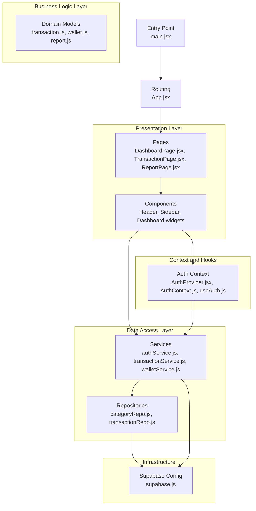
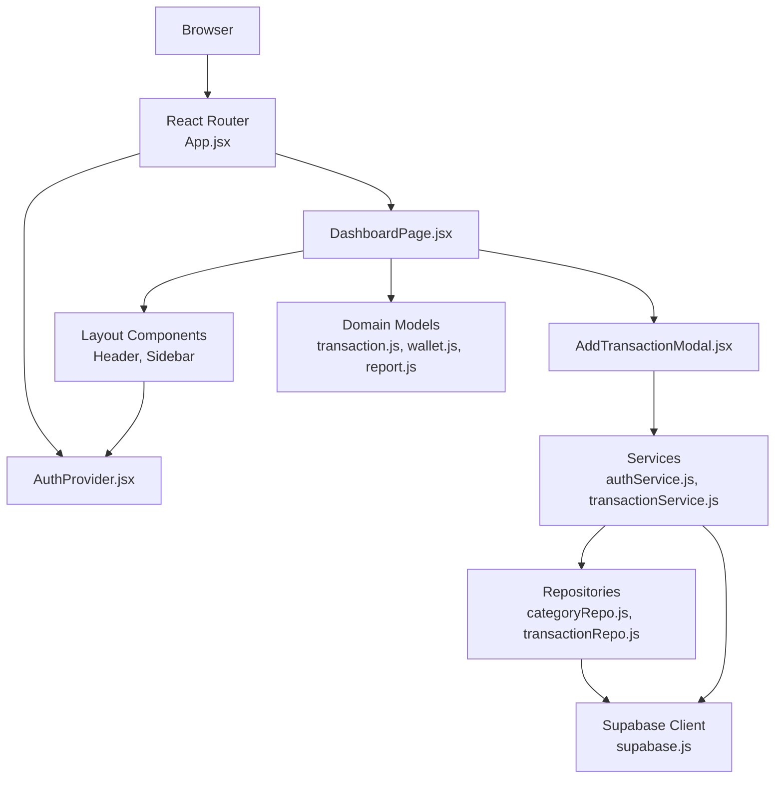
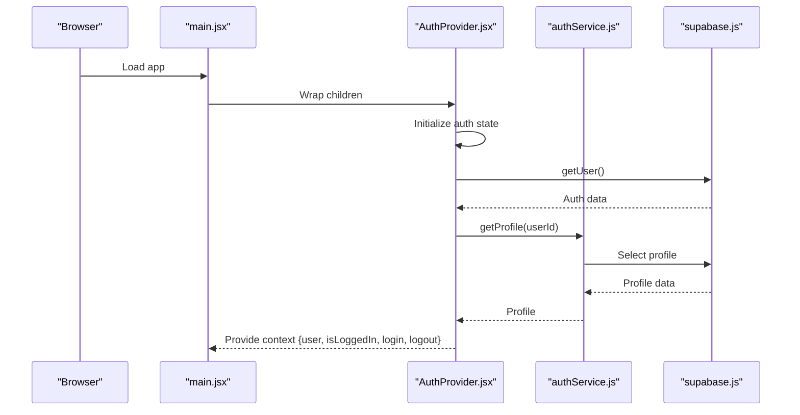
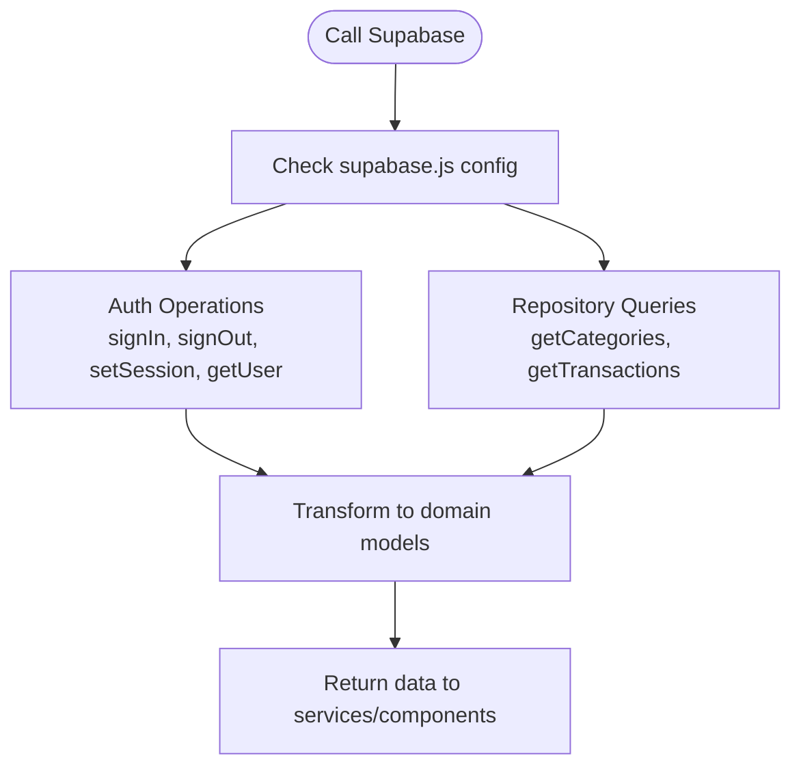
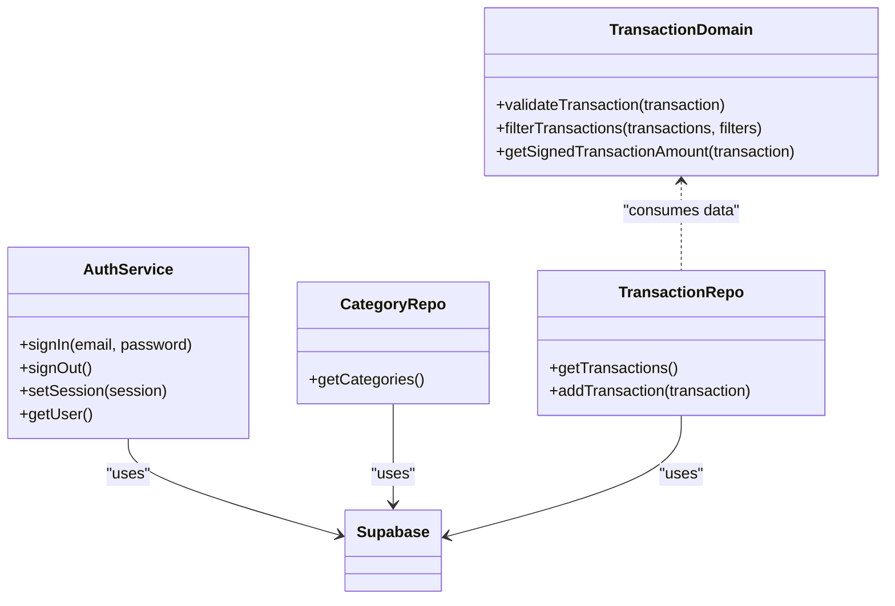
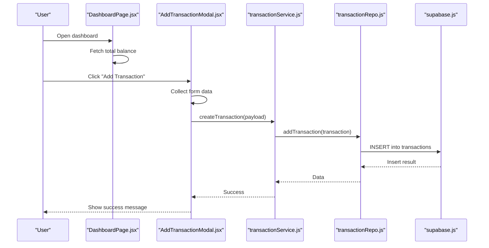
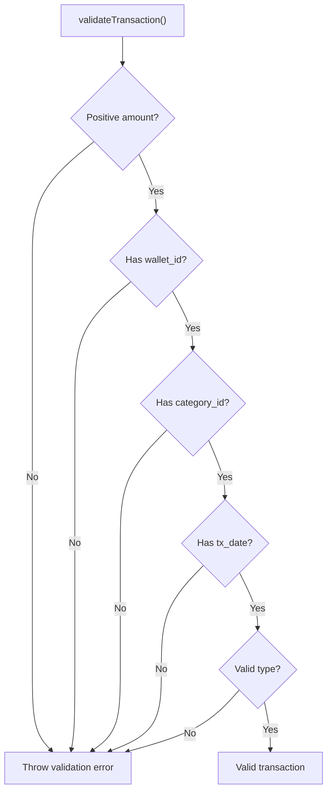
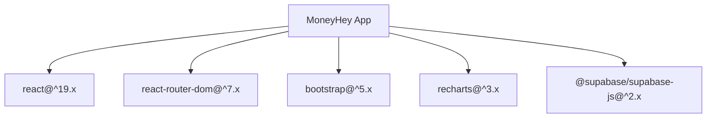

# Architecture Overview

<cite>
**Referenced Files in This Document**
- [main.jsx](file://MoneyHey/src/main.jsx)
- [App.jsx](file://MoneyHey/src/App.jsx)
- [AuthProvider.jsx](file://MoneyHey/src/context/AuthProvider.jsx)
- [AuthContext.js](file://MoneyHey/src/context/AuthContext.js)
- [useAuth.js](file://MoneyHey/src/hooks/useAuth.js)
- [ProtectedRoute.jsx](file://MoneyHey/src/components/auth/ProtectedRoute.jsx)
- [supabase.js](file://MoneyHey/src/config/supabase.js)
- [authService.js](file://MoneyHey/src/services/authService.js)
- [categoryRepo.js](file://MoneyHey/src/api/categoryRepo.js)
- [transactionRepo.js](file://MoneyHey/src/api/transactionRepo.js)
- [transaction.js](file://MoneyHey/src/domain/transaction.js)
- [wallet.js](file://MoneyHey/src/domain/wallet.js)
- [report.js](file://MoneyHey/src/domain/report.js)
- [DashboardPage.jsx](file://MoneyHey/src/pages/DashboardPage.jsx)
- [RecentTransactions.jsx](file://MoneyHey/src/components/dashboard/RecentTransactions.jsx)
- [AddTransactionModal.jsx](file://MoneyHey/src/components/transaction/AddTransactionModal.jsx)
- [package.json](file://MoneyHey/package.json)
- [README.md](file://MoneyHey/README.md)
</cite>

## Table of Contents
1. [Introduction](#introduction)
2. [Project Structure](#project-structure)
3. [Core Components](#core-components)
4. [Architecture Overview](#architecture-overview)
5. [Detailed Component Analysis](#detailed-component-analysis)
6. [Dependency Analysis](#dependency-analysis)
7. [Performance Considerations](#performance-considerations)
8. [Troubleshooting Guide](#troubleshooting-guide)
9. [Conclusion](#conclusion)

## Introduction
This document presents the architecture of MoneyHey, a React-based personal finance application. The system follows a layered architecture separating presentation, business logic, and data access concerns. It integrates with Supabase for authentication and database operations, and uses a service layer pattern with repository-style APIs for data access. The frontend employs React with React Router for navigation, a centralized authentication context for state management, and Bootstrap for UI components.

## Project Structure
The project is organized into distinct layers:
- Presentation Layer: Pages and components under MoneyHey/src/pages and MoneyHey/src/components handle UI rendering and user interactions.
- Business Logic Layer: Domain models under MoneyHey/src/domain encapsulate business rules and calculations.
- Data Access Layer: Services under MoneyHey/src/services and repositories under MoneyHey/src/api abstract Supabase operations.
- Infrastructure: Supabase client configuration under MoneyHey/src/config.
- Context and Hooks: Authentication context and hook under MoneyHey/src/context and MoneyHey/src/hooks.
- Application Bootstrap: Entry point under MoneyHey/src/main.jsx and routing under MoneyHey/src/App.jsx.

**Diagram sources**
- [main.jsx:1-20](file://MoneyHey/src/main.jsx#L1-L20)
- [App.jsx:1-43](file://MoneyHey/src/App.jsx#L1-L43)
- [AuthProvider.jsx:1-98](file://MoneyHey/src/context/AuthProvider.jsx#L1-L98)
- [AuthContext.js:1-4](file://MoneyHey/src/context/AuthContext.js#L1-L4)
- [useAuth.js:1-7](file://MoneyHey/src/hooks/useAuth.js#L1-L7)
- [supabase.js:1-11](file://MoneyHey/src/config/supabase.js#L1-L11)
- [authService.js:1-11](file://MoneyHey/src/services/authService.js#L1-L11)
- [categoryRepo.js:1-11](file://MoneyHey/src/api/categoryRepo.js#L1-L11)
- [transactionRepo.js:1-26](file://MoneyHey/src/api/transactionRepo.js#L1-L26)
- [transaction.js:1-50](file://MoneyHey/src/domain/transaction.js#L1-L50)
- [wallet.js:1-6](file://MoneyHey/src/domain/wallet.js#L1-L6)
- [report.js:1-32](file://MoneyHey/src/domain/report.js#L1-L32)
- [DashboardPage.jsx:1-94](file://MoneyHey/src/pages/DashboardPage.jsx#L1-L94)
- [RecentTransactions.jsx:1-50](file://MoneyHey/src/components/dashboard/RecentTransactions.jsx#L1-L50)
- [AddTransactionModal.jsx:1-171](file://MoneyHey/src/components/transaction/AddTransactionModal.jsx#L1-L171)

**Section sources**
- [main.jsx:1-20](file://MoneyHey/src/main.jsx#L1-L20)
- [App.jsx:1-43](file://MoneyHey/src/App.jsx#L1-L43)

## Core Components
- Entry Point and Routing: The application initializes React DOM, wraps the app with routing and authentication context, and defines routes guarded by a protected route component.
- Authentication Context: Provides centralized authentication state, login/logout actions, and user profile hydration via Supabase.
- Supabase Integration: Centralized client creation and configuration for authentication and database operations.
- Service Layer: Thin wrappers around Supabase operations for authentication and CRUD operations.
- Repository Pattern: Data access functions that encapsulate Supabase queries and transformations.
- Domain Models: Business rules for transactions, wallets, and reports.
- Presentation Components: Page components and reusable UI components for dashboards, forms, and lists.

**Section sources**
- [main.jsx:1-20](file://MoneyHey/src/main.jsx#L1-L20)
- [App.jsx:1-43](file://MoneyHey/src/App.jsx#L1-L43)
- [AuthProvider.jsx:1-98](file://MoneyHey/src/context/AuthProvider.jsx#L1-L98)
- [AuthContext.js:1-4](file://MoneyHey/src/context/AuthContext.js#L1-L4)
- [useAuth.js:1-7](file://MoneyHey/src/hooks/useAuth.js#L1-L7)
- [ProtectedRoute.jsx:1-7](file://MoneyHey/src/components/auth/ProtectedRoute.jsx#L1-L7)
- [supabase.js:1-11](file://MoneyHey/src/config/supabase.js#L1-L11)
- [authService.js:1-11](file://MoneyHey/src/services/authService.js#L1-L11)
- [categoryRepo.js:1-11](file://MoneyHey/src/api/categoryRepo.js#L1-L11)
- [transactionRepo.js:1-26](file://MoneyHey/src/api/transactionRepo.js#L1-L26)
- [transaction.js:1-50](file://MoneyHey/src/domain/transaction.js#L1-L50)
- [wallet.js:1-6](file://MoneyHey/src/domain/wallet.js#L1-L6)
- [report.js:1-32](file://MoneyHey/src/domain/report.js#L1-L32)

## Architecture Overview
MoneyHey adopts a layered architecture:
- Presentation Layer: React components and pages manage UI and user interactions. Navigation is handled by React Router with protected routes.
- Business Logic Layer: Domain modules enforce business rules for transactions, wallets, and reporting.
- Data Access Layer: Services abstract Supabase operations; repositories encapsulate database queries and response transformations.
- Infrastructure: Supabase client provides authentication and database connectivity.

**Diagram sources**
- [App.jsx:1-43](file://MoneyHey/src/App.jsx#L1-L43)
- [AuthProvider.jsx:1-98](file://MoneyHey/src/context/AuthProvider.jsx#L1-L98)
- [DashboardPage.jsx:1-94](file://MoneyHey/src/pages/DashboardPage.jsx#L1-L94)
- [AddTransactionModal.jsx:1-171](file://MoneyHey/src/components/transaction/AddTransactionModal.jsx#L1-L171)
- [authService.js:1-11](file://MoneyHey/src/services/authService.js#L1-L11)
- [categoryRepo.js:1-11](file://MoneyHey/src/api/categoryRepo.js#L1-L11)
- [transactionRepo.js:1-26](file://MoneyHey/src/api/transactionRepo.js#L1-L26)
- [supabase.js:1-11](file://MoneyHey/src/config/supabase.js#L1-L11)
- [transaction.js:1-50](file://MoneyHey/src/domain/transaction.js#L1-L50)
- [wallet.js:1-6](file://MoneyHey/src/domain/wallet.js#L1-L6)
- [report.js:1-32](file://MoneyHey/src/domain/report.js#L1-L32)

## Detailed Component Analysis

### Authentication Context and Protected Routes
- AuthProvider initializes authentication state, restores sessions from local storage, hydrates user profile, and exposes login/logout functions.
- ProtectedRoute ensures unauthenticated users are redirected to the login page.
- useAuth provides a convenient hook to consume authentication state across components.

**Diagram sources**
- [main.jsx:1-20](file://MoneyHey/src/main.jsx#L1-L20)
- [AuthProvider.jsx:1-98](file://MoneyHey/src/context/AuthProvider.jsx#L1-L98)
- [authService.js:1-11](file://MoneyHey/src/services/authService.js#L1-L11)
- [supabase.js:1-11](file://MoneyHey/src/config/supabase.js#L1-L11)

**Section sources**
- [AuthProvider.jsx:1-98](file://MoneyHey/src/context/AuthProvider.jsx#L1-L98)
- [AuthContext.js:1-4](file://MoneyHey/src/context/AuthContext.js#L1-L4)
- [useAuth.js:1-7](file://MoneyHey/src/hooks/useAuth.js#L1-L7)
- [ProtectedRoute.jsx:1-7](file://MoneyHey/src/components/auth/ProtectedRoute.jsx#L1-L7)

### Supabase Integration
- Supabase client is configured with URL and API key, disabling session persistence to avoid stale sessions.
- Authentication service exposes sign-in, sign-out, session restoration, and user retrieval.
- Repositories encapsulate database queries and transform results for the UI.

**Diagram sources**
- [supabase.js:1-11](file://MoneyHey/src/config/supabase.js#L1-L11)
- [authService.js:1-11](file://MoneyHey/src/services/authService.js#L1-L11)
- [categoryRepo.js:1-11](file://MoneyHey/src/api/categoryRepo.js#L1-L11)
- [transactionRepo.js:1-26](file://MoneyHey/src/api/transactionRepo.js#L1-L26)

**Section sources**
- [supabase.js:1-11](file://MoneyHey/src/config/supabase.js#L1-L11)
- [authService.js:1-11](file://MoneyHey/src/services/authService.js#L1-L11)
- [categoryRepo.js:1-11](file://MoneyHey/src/api/categoryRepo.js#L1-L11)
- [transactionRepo.js:1-26](file://MoneyHey/src/api/transactionRepo.js#L1-L26)

### Service Layer and Repository Pattern
- Services wrap Supabase operations and expose higher-level functions for components.
- Repositories encapsulate database queries and handle response mapping and error logging.
- Domain models validate and compute derived values for UI consumption.

**Diagram sources**
- [authService.js:1-11](file://MoneyHey/src/services/authService.js#L1-L11)
- [categoryRepo.js:1-11](file://MoneyHey/src/api/categoryRepo.js#L1-L11)
- [transactionRepo.js:1-26](file://MoneyHey/src/api/transactionRepo.js#L1-L26)
- [transaction.js:1-50](file://MoneyHey/src/domain/transaction.js#L1-L50)

**Section sources**
- [authService.js:1-11](file://MoneyHey/src/services/authService.js#L1-L11)
- [categoryRepo.js:1-11](file://MoneyHey/src/api/categoryRepo.js#L1-L11)
- [transactionRepo.js:1-26](file://MoneyHey/src/api/transactionRepo.js#L1-L26)
- [transaction.js:1-50](file://MoneyHey/src/domain/transaction.js#L1-L50)

### Dashboard and Transaction UI Flow
- DashboardPage orchestrates layout, sidebar state, and balance computation via services.
- RecentTransactions displays mock data for demonstration.
- AddTransactionModal collects form inputs, injects current user ID, and submits via service.

**Diagram sources**
- [DashboardPage.jsx:1-94](file://MoneyHey/src/pages/DashboardPage.jsx#L1-L94)
- [AddTransactionModal.jsx:1-171](file://MoneyHey/src/components/transaction/AddTransactionModal.jsx#L1-L171)
- [transactionRepo.js:1-26](file://MoneyHey/src/api/transactionRepo.js#L1-L26)
- [supabase.js:1-11](file://MoneyHey/src/config/supabase.js#L1-L11)

**Section sources**
- [DashboardPage.jsx:1-94](file://MoneyHey/src/pages/DashboardPage.jsx#L1-L94)
- [RecentTransactions.jsx:1-50](file://MoneyHey/src/components/dashboard/RecentTransactions.jsx#L1-L50)
- [AddTransactionModal.jsx:1-171](file://MoneyHey/src/components/transaction/AddTransactionModal.jsx#L1-L171)

### Business Rules and Calculations
- Transaction validation enforces required fields and type constraints.
- Filtering supports date range and category selection.
- Wallet totals and report summaries compute derived metrics.

**Diagram sources**
- [transaction.js:1-50](file://MoneyHey/src/domain/transaction.js#L1-L50)

**Section sources**
- [transaction.js:1-50](file://MoneyHey/src/domain/transaction.js#L1-L50)
- [wallet.js:1-6](file://MoneyHey/src/domain/wallet.js#L1-L6)
- [report.js:1-32](file://MoneyHey/src/domain/report.js#L1-L32)

## Dependency Analysis
External dependencies include React, React Router, Bootstrap, Recharts, and Supabase client. These dependencies define the runtime environment and integration points.

**Diagram sources**
- [package.json:12-19](file://MoneyHey/package.json#L12-L19)

**Section sources**
- [package.json:1-32](file://MoneyHey/package.json#L1-L32)

## Performance Considerations
- Minimize unnecessary re-renders by keeping authentication state in a dedicated context and passing only required props to components.
- Defer heavy computations to domain modules and memoize derived values.
- Use efficient filtering and mapping in repositories to reduce UI overhead.
- Avoid blocking the main thread with long-running operations; leverage asynchronous service calls.

## Troubleshooting Guide
- Authentication initialization errors: Verify Supabase credentials and network connectivity; check local storage session validity.
- Transaction submission failures: Confirm required fields, numeric amounts, and selected wallet/category; inspect console logs for thrown validation errors.
- Data fetching issues: Ensure repository queries return expected shapes and handle errors gracefully; validate foreign keys and relationships.

**Section sources**
- [AuthProvider.jsx:49-55](file://MoneyHey/src/context/AuthProvider.jsx#L49-L55)
- [AddTransactionModal.jsx:31-50](file://MoneyHey/src/components/transaction/AddTransactionModal.jsx#L31-L50)
- [transactionRepo.js:8-11](file://MoneyHey/src/api/transactionRepo.js#L8-L11)

## Conclusion
MoneyHey’s architecture cleanly separates presentation, business logic, and data access while integrating tightly with Supabase for authentication and persistence. The service and repository patterns simplify data operations, and the authentication context centralizes state management. The layered design promotes maintainability, testability, and scalability as the application evolves.