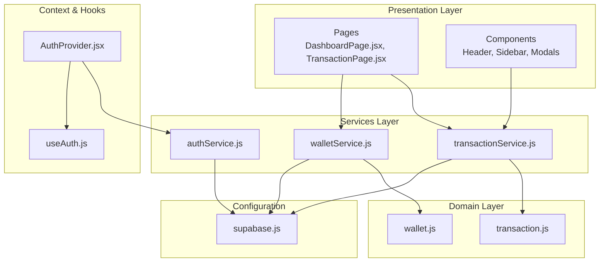
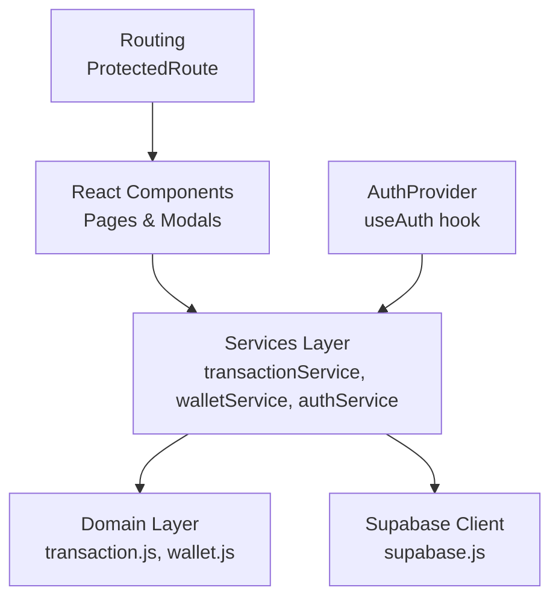
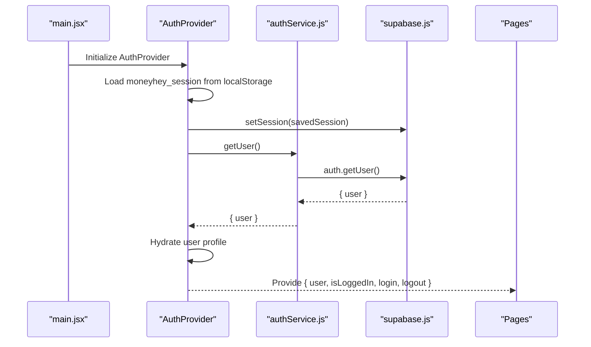
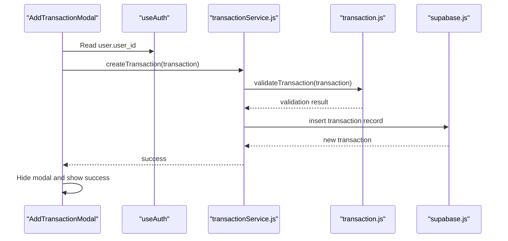
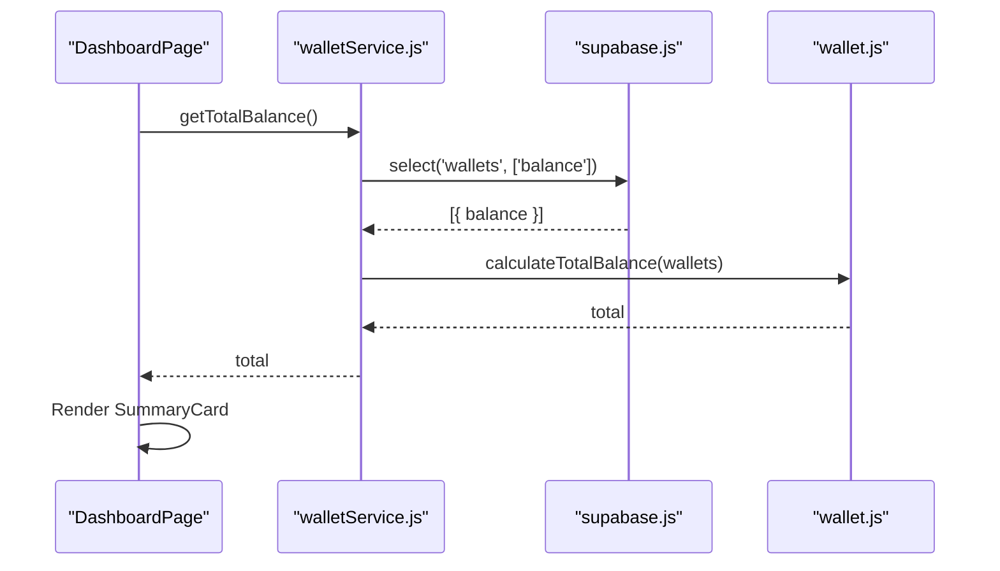
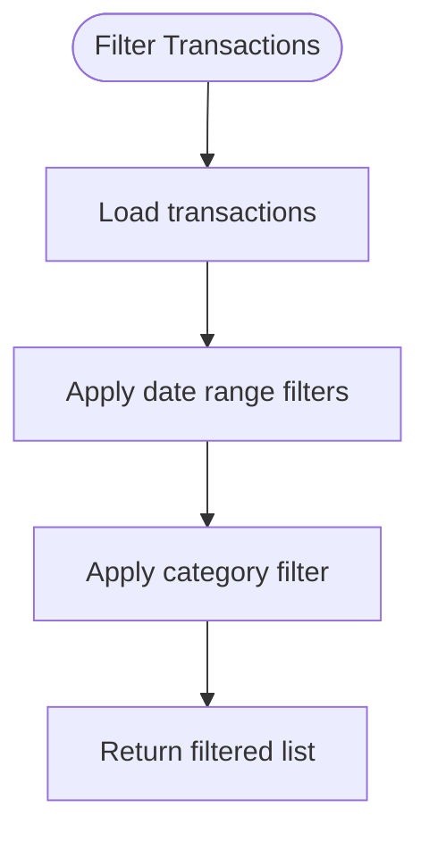
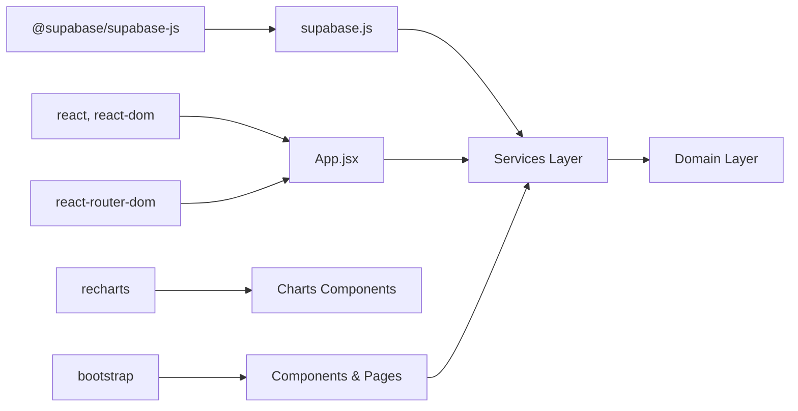

# Technical Architecture and Design Guide

<cite>
**Referenced Files in This Document**
- [README.md](file://MoneyHey/README.md)
- [package.json](file://MoneyHey/package.json)
- [main.jsx](file://MoneyHey/src/main.jsx)
- [App.jsx](file://MoneyHey/src/App.jsx)
- [AuthProvider.jsx](file://MoneyHey/src/context/AuthProvider.jsx)
- [useAuth.js](file://MoneyHey/src/hooks/useAuth.js)
- [ProtectedRoute.jsx](file://MoneyHey/src/components/auth/ProtectedRoute.jsx)
- [supabase.js](file://MoneyHey/src/config/supabase.js)
- [authService.js](file://MoneyHey/src/services/authService.js)
- [transactionService.js](file://MoneyHey/src/services/transactionService.js)
- [walletService.js](file://MoneyHey/src/services/walletService.js)
- [transaction.js](file://MoneyHey/src/domain/transaction.js)
- [wallet.js](file://MoneyHey/src/domain/wallet.js)
- [DashboardPage.jsx](file://MoneyHey/src/pages/DashboardPage.jsx)
- [TransactionPage.jsx](file://MoneyHey/src/pages/TransactionPage.jsx)
- [AddTransactionModal.jsx](file://MoneyHey/src/components/transaction/AddTransactionModal.jsx)
</cite>

## Table of Contents
1. [Introduction](#introduction)
2. [Project Structure](#project-structure)
3. [Core Components](#core-components)
4. [Architecture Overview](#architecture-overview)
5. [Detailed Component Analysis](#detailed-component-analysis)
6. [Dependency Analysis](#dependency-analysis)
7. [Performance Considerations](#performance-considerations)
8. [Troubleshooting Guide](#troubleshooting-guide)
9. [Conclusion](#conclusion)

## Introduction
This document presents a comprehensive technical architecture and design guide for the MoneyHey application. It explains the system's layered architecture, component relationships, data flows, and integration points. The application follows a React-based frontend with Supabase for backend-as-a-service authentication and data persistence, organized into clear layers: presentation (pages and components), services (business logic and API orchestration), domain (validation and calculations), and configuration (Supabase client).

## Project Structure
The project is structured around a classic React SPA with a clear separation of concerns:
- Presentation Layer: Pages and components under `src/pages` and `src/components`
- Services Layer: Business logic and external API orchestration under `src/services`
- Domain Layer: Validation and calculation utilities under `src/domain`
- Configuration: Supabase client initialization under `src/config`
- Context and Hooks: Authentication state management under `src/context` and `src/hooks`
- Application Bootstrap: Entry point under `src/main.jsx` and routing under `src/App.jsx`

**Diagram sources**
- [main.jsx:1-20](file://MoneyHey/src/main.jsx#L1-L20)
- [App.jsx:1-43](file://MoneyHey/src/App.jsx#L1-L43)
- [AuthProvider.jsx:1-98](file://MoneyHey/src/context/AuthProvider.jsx#L1-L98)
- [useAuth.js:1-7](file://MoneyHey/src/hooks/useAuth.js#L1-L7)
- [supabase.js:1-11](file://MoneyHey/src/config/supabase.js#L1-L11)
- [authService.js:1-11](file://MoneyHey/src/services/authService.js#L1-L11)
- [transactionService.js:1-24](file://MoneyHey/src/services/transactionService.js#L1-L24)
- [walletService.js:1-21](file://MoneyHey/src/services/walletService.js#L1-L21)
- [transaction.js:1-50](file://MoneyHey/src/domain/transaction.js#L1-L50)
- [wallet.js:1-6](file://MoneyHey/src/domain/wallet.js#L1-L6)
- [DashboardPage.jsx:1-94](file://MoneyHey/src/pages/DashboardPage.jsx#L1-L94)
- [TransactionPage.jsx:1-128](file://MoneyHey/src/pages/TransactionPage.jsx#L1-L128)
- [AddTransactionModal.jsx:1-171](file://MoneyHey/src/components/transaction/AddTransactionModal.jsx#L1-L171)

**Section sources**
- [main.jsx:1-20](file://MoneyHey/src/main.jsx#L1-L20)
- [App.jsx:1-43](file://MoneyHey/src/App.jsx#L1-L43)
- [package.json:1-32](file://MoneyHey/package.json#L1-L32)

## Core Components
- Application bootstrap initializes routing, authentication provider, and global styles.
- Routing defines public and protected routes, with a dedicated protected route wrapper.
- Authentication provider manages session lifecycle, user profile hydration, and exposes login/logout to the app.
- Supabase client encapsulates backend connectivity and auth operations.
- Services orchestrate domain validations and data access patterns against Supabase.
- Domain utilities enforce business rules and perform calculations.
- Pages coordinate data fetching and render lists, forms, and charts.

**Section sources**
- [main.jsx:1-20](file://MoneyHey/src/main.jsx#L1-L20)
- [App.jsx:1-43](file://MoneyHey/src/App.jsx#L1-L43)
- [AuthProvider.jsx:1-98](file://MoneyHey/src/context/AuthProvider.jsx#L1-L98)
- [ProtectedRoute.jsx:1-7](file://MoneyHey/src/components/auth/ProtectedRoute.jsx#L1-L7)
- [supabase.js:1-11](file://MoneyHey/src/config/supabase.js#L1-L11)
- [authService.js:1-11](file://MoneyHey/src/services/authService.js#L1-L11)
- [transactionService.js:1-24](file://MoneyHey/src/services/transactionService.js#L1-L24)
- [walletService.js:1-21](file://MoneyHey/src/services/walletService.js#L1-L21)
- [transaction.js:1-50](file://MoneyHey/src/domain/transaction.js#L1-L50)
- [wallet.js:1-6](file://MoneyHey/src/domain/wallet.js#L1-L6)

## Architecture Overview
The system follows a layered architecture:
- Presentation Layer: Pages and components render UI and collect user input.
- Services Layer: Encapsulate business logic and coordinate domain validations and data retrieval.
- Domain Layer: Provide pure functions for validation and calculations.
- Infrastructure: Supabase client handles authentication and database operations.
- Context/Hooks: Centralized authentication state and convenience hooks.

**Diagram sources**
- [App.jsx:1-43](file://MoneyHey/src/App.jsx#L1-L43)
- [AuthProvider.jsx:1-98](file://MoneyHey/src/context/AuthProvider.jsx#L1-L98)
- [useAuth.js:1-7](file://MoneyHey/src/hooks/useAuth.js#L1-L7)
- [ProtectedRoute.jsx:1-7](file://MoneyHey/src/components/auth/ProtectedRoute.jsx#L1-L7)
- [transactionService.js:1-24](file://MoneyHey/src/services/transactionService.js#L1-L24)
- [walletService.js:1-21](file://MoneyHey/src/services/walletService.js#L1-L21)
- [authService.js:1-11](file://MoneyHey/src/services/authService.js#L1-L11)
- [transaction.js:1-50](file://MoneyHey/src/domain/transaction.js#L1-L50)
- [wallet.js:1-6](file://MoneyHey/src/domain/wallet.js#L1-L6)
- [supabase.js:1-11](file://MoneyHey/src/config/supabase.js#L1-L11)

## Detailed Component Analysis

### Authentication Flow
The authentication flow integrates Supabase auth with local session storage and a React context provider. On startup, the provider attempts to restore a persisted session, validates expiration, sets the session if valid, and hydrates user profile data. Login and logout update the context state and clear stored sessions.

**Diagram sources**
- [main.jsx:1-20](file://MoneyHey/src/main.jsx#L1-L20)
- [AuthProvider.jsx:1-98](file://MoneyHey/src/context/AuthProvider.jsx#L1-L98)
- [authService.js:1-11](file://MoneyHey/src/services/authService.js#L1-L11)
- [supabase.js:1-11](file://MoneyHey/src/config/supabase.js#L1-L11)

**Section sources**
- [AuthProvider.jsx:1-98](file://MoneyHey/src/context/AuthProvider.jsx#L1-L98)
- [authService.js:1-11](file://MoneyHey/src/services/authService.js#L1-L11)
- [supabase.js:1-11](file://MoneyHey/src/config/supabase.js#L1-L11)

### Transaction Creation Workflow
This workflow demonstrates the end-to-end process for adding a transaction: form collection, domain validation, service orchestration, and UI feedback.

**Diagram sources**
- [AddTransactionModal.jsx:1-171](file://MoneyHey/src/components/transaction/AddTransactionModal.jsx#L1-L171)
- [useAuth.js:1-7](file://MoneyHey/src/hooks/useAuth.js#L1-L7)
- [transactionService.js:1-24](file://MoneyHey/src/services/transactionService.js#L1-L24)
- [transaction.js:1-50](file://MoneyHey/src/domain/transaction.js#L1-L50)
- [supabase.js:1-11](file://MoneyHey/src/config/supabase.js#L1-L11)

**Section sources**
- [AddTransactionModal.jsx:1-171](file://MoneyHey/src/components/transaction/AddTransactionModal.jsx#L1-L171)
- [transactionService.js:1-24](file://MoneyHey/src/services/transactionService.js#L1-L24)
- [transaction.js:1-50](file://MoneyHey/src/domain/transaction.js#L1-L50)

### Dashboard Data Flow
The dashboard fetches aggregated wallet balances using domain calculations and displays summary metrics.

**Diagram sources**
- [DashboardPage.jsx:1-94](file://MoneyHey/src/pages/DashboardPage.jsx#L1-L94)
- [walletService.js:1-21](file://MoneyHey/src/services/walletService.js#L1-L21)
- [wallet.js:1-6](file://MoneyHey/src/domain/wallet.js#L1-L6)
- [supabase.js:1-11](file://MoneyHey/src/config/supabase.js#L1-L11)

**Section sources**
- [DashboardPage.jsx:1-94](file://MoneyHey/src/pages/DashboardPage.jsx#L1-L94)
- [walletService.js:1-21](file://MoneyHey/src/services/walletService.js#L1-L21)
- [wallet.js:1-6](file://MoneyHey/src/domain/wallet.js#L1-L6)

### Transaction Filtering Logic
The filtering pipeline applies date range and category constraints to the transaction list.

**Diagram sources**
- [transaction.js:34-44](file://MoneyHey/src/domain/transaction.js#L34-L44)
- [TransactionPage.jsx:63-70](file://MoneyHey/src/pages/TransactionPage.jsx#L63-L70)

**Section sources**
- [transaction.js:34-44](file://MoneyHey/src/domain/transaction.js#L34-L44)
- [TransactionPage.jsx:63-70](file://MoneyHey/src/pages/TransactionPage.jsx#L63-L70)

## Dependency Analysis
External dependencies include React, React Router DOM, Bootstrap, Recharts, and Supabase. Internal dependencies are organized by layers, with services depending on domain utilities and the Supabase client, while presentation components depend on services and context.

**Diagram sources**
- [package.json:1-32](file://MoneyHey/package.json#L1-L32)
- [App.jsx:1-43](file://MoneyHey/src/App.jsx#L1-L43)
- [supabase.js:1-11](file://MoneyHey/src/config/supabase.js#L1-L11)
- [transactionService.js:1-24](file://MoneyHey/src/services/transactionService.js#L1-L24)
- [walletService.js:1-21](file://MoneyHey/src/services/walletService.js#L1-L21)
- [transaction.js:1-50](file://MoneyHey/src/domain/transaction.js#L1-L50)
- [wallet.js:1-6](file://MoneyHey/src/domain/wallet.js#L1-L6)

**Section sources**
- [package.json:1-32](file://MoneyHey/package.json#L1-L32)

## Performance Considerations
- Minimize unnecessary re-renders by keeping state close to where it is used (e.g., page-level state for transactions).
- Debounce or batch UI updates when applying filters to avoid excessive renders during rapid input changes.
- Use pagination effectively to limit the number of items rendered at once in lists.
- Cache frequently accessed data (e.g., categories and wallets) in component state to reduce repeated network requests.
- Avoid heavy computations in render paths; leverage memoization for derived data (e.g., filtered transactions).
- Lazy-load components where appropriate to reduce initial bundle size.

## Troubleshooting Guide
Common issues and resolutions:
- Authentication state not persisting: Verify localStorage key usage and session expiration checks in the provider initialization.
- Supabase errors: Inspect returned error objects from Supabase queries and surface user-friendly messages.
- Transaction creation failures: Ensure domain validation passes and that required fields are present before calling the service.
- UI state inconsistencies: Confirm that modal dismissal and state resets occur after successful submission callbacks.

**Section sources**
- [AuthProvider.jsx:1-98](file://MoneyHey/src/context/AuthProvider.jsx#L1-L98)
- [transactionService.js:1-24](file://MoneyHey/src/services/transactionService.js#L1-L24)
- [AddTransactionModal.jsx:1-171](file://MoneyHey/src/components/transaction/AddTransactionModal.jsx#L1-L171)

## Conclusion
MoneyHey employs a clean, layered architecture that separates concerns across presentation, services, domain, and infrastructure. Authentication is centralized via a React context provider and Supabase, while services encapsulate business logic and data access. Domain utilities enforce validation and calculations, ensuring predictable behavior. The design supports scalability and maintainability, with clear boundaries between layers and straightforward extension points for new features.