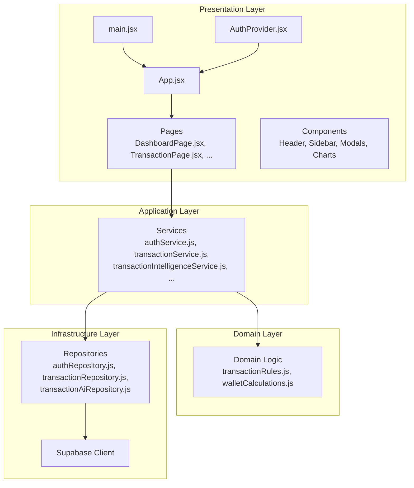
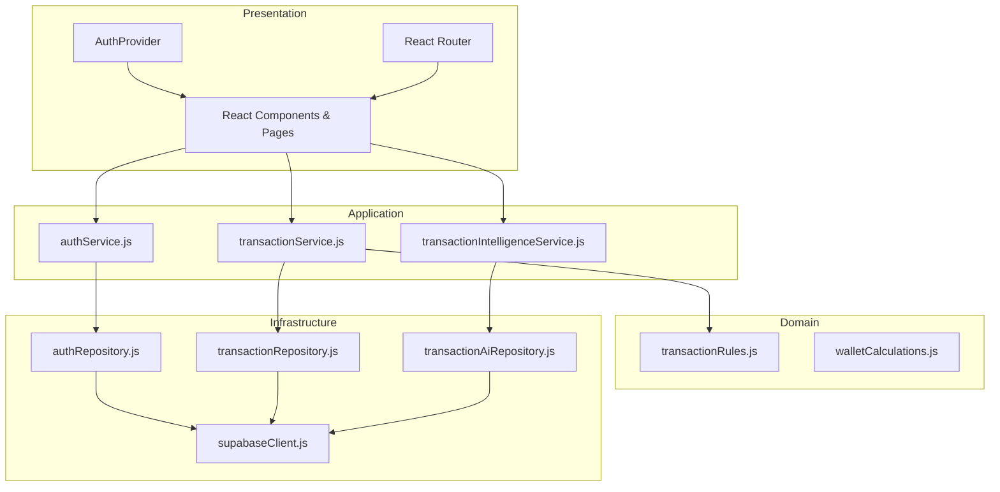
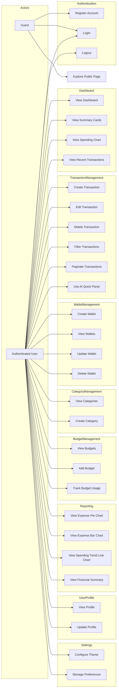
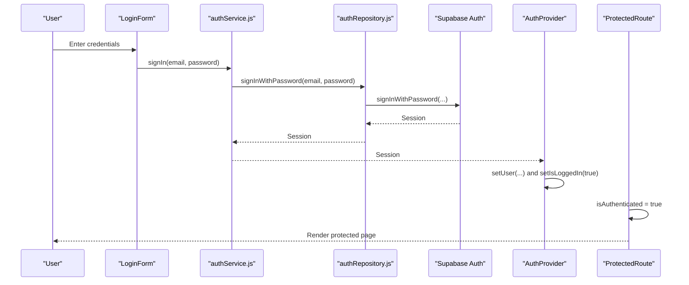
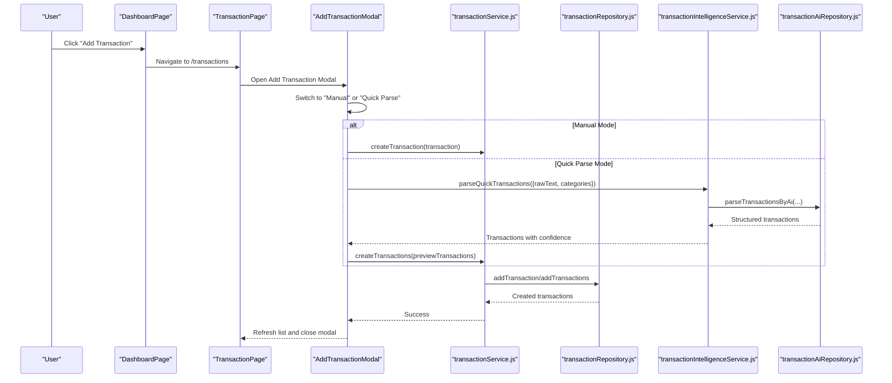
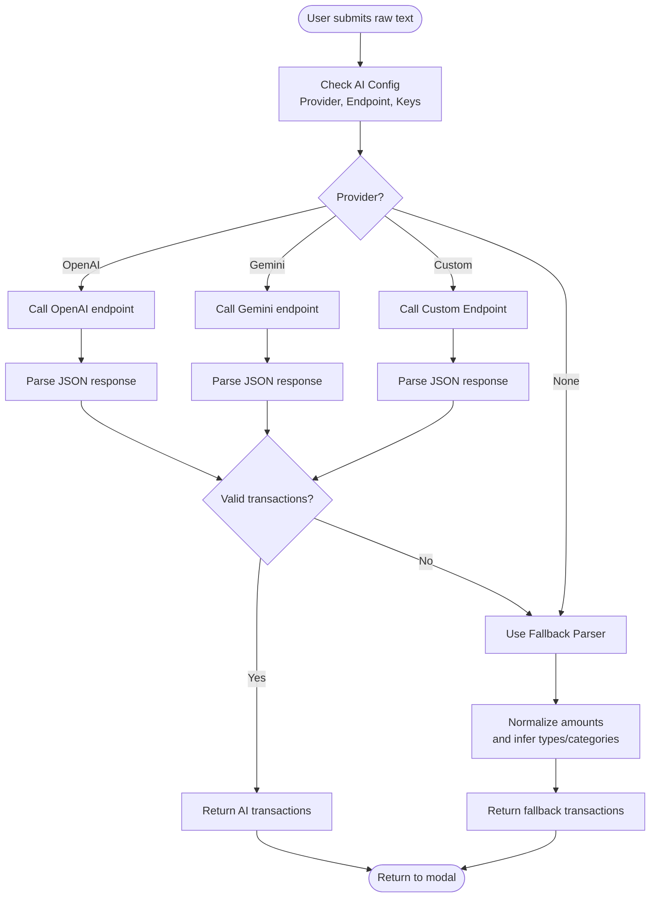
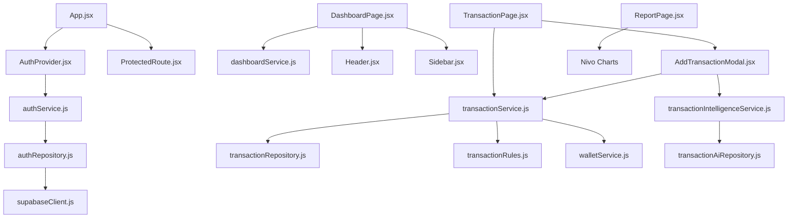

# Use Case Diagrams and System Overview

<cite>
**Referenced Files in This Document**
- [USECASE_DIAGRAM.md](file://USECASE_DIAGRAM.md)
- [SCREEN_FLOW.md](file://SCREEN_FLOW.md)
- [TECHNICAL_DOCUMENTATION.md](file://TECHNICAL_DOCUMENTATION.md)
- [README.md](file://README.md)
- [App.jsx](file://src/App.jsx)
- [main.jsx](file://src/main.jsx)
- [AuthProvider.jsx](file://src/presentation/context/AuthProvider.jsx)
- [ProtectedRoute.jsx](file://src/presentation/components/auth/ProtectedRoute.jsx)
- [authService.js](file://src/application/services/authService.js)
- [authRepository.js](file://src/infrastructure/repositories/authRepository.js)
- [DashboardPage.jsx](file://src/presentation/pages/DashboardPage.jsx)
- [TransactionPage.jsx](file://src/presentation/pages/TransactionPage.jsx)
- [AddTransactionModal.jsx](file://src/presentation/components/transaction/AddTransactionModal.jsx)
- [transactionService.js](file://src/application/services/transactionService.js)
- [transactionRepository.js](file://src/infrastructure/repositories/transactionRepository.js)
- [transactionIntelligenceService.js](file://src/application/services/transactionIntelligenceService.js)
- [transactionAiRepository.js](file://src/infrastructure/repositories/transactionAiRepository.js)
</cite>

## Table of Contents
1. [Introduction](#introduction)
2. [Project Structure](#project-structure)
3. [Core Components](#core-components)
4. [Architecture Overview](#architecture-overview)
5. [Detailed Component Analysis](#detailed-component-analysis)
6. [Dependency Analysis](#dependency-analysis)
7. [Performance Considerations](#performance-considerations)
8. [Troubleshooting Guide](#troubleshooting-guide)
9. [Conclusion](#conclusion)

## Introduction
This document presents the use case diagrams and system overview for MoneyHey, a personal finance management web application. It consolidates the official use case definitions, screen flow, and technical architecture to provide a comprehensive understanding of the system's capabilities, actors, features, and internal structure. The goal is to help both technical and non-technical stakeholders grasp how MoneyHey enables users to manage transactions, wallets, categories, budgets, and reports with an innovative AI-powered quick transaction parsing feature.

## Project Structure
MoneyHey follows a layered architecture with clear separation between presentation, application, domain, and infrastructure layers. The frontend is built with React and Vite, integrates with Supabase for authentication and data persistence, and includes AI-powered transaction parsing via OpenAI or Google Gemini.

**Diagram sources**
- [App.jsx:1-65](file://src/App.jsx#L1-L65)
- [main.jsx:1-20](file://src/main.jsx#L1-L20)
- [AuthProvider.jsx:1-84](file://src/presentation/context/AuthProvider.jsx#L1-L84)
- [authService.js:1-7](file://src/application/services/authService.js#L1-L7)
- [transactionService.js:1-133](file://src/application/services/transactionService.js#L1-L133)
- [transactionIntelligenceService.js:1-179](file://src/application/services/transactionIntelligenceService.js#L1-L179)
- [authRepository.js:1-11](file://src/infrastructure/repositories/authRepository.js#L1-L11)
- [transactionRepository.js:1-133](file://src/infrastructure/repositories/transactionRepository.js#L1-L133)
- [transactionAiRepository.js:1-325](file://src/infrastructure/repositories/transactionAiRepository.js#L1-L325)

**Section sources**
- [TECHNICAL_DOCUMENTATION.md:38-81](file://TECHNICAL_DOCUMENTATION.md#L38-L81)
- [App.jsx:1-65](file://src/App.jsx#L1-L65)
- [main.jsx:1-20](file://src/main.jsx#L1-L20)

## Core Components
This section outlines the primary components and their responsibilities, aligned with the layered architecture:

- Presentation Layer: UI rendering, routing, and user interactions handled by React components and pages.
- Application Layer: Orchestrates business operations via service modules that coordinate repositories and domain logic.
- Domain Layer: Encapsulates business rules, validations, and calculations.
- Infrastructure Layer: Integrates external services (Supabase) and repositories for data access.

Key responsibilities include:
- Authentication orchestration and route protection
- Transaction CRUD operations with validation and wallet balance adjustments
- AI-powered transaction parsing with fallback heuristics
- Dashboard analytics aggregation and reporting visuals

**Section sources**
- [TECHNICAL_DOCUMENTATION.md:66-74](file://TECHNICAL_DOCUMENTATION.md#L66-L74)
- [AuthProvider.jsx:1-84](file://src/presentation/context/AuthProvider.jsx#L1-L84)
- [ProtectedRoute.jsx:1-7](file://src/presentation/components/auth/ProtectedRoute.jsx#L1-L7)
- [transactionService.js:1-133](file://src/application/services/transactionService.js#L1-L133)
- [transactionIntelligenceService.js:1-179](file://src/application/services/transactionIntelligenceService.js#L1-L179)

## Architecture Overview
The system architecture employs a layered pattern with clear boundaries:

- Presentation Layer: React components, pages, hooks, context, and CSS
- Application Layer: Services for auth, transactions, intelligence, and domain coordination
- Domain Layer: Business rules and mappers
- Infrastructure Layer: Repositories and Supabase client

**Diagram sources**
- [AuthProvider.jsx:1-84](file://src/presentation/context/AuthProvider.jsx#L1-L84)
- [authService.js:1-7](file://src/application/services/authService.js#L1-L7)
- [transactionService.js:1-133](file://src/application/services/transactionService.js#L1-L133)
- [transactionIntelligenceService.js:1-179](file://src/application/services/transactionIntelligenceService.js#L1-L179)
- [authRepository.js:1-11](file://src/infrastructure/repositories/authRepository.js#L1-L11)
- [transactionRepository.js:1-133](file://src/infrastructure/repositories/transactionRepository.js#L1-L133)
- [transactionAiRepository.js:1-325](file://src/infrastructure/repositories/transactionAiRepository.js#L1-L325)

**Section sources**
- [TECHNICAL_DOCUMENTATION.md:38-81](file://TECHNICAL_DOCUMENTATION.md#L38-L81)

## Detailed Component Analysis

### Use Case Diagrams
The official use case diagram defines actors and features across authentication, dashboard, transaction management, wallet management, category management, budget management, reporting, user profile, and settings.

**Diagram sources**
- [USECASE_DIAGRAM.md:3-100](file://USECASE_DIAGRAM.md#L3-L100)

**Section sources**
- [USECASE_DIAGRAM.md:102-176](file://USECASE_DIAGRAM.md#L102-L176)

### Screen Flow Overview
The screen flow illustrates navigation paths for authenticated and unauthenticated users, including modals and sidebar navigation.

```mermaid
graph TD
subgraph Unauthenticated
ENTRY["/ - Entry Point"]
LOGIN["/login - Login Page"]
REGISTER["/register - Register Page"]
EXPLORE["/explore - Explore Page"]
end
subgraph Authenticated
DASHBOARD["/dashboard - Dashboard"]
TRANSACTIONS["/transactions - Transactions"]
REPORTS["/reports - Reports"]
BUDGET["/budget - Budget"]
PROFILE["/profile - Profile"]
SETTINGS["/settings - Settings"]
end
subgraph Modals
ADD_TX["Add Transaction Modal"]
EDIT_TX["Edit Transaction Modal"]
end
ENTRY --> |"Not logged in"| LOGIN
ENTRY --> |"Already logged in"| DASHBOARD
LOGIN --> |"Has no account"| REGISTER
LOGIN --> |"Valid credentials"| DASHBOARD
LOGIN --> |"Browse public content"| EXPLORE
REGISTER --> |"Account created"| LOGIN
REGISTER --> |"Back to login"| LOGIN
EXPLORE --> |"Login"| LOGIN
EXPLORE --> |"Register"| REGISTER
DASHBOARD --> |"Sidebar: Transactions"| TRANSACTIONS
DASHBOARD --> |"Sidebar: Reports"| REPORTS
DASHBOARD --> |"Sidebar: Budget"| BUDGET
DASHBOARD --> |"Sidebar: Profile"| PROFILE
DASHBOARD --> |"Sidebar: Settings"| SETTINGS
DASHBOARD --> |"Header: Logout"| LOGIN
DASHBOARD --> |"Quick Action: Add Expense/Income"| TRANSACTIONS
DASHBOARD --> |"Quick Action: View Report"| REPORTS
TRANSACTIONS --> |"Sidebar: Dashboard"| DASHBOARD
TRANSACTIONS --> |"Sidebar: Reports"| REPORTS
TRANSACTIONS --> |"Sidebar: Budget"| BUDGET
TRANSACTIONS --> |"Sidebar: Profile"| PROFILE
TRANSACTIONS --> |"Sidebar: Settings"| SETTINGS
TRANSACTIONS --> |"Header: Logout"| LOGIN
TRANSACTIONS --> |"Button: Add Transaction"| ADD_TX
TRANSACTIONS --> |"Action: Edit"| EDIT_TX
TRANSACTIONS --> |"Action: Delete"| TRANSACTIONS
ADD_TX --> |"Saved / Closed"| TRANSACTIONS
EDIT_TX --> |"Saved / Closed"| TRANSACTIONS
REPORTS --> |"Sidebar: Dashboard"| DASHBOARD
REPORTS --> |"Sidebar: Transactions"| TRANSACTIONS
REPORTS --> |"Sidebar: Budget"| BUDGET
REPORTS --> |"Sidebar: Profile"| PROFILE
REPORTS --> |"Sidebar: Settings"| SETTINGS
REPORTS --> |"Header: Logout"| LOGIN
BUDGET --> |"Sidebar: Dashboard"| DASHBOARD
BUDGET --> |"Sidebar: Transactions"| TRANSACTIONS
BUDGET --> |"Sidebar: Reports"| REPORTS
BUDGET --> |"Sidebar: Profile"| PROFILE
BUDGET --> |"Sidebar: Settings"| SETTINGS
BUDGET --> |"Header: Logout"| LOGIN
PROFILE --> |"Sidebar: Dashboard"| DASHBOARD
PROFILE --> |"Sidebar: Transactions"| TRANSACTIONS
PROFILE --> |"Sidebar: Reports"| REPORTS
PROFILE --> |"Sidebar: Budget"| BUDGET
PROFILE --> |"Sidebar: Settings"| SETTINGS
PROFILE --> |"Header: Logout"| LOGIN
SETTINGS --> |"Sidebar: Dashboard"| DASHBOARD
SETTINGS --> |"Sidebar: Transactions"| TRANSACTIONS
SETTINGS --> |"Sidebar: Reports"| REPORTS
SETTINGS --> |"Sidebar: Budget"| BUDGET
SETTINGS --> |"Sidebar: Profile"| PROFILE
SETTINGS --> |"Header: Logout"| LOGIN
```

**Diagram sources**
- [SCREEN_FLOW.md:3-87](file://SCREEN_FLOW.md#L3-L87)

**Section sources**
- [SCREEN_FLOW.md:89-192](file://SCREEN_FLOW.md#L89-L192)

### Authentication Flow
The authentication flow integrates Supabase Auth with React Context and protected routes.

**Diagram sources**
- [AuthProvider.jsx:1-84](file://src/presentation/context/AuthProvider.jsx#L1-L84)
- [authService.js:1-7](file://src/application/services/authService.js#L1-L7)
- [authRepository.js:1-11](file://src/infrastructure/repositories/authRepository.js#L1-L11)
- [ProtectedRoute.jsx:1-7](file://src/presentation/components/auth/ProtectedRoute.jsx#L1-L7)

**Section sources**
- [TECHNICAL_DOCUMENTATION.md:486-549](file://TECHNICAL_DOCUMENTATION.md#L486-L549)

### Transaction Management Flow
End-to-end transaction management includes creation, editing, deletion, filtering, pagination, and AI quick parsing.

**Diagram sources**
- [DashboardPage.jsx:1-151](file://src/presentation/pages/DashboardPage.jsx#L1-L151)
- [TransactionPage.jsx:1-330](file://src/presentation/pages/TransactionPage.jsx#L1-L330)
- [AddTransactionModal.jsx:1-908](file://src/presentation/components/transaction/AddTransactionModal.jsx#L1-L908)
- [transactionService.js:1-133](file://src/application/services/transactionService.js#L1-L133)
- [transactionRepository.js:1-133](file://src/infrastructure/repositories/transactionRepository.js#L1-L133)
- [transactionIntelligenceService.js:1-179](file://src/application/services/transactionIntelligenceService.js#L1-L179)
- [transactionAiRepository.js:1-325](file://src/infrastructure/repositories/transactionAiRepository.js#L1-L325)

**Section sources**
- [TECHNICAL_DOCUMENTATION.md:551-660](file://TECHNICAL_DOCUMENTATION.md#L551-L660)

### AI Quick Transaction Parsing Flow
The AI parsing pipeline attempts OpenAI or Gemini, falling back to a Vietnamese-specific heuristic parser when providers are unavailable or fail.

**Diagram sources**
- [transactionIntelligenceService.js:1-179](file://src/application/services/transactionIntelligenceService.js#L1-L179)
- [transactionAiRepository.js:1-325](file://src/infrastructure/repositories/transactionAiRepository.js#L1-L325)

**Section sources**
- [TECHNICAL_DOCUMENTATION.md:587-612](file://TECHNICAL_DOCUMENTATION.md#L587-L612)

## Dependency Analysis
This section maps key dependencies among components and services:

**Diagram sources**
- [App.jsx:1-65](file://src/App.jsx#L1-L65)
- [AuthProvider.jsx:1-84](file://src/presentation/context/AuthProvider.jsx#L1-L84)
- [ProtectedRoute.jsx:1-7](file://src/presentation/components/auth/ProtectedRoute.jsx#L1-L7)
- [authService.js:1-7](file://src/application/services/authService.js#L1-L7)
- [authRepository.js:1-11](file://src/infrastructure/repositories/authRepository.js#L1-L11)
- [DashboardPage.jsx:1-151](file://src/presentation/pages/DashboardPage.jsx#L1-L151)
- [TransactionPage.jsx:1-330](file://src/presentation/pages/TransactionPage.jsx#L1-L330)
- [AddTransactionModal.jsx:1-908](file://src/presentation/components/transaction/AddTransactionModal.jsx#L1-L908)
- [transactionService.js:1-133](file://src/application/services/transactionService.js#L1-L133)
- [transactionRepository.js:1-133](file://src/infrastructure/repositories/transactionRepository.js#L1-L133)
- [transactionIntelligenceService.js:1-179](file://src/application/services/transactionIntelligenceService.js#L1-L179)
- [transactionAiRepository.js:1-325](file://src/infrastructure/repositories/transactionAiRepository.js#L1-L325)

**Section sources**
- [TECHNICAL_DOCUMENTATION.md:369-484](file://TECHNICAL_DOCUMENTATION.md#L369-L484)

## Performance Considerations
- Layered architecture improves testability and maintainability, enabling isolated optimization of services and repositories.
- Client-side pagination reduces payload sizes on TransactionPage, improving perceived performance.
- AI parsing is asynchronous and guarded by loading states to prevent UI blocking.
- Wallet balance updates leverage compensating transactions to maintain consistency after errors.

[No sources needed since this section provides general guidance]

## Troubleshooting Guide
Common issues and resolutions:

- Authentication failures: Verify Supabase credentials and environment variables. Check the AuthProvider initialization and route protection behavior.
- Transaction creation/deletion errors: Review transaction validation rules and wallet balance adjustments. Compensating transactions are applied automatically on failure.
- AI parsing errors: Ensure provider keys or custom endpoint are configured. The system falls back to a heuristic parser with a reason message.
- Session persistence: "Remember Me" toggles between localStorage and sessionStorage; confirm the setting persists in localStorage.

**Section sources**
- [AuthProvider.jsx:1-84](file://src/presentation/context/AuthProvider.jsx#L1-L84)
- [ProtectedRoute.jsx:1-7](file://src/presentation/components/auth/ProtectedRoute.jsx#L1-L7)
- [transactionService.js:1-133](file://src/application/services/transactionService.js#L1-L133)
- [transactionIntelligenceService.js:1-179](file://src/application/services/transactionIntelligenceService.js#L1-L179)
- [README.md:18-40](file://README.md#L18-L40)

## Conclusion
MoneyHey’s use case-driven design, combined with a clean layered architecture, delivers a robust personal finance management solution. The system supports comprehensive transaction lifecycle management, intelligent parsing, and insightful reporting, all while maintaining strong separation of concerns and extensibility for future enhancements.