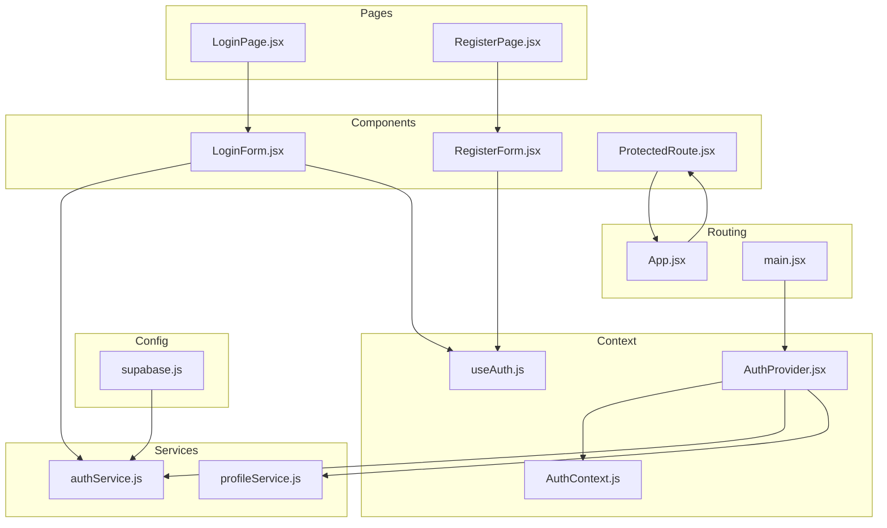
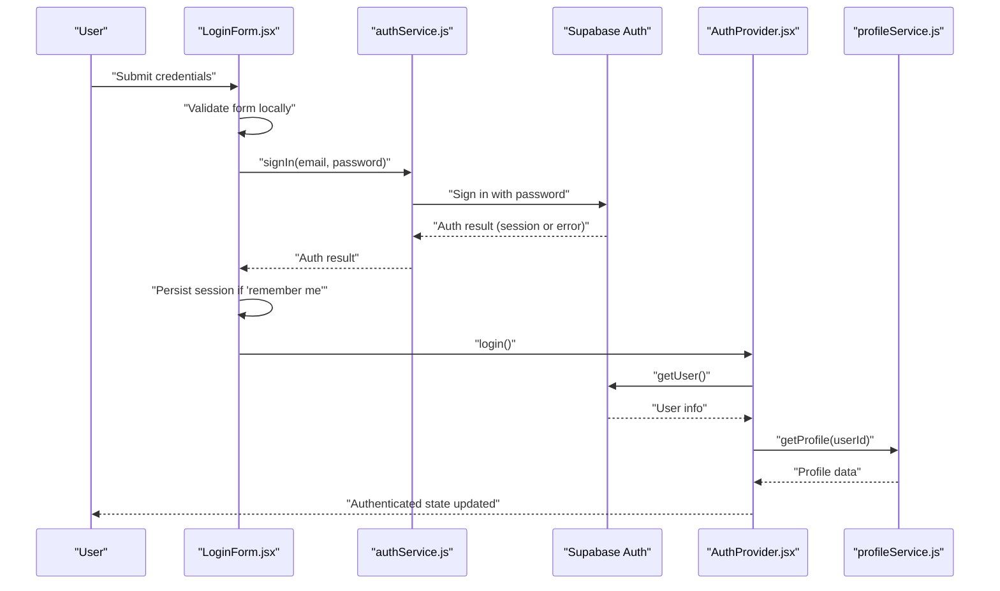
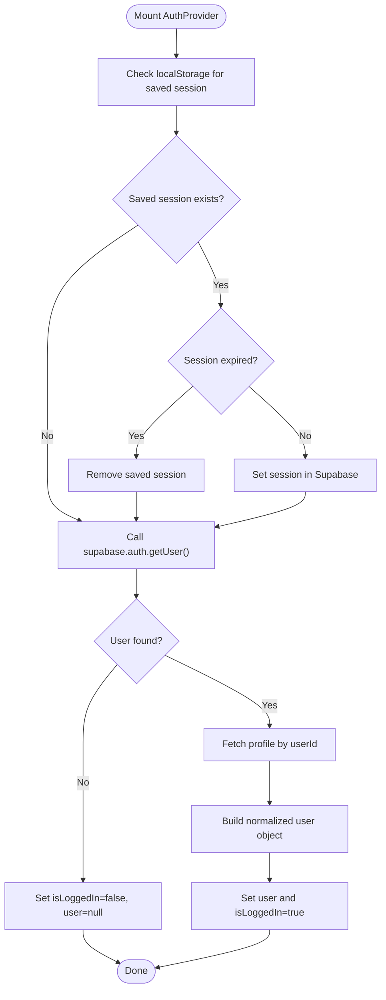
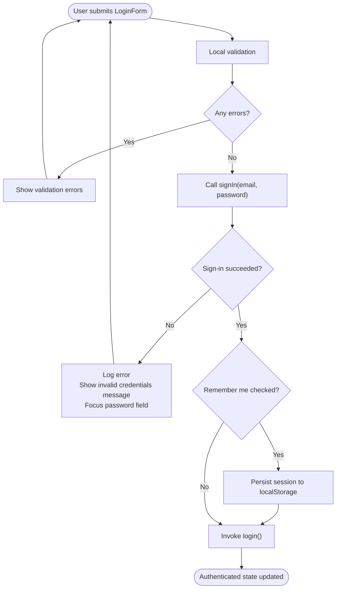
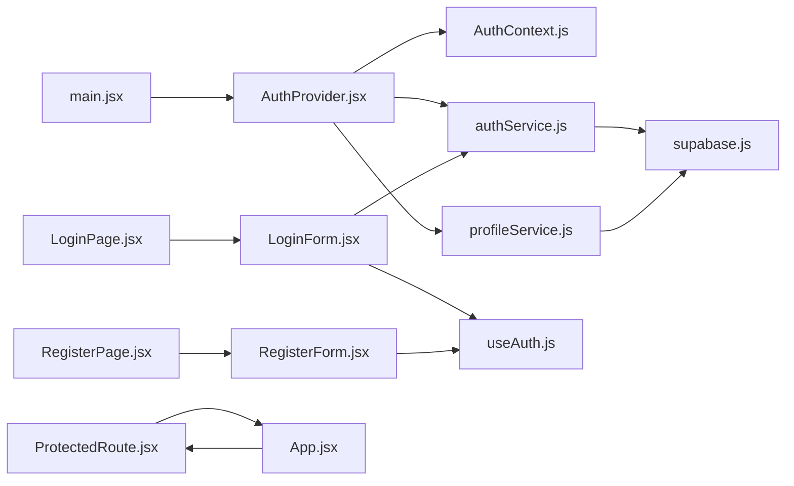

# Authentication System

<cite>
**Referenced Files in This Document**
- [supabase.js](file://MoneyHey/src/config/supabase.js)
- [AuthProvider.jsx](file://MoneyHey/src/context/AuthProvider.jsx)
- [AuthContext.js](file://MoneyHey/src/context/AuthContext.js)
- [useAuth.js](file://MoneyHey/src/hooks/useAuth.js)
- [authService.js](file://MoneyHey/src/services/authService.js)
- [profileService.js](file://MoneyHey/src/services/profileService.js)
- [LoginForm.jsx](file://MoneyHey/src/components/auth/LoginForm.jsx)
- [RegisterForm.jsx](file://MoneyHey/src/components/auth/RegisterForm.jsx)
- [ProtectedRoute.jsx](file://MoneyHey/src/components/auth/ProtectedRoute.jsx)
- [LoginPage.jsx](file://MoneyHey/src/pages/LoginPage.jsx)
- [RegisterPage.jsx](file://MoneyHey/src/pages/RegisterPage.jsx)
- [App.jsx](file://MoneyHey/src/App.jsx)
- [main.jsx](file://MoneyHey/src/main.jsx)
</cite>

## Table of Contents
1. [Introduction](#introduction)
2. [Project Structure](#project-structure)
3. [Core Components](#core-components)
4. [Architecture Overview](#architecture-overview)
5. [Detailed Component Analysis](#detailed-component-analysis)
6. [Dependency Analysis](#dependency-analysis)
7. [Performance Considerations](#performance-considerations)
8. [Security Considerations](#security-considerations)
9. [Troubleshooting Guide](#troubleshooting-guide)
10. [Conclusion](#conclusion)
11. [Appendices](#appendices)

## Introduction
This document explains the authentication system for MoneyHey, built on Supabase Auth. It covers login, registration, session management, the AuthProvider context, AuthContext state management, and protected route handling. It also documents the authentication flow from user input through form validation to session persistence, along with security considerations, token/session lifecycle, and practical usage patterns for hooks, protected components, and custom logic.

## Project Structure
Authentication-related modules are organized across configuration, context/state, services, components, and routing:

- Configuration: Supabase client initialization and options
- Context: Provider and context definition for global auth state
- Services: Thin wrappers around Supabase Auth and profile queries
- Components: Login and registration forms, protected route guard
- Pages: Login and register page containers
- Routing: Application routes with protected route wrapper

**Diagram sources**
- [supabase.js:1-11](file://MoneyHey/src/config/supabase.js#L1-L11)
- [AuthProvider.jsx:1-98](file://MoneyHey/src/context/AuthProvider.jsx#L1-L98)
- [AuthContext.js:1-4](file://MoneyHey/src/context/AuthContext.js#L1-L4)
- [useAuth.js:1-7](file://MoneyHey/src/hooks/useAuth.js#L1-L7)
- [authService.js:1-11](file://MoneyHey/src/services/authService.js#L1-L11)
- [profileService.js:1-12](file://MoneyHey/src/services/profileService.js#L1-L12)
- [LoginForm.jsx:1-137](file://MoneyHey/src/components/auth/LoginForm.jsx#L1-L137)
- [RegisterForm.jsx:1-115](file://MoneyHey/src/components/auth/RegisterForm.jsx#L1-L115)
- [ProtectedRoute.jsx:1-7](file://MoneyHey/src/components/auth/ProtectedRoute.jsx#L1-L7)
- [LoginPage.jsx:1-56](file://MoneyHey/src/pages/LoginPage.jsx#L1-L56)
- [RegisterPage.jsx:1-62](file://MoneyHey/src/pages/RegisterPage.jsx#L1-L62)
- [App.jsx:1-43](file://MoneyHey/src/App.jsx#L1-L43)
- [main.jsx:1-20](file://MoneyHey/src/main.jsx#L1-L20)

**Section sources**
- [main.jsx:1-20](file://MoneyHey/src/main.jsx#L1-L20)
- [App.jsx:1-43](file://MoneyHey/src/App.jsx#L1-L43)

## Core Components
- Supabase client configured with explicit auth options and session persistence disabled
- AuthProvider initializes auth state, restores persisted sessions, loads profile, and exposes login/logout
- useAuth hook provides access to the AuthContext
- authService wraps Supabase Auth operations
- profileService fetches user profile data
- LoginForm handles local validation and triggers Supabase sign-in
- ProtectedRoute enforces authentication for nested routes

**Section sources**
- [supabase.js:1-11](file://MoneyHey/src/config/supabase.js#L1-L11)
- [AuthProvider.jsx:1-98](file://MoneyHey/src/context/AuthProvider.jsx#L1-L98)
- [useAuth.js:1-7](file://MoneyHey/src/hooks/useAuth.js#L1-L7)
- [authService.js:1-11](file://MoneyHey/src/services/authService.js#L1-L11)
- [profileService.js:1-12](file://MoneyHey/src/services/profileService.js#L1-L12)
- [LoginForm.jsx:1-137](file://MoneyHey/src/components/auth/LoginForm.jsx#L1-L137)
- [ProtectedRoute.jsx:1-7](file://MoneyHey/src/components/auth/ProtectedRoute.jsx#L1-L7)

## Architecture Overview
The authentication system follows a layered pattern:
- UI layer: LoginForm, RegisterForm, LoginPage, RegisterPage
- Routing layer: App routes and ProtectedRoute wrapper
- Context layer: AuthProvider manages state and exposes login/logout
- Service layer: authService and profileService encapsulate Supabase operations
- Config layer: supabase client configuration

**Diagram sources**
- [LoginForm.jsx:47-68](file://MoneyHey/src/components/auth/LoginForm.jsx#L47-L68)
- [authService.js:3-10](file://MoneyHey/src/services/authService.js#L3-L10)
- [AuthProvider.jsx:11-59](file://MoneyHey/src/context/AuthProvider.jsx#L11-L59)
- [profileService.js:3-11](file://MoneyHey/src/services/profileService.js#L3-L11)

## Detailed Component Analysis

### Supabase Configuration
- Initializes the Supabase client with URL and key
- Disables automatic session persistence in Supabase Auth
- Exposes a single supabase instance for services to use

**Section sources**
- [supabase.js:1-11](file://MoneyHey/src/config/supabase.js#L1-L11)

### AuthProvider Context
Responsibilities:
- Initialize auth on mount by restoring a persisted session from localStorage if present and not expired
- Call Supabase getUser to hydrate current user session
- Load profile via profileService and construct a normalized user object
- Expose login, logout, isLoggedIn, user, and loading state
- Persist session to localStorage when “remember me” is selected during login

Key behaviors:
- Session restoration checks expiration before setting session
- On logout, clears localStorage and calls Supabase signOut
- On successful login, sets user state and isLoggedIn flag

**Diagram sources**
- [AuthProvider.jsx:11-59](file://MoneyHey/src/context/AuthProvider.jsx#L11-L59)
- [AuthProvider.jsx:78-83](file://MoneyHey/src/context/AuthProvider.jsx#L78-L83)
- [profileService.js:3-11](file://MoneyHey/src/services/profileService.js#L3-L11)

**Section sources**
- [AuthProvider.jsx:1-98](file://MoneyHey/src/context/AuthProvider.jsx#L1-L98)

### AuthContext and useAuth Hook
- AuthContext defines the shared authentication state container
- useAuth provides convenient access to the context value

Usage patterns:
- Wrap the app with AuthProvider at the root
- Consume useAuth in components to access user, isLoggedIn, login, logout, and loading

**Section sources**
- [AuthContext.js:1-4](file://MoneyHey/src/context/AuthContext.js#L1-L4)
- [useAuth.js:1-7](file://MoneyHey/src/hooks/useAuth.js#L1-L7)

### AuthService Wrapper
- signIn: thin wrapper around Supabase sign-in with email/password
- signOut: thin wrapper around Supabase sign-out
- setSession: sets a session programmatically (used after restoring from localStorage)
- getUser: retrieves current user session

**Section sources**
- [authService.js:1-11](file://MoneyHey/src/services/authService.js#L1-L11)

### Profile Service
- getProfile: queries the profiles table for the given userId and returns selected fields

**Section sources**
- [profileService.js:1-12](file://MoneyHey/src/services/profileService.js#L1-L12)

### LoginForm Component
Responsibilities:
- Local form validation for email, password, and rememberMe
- Submit handler:
  - Validates input
  - Calls signIn from authService
  - On success, persists session if requested and invokes login from AuthProvider
  - On error, displays localized error message and focuses password field

**Diagram sources**
- [LoginForm.jsx:33-68](file://MoneyHey/src/components/auth/LoginForm.jsx#L33-L68)
- [authService.js:3-4](file://MoneyHey/src/services/authService.js#L3-L4)

**Section sources**
- [LoginForm.jsx:1-137](file://MoneyHey/src/components/auth/LoginForm.jsx#L1-L137)

### RegisterForm Component
Responsibilities:
- Local validation for email, password, and confirm password
- Submit handler:
  - Validates input
  - Shows success message with email
  - Note: Registration does not currently trigger Supabase sign-up in this component

**Section sources**
- [RegisterForm.jsx:1-115](file://MoneyHey/src/components/auth/RegisterForm.jsx#L1-L115)

### ProtectedRoute Component
Responsibilities:
- Guards nested routes by checking isAuthenticated prop
- Redirects unauthenticated users to /login

**Section sources**
- [ProtectedRoute.jsx:1-7](file://MoneyHey/src/components/auth/ProtectedRoute.jsx#L1-L7)

### Routing and Page Integration
- main.jsx wraps the app with AuthProvider and BrowserRouter
- App.jsx defines routes:
  - Public: /login, /register
  - Protected: /dashboard, /transactions, /reports via ProtectedRoute
  - Redirects based on authentication state

**Section sources**
- [main.jsx:1-20](file://MoneyHey/src/main.jsx#L1-L20)
- [App.jsx:1-43](file://MoneyHey/src/App.jsx#L1-L43)

## Dependency Analysis
The authentication stack exhibits clear separation of concerns with minimal coupling:

**Diagram sources**
- [main.jsx:6](file://MoneyHey/src/main.jsx#L6)
- [AuthProvider.jsx:2-4](file://MoneyHey/src/context/AuthProvider.jsx#L2-L4)
- [authService.js:1](file://MoneyHey/src/services/authService.js#L1)
- [profileService.js:1](file://MoneyHey/src/services/profileService.js#L1)
- [LoginForm.jsx:3](file://MoneyHey/src/components/auth/LoginForm.jsx#L3)
- [useAuth.js:2](file://MoneyHey/src/hooks/useAuth.js#L2)
- [ProtectedRoute.jsx:1](file://MoneyHey/src/components/auth/ProtectedRoute.jsx#L1)
- [LoginPage.jsx:3](file://MoneyHey/src/pages/LoginPage.jsx#L3)
- [RegisterPage.jsx:3](file://MoneyHey/src/pages/RegisterPage.jsx#L3)
- [App.jsx:8](file://MoneyHey/src/App.jsx#L8)
- [supabase.js:1](file://MoneyHey/src/config/supabase.js#L1)

Observations:
- LoginForm depends on authService and useAuth
- AuthProvider depends on authService and profileService
- ProtectedRoute depends on App’s authentication state
- Supabase client is centralized in supabase.js and reused by services

**Section sources**
- [AuthProvider.jsx:1-98](file://MoneyHey/src/context/AuthProvider.jsx#L1-L98)
- [authService.js:1-11](file://MoneyHey/src/services/authService.js#L1-L11)
- [profileService.js:1-12](file://MoneyHey/src/services/profileService.js#L1-L12)
- [LoginForm.jsx:1-137](file://MoneyHey/src/components/auth/LoginForm.jsx#L1-L137)
- [ProtectedRoute.jsx:1-7](file://MoneyHey/src/components/auth/ProtectedRoute.jsx#L1-L7)
- [App.jsx:1-43](file://MoneyHey/src/App.jsx#L1-L43)
- [main.jsx:1-20](file://MoneyHey/src/main.jsx#L1-L20)

## Performance Considerations
- Session restoration occurs once on mount; keep the effect body minimal
- Avoid unnecessary re-renders by passing stable callbacks from AuthProvider to consumers
- Consider debouncing or throttling frequent UI updates in forms
- Profile fetching is lightweight; cache results per session if needed
- Keep Supabase client initialization centralized to avoid multiple instances

## Security Considerations
- Supabase session persistence is disabled in configuration; session is manually persisted to localStorage only when the user selects “remember me”
- Session expiration is validated before restoration; expired sessions are removed
- Logout clears both Supabase session and localStorage
- Passwords are handled by Supabase; client-side validation prevents empty submissions
- Consider adding CSRF protection and secure cookie policies at the Supabase level if enabling server-side sessions later

Operational notes:
- The current implementation stores raw session data in localStorage; ensure HTTPS and secure storage practices
- Avoid logging sensitive session data
- Enforce strong password policies on the backend and consider rate limiting

**Section sources**
- [supabase.js:8](file://MoneyHey/src/config/supabase.js#L8)
- [AuthProvider.jsx:15-26](file://MoneyHey/src/context/AuthProvider.jsx#L15-L26)
- [AuthProvider.jsx:78-83](file://MoneyHey/src/context/AuthProvider.jsx#L78-L83)
- [LoginForm.jsx:63-66](file://MoneyHey/src/components/auth/LoginForm.jsx#L63-L66)

## Troubleshooting Guide
Common issues and resolutions:
- Login fails with invalid credentials:
  - LoginForm displays a localized error and focuses the password field
  - Verify email/password correctness and network connectivity
- Stuck in loading state:
  - AuthProvider sets loading true during initialization; check console for errors
  - Ensure Supabase URL/key are correct and reachable
- Session not restored:
  - Confirm localStorage key matches expected name and is not expired
  - Clear localStorage manually if corrupted
- Protected routes redirect to login:
  - Ensure useAuth is used inside AuthProvider
  - Verify isLoggedIn reflects actual auth state

Debugging tips:
- Inspect Supabase Auth response and errors in LoginForm submit handler
- Log user state in AuthProvider after getUser and profile fetch
- Use browser devtools Network tab to monitor Supabase requests
- Temporarily enable Supabase debug logs if needed

**Section sources**
- [LoginForm.jsx:54-67](file://MoneyHey/src/components/auth/LoginForm.jsx#L54-L67)
- [AuthProvider.jsx:49-55](file://MoneyHey/src/context/AuthProvider.jsx#L49-L55)
- [AuthProvider.jsx:15-26](file://MoneyHey/src/context/AuthProvider.jsx#L15-L26)

## Conclusion
MoneyHey’s authentication system integrates Supabase Auth with a clean React context layer. It supports login with local validation, optional session persistence, profile hydration, and protected routing. The modular design enables straightforward extension for additional providers, stronger security controls, and advanced session management.

## Appendices

### Authentication Hooks Usage Examples
- Access authentication state and actions:
  - Import and use useAuth to get user, isLoggedIn, login, logout, and loading
  - Example path: [useAuth.js:4-6](file://MoneyHey/src/hooks/useAuth.js#L4-L6)

- Implement a logout button:
  - Call logout from useAuth and handle navigation if needed
  - Example path: [AuthProvider.jsx:78-83](file://MoneyHey/src/context/AuthProvider.jsx#L78-L83)

**Section sources**
- [useAuth.js:1-7](file://MoneyHey/src/hooks/useAuth.js#L1-L7)
- [AuthProvider.jsx:78-83](file://MoneyHey/src/context/AuthProvider.jsx#L78-L83)

### Protected Component Implementation
- Wrap route sections with ProtectedRoute and pass isAuthenticated from useAuth
- Example path: [App.jsx:25-29](file://MoneyHey/src/App.jsx#L25-L29), [ProtectedRoute.jsx:3-4](file://MoneyHey/src/components/auth/ProtectedRoute.jsx#L3-L4)

**Section sources**
- [App.jsx:25-29](file://MoneyHey/src/App.jsx#L25-L29)
- [ProtectedRoute.jsx:1-7](file://MoneyHey/src/components/auth/ProtectedRoute.jsx#L1-L7)

### Custom Authentication Logic
- Extend AuthService:
  - Add new methods for magic links, OAuth, or custom flows
  - Example path: [authService.js:1-11](file://MoneyHey/src/services/authService.js#L1-L11)

- Integrate with AuthProvider:
  - Add new actions (e.g., socialLogin) and update state accordingly
  - Example path: [AuthProvider.jsx:61-76](file://MoneyHey/src/context/AuthProvider.jsx#L61-L76)

**Section sources**
- [authService.js:1-11](file://MoneyHey/src/services/authService.js#L1-L11)
- [AuthProvider.jsx:61-76](file://MoneyHey/src/context/AuthProvider.jsx#L61-L76)