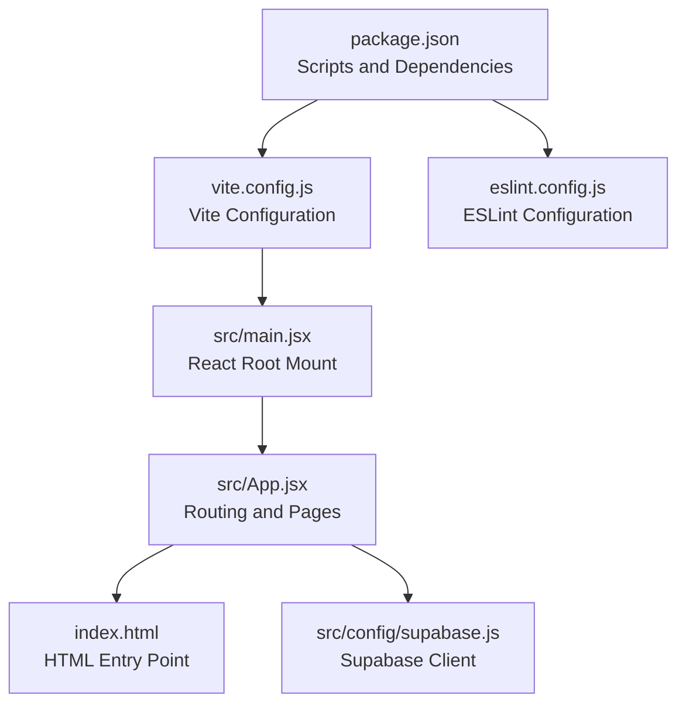
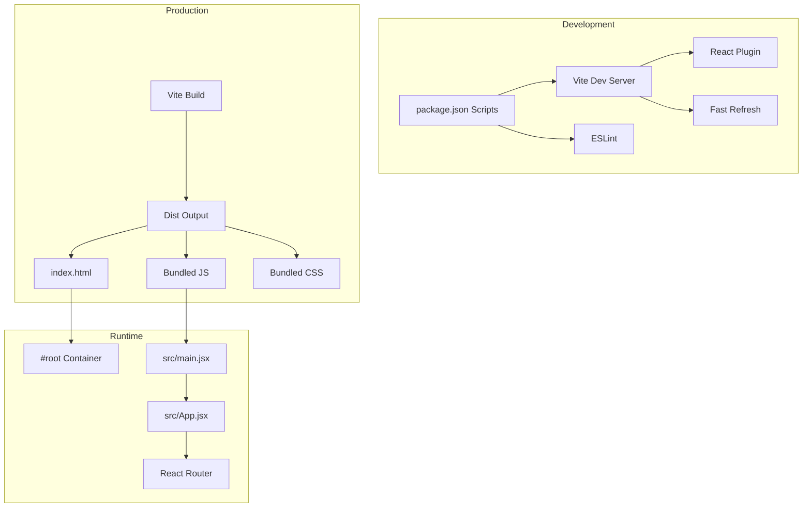
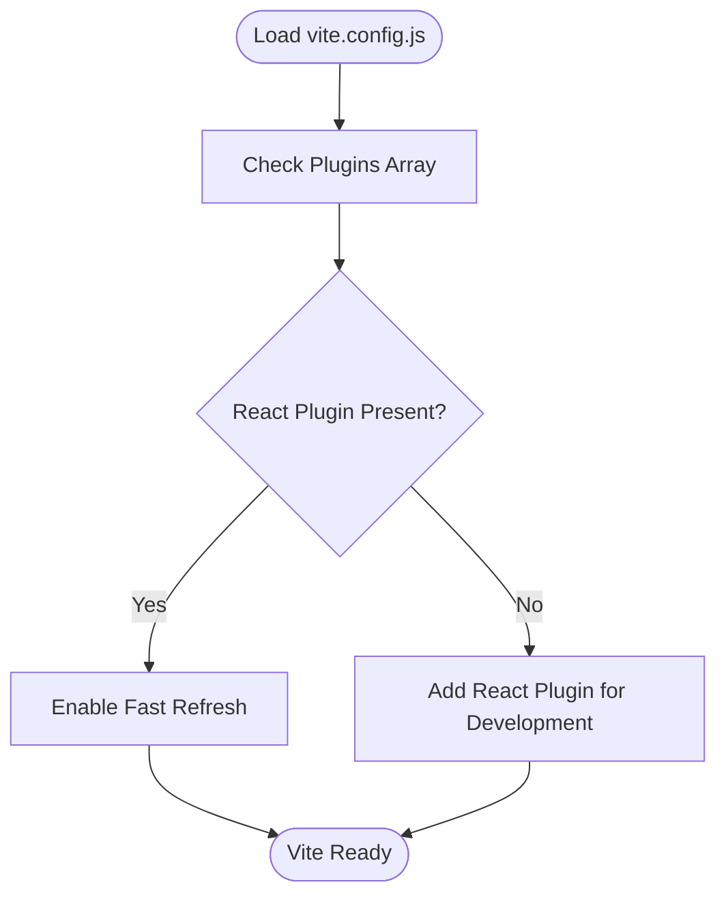
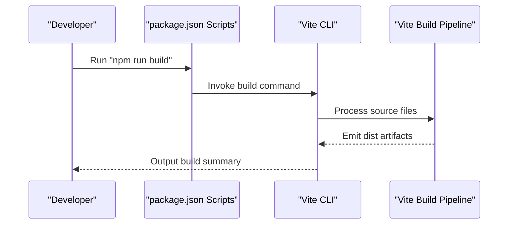
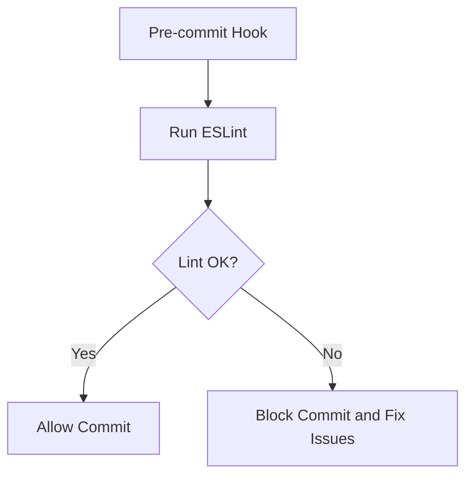
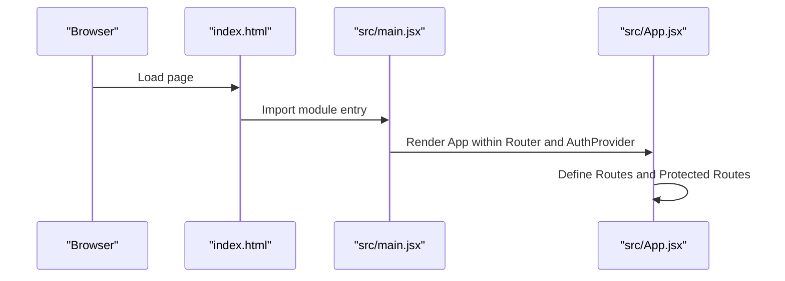
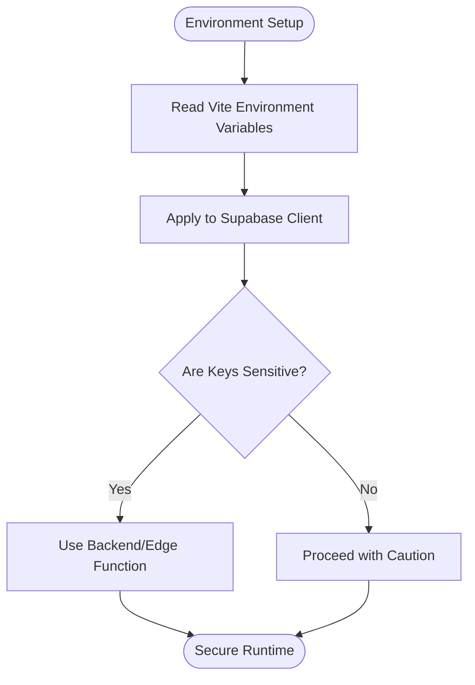
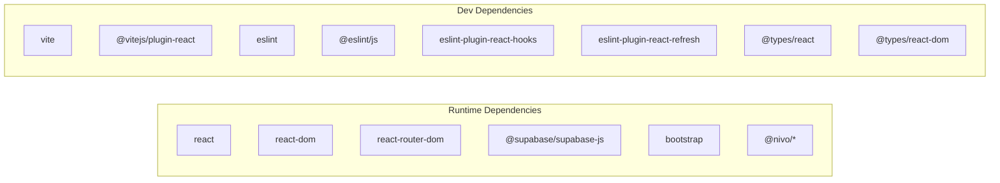

# Build and Deployment

<cite>
**Referenced Files in This Document**
- [package.json](file://package.json)
- [vite.config.js](file://vite.config.js)
- [eslint.config.js](file://eslint.config.js)
- [index.html](file://index.html)
- [README.md](file://README.md)
- [src/main.jsx](file://src/main.jsx)
- [src/App.jsx](file://src/App.jsx)
- [src/config/supabase.js](file://src/config/supabase.js)
</cite>

## Table of Contents
1. [Introduction](#introduction)
2. [Project Structure](#project-structure)
3. [Core Components](#core-components)
4. [Architecture Overview](#architecture-overview)
5. [Detailed Component Analysis](#detailed-component-analysis)
6. [Dependency Analysis](#dependency-analysis)
7. [Performance Considerations](#performance-considerations)
8. [Troubleshooting Guide](#troubleshooting-guide)
9. [Conclusion](#conclusion)
10. [Appendices](#appendices)

## Introduction
This document provides comprehensive build and deployment guidance for MoneyHey, focusing on the Vite build configuration, development workflow, and production optimization settings. It documents the package.json scripts, dependency management, and build pipeline processes, explains the ESLint configuration and code quality checks, and outlines pre-commit validation strategies. It also covers environment variable management, deployment strategies for various platforms, and CI/CD pipeline setup recommendations. Practical examples of build customization, asset optimization, and performance monitoring are included, along with troubleshooting advice for common build and deployment issues.

## Project Structure
MoneyHey is a React application configured with Vite. The build system relies on a minimal Vite configuration with the React plugin, while development and production builds are orchestrated via npm scripts. Code quality is enforced through a flat ESLint configuration that extends recommended rulesets for React and Vite. The application bootstraps via a standard HTML entry point and mounts the React root in the src/main.jsx file.

**Diagram sources**
- [package.json:1-35](file://package.json#L1-L35)
- [vite.config.js:1-8](file://vite.config.js#L1-L8)
- [src/main.jsx:1-20](file://src/main.jsx#L1-L20)
- [src/App.jsx:1-65](file://src/App.jsx#L1-L65)
- [index.html:1-20](file://index.html#L1-L20)
- [eslint.config.js:1-30](file://eslint.config.js#L1-L30)
- [src/config/supabase.js:1-11](file://src/config/supabase.js#L1-L11)

**Section sources**
- [package.json:1-35](file://package.json#L1-L35)
- [vite.config.js:1-8](file://vite.config.js#L1-L8)
- [index.html:1-20](file://index.html#L1-L20)
- [src/main.jsx:1-20](file://src/main.jsx#L1-L20)
- [src/App.jsx:1-65](file://src/App.jsx#L1-L65)
- [eslint.config.js:1-30](file://eslint.config.js#L1-L30)
- [src/config/supabase.js:1-11](file://src/config/supabase.js#L1-L11)

## Core Components
- Vite configuration: Minimal setup with the React plugin enables JSX transform and fast refresh during development.
- Package scripts: Standard commands for development, building, linting, and previewing the application.
- ESLint configuration: Flat config extending recommended rules for JavaScript, React Hooks, and React Refresh for Vite.
- Application bootstrap: The HTML entry point initializes the DOM container and loads the module entry script.
- Environment awareness: The README describes client-side environment variables for optional AI-powered transaction parsing.

**Section sources**
- [vite.config.js:1-8](file://vite.config.js#L1-L8)
- [package.json:6-11](file://package.json#L6-L11)
- [eslint.config.js:7-29](file://eslint.config.js#L7-L29)
- [index.html:15-17](file://index.html#L15-L17)
- [README.md:22-40](file://README.md#L22-L40)

## Architecture Overview
The build and runtime architecture integrates Vite’s development server with React’s component model and routing. The application is bundled for production using Vite, while ESLint enforces code quality during development and pre-commit validation.

**Diagram sources**
- [package.json:6-11](file://package.json#L6-L11)
- [vite.config.js:5-7](file://vite.config.js#L5-L7)
- [index.html:15-17](file://index.html#L15-L17)
- [src/main.jsx:10-19](file://src/main.jsx#L10-L19)
- [src/App.jsx:35-61](file://src/App.jsx#L35-L61)

## Detailed Component Analysis

### Vite Build Configuration
- Purpose: Configure Vite with the React plugin for JSX transform and fast refresh.
- Plugins: React plugin is registered to enable component development ergonomics.
- Extensibility: Additional plugins and build options can be introduced here for production optimization (e.g., minification, asset hashing, code splitting).

**Diagram sources**
- [vite.config.js:5-7](file://vite.config.js#L5-L7)

**Section sources**
- [vite.config.js:1-8](file://vite.config.js#L1-L8)

### Package Scripts and Dependency Management
- Scripts:
  - dev: Starts the Vite development server.
  - build: Produces a production bundle.
  - lint: Runs ESLint across the project.
  - preview: Serves the production build locally.
- Dependencies:
  - Runtime: React, React DOM, React Router, Bootstrap, Supabase client, Nivo chart libraries.
  - Dev-time: Vite, React plugin, ESLint, React Hooks and Refresh plugins, TypeScript types.

**Diagram sources**
- [package.json:6-11](file://package.json#L6-L11)

**Section sources**
- [package.json:6-33](file://package.json#L6-L33)

### ESLint Configuration and Code Quality Checks
- Flat Config: Uses ESLint’s flat config with recommended presets for JavaScript, React Hooks, and React Refresh for Vite.
- Language Options: ECMAScript 2020 with JSX support and browser globals.
- Rules: Includes a rule to ignore unused vars that match a specific pattern.
- Pre-commit Validation: Integrate ESLint in a pre-commit hook to prevent committing lint failures.

**Diagram sources**
- [eslint.config.js:7-29](file://eslint.config.js#L7-L29)

**Section sources**
- [eslint.config.js:1-30](file://eslint.config.js#L1-L30)

### Application Bootstrap and Routing
- HTML Entry: The HTML file defines the root container and loads the module entry script.
- React Root: The main entry creates the React root and mounts the App inside a router and authentication provider.
- Routing: App routes define public and protected paths, with a ProtectedRoute wrapper for authenticated areas.

**Diagram sources**
- [index.html:15-17](file://index.html#L15-L17)
- [src/main.jsx:10-19](file://src/main.jsx#L10-L19)
- [src/App.jsx:35-61](file://src/App.jsx#L35-L61)

**Section sources**
- [index.html:1-20](file://index.html#L1-20)
- [src/main.jsx:1-20](file://src/main.jsx#L1-L20)
- [src/App.jsx:1-65](file://src/App.jsx#L1-L65)

### Environment Variable Management
- Local Development: The README describes optional client-side environment variables for AI-powered transaction parsing, including provider selection and model overrides.
- Security: The README emphasizes not exposing API keys in client-side code for production; use a backend or edge function instead.
- Implementation: The Supabase client configuration demonstrates embedding credentials in the codebase, which should be replaced with environment-driven configuration in production.

**Diagram sources**
- [README.md:22-40](file://README.md#L22-L40)
- [src/config/supabase.js:3-10](file://src/config/supabase.js#L3-L10)

**Section sources**
- [README.md:22-40](file://README.md#L22-L40)
- [src/config/supabase.js:1-11](file://src/config/supabase.js#L1-L11)

### Build Customization Examples
- Asset Optimization: Enable CSS and JS minification, resource hashing, and external asset handling in Vite for production.
- Code Splitting: Use dynamic imports for route-based lazy loading to reduce initial bundle size.
- Polyfills: Add polyfill entries if targeting older browsers.
- Output Configuration: Customize output directory and asset naming patterns.

[No sources needed since this section provides general guidance]

### CI/CD Pipeline Setup
- Stages:
  - Install dependencies using the lockfile.
  - Run ESLint and tests.
  - Build the application with production mode.
  - Deploy artifacts to hosting platform.
- Artifacts: Store the dist folder for deployment.
- Secrets: Inject environment variables at build time and avoid committing secrets.

[No sources needed since this section provides general guidance]

## Dependency Analysis
The project maintains a clear separation between runtime and development dependencies. Runtime dependencies include React, routing, UI framework, and third-party libraries for charts and authentication. Development dependencies include Vite, the React plugin, and ESLint tooling.

**Diagram sources**
- [package.json:12-33](file://package.json#L12-L33)

**Section sources**
- [package.json:12-33](file://package.json#L12-L33)

## Performance Considerations
- Bundle Size: Monitor bundle composition using Vite’s built-in analyzer plugin to identify large dependencies.
- Lazy Loading: Split routes and heavy components to improve initial load performance.
- Assets: Optimize images and fonts; leverage CDN delivery for static assets.
- Caching: Configure cache headers for static assets in production deployments.
- Hydration: Ensure hydration matches between server-rendered and client-rendered content if adopting SSR later.

[No sources needed since this section provides general guidance]

## Troubleshooting Guide
- Vite Dev Server Issues:
  - Verify the React plugin is present in the Vite configuration.
  - Clear node_modules and reinstall dependencies if encountering module resolution errors.
- Build Failures:
  - Run the build script and inspect error messages; fix syntax or type errors flagged by ESLint.
  - Ensure environment variables are defined for any features relying on them.
- ESLint Errors:
  - Run the lint script locally and resolve reported issues before committing.
  - Configure pre-commit hooks to automatically run ESLint.
- Environment Variables:
  - Confirm variable names align with Vite’s environment prefix rules.
  - For sensitive keys, avoid embedding in client code; use backend or edge functions.

**Section sources**
- [vite.config.js:5-7](file://vite.config.js#L5-L7)
- [package.json:6-11](file://package.json#L6-L11)
- [eslint.config.js:25-27](file://eslint.config.js#L25-L27)
- [README.md:22-40](file://README.md#L22-L40)

## Conclusion
MoneyHey’s build and deployment pipeline centers on a straightforward Vite configuration with the React plugin, complemented by robust ESLint enforcement and a clean set of npm scripts. By following the outlined practices—customizing the Vite build for production, managing environment variables securely, integrating CI/CD, and optimizing performance—you can achieve reliable development workflows and efficient deployments across platforms.

[No sources needed since this section summarizes without analyzing specific files]

## Appendices
- Example Commands:
  - Development: npm run dev
  - Production Build: npm run build
  - Lint: npm run lint
  - Preview: npm run preview
- Recommended Tools:
  - Vite Analyzer Plugin for bundle inspection.
  - Husky and lint-staged for pre-commit validation.
  - Environment-specific configuration for different deployment targets.

[No sources needed since this section provides general guidance]