# Dashboard and Analytics

<cite>
**Referenced Files in This Document**
- [DashboardPage.jsx](file://MoneyHey/src/pages/DashboardPage.jsx)
- [SummaryCard.jsx](file://MoneyHey/src/components/dashboard/SummaryCard.jsx)
- [SpendingChart.jsx](file://MoneyHey/src/components/dashboard/SpendingChart.jsx)
- [QuickActions.jsx](file://MoneyHey/src/components/dashboard/QuickActions.jsx)
- [RecentTransactions.jsx](file://MoneyHey/src/components/dashboard/RecentTransactions.jsx)
- [Dashboard.css](file://MoneyHey/src/css/Dashboard.css)
- [walletService.js](file://MoneyHey/src/services/walletService.js)
- [transactionService.js](file://MoneyHey/src/services/transactionService.js)
- [wallet.js](file://MoneyHey/src/domain/wallet.js)
- [transaction.js](file://MoneyHey/src/domain/transaction.js)
- [transactionRepo.js](file://MoneyHey/src/api/transactionRepo.js)
- [supabase.js](file://MoneyHey/src/config/supabase.js)
- [ExpensePieChart.jsx](file://MoneyHey/src/components/report/ExpensePieChart.jsx)
- [TransactionList.jsx](file://MoneyHey/src/components/transaction/TransactionList.jsx)
- [TransactionFilter.jsx](file://MoneyHey/src/components/transaction/TransactionFilter.jsx)
</cite>

## Table of Contents
1. [Introduction](#introduction)
2. [Project Structure](#project-structure)
3. [Core Components](#core-components)
4. [Architecture Overview](#architecture-overview)
5. [Detailed Component Analysis](#detailed-component-analysis)
6. [Dependency Analysis](#dependency-analysis)
7. [Performance Considerations](#performance-considerations)
8. [Troubleshooting Guide](#troubleshooting-guide)
9. [Conclusion](#conclusion)
10. [Appendices](#appendices)

## Introduction
This document explains the MoneyHey dashboard and analytics system. It covers the dashboard layout architecture, financial summary cards, interactive charts, spending visualizations, quick actions, and recent transactions display. It also documents the dashboard service implementation, data aggregation algorithms, and real-time update strategies. Finally, it provides guidance on customizing widgets, adding new analytics components, integrating additional financial metrics, and optimizing performance for large datasets and real-time updates.

## Project Structure
The dashboard is implemented as a page component that composes reusable dashboard components and integrates with services and repositories for data access. Styles are centralized in a dedicated CSS module. Supporting services and repositories connect to Supabase for persistence.

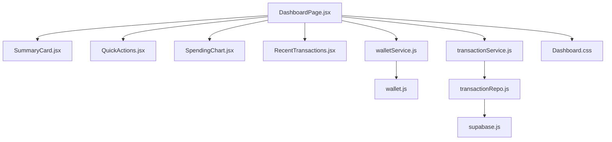

**Diagram sources**
- [DashboardPage.jsx:1-94](file://MoneyHey/src/pages/DashboardPage.jsx#L1-L94)
- [SummaryCard.jsx:1-22](file://MoneyHey/src/components/dashboard/SummaryCard.jsx#L1-L22)
- [QuickActions.jsx:1-27](file://MoneyHey/src/components/dashboard/QuickActions.jsx#L1-L27)
- [SpendingChart.jsx:1-41](file://MoneyHey/src/components/dashboard/SpendingChart.jsx#L1-L41)
- [RecentTransactions.jsx:1-50](file://MoneyHey/src/components/dashboard/RecentTransactions.jsx#L1-L50)
- [walletService.js:1-21](file://MoneyHey/src/services/walletService.js#L1-L21)
- [transactionService.js:1-24](file://MoneyHey/src/services/transactionService.js#L1-L24)
- [wallet.js:1-6](file://MoneyHey/src/domain/wallet.js#L1-L6)
- [transactionRepo.js:1-26](file://MoneyHey/src/api/transactionRepo.js#L1-L26)
- [supabase.js:1-11](file://MoneyHey/src/config/supabase.js#L1-L11)
- [Dashboard.css:1-335](file://MoneyHey/src/css/Dashboard.css#L1-L335)

**Section sources**
- [DashboardPage.jsx:1-94](file://MoneyHey/src/pages/DashboardPage.jsx#L1-L94)
- [Dashboard.css:1-335](file://MoneyHey/src/css/Dashboard.css#L1-L335)

## Core Components
- Summary Card: Displays a labeled metric with an icon, current value, and trend indicator. Supports color variants and positive/negative change semantics.
- Spending Chart: Renders a vertical progress-based spending breakdown by category for the current period.
- Quick Actions: Provides primary actions for adding expenses/income, transfers, and budgets.
- Recent Transactions: Shows a scrollable list of recent entries with category icons and amounts.

These components are composed in the dashboard page and styled via shared CSS.

**Section sources**
- [SummaryCard.jsx:1-22](file://MoneyHey/src/components/dashboard/SummaryCard.jsx#L1-L22)
- [SpendingChart.jsx:1-41](file://MoneyHey/src/components/dashboard/SpendingChart.jsx#L1-L41)
- [QuickActions.jsx:1-27](file://MoneyHey/src/components/dashboard/QuickActions.jsx#L1-L27)
- [RecentTransactions.jsx:1-50](file://MoneyHey/src/components/dashboard/RecentTransactions.jsx#L1-L50)
- [Dashboard.css:126-335](file://MoneyHey/src/css/Dashboard.css#L126-L335)

## Architecture Overview
The dashboard orchestrates data fetching and rendering:
- The page component initializes state and triggers a balance retrieval on mount.
- Services encapsulate data access and domain logic.
- Repositories communicate with Supabase.
- Components render UI and present data.

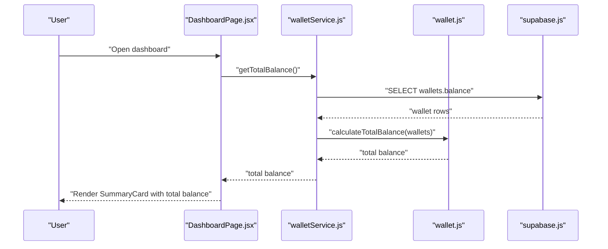

**Diagram sources**
- [DashboardPage.jsx:24-35](file://MoneyHey/src/pages/DashboardPage.jsx#L24-L35)
- [walletService.js:4-10](file://MoneyHey/src/services/walletService.js#L4-L10)
- [wallet.js:3-5](file://MoneyHey/src/domain/wallet.js#L3-L5)
- [supabase.js:1-11](file://MoneyHey/src/config/supabase.js#L1-L11)

## Detailed Component Analysis

### Dashboard Layout and Composition
- The dashboard page sets up the shell, header, sidebar toggle, and main content area.
- It renders summary cards, quick actions, spending visualization, and recent transactions.
- Responsive layout adjusts spacing and card widths for smaller screens.

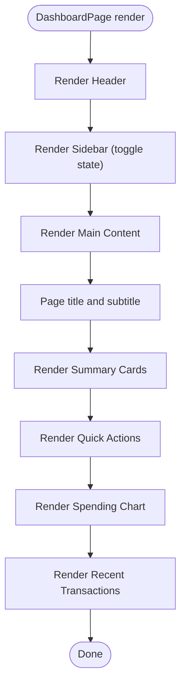

**Diagram sources**
- [DashboardPage.jsx:38-90](file://MoneyHey/src/pages/DashboardPage.jsx#L38-L90)
- [Dashboard.css:94-125](file://MoneyHey/src/css/Dashboard.css#L94-L125)

**Section sources**
- [DashboardPage.jsx:15-94](file://MoneyHey/src/pages/DashboardPage.jsx#L15-L94)
- [Dashboard.css:94-133](file://MoneyHey/src/css/Dashboard.css#L94-L133)

### Financial Summary Card Implementation
- Props: label, value, change percentage, positivity flag, icon name, and color variant.
- Rendering: icon container, label, value, and a directional change indicator.
- Styling: themed background and color per card variant; hover elevation.

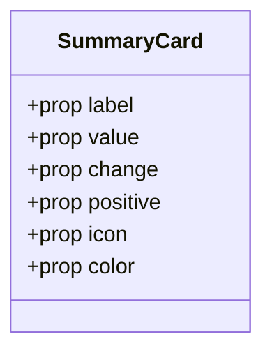

**Diagram sources**
- [SummaryCard.jsx:3-18](file://MoneyHey/src/components/dashboard/SummaryCard.jsx#L3-L18)
- [Dashboard.css:136-206](file://MoneyHey/src/css/Dashboard.css#L136-L206)

**Section sources**
- [SummaryCard.jsx:1-22](file://MoneyHey/src/components/dashboard/SummaryCard.jsx#L1-L22)
- [Dashboard.css:136-206](file://MoneyHey/src/css/Dashboard.css#L136-L206)

### Spending Visualization System
- Static bars represent category-wise spending distribution for the current period.
- Each bar displays category label, absolute value, and percentage width.
- Progress bar visuals reflect proportional spending.

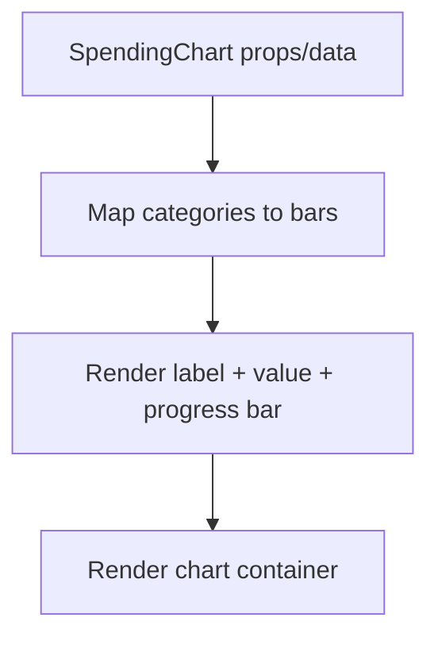

**Diagram sources**
- [SpendingChart.jsx:3-37](file://MoneyHey/src/components/dashboard/SpendingChart.jsx#L3-L37)
- [Dashboard.css:208-237](file://MoneyHey/src/css/Dashboard.css#L208-L237)

**Section sources**
- [SpendingChart.jsx:1-41](file://MoneyHey/src/components/dashboard/SpendingChart.jsx#L1-L41)
- [Dashboard.css:208-237](file://MoneyHey/src/css/Dashboard.css#L208-L237)

### Quick Actions Functionality
- Predefined actions with labels, icons, and color accents.
- Centered layout with wrapping buttons for mobile responsiveness.

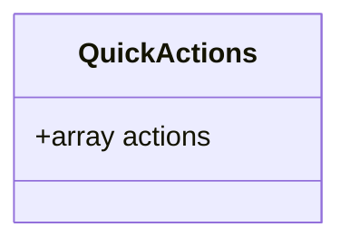

**Diagram sources**
- [QuickActions.jsx:3-22](file://MoneyHey/src/components/dashboard/QuickActions.jsx#L3-L22)
- [Dashboard.css:296-326](file://MoneyHey/src/css/Dashboard.css#L296-L326)

**Section sources**
- [QuickActions.jsx:1-27](file://MoneyHey/src/components/dashboard/QuickActions.jsx#L1-L27)
- [Dashboard.css:296-326](file://MoneyHey/src/css/Dashboard.css#L296-L326)

### Recent Transactions Display
- Displays a list of recent entries with category icons and income/expense amounts.
- Uses a mapping of categories to icons for visual clarity.

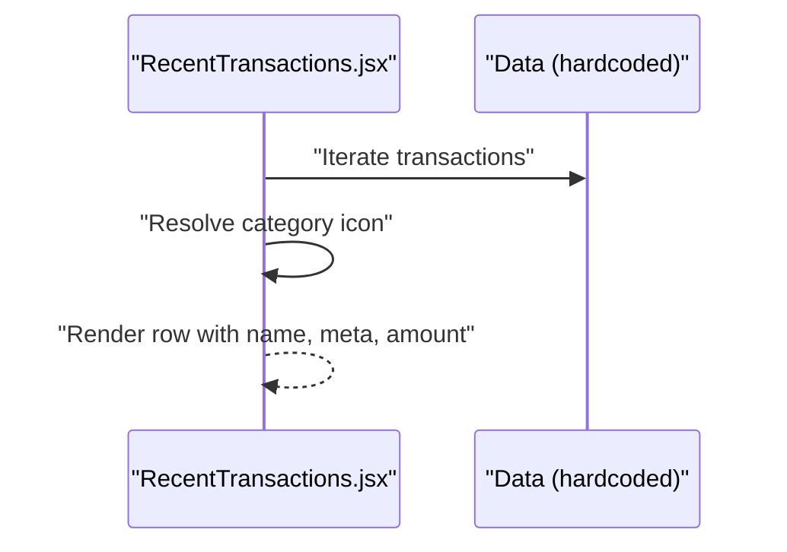

**Diagram sources**
- [RecentTransactions.jsx:3-46](file://MoneyHey/src/components/dashboard/RecentTransactions.jsx#L3-L46)
- [Dashboard.css:239-295](file://MoneyHey/src/css/Dashboard.css#L239-L295)

**Section sources**
- [RecentTransactions.jsx:1-50](file://MoneyHey/src/components/dashboard/RecentTransactions.jsx#L1-L50)
- [Dashboard.css:239-295](file://MoneyHey/src/css/Dashboard.css#L239-L295)

### Dashboard Service Implementation and Data Aggregation
- Total balance calculation aggregates wallet balances via a domain function.
- Domain conversion ensures numeric safety for monetary amounts.
- Transaction filtering supports date range and category selection.

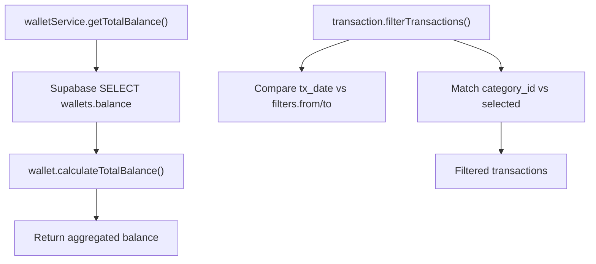

**Diagram sources**
- [walletService.js:4-10](file://MoneyHey/src/services/walletService.js#L4-L10)
- [wallet.js:3-5](file://MoneyHey/src/domain/wallet.js#L3-L5)
- [transaction.js:34-44](file://MoneyHey/src/domain/transaction.js#L34-L44)

**Section sources**
- [walletService.js:1-21](file://MoneyHey/src/services/walletService.js#L1-L21)
- [wallet.js:1-6](file://MoneyHey/src/domain/wallet.js#L1-L6)
- [transaction.js:34-44](file://MoneyHey/src/domain/transaction.js#L34-L44)

### Real-Time Updates Strategy
- Current implementation performs initial fetch on mount and does not subscribe to live updates.
- Recommended enhancements:
  - Subscribe to Supabase Realtime channels for transactions and wallets.
  - Invalidate and refetch cached data upon insert/update/delete events.
  - Debounce frequent updates to avoid excessive re-renders.

[No sources needed since this section provides general guidance]

### Chart Configuration Options and Analytics Components
- Recharts-based pie chart for expense distribution is available in the reporting module.
- Configuration includes data keys, colors, tooltip, and legend.

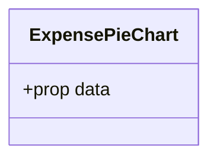

**Diagram sources**
- [ExpensePieChart.jsx:5-25](file://MoneyHey/src/components/report/ExpensePieChart.jsx#L5-L25)

**Section sources**
- [ExpensePieChart.jsx:1-28](file://MoneyHey/src/components/report/ExpensePieChart.jsx#L1-L28)

### Data Filtering Capabilities
- Filters support date range and category selection.
- Reset functionality clears filters to defaults.

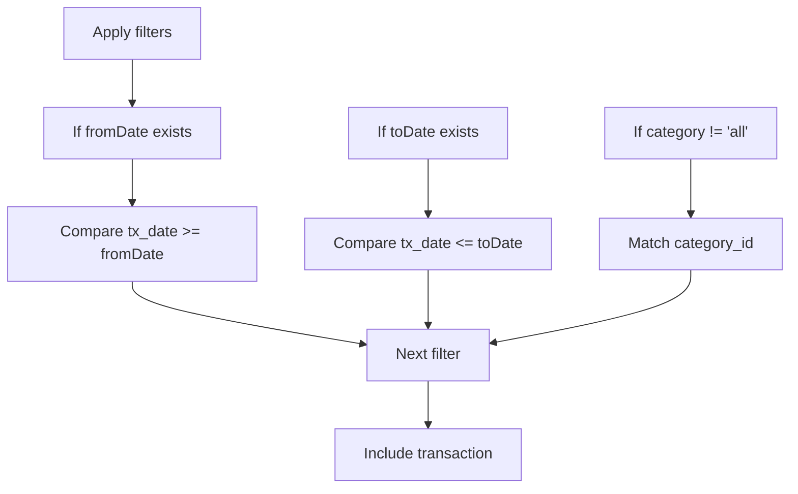

**Diagram sources**
- [transaction.js:34-44](file://MoneyHey/src/domain/transaction.js#L34-L44)
- [TransactionFilter.jsx:5-18](file://MoneyHey/src/components/transaction/TransactionFilter.jsx#L5-L18)

**Section sources**
- [transaction.js:34-44](file://MoneyHey/src/domain/transaction.js#L34-L44)
- [TransactionFilter.jsx:1-65](file://MoneyHey/src/components/transaction/TransactionFilter.jsx#L1-L65)

### Responsive Design Considerations
- Summary cards switch from a horizontal grid to a vertical stack on small screens.
- Sidebar toggles width and overlays on small devices.
- Flexible layouts adapt to varying viewport sizes.

**Section sources**
- [Dashboard.css:327-335](file://MoneyHey/src/css/Dashboard.css#L327-L335)

## Dependency Analysis
The dashboard depends on services and repositories for data access, and uses domain logic for safe numeric conversions and filtering.

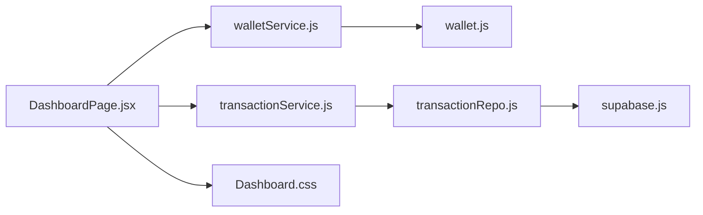

**Diagram sources**
- [DashboardPage.jsx:1-94](file://MoneyHey/src/pages/DashboardPage.jsx#L1-L94)
- [walletService.js:1-21](file://MoneyHey/src/services/walletService.js#L1-L21)
- [transactionService.js:1-24](file://MoneyHey/src/services/transactionService.js#L1-L24)
- [wallet.js:1-6](file://MoneyHey/src/domain/wallet.js#L1-L6)
- [transactionRepo.js:1-26](file://MoneyHey/src/api/transactionRepo.js#L1-L26)
- [supabase.js:1-11](file://MoneyHey/src/config/supabase.js#L1-L11)
- [Dashboard.css:1-335](file://MoneyHey/src/css/Dashboard.css#L1-L335)

**Section sources**
- [DashboardPage.jsx:1-94](file://MoneyHey/src/pages/DashboardPage.jsx#L1-L94)
- [walletService.js:1-21](file://MoneyHey/src/services/walletService.js#L1-L21)
- [transactionService.js:1-24](file://MoneyHey/src/services/transactionService.js#L1-L24)
- [wallet.js:1-6](file://MoneyHey/src/domain/wallet.js#L1-L6)
- [transactionRepo.js:1-26](file://MoneyHey/src/api/transactionRepo.js#L1-L26)
- [supabase.js:1-11](file://MoneyHey/src/config/supabase.js#L1-L11)
- [Dashboard.css:1-335](file://MoneyHey/src/css/Dashboard.css#L1-L335)

## Performance Considerations
- Initial load: Fetch only necessary fields from Supabase to minimize payload.
- Virtualization: For long transaction lists, consider virtualized lists to reduce DOM nodes.
- Memoization: Cache computed totals and filtered lists using stable keys.
- Debouncing: Debounce filter changes to avoid frequent re-fetches.
- Incremental updates: Use Supabase Realtime to update local cache incrementally rather than refetching all data.
- Lazy loading: Defer heavy chart rendering until the container is visible.

[No sources needed since this section provides general guidance]

## Troubleshooting Guide
- Network errors during balance fetch: The dashboard logs network-related errors and surfaces them to the caller. Verify credentials and connectivity.
- Transaction fetch failures: Errors are logged and re-thrown; ensure the backend is reachable and the client is configured correctly.
- Numeric conversion issues: Domain helpers convert values safely; ensure inputs conform to numeric expectations.

**Section sources**
- [DashboardPage.jsx:24-35](file://MoneyHey/src/pages/DashboardPage.jsx#L24-L35)
- [walletService.js:4-10](file://MoneyHey/src/services/walletService.js#L4-L10)
- [transactionService.js:4-13](file://MoneyHey/src/services/transactionService.js#L4-L13)
- [transaction.js:6-9](file://MoneyHey/src/domain/transaction.js#L6-L9)

## Conclusion
The MoneyHey dashboard composes modular, reusable components with a clean separation of concerns. Services and repositories abstract data access, while domain logic ensures robust numeric handling and filtering. The current implementation focuses on initial data loads; extending it with Supabase Realtime subscriptions and performance optimizations will enable scalable, real-time experiences.

## Appendices

### Customizing Dashboard Widgets
- Add a new summary card: Define props and integrate into the summary grid in the dashboard page.
- Extend quick actions: Add new actions with appropriate icons and colors.
- Modify spending visualization: Replace static bars with dynamic charts using domain aggregation.

**Section sources**
- [DashboardPage.jsx:58-81](file://MoneyHey/src/pages/DashboardPage.jsx#L58-L81)
- [SummaryCard.jsx:1-22](file://MoneyHey/src/components/dashboard/SummaryCard.jsx#L1-L22)
- [QuickActions.jsx:1-27](file://MoneyHey/src/components/dashboard/QuickActions.jsx#L1-L27)
- [SpendingChart.jsx:1-41](file://MoneyHey/src/components/dashboard/SpendingChart.jsx#L1-L41)

### Adding New Analytics Components
- Create a new chart component using a charting library and pass aggregated data from services.
- Integrate the component into the dashboard layout and ensure responsive sizing.

**Section sources**
- [ExpensePieChart.jsx:1-28](file://MoneyHey/src/components/report/ExpensePieChart.jsx#L1-L28)

### Integrating Additional Financial Metrics
- Extend domain calculations to compute new metrics (e.g., average daily spend).
- Update services to expose new endpoints or computed fields.
- Render new summary cards or charts with the computed values.

**Section sources**
- [wallet.js:3-5](file://MoneyHey/src/domain/wallet.js#L3-L5)
- [transaction.js:34-44](file://MoneyHey/src/domain/transaction.js#L34-L44)

### Real-Time Data Integration
- Subscribe to Supabase channels for transactions and wallets.
- On insert/update/delete, update local state and recompute affected metrics.
- Debounce updates and invalidate caches efficiently.

[No sources needed since this section provides general guidance]