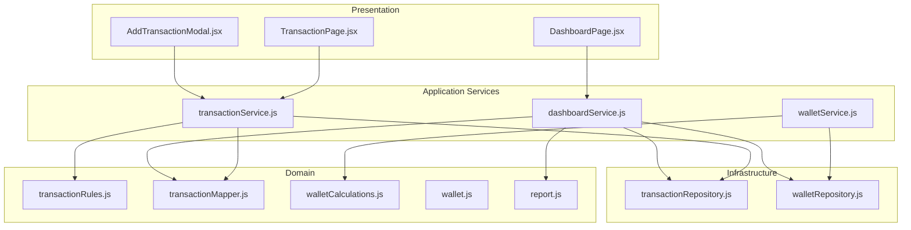
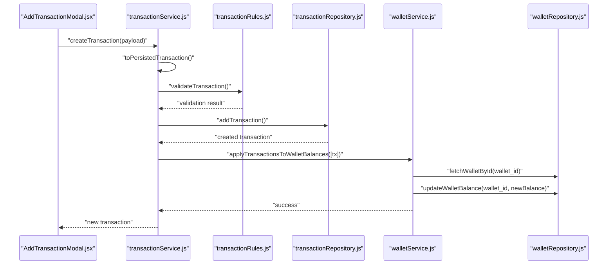
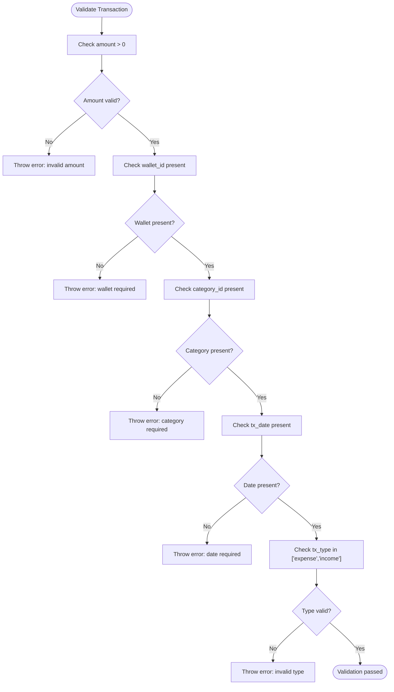
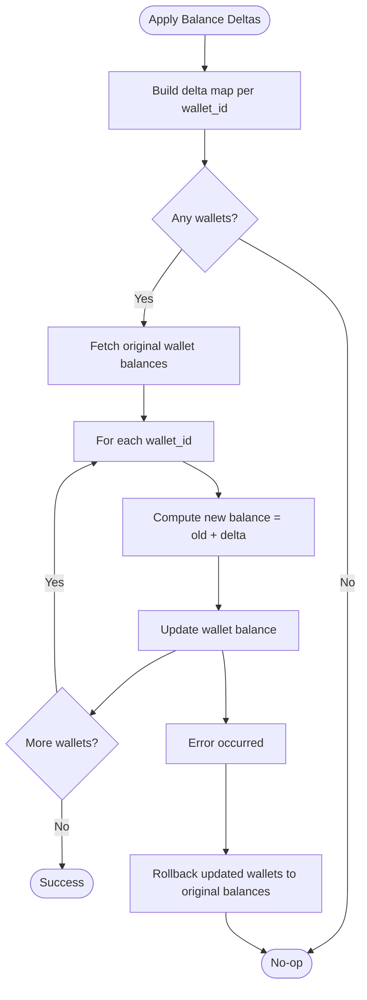
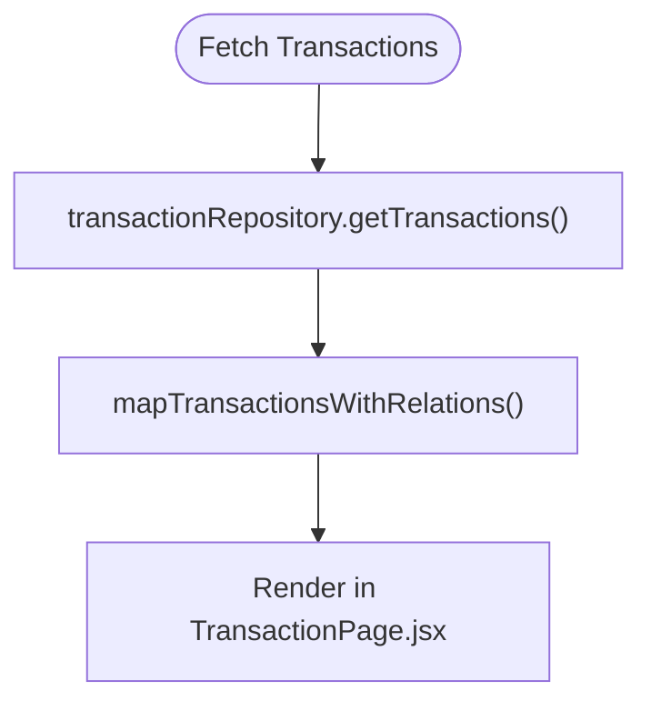
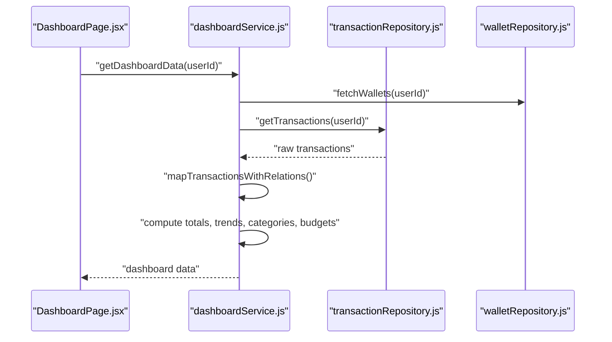
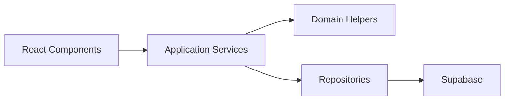

# Data Models and Domain Logic

<cite>
**Referenced Files in This Document**
- [transaction.js](file://MoneyHey/src/domain/transaction.js)
- [wallet.js](file://MoneyHey/src/domain/wallet.js)
- [report.js](file://MoneyHey/src/domain/report.js)
- [transactionMapper.js](file://MoneyHey/src/domain/transactions/transactionMapper.js)
- [transactionRules.js](file://MoneyHey/src/domain/transactions/transactionRules.js)
- [walletCalculations.js](file://MoneyHey/src/domain/wallets/walletCalculations.js)
- [transactionService.js](file://MoneyHey/src/application/services/transactionService.js)
- [walletService.js](file://MoneyHey/src/application/services/walletService.js)
- [dashboardService.js](file://MoneyHey/src/application/services/dashboardService.js)
- [transactionRepository.js](file://MoneyHey/src/infrastructure/repositories/transactionRepository.js)
- [walletRepository.js](file://MoneyHey/src/infrastructure/repositories/walletRepository.js)
- [AddTransactionModal.jsx](file://MoneyHey/src/components/transaction/AddTransactionModal.jsx)
- [TransactionPage.jsx](file://MoneyHey/src/pages/TransactionPage.jsx)
- [DashboardPage.jsx](file://MoneyHey/src/pages/DashboardPage.jsx)
</cite>

## Table of Contents
1. [Introduction](#introduction)
2. [Project Structure](#project-structure)
3. [Core Components](#core-components)
4. [Architecture Overview](#architecture-overview)
5. [Detailed Component Analysis](#detailed-component-analysis)
6. [Dependency Analysis](#dependency-analysis)
7. [Performance Considerations](#performance-considerations)
8. [Troubleshooting Guide](#troubleshooting-guide)
9. [Conclusion](#conclusion)
10. [Appendices](#appendices)

## Introduction
This document describes the data models and domain logic of MoneyHey with a focus on Transactions and Wallets. It explains the core domain entities, their properties, relationships, and constraints; documents business rules, validation logic, and data transformation processes; and outlines the transaction mapping system, rule engines, and calculation algorithms. It also provides diagrams, validation rules, and guidance for extending domain models, adding new business rules, and implementing complex financial calculations while addressing data consistency, transaction atomicity, and domain-driven design principles.

## Project Structure
MoneyHey follows a layered architecture:
- Domain layer: Pure business logic for transactions, wallets, reports, and transformations.
- Application services: Coordinate workflows, orchestrate repositories, and enforce business rules.
- Infrastructure: Data access via Supabase client and repositories.
- Presentation: React components and pages that render UI and trigger application services.

**Diagram sources**
- [TransactionPage.jsx](file://MoneyHey/src/pages/TransactionPage.jsx)
- [DashboardPage.jsx](file://MoneyHey/src/pages/DashboardPage.jsx)
- [AddTransactionModal.jsx](file://MoneyHey/src/components/transaction/AddTransactionModal.jsx)
- [transactionService.js](file://MoneyHey/src/application/services/transactionService.js)
- [walletService.js](file://MoneyHey/src/application/services/walletService.js)
- [dashboardService.js](file://MoneyHey/src/application/services/dashboardService.js)
- [transactionRules.js](file://MoneyHey/src/domain/transactions/transactionRules.js)
- [transactionMapper.js](file://MoneyHey/src/domain/transactions/transactionMapper.js)
- [walletCalculations.js](file://MoneyHey/src/domain/wallets/walletCalculations.js)
- [wallet.js](file://MoneyHey/src/domain/wallet.js)
- [report.js](file://MoneyHey/src/domain/report.js)
- [transactionRepository.js](file://MoneyHey/src/infrastructure/repositories/transactionRepository.js)
- [walletRepository.js](file://MoneyHey/src/infrastructure/repositories/walletRepository.js)

**Section sources**
- [TransactionPage.jsx](file://MoneyHey/src/pages/TransactionPage.jsx)
- [DashboardPage.jsx](file://MoneyHey/src/pages/DashboardPage.jsx)
- [AddTransactionModal.jsx](file://MoneyHey/src/components/transaction/AddTransactionModal.jsx)
- [transactionService.js](file://MoneyHey/src/application/services/transactionService.js)
- [walletService.js](file://MoneyHey/src/application/services/walletService.js)
- [dashboardService.js](file://MoneyHey/src/application/services/dashboardService.js)
- [transactionRepository.js](file://MoneyHey/src/infrastructure/repositories/transactionRepository.js)
- [walletRepository.js](file://MoneyHey/src/infrastructure/repositories/walletRepository.js)

## Core Components
This section documents the core domain entities and supporting logic.

### Transaction Model and Validation
- Properties:
  - amount: numeric amount; validated to be finite and positive.
  - wallet_id: required wallet identifier.
  - category_id: required category identifier.
  - tx_date: required transaction date.
  - tx_type: either "expense" or "income".
  - note: optional free-text note.
  - user_id: optional user identifier.
- Validation rules:
  - Amount must be a positive number.
  - Wallet and category identifiers are required.
  - Transaction date is required.
  - Transaction type must be one of the allowed values.
- Data transformation:
  - Amount normalization to a finite number.
  - Signed amount computation based on transaction type.
- Filtering:
  - Filter by date range and category.

**Section sources**
- [transaction.js](file://MoneyHey/src/domain/transaction.js)
- [transactionRules.js](file://MoneyHey/src/domain/transactions/transactionRules.js)

### Wallet Model and Calculations
- Properties:
  - balance: numeric wallet balance.
  - wallet_name: non-empty trimmed string.
  - user_id: optional user identifier.
- Aggregation:
  - Total balance computed across multiple wallets.
- Balance delta computation:
  - Income contributes positively; expense negatively.
  - Delta map per wallet built from a list of transactions.
- Atomic balance updates:
  - Original balances captured before applying deltas.
  - Rollback on errors to maintain consistency.

**Section sources**
- [wallet.js](file://MoneyHey/src/domain/wallet.js)
- [walletCalculations.js](file://MoneyHey/src/domain/wallets/walletCalculations.js)
- [walletService.js](file://MoneyHey/src/application/services/walletService.js)

### Report and Analytics
- Totals by type:
  - Sum income and expense amounts.
- Net balance:
  - Sum signed transaction amounts.
- Category summary:
  - Group expenses by category name and compute totals.

**Section sources**
- [report.js](file://MoneyHey/src/domain/report.js)

### Transaction Mapping and Relations
- Relation mapping:
  - Enriches transactions with category and wallet names from related records.
- Used across services to present joined data without changing persistence concerns.

**Section sources**
- [transactionMapper.js](file://MoneyHey/src/domain/transactions/transactionMapper.js)

## Architecture Overview
The system enforces domain-driven design by keeping business logic in the domain layer and orchestrating operations in application services. Repositories encapsulate data access and are used by services to persist and retrieve data.

**Diagram sources**
- [AddTransactionModal.jsx](file://MoneyHey/src/components/transaction/AddTransactionModal.jsx)
- [transactionService.js](file://MoneyHey/src/application/services/transactionService.js)
- [transactionRules.js](file://MoneyHey/src/domain/transactions/transactionRules.js)
- [transactionRepository.js](file://MoneyHey/src/infrastructure/repositories/transactionRepository.js)
- [walletService.js](file://MoneyHey/src/application/services/walletService.js)
- [walletRepository.js](file://MoneyHey/src/infrastructure/repositories/walletRepository.js)

## Detailed Component Analysis

### Transaction Domain and Business Rules
- Validation engine:
  - Validates amount positivity, presence of wallet and category, presence of date, and allowed transaction type.
- Transformation helpers:
  - Normalizes amount to a finite number.
  - Computes signed amount based on type.
- Filtering:
  - Supports filtering by date range and category.

**Diagram sources**
- [transactionRules.js](file://MoneyHey/src/domain/transactions/transactionRules.js)
- [transaction.js](file://MoneyHey/src/domain/transaction.js)

**Section sources**
- [transactionRules.js](file://MoneyHey/src/domain/transactions/transactionRules.js)
- [transaction.js](file://MoneyHey/src/domain/transaction.js)

### Wallet Balance Calculation and Atomic Updates
- Balance delta computation:
  - Builds a map of wallet_id to cumulative balance delta from transactions.
- Atomic update:
  - Fetches original balances before applying deltas.
  - On success, persists new balances; on error, reverts balances per wallet.

**Diagram sources**
- [walletCalculations.js](file://MoneyHey/src/domain/wallets/walletCalculations.js)
- [walletService.js](file://MoneyHey/src/application/services/walletService.js)
- [walletRepository.js](file://MoneyHey/src/infrastructure/repositories/walletRepository.js)

**Section sources**
- [walletCalculations.js](file://MoneyHey/src/domain/wallets/walletCalculations.js)
- [walletService.js](file://MoneyHey/src/application/services/walletService.js)
- [walletRepository.js](file://MoneyHey/src/infrastructure/repositories/walletRepository.js)

### Transaction Mapping and Presentation
- Mapping enriches transactions with category and wallet names for UI rendering.
- Applied when fetching transactions for display.

**Diagram sources**
- [transactionRepository.js](file://MoneyHey/src/infrastructure/repositories/transactionRepository.js)
- [transactionMapper.js](file://MoneyHey/src/domain/transactions/transactionMapper.js)
- [TransactionPage.jsx](file://MoneyHey/src/pages/TransactionPage.jsx)

**Section sources**
- [transactionRepository.js](file://MoneyHey/src/infrastructure/repositories/transactionRepository.js)
- [transactionMapper.js](file://MoneyHey/src/domain/transactions/transactionMapper.js)
- [TransactionPage.jsx](file://MoneyHey/src/pages/TransactionPage.jsx)

### Dashboard Analytics and Budget Usage
- Dashboard aggregates:
  - Recent transactions.
  - Monthly income and expense trends.
  - Top spending categories.
  - Budget usage percentage across active budgets.
- Uses mapped transactions and wallet data.

**Diagram sources**
- [DashboardPage.jsx](file://MoneyHey/src/pages/DashboardPage.jsx)
- [dashboardService.js](file://MoneyHey/src/application/services/dashboardService.js)
- [transactionRepository.js](file://MoneyHey/src/infrastructure/repositories/transactionRepository.js)
- [walletRepository.js](file://MoneyHey/src/infrastructure/repositories/walletRepository.js)

**Section sources**
- [dashboardService.js](file://MoneyHey/src/application/services/dashboardService.js)
- [DashboardPage.jsx](file://MoneyHey/src/pages/DashboardPage.jsx)

## Dependency Analysis
- Domain depends on pure helpers and constants; no external dependencies.
- Application services depend on domain helpers and repositories.
- Repositories depend on the Supabase client.
- Presentation components depend on application services.

**Diagram sources**
- [transactionService.js](file://MoneyHey/src/application/services/transactionService.js)
- [walletService.js](file://MoneyHey/src/application/services/walletService.js)
- [transactionRepository.js](file://MoneyHey/src/infrastructure/repositories/transactionRepository.js)
- [walletRepository.js](file://MoneyHey/src/infrastructure/repositories/walletRepository.js)

**Section sources**
- [transactionService.js](file://MoneyHey/src/application/services/transactionService.js)
- [walletService.js](file://MoneyHey/src/application/services/walletService.js)
- [transactionRepository.js](file://MoneyHey/src/infrastructure/repositories/transactionRepository.js)
- [walletRepository.js](file://MoneyHey/src/infrastructure/repositories/walletRepository.js)

## Performance Considerations
- Prefer batch operations for multiple transactions to reduce round-trips.
- Use delta-based balance updates to avoid recalculating balances from scratch.
- Apply server-side filtering and pagination to limit payload sizes.
- Cache frequently accessed metadata (categories, wallets) in the UI to reduce network requests.

## Troubleshooting Guide
Common issues and resolutions:
- Validation errors during creation or update:
  - Ensure amount is a positive number, wallet and category are selected, date is provided, and type is one of the allowed values.
- Wallet update failures:
  - Verify the wallet exists and the delta computation is correct; check for concurrent updates and retry with rollback logic.
- Transaction deletion anomalies:
  - Confirm that dependent constraints (e.g., existing transactions) are handled before attempting deletions.

**Section sources**
- [transactionRules.js](file://MoneyHey/src/domain/transactions/transactionRules.js)
- [walletService.js](file://MoneyHey/src/application/services/walletService.js)

## Conclusion
MoneyHey’s domain layer cleanly separates business logic from infrastructure and presentation. Transactions and wallets are modeled with explicit validation, transformation, and calculation helpers. Application services coordinate these domain capabilities with repositories to ensure data consistency and atomicity. The mapping layer enriches data for UI rendering without affecting persistence. Extending the domain involves adding new rules, calculations, or mappings while preserving the layered architecture and DDD boundaries.

## Appendices

### Extending Domain Models and Adding Business Rules
- Extend transaction validation:
  - Add new required fields or derived constraints in the validation module.
  - Keep the validation pure and deterministic.
- Add new calculation algorithms:
  - Implement in domain helpers (e.g., new report aggregations).
  - Ensure immutability and predictable outputs.
- Introduce new mappers:
  - Extend mapping functions to support additional relations or computed fields.
- Enforce new constraints:
  - Add checks in application services before invoking repositories.
  - Use atomic update patterns to maintain consistency.

### Implementing Complex Financial Calculations
- Use delta maps for efficient balance recomputation across multiple wallets.
- Aggregate by time windows (monthly, quarterly) and categories for reporting.
- Normalize amounts and dates consistently to avoid precision and timezone issues.

### Data Consistency and Transaction Atomicity
- Wrap related updates in atomic blocks:
  - Capture original state before applying deltas.
  - Roll back on errors to preserve consistency.
- Use repository methods for single-table operations and service-level coordination for cross-table effects.