# Database Schema and Configuration

<cite>
**Referenced Files in This Document**
- [supabase.js](file://MoneyHey/src/config/supabase.js)
- [supabaseClient.js](file://src/infrastructure/supabaseClient.js)
- [authRepository.js](file://src/infrastructure/repositories/authRepository.js)
- [categoryRepository.js](file://src/infrastructure/repositories/categoryRepository.js)
- [transactionRepository.js](file://src/infrastructure/repositories/transactionRepository.js)
- [walletRepository.js](file://src/infrastructure/repositories/walletRepository.js)
- [transaction.js](file://src/domain/transaction.js)
- [wallet.js](file://src/domain/wallet.js)
- [authService.js](file://src/services/authService.js)
- [categoryService.js](file://src/services/categoryService.js)
- [transactionService.js](file://src/services/transactionService.js)
- [walletService.js](file://src/services/walletService.js)
- [LoginForm.jsx](file://src/components/auth/LoginForm.jsx)
- [RegisterForm.jsx](file://src/components/auth/RegisterForm.jsx)
- [ProtectedRoute.jsx](file://src/components/auth/ProtectedRoute.jsx)
- [DashboardPage.jsx](file://src/pages/DashboardPage.jsx)
- [TransactionPage.jsx](file://src/pages/TransactionPage.jsx)
- [ReportPage.jsx](file://src/pages/ReportPage.jsx)
- [supabase-schema-moneyhey.png](file://database/supabase-schema-moneyhey.png)
</cite>

## Table of Contents
1. [Introduction](#introduction)
2. [Project Structure](#project-structure)
3. [Core Components](#core-components)
4. [Architecture Overview](#architecture-overview)
5. [Detailed Component Analysis](#detailed-component-analysis)
6. [Dependency Analysis](#dependency-analysis)
7. [Performance Considerations](#performance-considerations)
8. [Troubleshooting Guide](#troubleshooting-guide)
9. [Conclusion](#conclusion)
10. [Appendices](#appendices)

## Introduction
This document provides comprehensive database schema and configuration documentation for MoneyHey, focusing on the Supabase backend implementation. It covers the data model for authentication, categories, transactions, and wallets; repository pattern usage for database operations; query optimization strategies; and practical guidance for migrations, versioning, backups, and security.

## Project Structure
MoneyHey follows a layered architecture with clear separation between configuration, domain logic, services, and infrastructure. Database connectivity is centralized via Supabase client configuration, while repositories encapsulate CRUD operations and service layers orchestrate business logic.

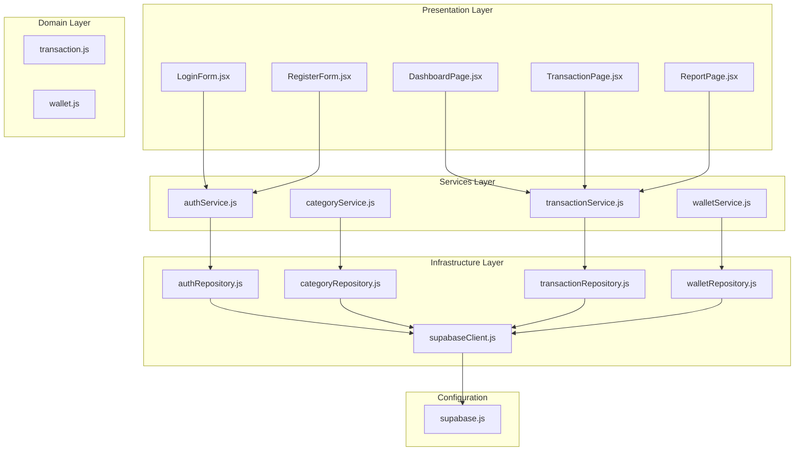

**Diagram sources**
- [supabase.js:1-11](file://MoneyHey/src/config/supabase.js#L1-L11)
- [supabaseClient.js](file://src/infrastructure/supabaseClient.js)
- [authRepository.js](file://src/infrastructure/repositories/authRepository.js)
- [categoryRepository.js](file://src/infrastructure/repositories/categoryRepository.js)
- [transactionRepository.js](file://src/infrastructure/repositories/transactionRepository.js)
- [walletRepository.js](file://src/infrastructure/repositories/walletRepository.js)
- [transaction.js:1-50](file://src/domain/transaction.js#L1-L50)
- [wallet.js:1-6](file://src/domain/wallet.js#L1-L6)
- [authService.js](file://src/services/authService.js)
- [categoryService.js](file://src/services/categoryService.js)
- [transactionService.js](file://src/services/transactionService.js)
- [walletService.js](file://src/services/walletService.js)
- [LoginForm.jsx](file://src/components/auth/LoginForm.jsx)
- [RegisterForm.jsx](file://src/components/auth/RegisterForm.jsx)
- [DashboardPage.jsx](file://src/pages/DashboardPage.jsx)
- [TransactionPage.jsx](file://src/pages/TransactionPage.jsx)
- [ReportPage.jsx](file://src/pages/ReportPage.jsx)

**Section sources**
- [supabase.js:1-11](file://MoneyHey/src/config/supabase.js#L1-L11)
- [supabaseClient.js](file://src/infrastructure/supabaseClient.js)

## Core Components
- Supabase Client Configuration: Centralized initialization of the Supabase client with authentication session persistence disabled.
- Repository Pattern: Each domain entity (auth, category, transaction, wallet) has a dedicated repository implementing CRUD operations against Supabase.
- Service Layer: Encapsulates business logic and orchestrates repository calls.
- Domain Utilities: Validation and calculation helpers for transactions and wallets.

Key implementation references:
- Supabase client creation and configuration
- Repository classes for auth, category, transaction, and wallet
- Service classes for business logic
- Domain validators and calculators

**Section sources**
- [supabase.js:1-11](file://MoneyHey/src/config/supabase.js#L1-L11)
- [authRepository.js](file://src/infrastructure/repositories/authRepository.js)
- [categoryRepository.js](file://src/infrastructure/repositories/categoryRepository.js)
- [transactionRepository.js](file://src/infrastructure/repositories/transactionRepository.js)
- [walletRepository.js](file://src/infrastructure/repositories/walletRepository.js)
- [authService.js](file://src/services/authService.js)
- [categoryService.js](file://src/services/categoryService.js)
- [transactionService.js](file://src/services/transactionService.js)
- [walletService.js](file://src/services/walletService.js)
- [transaction.js:1-50](file://src/domain/transaction.js#L1-L50)
- [wallet.js:1-6](file://src/domain/wallet.js#L1-L6)

## Architecture Overview
The system uses Supabase as the backend database and authentication provider. The Supabase client is configured centrally and injected into repositories. Services coordinate operations, and domain utilities enforce data validation and calculations.

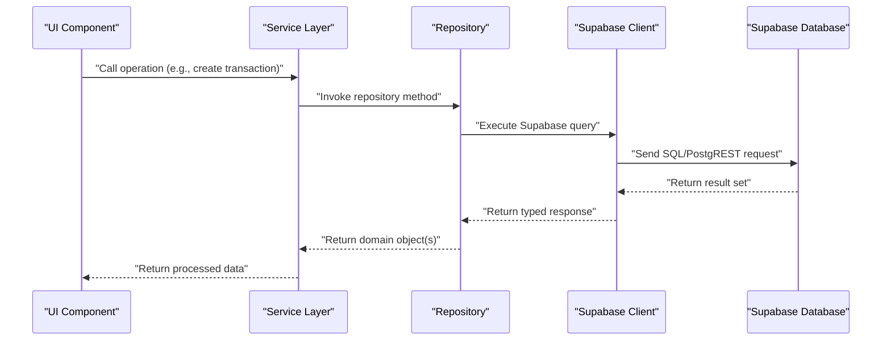

**Diagram sources**
- [supabase.js:1-11](file://MoneyHey/src/config/supabase.js#L1-L11)
- [supabaseClient.js](file://src/infrastructure/supabaseClient.js)
- [transactionRepository.js](file://src/infrastructure/repositories/transactionRepository.js)
- [transactionService.js](file://src/services/transactionService.js)

## Detailed Component Analysis

### Authentication Tables and Flow
Authentication relies on Supabase Auth. The client configuration disables session persistence, requiring re-authentication on page reload. Protected routes wrap pages to enforce authentication.

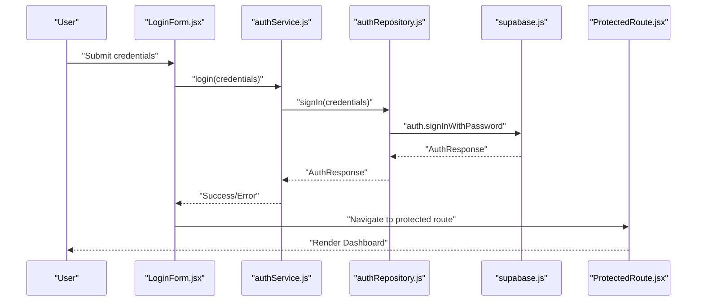

**Diagram sources**
- [LoginForm.jsx](file://src/components/auth/LoginForm.jsx)
- [ProtectedRoute.jsx](file://src/components/auth/ProtectedRoute.jsx)
- [authService.js](file://src/services/authService.js)
- [authRepository.js](file://src/infrastructure/repositories/authRepository.js)
- [supabase.js:1-11](file://MoneyHey/src/config/supabase.js#L1-L11)

**Section sources**
- [supabase.js:1-11](file://MoneyHey/src/config/supabase.js#L1-L11)
- [authRepository.js](file://src/infrastructure/repositories/authRepository.js)
- [authService.js](file://src/services/authService.js)
- [LoginForm.jsx](file://src/components/auth/LoginForm.jsx)
- [ProtectedRoute.jsx](file://src/components/auth/ProtectedRoute.jsx)

### Transaction Schema and Business Rules
Transactions are validated for amount positivity, wallet presence, category presence, date presence, and type membership. Amounts are normalized and signed according to transaction type.

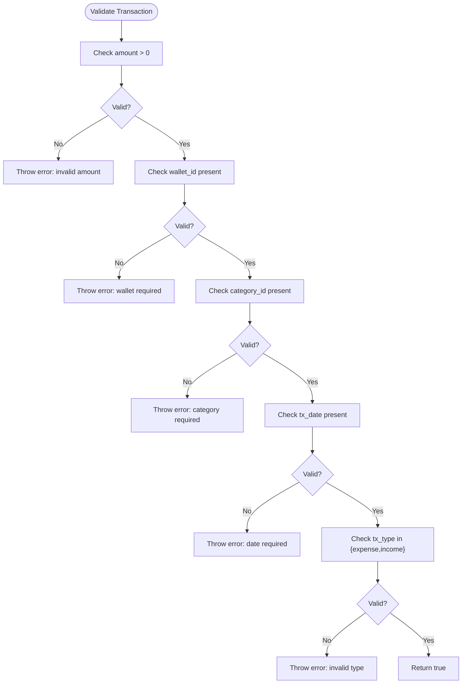

**Diagram sources**
- [transaction.js:15-32](file://src/domain/transaction.js#L15-L32)

**Section sources**
- [transaction.js:1-50](file://src/domain/transaction.js#L1-L50)

### Wallet Model and Aggregation
Wallet totals are computed by summing balances across multiple wallets, with amount normalization applied.

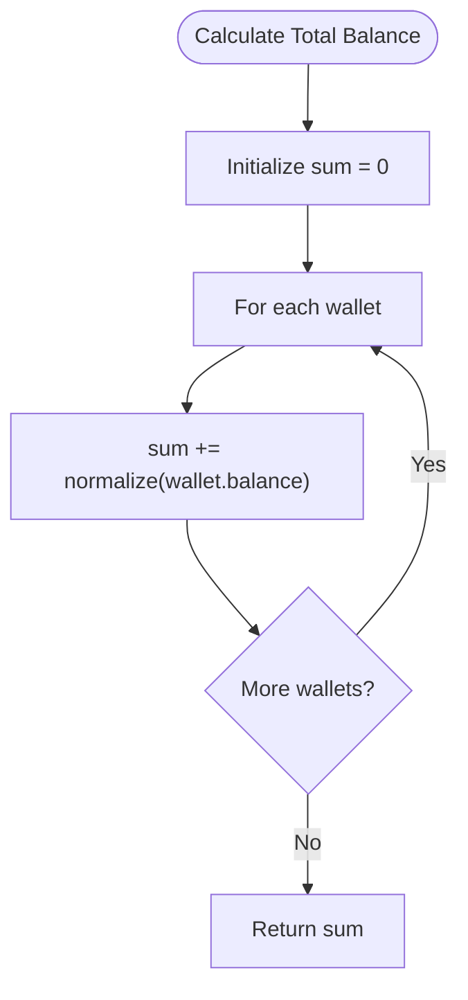

**Diagram sources**
- [wallet.js:3-5](file://src/domain/wallet.js#L3-L5)

**Section sources**
- [wallet.js:1-6](file://src/domain/wallet.js#L1-L6)

### Category Hierarchy and Management
Categories support hierarchical grouping and filtering. The repository pattern enables CRUD operations and service layer integration for UI components.

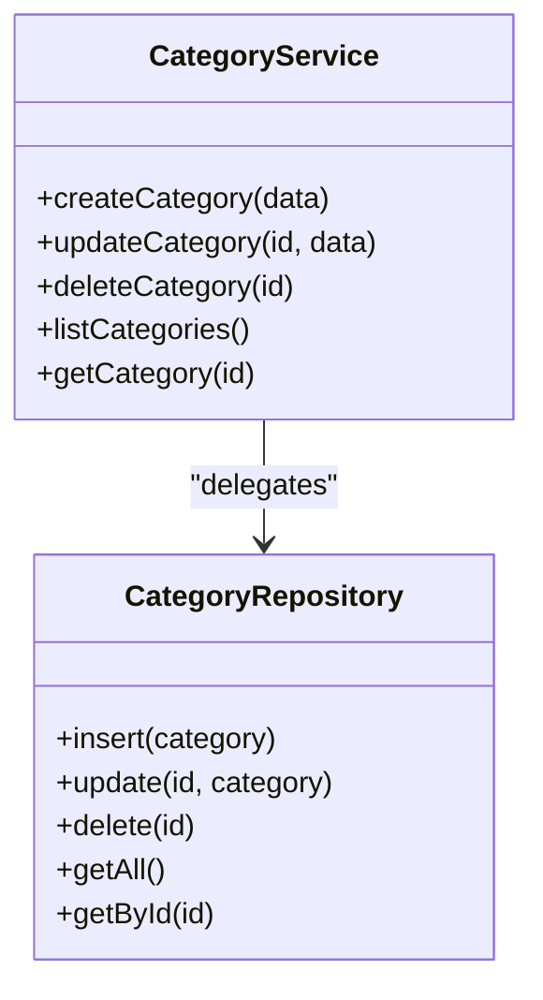

**Diagram sources**
- [categoryRepository.js](file://src/infrastructure/repositories/categoryRepository.js)
- [categoryService.js](file://src/services/categoryService.js)

**Section sources**
- [categoryRepository.js](file://src/infrastructure/repositories/categoryRepository.js)
- [categoryService.js](file://src/services/categoryService.js)

### Transaction Repository and Queries
The transaction repository encapsulates Supabase operations for transactions, including filtering and aggregation. Domain utilities handle validation and amount normalization.

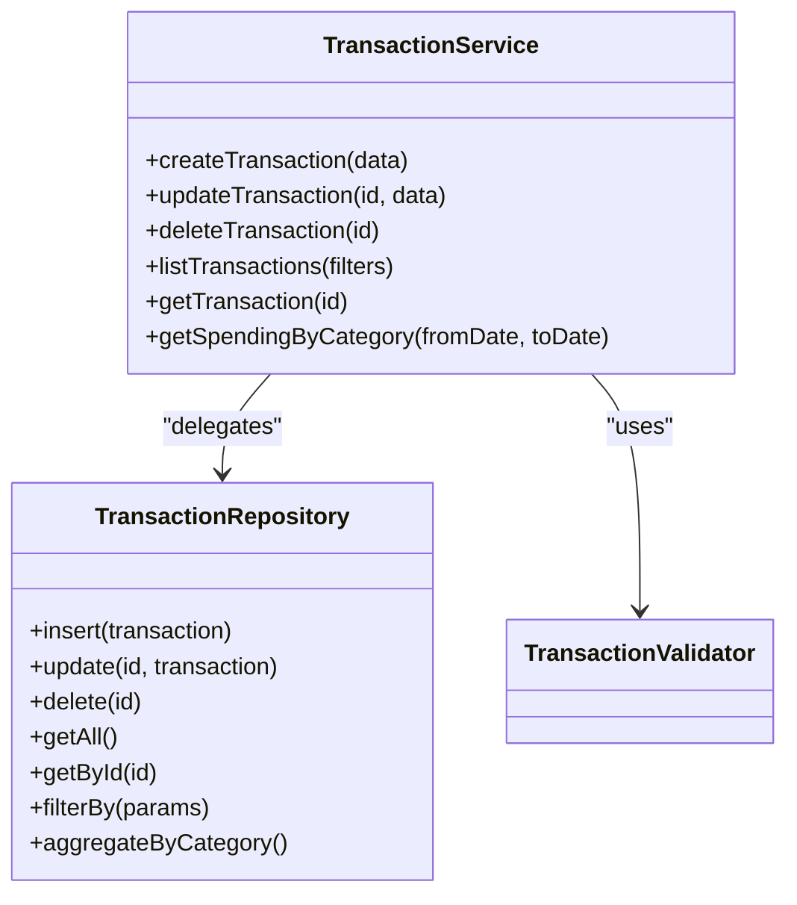

**Diagram sources**
- [transactionRepository.js](file://src/infrastructure/repositories/transactionRepository.js)
- [transactionService.js](file://src/services/transactionService.js)
- [transaction.js:1-50](file://src/domain/transaction.js#L1-L50)

**Section sources**
- [transactionRepository.js](file://src/infrastructure/repositories/transactionRepository.js)
- [transactionService.js](file://src/services/transactionService.js)
- [transaction.js:1-50](file://src/domain/transaction.js#L1-L50)

### Wallet Repository and Operations
Wallet operations include balance retrieval, updates, and aggregations across multiple wallets.

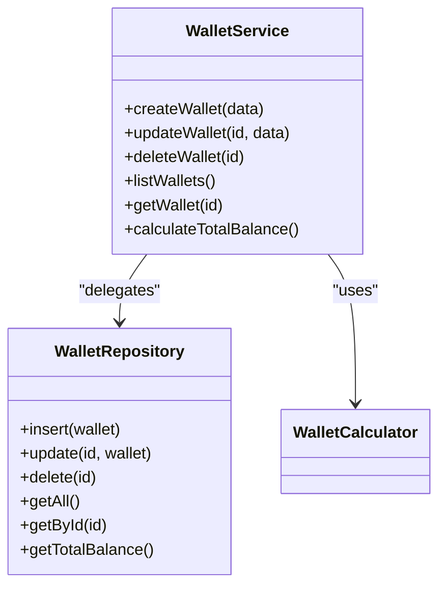

**Diagram sources**
- [walletRepository.js](file://src/infrastructure/repositories/walletRepository.js)
- [walletService.js](file://src/services/walletService.js)
- [wallet.js:1-6](file://src/domain/wallet.js#L1-L6)

**Section sources**
- [walletRepository.js](file://src/infrastructure/repositories/walletRepository.js)
- [walletService.js](file://src/services/walletService.js)
- [wallet.js:1-6](file://src/domain/wallet.js#L1-L6)

### Supabase Client and Configuration
The Supabase client is initialized with a public URL and key, and authentication session persistence is disabled. This configuration affects how sessions are managed across the app.

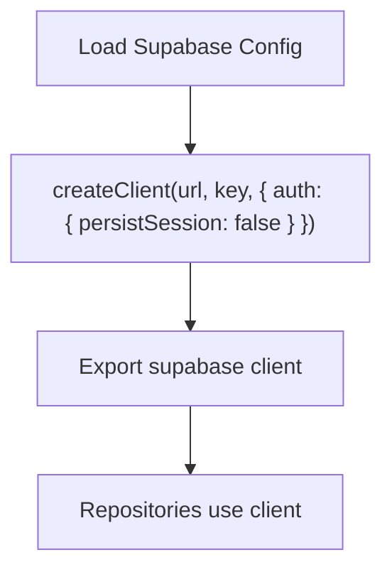

**Diagram sources**
- [supabase.js:1-11](file://MoneyHey/src/config/supabase.js#L1-L11)

**Section sources**
- [supabase.js:1-11](file://MoneyHey/src/config/supabase.js#L1-L11)

## Dependency Analysis
The dependency chain flows from UI components through services to repositories and finally to the Supabase client. Supabase client configuration is a shared dependency across repositories.

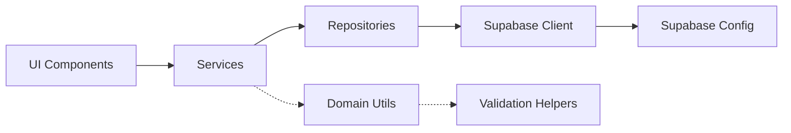

**Diagram sources**
- [supabase.js:1-11](file://MoneyHey/src/config/supabase.js#L1-L11)
- [supabaseClient.js](file://src/infrastructure/supabaseClient.js)
- [authRepository.js](file://src/infrastructure/repositories/authRepository.js)
- [categoryRepository.js](file://src/infrastructure/repositories/categoryRepository.js)
- [transactionRepository.js](file://src/infrastructure/repositories/transactionRepository.js)
- [walletRepository.js](file://src/infrastructure/repositories/walletRepository.js)
- [authService.js](file://src/services/authService.js)
- [categoryService.js](file://src/services/categoryService.js)
- [transactionService.js](file://src/services/transactionService.js)
- [walletService.js](file://src/services/walletService.js)
- [transaction.js:1-50](file://src/domain/transaction.js#L1-L50)
- [wallet.js:1-6](file://src/domain/wallet.js#L1-L6)

**Section sources**
- [supabase.js:1-11](file://MoneyHey/src/config/supabase.js#L1-L11)
- [supabaseClient.js](file://src/infrastructure/supabaseClient.js)
- [authRepository.js](file://src/infrastructure/repositories/authRepository.js)
- [categoryRepository.js](file://src/infrastructure/repositories/categoryRepository.js)
- [transactionRepository.js](file://src/infrastructure/repositories/transactionRepository.js)
- [walletRepository.js](file://src/infrastructure/repositories/walletRepository.js)
- [authService.js](file://src/services/authService.js)
- [categoryService.js](file://src/services/categoryService.js)
- [transactionService.js](file://src/services/transactionService.js)
- [walletService.js](file://src/services/walletService.js)
- [transaction.js:1-50](file://src/domain/transaction.js#L1-L50)
- [wallet.js:1-6](file://src/domain/wallet.js#L1-L6)

## Performance Considerations
- Query Optimization Strategies
  - Use targeted SELECT columns instead of SELECT * to reduce payload size.
  - Apply server-side filtering early using WHERE clauses on frequently accessed fields (e.g., user_id, tx_date).
  - Leverage Supabase RLS policies to push filtering to the database layer.
  - Batch operations where possible to minimize round trips.
  - Use LIMIT and OFFSET for pagination to avoid large result sets.
- Indexing Recommendations
  - Index foreign keys (e.g., wallet_id, category_id) to speed up JOINs.
  - Index date fields (tx_date) for range queries.
  - Consider composite indexes for frequent filter combinations (e.g., user_id + tx_date).
- Caching and Session Handling
  - Disable persistent sessions in the Supabase client to avoid stale session data.
  - Re-fetch data after navigation to ensure freshness.
- Monitoring and Profiling
  - Monitor slow queries using Supabase logs and analytics.
  - Profile UI rendering to ensure efficient updates after data fetches.

[No sources needed since this section provides general guidance]

## Troubleshooting Guide
- Authentication Issues
  - Verify Supabase URL and API key in configuration.
  - Confirm that session persistence is disabled if relying on programmatic login.
  - Check that ProtectedRoute wraps pages requiring authentication.
- Transaction Validation Errors
  - Ensure amount is a positive number and wallet/category/date are provided.
  - Validate transaction type belongs to the allowed set.
- Repository Access Problems
  - Confirm repositories are using the shared Supabase client instance.
  - Verify RLS policies allow the current user to access requested records.
- UI Navigation and Data Refresh
  - Trigger data refresh on navigation to protected routes.
  - Re-run queries after authentication to populate state.

**Section sources**
- [supabase.js:1-11](file://MoneyHey/src/config/supabase.js#L1-L11)
- [ProtectedRoute.jsx](file://src/components/auth/ProtectedRoute.jsx)
- [transaction.js:15-32](file://src/domain/transaction.js#L15-L32)

## Conclusion
MoneyHey leverages Supabase for both database and authentication needs, with a clean repository pattern separating data access from business logic. The domain utilities ensure data integrity through validation and normalization. By following the recommended optimization and security practices, the system can maintain performance and reliability as it scales.

[No sources needed since this section summarizes without analyzing specific files]

## Appendices

### Database Schema Overview
The database schema is illustrated by the included schema image, showing entities and relationships for MoneyHey.

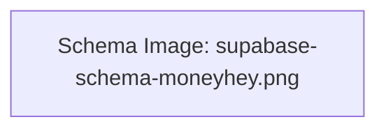

**Diagram sources**
- [supabase-schema-moneyhey.png](file://database/supabase-schema-moneyhey.png)

### Migration Procedures and Schema Versioning
- Use Supabase Dashboard or CLI to manage migrations and schema changes.
- Keep migrations atomic and reversible where possible.
- Version control schema changes alongside application code.
- Test migrations in staging before applying to production.

[No sources needed since this section provides general guidance]

### Backup Strategies
- Enable automatic backups via Supabase settings.
- Periodically export data using Supabase CLI or dashboard tools.
- Store encrypted backups offsite or in secure cloud storage.
- Validate restore procedures regularly.

[No sources needed since this section provides general guidance]

### Security, Access Control, and Privacy
- Enforce Row Level Security (RLS) policies to restrict data access per user.
- Use Supabase Auth to manage identities and enforce sign-in requirements.
- Avoid exposing sensitive fields in public views or queries.
- Sanitize inputs and validate all user-provided data.
- Regularly audit permissions and policy changes.

[No sources needed since this section provides general guidance]