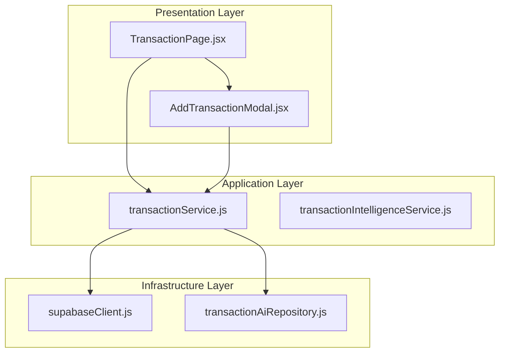
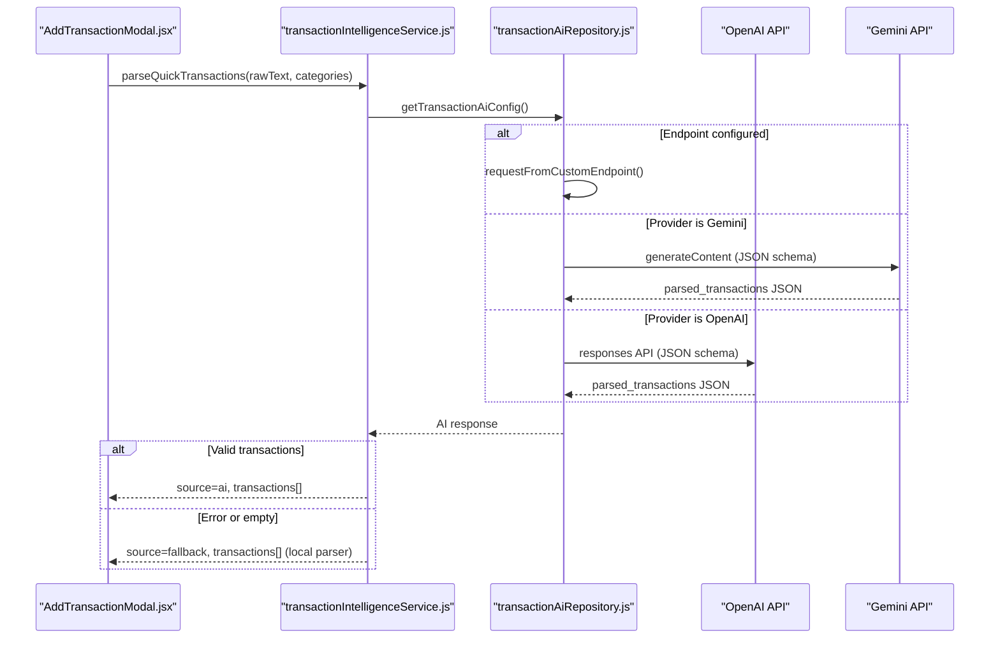

# Getting Started

<cite>
**Referenced Files in This Document**
- [README.md](file://README.md)
- [package.json](file://package.json)
- [vite.config.js](file://vite.config.js)
- [supabase.js](file://MoneyHey/src/config/supabase.js)
- [supabaseClient.js](file://src/infrastructure/supabaseClient.js)
- [transactionService.js](file://src/application/services/transactionService.js)
- [transactionIntelligenceService.js](file://src/application/services/transactionIntelligenceService.js)
- [transactionAiRepository.js](file://src/infrastructure/repositories/transactionAiRepository.js)
- [AddTransactionModal.jsx](file://src/presentation/components/transaction/AddTransactionModal.jsx)
- [TransactionPage.jsx](file://src/presentation/pages/TransactionPage.jsx)
- [App.jsx](file://src/App.jsx)
</cite>

## Table of Contents
1. [Introduction](#introduction)
2. [Project Structure](#project-structure)
3. [Prerequisites](#prerequisites)
4. [Installation](#installation)
5. [Environment Configuration](#environment-configuration)
6. [Initial Setup Verification](#initial-setup-verification)
7. [Development Workflow](#development-workflow)
8. [Basic Usage Examples](#basic-usage-examples)
9. [Troubleshooting Guide](#troubleshooting-guide)
10. [Conclusion](#conclusion)

## Introduction
MoneyHey is a React-based personal finance application that helps you track income and expenses, categorize transactions, and gain insights through charts and reports. It integrates with Supabase for authentication and data persistence, and optionally uses AI providers (OpenAI or Gemini) to quickly parse free-form notes into structured transactions.

## Project Structure
The project follows a layered architecture:
- Presentation layer: React components and pages
- Application layer: Services orchestrating business logic
- Infrastructure layer: Repositories and external integrations (Supabase, AI providers)
- Domain layer: Business rules and data mapping

**Diagram sources**
- [TransactionPage.jsx:1-330](file://src/presentation/pages/TransactionPage.jsx#L1-L330)
- [AddTransactionModal.jsx:1-908](file://src/presentation/components/transaction/AddTransactionModal.jsx#L1-L908)
- [transactionService.js:1-133](file://src/application/services/transactionService.js#L1-L133)
- [transactionIntelligenceService.js:1-179](file://src/application/services/transactionIntelligenceService.js#L1-L179)
- [supabaseClient.js:1-32](file://src/infrastructure/supabaseClient.js#L1-L32)
- [transactionAiRepository.js:1-325](file://src/infrastructure/repositories/transactionAiRepository.js#L1-L325)

**Section sources**
- [App.jsx:1-65](file://src/App.jsx#L1-L65)
- [package.json:1-35](file://package.json#L1-L35)

## Prerequisites
Before installing MoneyHey, ensure your development environment meets the following requirements:

- Operating System
  - Windows, macOS, or Linux
- Node.js
  - Version 18.x or later recommended
  - Verify installation: node --version
- Package Manager
  - npm (bundled with Node.js) or pnpm
  - Verify npm: npm --version
  - Verify pnpm: pnpm --version
- Git
  - Required for cloning the repository
  - Verify installation: git --version

Notes:
- The project uses Vite for the build toolchain and React for the UI framework.
- Environment variables are loaded via Vite's import.meta.env mechanism.

**Section sources**
- [package.json:1-35](file://package.json#L1-L35)
- [vite.config.js:1-8](file://vite.config.js#L1-L8)

## Installation
Follow these steps to install and run MoneyHey locally:

1. Clone the repository
   - Use Git to clone the repository to your local machine.
   - Example command: git clone <repository-url>
2. Navigate to the project directory
   - Change into the project folder containing package.json.
3. Install dependencies
   - Using npm: npm install
   - Using pnpm: pnpm install
4. Start the development server
   - Run: npm run dev
   - The app will launch at http://localhost:5173 by default.

Verification:
- Confirm the development server starts without errors.
- Open the browser and verify the login page loads.

**Section sources**
- [package.json:6-11](file://package.json#L6-L11)
- [vite.config.js:1-8](file://vite.config.js#L1-L8)

## Environment Configuration
Configure MoneyHey by setting up environment variables and integrating third-party services.

### Environment Variables (.env)
- Create a .env file in the project root by copying the example file.
- Configure the AI provider:
  - Provider selection: VITE_TRANSACTION_AI_PROVIDER=openai or VITE_TRANSACTION_AI_PROVIDER=gemini
  - Local testing keys: VITE_OPENAI_API_KEY or VITE_GEMINI_API_KEY
  - Optional model overrides: VITE_OPENAI_MODEL or VITE_GEMINI_MODEL
  - Custom endpoint: VITE_TRANSACTION_AI_ENDPOINT (to route AI requests through your own backend)
- Example input format for AI parsing:
  - "uống phúc long hết 65k, ăn mỳ cay hết 79k, mua áo hết 100k"

Notes:
- API keys should not be exposed in client-side code for production. Use a backend or edge function to proxy AI requests.
- Defaults:
  - OpenAI: gpt-5.4-nano
  - Gemini: gemini-2.5-flash

**Section sources**
- [README.md:22-40](file://README.md#L22-L40)
- [transactionAiRepository.js:110-145](file://src/infrastructure/repositories/transactionAiRepository.js#L110-L145)
- [transactionIntelligenceService.js:139-179](file://src/application/services/transactionIntelligenceService.js#L139-L179)

### Supabase Configuration
- Authentication and session persistence are configured in the Supabase client.
- The client supports persistent sessions and custom storage resolution (localStorage vs sessionStorage).
- Session persistence is enabled with custom auth storage.

Integration points:
- Supabase client initialization
- Auth context and routes protection
- Wallet and transaction data access

**Section sources**
- [supabaseClient.js:1-32](file://src/infrastructure/supabaseClient.js#L1-L32)
- [supabase.js:1-11](file://MoneyHey/src/config/supabase.js#L1-L11)
- [App.jsx:1-65](file://src/App.jsx#L1-L65)

### AI Provider Integration
- Supported providers: OpenAI and Gemini
- Fallback parser: If AI is unavailable or returns no valid transactions, the system falls back to a local parser.
- Custom endpoint: Override the built-in provider flow by setting VITE_TRANSACTION_AI_ENDPOINT.

Sequence of AI parsing:

**Diagram sources**
- [AddTransactionModal.jsx:434-476](file://src/presentation/components/transaction/AddTransactionModal.jsx#L434-L476)
- [transactionIntelligenceService.js:139-179](file://src/application/services/transactionIntelligenceService.js#L139-L179)
- [transactionAiRepository.js:147-325](file://src/infrastructure/repositories/transactionAiRepository.js#L147-L325)

**Section sources**
- [transactionAiRepository.js:1-325](file://src/infrastructure/repositories/transactionAiRepository.js#L1-L325)
- [transactionIntelligenceService.js:1-179](file://src/application/services/transactionIntelligenceService.js#L1-L179)
- [AddTransactionModal.jsx:1-908](file://src/presentation/components/transaction/AddTransactionModal.jsx#L1-L908)

## Initial Setup Verification
After completing installation and environment configuration, verify the setup:

1. Development server
   - npm run dev should start successfully without errors.
2. AI parsing
   - Open the transaction page and use the "Add quick by text" mode.
   - Paste example input text to test AI parsing.
   - Verify that the system either parses with AI or falls back to the local parser.
3. Supabase integration
   - Log in to the application to confirm authentication works.
   - Check that protected routes redirect appropriately when logged in or out.

**Section sources**
- [TransactionPage.jsx:1-330](file://src/presentation/pages/TransactionPage.jsx#L1-L330)
- [AddTransactionModal.jsx:434-476](file://src/presentation/components/transaction/AddTransactionModal.jsx#L434-L476)
- [App.jsx:1-65](file://src/App.jsx#L1-L65)

## Development Workflow
- Run the development server: npm run dev
- Build for production: npm run build
- Preview production build: npm run preview
- Lint the codebase: npm run lint

Recommended workflow:
1. Make changes to components or services.
2. Test locally using the development server.
3. Commit changes with descriptive messages.
4. Push to the remote repository.

**Section sources**
- [package.json:6-11](file://package.json#L6-L11)

## Basic Usage Examples
- Adding a single transaction manually
  - Navigate to the Transactions page.
  - Click "Add transaction" and select "Add manually".
  - Fill in amount, category, date, and note.
  - Submit to save.
- Adding multiple transactions quickly
  - Use the "Add quick by text" mode.
  - Paste a multi-line note with multiple expenses/income entries.
  - Review the parsed preview and save.

Note: The AI parser normalizes amounts (e.g., 65k → 65000) and infers categories and types based on keywords and provided categories.

**Section sources**
- [AddTransactionModal.jsx:434-512](file://src/presentation/components/transaction/AddTransactionModal.jsx#L434-L512)
- [transactionIntelligenceService.js:106-124](file://src/application/services/transactionIntelligenceService.js#L106-L124)

## Troubleshooting Guide
Common setup issues and resolutions:

- Node.js version mismatch
  - Symptom: Errors during installation or runtime.
  - Resolution: Install Node.js 18.x or later and retry installation.
- Missing environment variables
  - Symptom: AI parsing shows "not configured" or fails.
  - Resolution: Set VITE_TRANSACTION_AI_PROVIDER and the appropriate API key. For local testing, set VITE_OPENAI_API_KEY or VITE_GEMINI_API_KEY. Optionally set VITE_OPENAI_MODEL or VITE_GEMINI_MODEL.
- AI request failures
  - Symptom: Error messages indicating provider refusal or empty responses.
  - Resolution: Verify API keys and models. The system automatically falls back to the local parser if AI is unavailable.
- Supabase authentication issues
  - Symptom: Cannot log in or session not persisting.
  - Resolution: Ensure the Supabase client is initialized correctly. Check that auth storage is functioning and sessions are persisted as expected.
- Port conflicts
  - Symptom: Development server fails to start on port 5173.
  - Resolution: Stop other processes using the port or configure Vite to use a different port.

**Section sources**
- [README.md:22-40](file://README.md#L22-L40)
- [transactionAiRepository.js:178-248](file://src/infrastructure/repositories/transactionAiRepository.js#L178-L248)
- [transactionAiRepository.js:250-309](file://src/infrastructure/repositories/transactionAiRepository.js#L250-L309)
- [supabaseClient.js:19-32](file://src/infrastructure/supabaseClient.js#L19-L32)
- [transactionIntelligenceService.js:155-168](file://src/application/services/transactionIntelligenceService.js#L155-L168)

## Conclusion
You are now ready to use MoneyHey for managing personal finances. Start by configuring environment variables, verifying the development server, and testing the AI transaction parsing feature. For production deployments, ensure sensitive API keys are handled securely and consider using a backend or edge function to proxy AI requests.