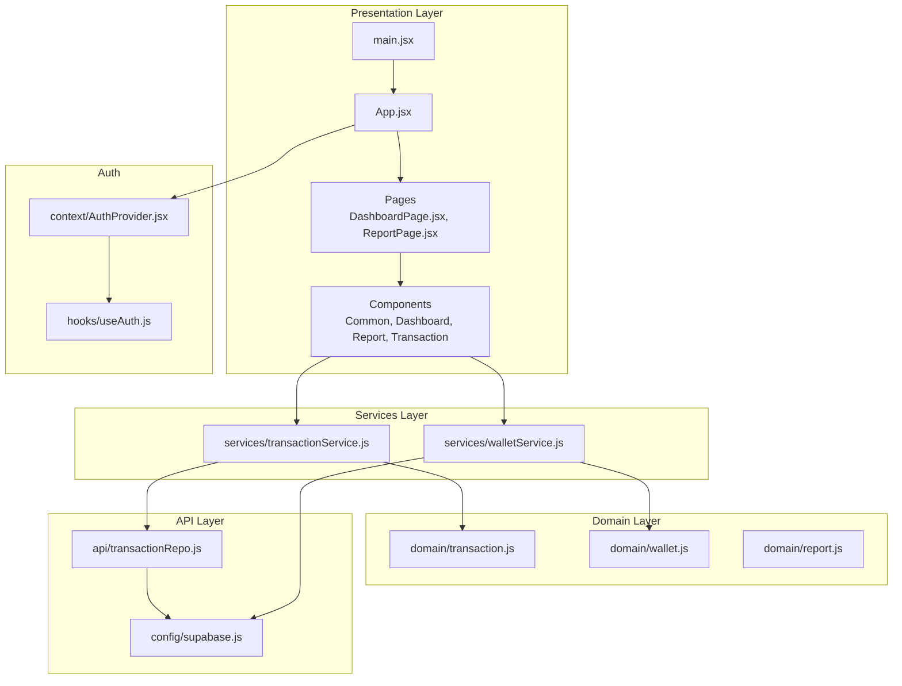
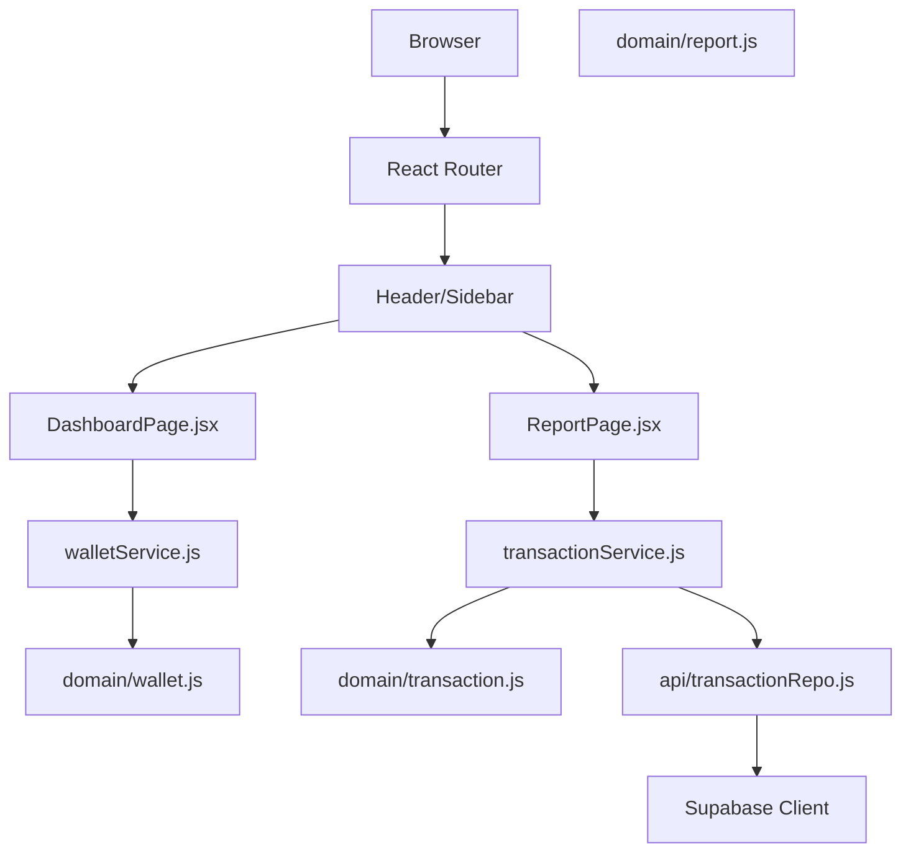
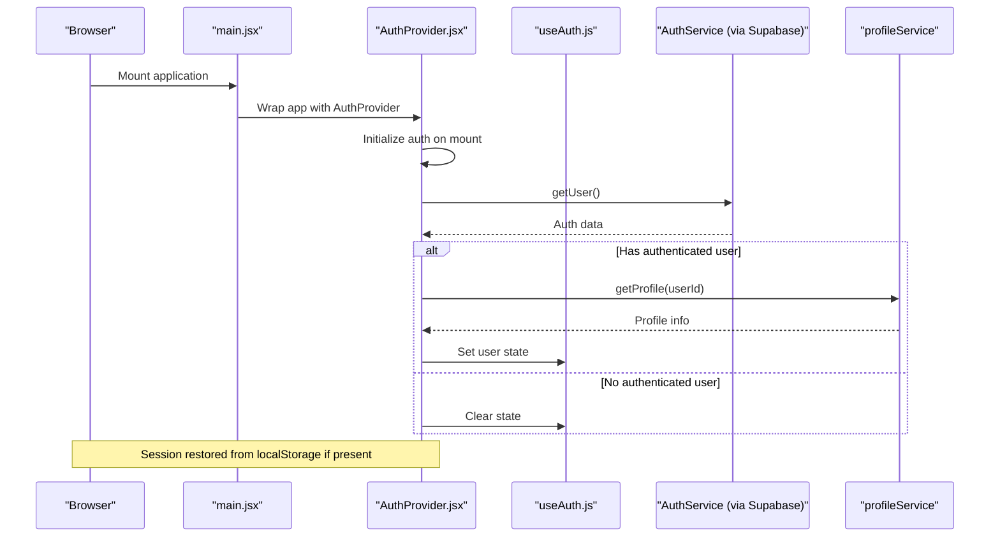
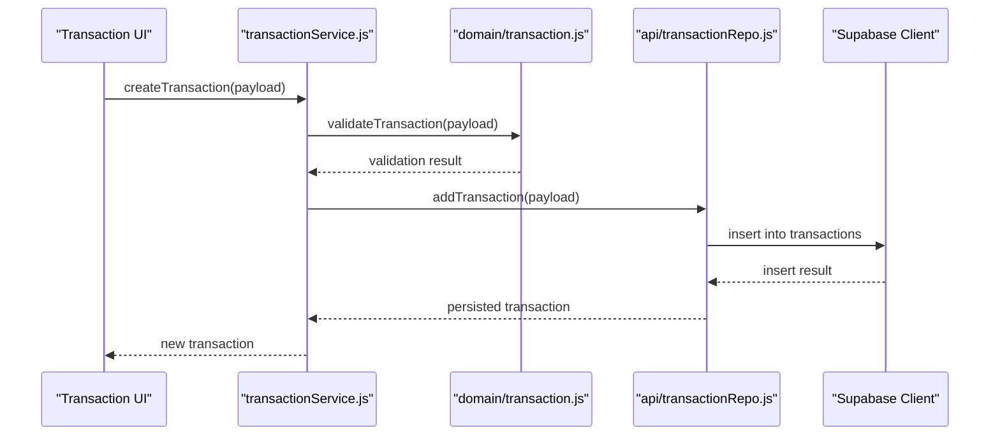
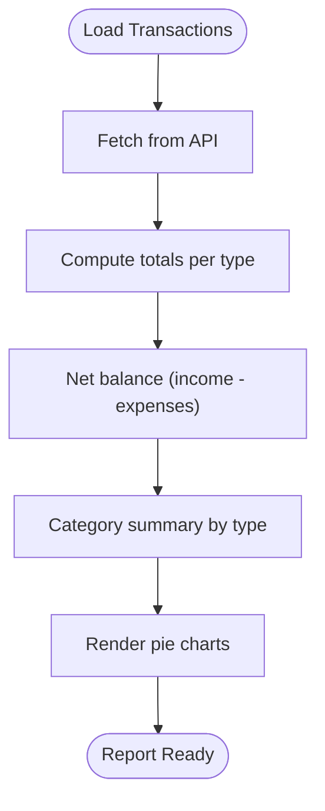
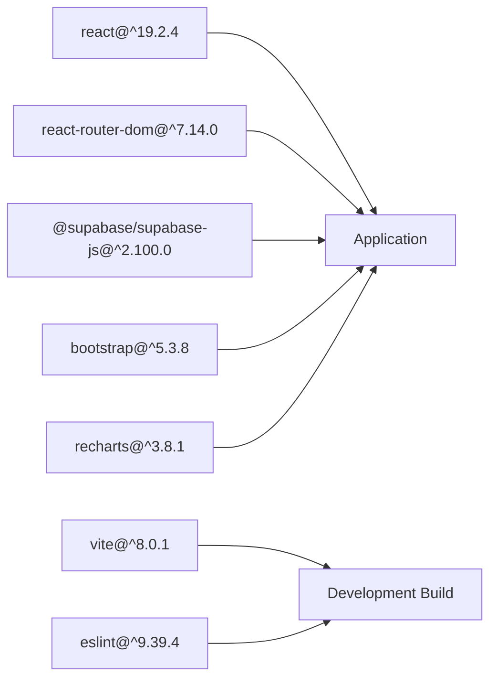

# Project Overview

<cite>
**Referenced Files in This Document**
- [README.md](file://README.md)
- [package.json](file://package.json)
- [src/main.jsx](file://src/main.jsx)
- [src/App.jsx](file://src/App.jsx)
- [src/context/AuthProvider.jsx](file://src/context/AuthProvider.jsx)
- [src/hooks/useAuth.js](file://src/hooks/useAuth.js)
- [src/config/supabase.js](file://src/config/supabase.js)
- [src/api/transactionRepo.js](file://src/api/transactionRepo.js)
- [src/services/transactionService.js](file://src/services/transactionService.js)
- [src/services/walletService.js](file://src/services/walletService.js)
- [src/domain/transaction.js](file://src/domain/transaction.js)
- [src/domain/wallet.js](file://src/domain/wallet.js)
- [src/domain/report.js](file://src/domain/report.js)
- [src/pages/DashboardPage.jsx](file://src/pages/DashboardPage.jsx)
- [src/pages/ReportPage.jsx](file://src/pages/ReportPage.jsx)
</cite>

## Table of Contents
1. [Introduction](#introduction)
2. [Project Structure](#project-structure)
3. [Core Components](#core-components)
4. [Architecture Overview](#architecture-overview)
5. [Detailed Component Analysis](#detailed-component-analysis)
6. [Dependency Analysis](#dependency-analysis)
7. [Performance Considerations](#performance-considerations)
8. [Troubleshooting Guide](#troubleshooting-guide)
9. [Conclusion](#conclusion)

## Introduction
MoneyHey is a personal finance management application designed to help users track income and expenses, visualize spending patterns, manage multiple wallets, and generate insightful reports. It targets individuals seeking a straightforward yet powerful solution to monitor their finances, with a focus on ease of use and clear financial insights.

Key capabilities:
- Transaction tracking with categorization and filtering
- Financial visualization via charts and summaries
- Multi-wallet support with aggregated balances
- Reporting features including income/expense totals and category breakdowns

Technology stack highlights:
- Frontend built with React 19.2.4 and React Router 7.14.0
- Modern build tooling with Vite 8.0.1
- Supabase backend for authentication, real-time data, and storage
- UI components styled with Bootstrap 5.3.8 and Recharts 3.8.1 for data visualization

Unique value propositions:
- Unified dashboard for quick financial overview
- Category-based reporting with pie charts
- Seamless authentication and session persistence
- Clean separation of concerns across domain, services, and API layers

## Project Structure
The project follows a modular, layered architecture:
- Presentation layer: Pages, components, and routing
- Domain layer: Business rules and calculations
- Services layer: Orchestration and validation
- API layer: Data access via Supabase
- Configuration: Supabase client initialization

**Diagram sources**
- [src/main.jsx:1-20](file://src/main.jsx#L1-L20)
- [src/App.jsx:1-43](file://src/App.jsx#L1-L43)
- [src/pages/DashboardPage.jsx:1-94](file://src/pages/DashboardPage.jsx#L1-L94)
- [src/pages/ReportPage.jsx:1-106](file://src/pages/ReportPage.jsx#L1-L106)
- [src/domain/transaction.js:1-50](file://src/domain/transaction.js#L1-L50)
- [src/domain/wallet.js:1-6](file://src/domain/wallet.js#L1-L6)
- [src/domain/report.js:1-32](file://src/domain/report.js#L1-L32)
- [src/services/transactionService.js:1-24](file://src/services/transactionService.js#L1-L24)
- [src/services/walletService.js:1-21](file://src/services/walletService.js#L1-L21)
- [src/api/transactionRepo.js:1-26](file://src/api/transactionRepo.js#L1-L26)
- [src/config/supabase.js:1-11](file://src/config/supabase.js#L1-L11)
- [src/context/AuthProvider.jsx:1-98](file://src/context/AuthProvider.jsx#L1-L98)
- [src/hooks/useAuth.js:1-7](file://src/hooks/useAuth.js#L1-L7)

**Section sources**
- [src/main.jsx:1-20](file://src/main.jsx#L1-L20)
- [src/App.jsx:1-43](file://src/App.jsx#L1-L43)
- [package.json:1-32](file://package.json#L1-L32)

## Core Components
- Authentication and routing: Centralized routing with protected routes and session management via Supabase and local storage.
- Transaction management: CRUD operations for transactions with validation and retrieval enriched with category and wallet metadata.
- Wallet aggregation: Total balance calculation across multiple wallets.
- Reporting: Income/expense totals, net balance, and category-wise expense/income summaries with chart-ready datasets.

Practical examples:
- Adding a transaction: Validation ensures required fields and positive amounts; persisted via Supabase.
- Viewing financial summaries: Dashboard aggregates total balance; Report page computes totals and category distributions.
- Filtering transactions: Date range and category filters applied in-memory on retrieved data.

**Section sources**
- [src/context/AuthProvider.jsx:1-98](file://src/context/AuthProvider.jsx#L1-L98)
- [src/hooks/useAuth.js:1-7](file://src/hooks/useAuth.js#L1-L7)
- [src/App.jsx:1-43](file://src/App.jsx#L1-L43)
- [src/services/transactionService.js:1-24](file://src/services/transactionService.js#L1-L24)
- [src/api/transactionRepo.js:1-26](file://src/api/transactionRepo.js#L1-L26)
- [src/services/walletService.js:1-21](file://src/services/walletService.js#L1-L21)
- [src/domain/transaction.js:1-50](file://src/domain/transaction.js#L1-L50)
- [src/domain/wallet.js:1-6](file://src/domain/wallet.js#L1-L6)
- [src/domain/report.js:1-32](file://src/domain/report.js#L1-L32)
- [src/pages/DashboardPage.jsx:1-94](file://src/pages/DashboardPage.jsx#L1-L94)
- [src/pages/ReportPage.jsx:1-106](file://src/pages/ReportPage.jsx#L1-L106)

## Architecture Overview
The application uses a clean architecture pattern:
- Presentation layer handles UI and user interactions.
- Domain layer encapsulates business rules and calculations.
- Services layer orchestrates operations and applies validation.
- API layer abstracts data access to Supabase.
- Authentication and routing are integrated at the root.

**Diagram sources**
- [src/App.jsx:1-43](file://src/App.jsx#L1-L43)
- [src/pages/DashboardPage.jsx:1-94](file://src/pages/DashboardPage.jsx#L1-L94)
- [src/pages/ReportPage.jsx:1-106](file://src/pages/ReportPage.jsx#L1-L106)
- [src/services/transactionService.js:1-24](file://src/services/transactionService.js#L1-L24)
- [src/services/walletService.js:1-21](file://src/services/walletService.js#L1-L21)
- [src/domain/transaction.js:1-50](file://src/domain/transaction.js#L1-L50)
- [src/domain/report.js:1-32](file://src/domain/report.js#L1-L32)
- [src/domain/wallet.js:1-6](file://src/domain/wallet.js#L1-L6)
- [src/api/transactionRepo.js:1-26](file://src/api/transactionRepo.js#L1-L26)
- [src/config/supabase.js:1-11](file://src/config/supabase.js#L1-L11)

## Detailed Component Analysis

### Authentication Flow
End-to-end authentication lifecycle including session restoration, user profile retrieval, and logout.

**Diagram sources**
- [src/main.jsx:1-20](file://src/main.jsx#L1-L20)
- [src/context/AuthProvider.jsx:1-98](file://src/context/AuthProvider.jsx#L1-L98)
- [src/hooks/useAuth.js:1-7](file://src/hooks/useAuth.js#L1-L7)

**Section sources**
- [src/context/AuthProvider.jsx:1-98](file://src/context/AuthProvider.jsx#L1-L98)
- [src/hooks/useAuth.js:1-7](file://src/hooks/useAuth.js#L1-L7)
- [src/App.jsx:1-43](file://src/App.jsx#L1-L43)

### Transaction Creation Workflow
Validation and persistence pipeline for new transactions.

**Diagram sources**
- [src/services/transactionService.js:1-24](file://src/services/transactionService.js#L1-L24)
- [src/domain/transaction.js:1-50](file://src/domain/transaction.js#L1-L50)
- [src/api/transactionRepo.js:1-26](file://src/api/transactionRepo.js#L1-L26)
- [src/config/supabase.js:1-11](file://src/config/supabase.js#L1-L11)

**Section sources**
- [src/services/transactionService.js:1-24](file://src/services/transactionService.js#L1-L24)
- [src/domain/transaction.js:1-50](file://src/domain/transaction.js#L1-L50)
- [src/api/transactionRepo.js:1-26](file://src/api/transactionRepo.js#L1-L26)

### Reporting Calculation Pipeline
Aggregation of income, expenses, and category summaries for visualization.

**Diagram sources**
- [src/pages/ReportPage.jsx:1-106](file://src/pages/ReportPage.jsx#L1-L106)
- [src/services/transactionService.js:1-24](file://src/services/transactionService.js#L1-L24)
- [src/domain/report.js:1-32](file://src/domain/report.js#L1-L32)

**Section sources**
- [src/pages/ReportPage.jsx:1-106](file://src/pages/ReportPage.jsx#L1-L106)
- [src/domain/report.js:1-32](file://src/domain/report.js#L1-L32)

### Conceptual Overview
Beginner-friendly highlights:
- Track daily income and expenses with categories
- See your total balance across all wallets
- Visualize spending by category with interactive charts
- Secure login and session persistence

Developer-focused highlights:
- Clear separation between domain logic, services, and API access
- Supabase-backed data model with joins for enriched transaction details
- In-memory filtering and aggregation for fast UI updates
- Protected routing and centralized authentication state

## Dependency Analysis
Primary runtime dependencies:
- React and React DOM for UI rendering
- React Router for declarative navigation
- Supabase JS client for authentication and database operations
- Bootstrap for responsive UI components
- Recharts for data visualization

Build and development dependencies include Vite, React plugin, and ESLint configurations.

**Diagram sources**
- [package.json:12-29](file://package.json#L12-L29)

**Section sources**
- [package.json:1-32](file://package.json#L1-L32)

## Performance Considerations
- Prefer client-side filtering and aggregation for small to medium datasets to reduce server load.
- Debounce or batch UI updates when applying multiple filters simultaneously.
- Lazy-load heavy visualizations only when their containers are visible.
- Cache frequently accessed data (e.g., categories, wallets) in memory to minimize repeated requests.

## Troubleshooting Guide
Common issues and resolutions:
- Authentication errors: Verify session restoration logic and ensure local storage keys match expectations. Confirm Supabase credentials and network connectivity.
- Transaction creation failures: Check validation messages returned by the domain validator and confirm backend insert permissions.
- Missing or incorrect data in reports: Inspect API response mapping for category and wallet names; ensure joins are correctly configured in the repository.

**Section sources**
- [src/context/AuthProvider.jsx:1-98](file://src/context/AuthProvider.jsx#L1-L98)
- [src/services/transactionService.js:1-24](file://src/services/transactionService.js#L1-L24)
- [src/api/transactionRepo.js:1-26](file://src/api/transactionRepo.js#L1-L26)

## Conclusion
MoneyHey delivers a pragmatic personal finance solution with a modern React frontend and a robust Supabase backend. Its layered architecture promotes maintainability, while its domain-driven services and API abstractions keep business logic explicit and testable. Users benefit from intuitive transaction tracking, multi-wallet aggregation, and insightful reporting, making it suitable for both newcomers and experienced developers who appreciate clean code and clear data flows.