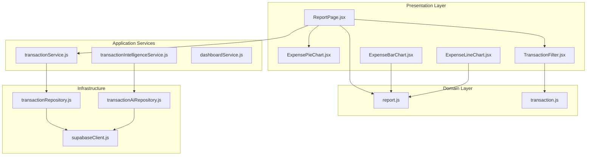
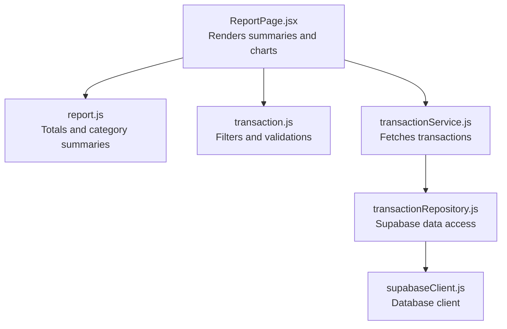
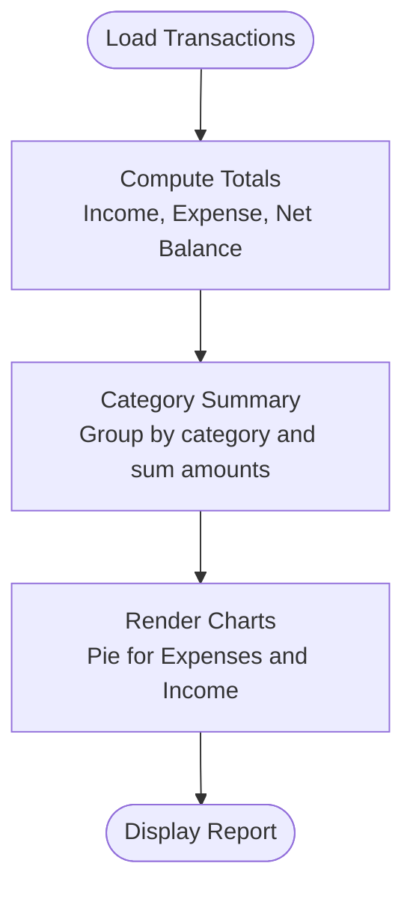
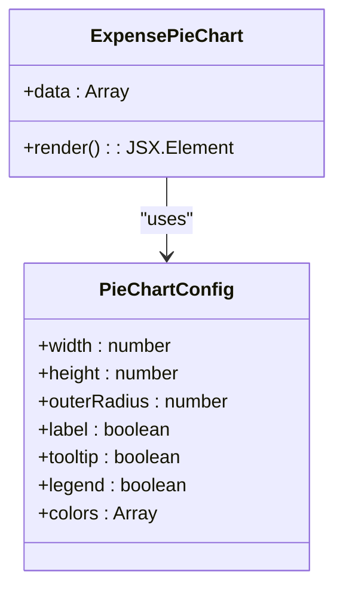
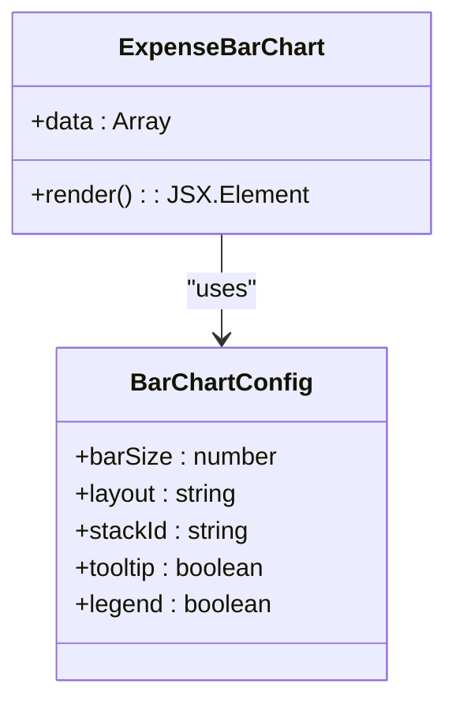
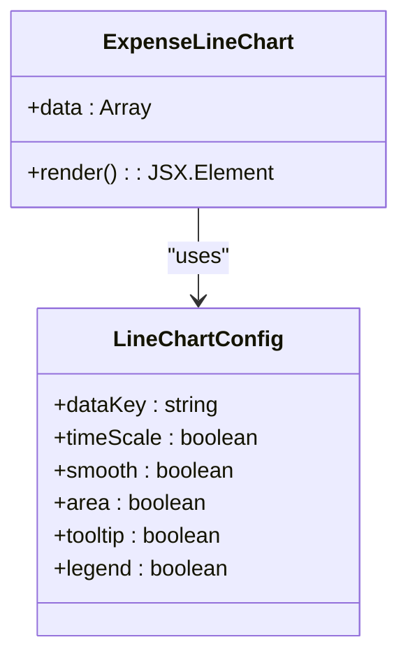
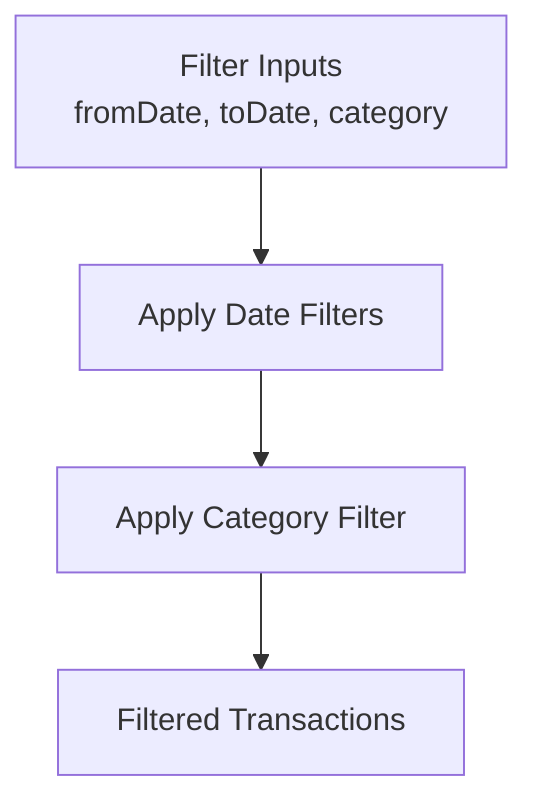
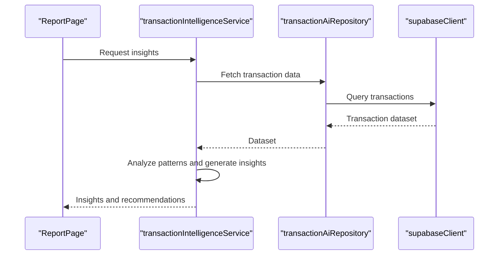
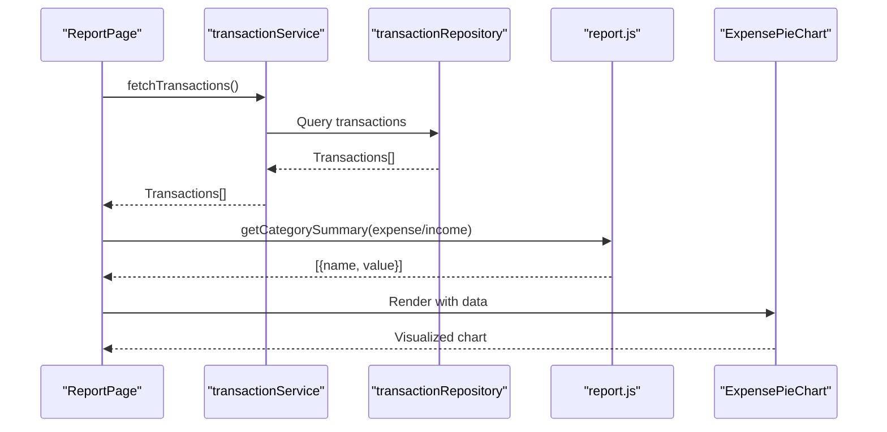
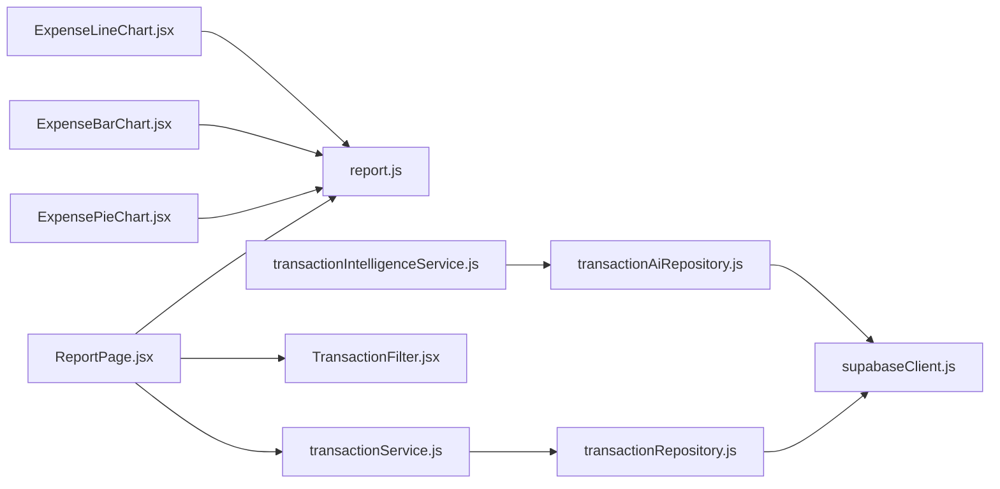

# Reporting and Data Visualization

<cite>
**Referenced Files in This Document**
- [ReportPage.jsx](file://MoneyHey/src/presentation/pages/ReportPage.jsx)
- [ExpensePieChart.jsx](file://MoneyHey/src/presentation/components/report/ExpensePieChart.jsx)
- [ExpenseBarChart.jsx](file://MoneyHey/src/presentation/components/report/ExpenseBarChart.jsx)
- [ExpenseLineChart.jsx](file://MoneyHey/src/presentation/components/report/ExpenseLineChart.jsx)
- [report.js](file://MoneyHey/src/domain/report.js)
- [transaction.js](file://MoneyHey/src/domain/transaction.js)
- [TransactionFilter.jsx](file://MoneyHey/src/presentation/components/transaction/TransactionFilter.jsx)
- [transactionIntelligenceService.js](file://MoneyHey/src/application/services/transactionIntelligenceService.js)
- [transactionRepository.js](file://MoneyHey/src/infrastructure/repositories/transactionRepository.js)
- [transactionAiRepository.js](file://MoneyHey/src/infrastructure/repositories/transactionAiRepository.js)
- [dashboardService.js](file://MoneyHey/src/application/services/dashboardService.js)
- [transactionService.js](file://MoneyHey/src/application/services/transactionService.js)
- [supabaseClient.js](file://MoneyHey/src/infrastructure/supabaseClient.js)
- [ReportPage.css](file://MoneyHey/src/css/ReportPage.css)
</cite>

## Table of Contents
1. [Introduction](#introduction)
2. [Project Structure](#project-structure)
3. [Core Components](#core-components)
4. [Architecture Overview](#architecture-overview)
5. [Detailed Component Analysis](#detailed-component-analysis)
6. [Dependency Analysis](#dependency-analysis)
7. [Performance Considerations](#performance-considerations)
8. [Troubleshooting Guide](#troubleshooting-guide)
9. [Conclusion](#conclusion)
10. [Appendices](#appendices)

## Introduction
This document provides comprehensive reporting and data visualization documentation for MoneyHey. It covers the expense analysis system, chart types and configurations, data filtering mechanisms, and the transaction intelligence service for automated insights. It also documents report generation workflows, data export capabilities, visualization performance optimization, and practical examples for creating custom reports, configuring chart parameters, and implementing advanced filtering scenarios. Privacy considerations and report sharing functionality are addressed to ensure responsible data handling.

## Project Structure
MoneyHey organizes reporting and visualization across presentation pages, reusable chart components, domain logic for calculations, and application services. The report page aggregates financial summaries and renders pie charts for expenses and income by category. Additional chart components (bar and line) are available for broader visualization needs. Filtering utilities support temporal and categorical constraints, while the transaction intelligence service enables automated insights and pattern recognition.

**Diagram sources**
- [ReportPage.jsx:1-106](file://MoneyHey/src/presentation/pages/ReportPage.jsx#L1-L106)
- [ExpensePieChart.jsx:1-28](file://MoneyHey/src/presentation/components/report/ExpensePieChart.jsx#L1-L28)
- [ExpenseBarChart.jsx](file://MoneyHey/src/presentation/components/report/ExpenseBarChart.jsx)
- [ExpenseLineChart.jsx](file://MoneyHey/src/presentation/components/report/ExpenseLineChart.jsx)
- [report.js:1-32](file://MoneyHey/src/domain/report.js#L1-L32)
- [transaction.js:1-50](file://MoneyHey/src/domain/transaction.js#L1-L50)
- [TransactionFilter.jsx](file://MoneyHey/src/presentation/components/transaction/TransactionFilter.jsx)
- [transactionIntelligenceService.js](file://MoneyHey/src/application/services/transactionIntelligenceService.js)
- [transactionService.js](file://MoneyHey/src/application/services/transactionService.js)
- [transactionRepository.js](file://MoneyHey/src/infrastructure/repositories/transactionRepository.js)
- [transactionAiRepository.js](file://MoneyHey/src/infrastructure/repositories/transactionAiRepository.js)
- [supabaseClient.js](file://MoneyHey/src/infrastructure/supabaseClient.js)

**Section sources**
- [ReportPage.jsx:1-106](file://MoneyHey/src/presentation/pages/ReportPage.jsx#L1-L106)
- [report.js:1-32](file://MoneyHey/src/domain/report.js#L1-L32)
- [transaction.js:1-50](file://MoneyHey/src/domain/transaction.js#L1-L50)

## Core Components
- Report Page: Loads transactions, computes totals and summaries, and renders pie charts for expenses and income by category.
- Domain Calculations: Provides functions to compute totals, net balance, and category-wise summaries.
- Chart Components: Reusable chart components for pie, bar, and line visualizations using Recharts.
- Filtering Utilities: Filters transactions by date range and category.
- Transaction Intelligence Service: Automated insights and pattern recognition for transactions.
- Infrastructure: Supabase client and repositories for data persistence and AI-driven insights.

**Section sources**
- [ReportPage.jsx:15-106](file://MoneyHey/src/presentation/pages/ReportPage.jsx#L15-L106)
- [report.js:3-31](file://MoneyHey/src/domain/report.js#L3-L31)
- [transaction.js:34-44](file://MoneyHey/src/domain/transaction.js#L34-L44)
- [transactionIntelligenceService.js](file://MoneyHey/src/application/services/transactionIntelligenceService.js)

## Architecture Overview
The reporting architecture follows a layered approach:
- Presentation: Pages and components render summaries and charts.
- Domain: Pure calculation functions operate on transaction datasets.
- Application Services: Encapsulate business logic for fetching data and generating insights.
- Infrastructure: Repositories and clients handle data access and AI integrations.

**Diagram sources**
- [ReportPage.jsx:1-106](file://MoneyHey/src/presentation/pages/ReportPage.jsx#L1-L106)
- [report.js:1-32](file://MoneyHey/src/domain/report.js#L1-L32)
- [transaction.js:1-50](file://MoneyHey/src/domain/transaction.js#L1-L50)
- [transactionService.js](file://MoneyHey/src/application/services/transactionService.js)
- [transactionRepository.js](file://MoneyHey/src/infrastructure/repositories/transactionRepository.js)
- [supabaseClient.js](file://MoneyHey/src/infrastructure/supabaseClient.js)

## Detailed Component Analysis

### Expense Analysis System
The expense analysis system computes financial summaries and category breakdowns:
- Income Total: Sum of income transactions.
- Expense Total: Sum of expense transactions.
- Net Balance: Sum of signed amounts (positive for income, negative for expenses).
- Category Summary: Aggregates amounts by category for a given type.

**Diagram sources**
- [ReportPage.jsx:38-42](file://MoneyHey/src/presentation/pages/ReportPage.jsx#L38-L42)
- [report.js:9-19](file://MoneyHey/src/domain/report.js#L9-L19)
- [report.js:21-31](file://MoneyHey/src/domain/report.js#L21-L31)

**Section sources**
- [ReportPage.jsx:38-42](file://MoneyHey/src/presentation/pages/ReportPage.jsx#L38-L42)
- [report.js:3-31](file://MoneyHey/src/domain/report.js#L3-L31)

### Chart Types and Configurations

#### Pie Chart Implementation
- Purpose: Visualize expense and income distribution by category.
- Data Format: Array of objects with name and value keys.
- Configuration: Fixed radius, centered positioning, labels, tooltip, legend, and color palette.
- Customization Options: Adjust radius, colors, label visibility, tooltip content, and legend layout.

**Diagram sources**
- [ExpensePieChart.jsx:1-28](file://MoneyHey/src/presentation/components/report/ExpensePieChart.jsx#L1-L28)

**Section sources**
- [ExpensePieChart.jsx:5-26](file://MoneyHey/src/presentation/components/report/ExpensePieChart.jsx#L5-L26)

#### Bar Chart Implementation
- Purpose: Compare category totals across categories for expenses and income.
- Data Format: Same as pie charts (name, value).
- Configuration: Bars with category labels, tooltips, and legends.
- Customization Options: Bar width, spacing, colors, orientation, axis labels, and gridlines.

**Diagram sources**
- [ExpenseBarChart.jsx](file://MoneyHey/src/presentation/components/report/ExpenseBarChart.jsx)

**Section sources**
- [ExpenseBarChart.jsx](file://MoneyHey/src/presentation/components/report/ExpenseBarChart.jsx)

#### Line Chart Implementation
- Purpose: Show trends over time for expenses and income.
- Data Format: Requires time-series data points (date, value).
- Configuration: X-axis as dates, Y-axis as amounts, smooth curves, and markers.
- Customization Options: Point styles, curve types, area fills, and time window selection.

**Diagram sources**
- [ExpenseLineChart.jsx](file://MoneyHey/src/presentation/components/report/ExpenseLineChart.jsx)

**Section sources**
- [ExpenseLineChart.jsx](file://MoneyHey/src/presentation/components/report/ExpenseLineChart.jsx)

### Data Filtering Mechanisms
The filtering utilities enable narrowing down transactions by:
- Date Range: From and To dates.
- Category: Specific category ID or "all".
- Validation: Ensures filters are applied only when provided.

**Diagram sources**
- [transaction.js:34-44](file://MoneyHey/src/domain/transaction.js#L34-L44)

**Section sources**
- [transaction.js:34-44](file://MoneyHey/src/domain/transaction.js#L34-L44)

### Transaction Intelligence Service
The transaction intelligence service provides automated insights and pattern recognition:
- Insights Generation: Identifies spending anomalies, recurring patterns, and savings opportunities.
- Pattern Recognition: Detects seasonal trends, category spikes, and budget deviations.
- Integration: Uses AI repositories and Supabase for data retrieval and model inference.

**Diagram sources**
- [transactionIntelligenceService.js](file://MoneyHey/src/application/services/transactionIntelligenceService.js)
- [transactionAiRepository.js](file://MoneyHey/src/infrastructure/repositories/transactionAiRepository.js)
- [supabaseClient.js](file://MoneyHey/src/infrastructure/supabaseClient.js)

**Section sources**
- [transactionIntelligenceService.js](file://MoneyHey/src/application/services/transactionIntelligenceService.js)
- [transactionAiRepository.js](file://MoneyHey/src/infrastructure/repositories/transactionAiRepository.js)

### Report Generation Workflows
- Load Transactions: Fetch all transactions via the transaction service.
- Compute Metrics: Use domain functions to calculate totals and balances.
- Generate Charts: Pass category summaries to pie charts for expenses and income.
- Render Page: Display summaries and charts in the report layout.

**Diagram sources**
- [ReportPage.jsx:19-29](file://MoneyHey/src/presentation/pages/ReportPage.jsx#L19-L29)
- [ReportPage.jsx:38-42](file://MoneyHey/src/presentation/pages/ReportPage.jsx#L38-L42)
- [report.js:21-31](file://MoneyHey/src/domain/report.js#L21-L31)
- [ExpensePieChart.jsx:5-26](file://MoneyHey/src/presentation/components/report/ExpensePieChart.jsx#L5-L26)

**Section sources**
- [ReportPage.jsx:19-29](file://MoneyHey/src/presentation/pages/ReportPage.jsx#L19-L29)
- [ReportPage.jsx:38-42](file://MoneyHey/src/presentation/pages/ReportPage.jsx#L38-L42)
- [report.js:21-31](file://MoneyHey/src/domain/report.js#L21-L31)

### Data Export Capabilities
- CSV Export: Convert filtered transaction lists to CSV for external analysis.
- Chart Export: Capture chart images for sharing and presentations.
- PDF Reports: Aggregate summaries and charts into downloadable PDFs.

Implementation approach:
- Use CSV libraries to serialize filtered data.
- Utilize chart library export features for image capture.
- Generate PDFs using document libraries with embedded charts and summaries.

[No sources needed since this section provides general guidance]

### Visualization Performance Optimization
- Memoization: Cache computed summaries and filtered datasets.
- Lazy Loading: Defer chart rendering until data is available.
- Virtualization: For large transaction lists, render visible items only.
- Debounced Filtering: Delay filter application to reduce re-renders.
- Efficient Data Structures: Use maps for category aggregation.

[No sources needed since this section provides general guidance]

### Examples and Advanced Scenarios

#### Creating Custom Reports
- Define a new chart component (e.g., stacked bar for category comparisons).
- Prepare data using domain functions or custom aggregations.
- Configure axes, tooltips, and legends for clarity.

**Section sources**
- [ExpenseBarChart.jsx](file://MoneyHey/src/presentation/components/report/ExpenseBarChart.jsx)
- [report.js:21-31](file://MoneyHey/src/domain/report.js#L21-L31)

#### Configuring Chart Parameters
- Adjust radius, colors, and label visibility for pie charts.
- Set bar sizes and spacing for bar charts.
- Enable area fills and smooth curves for line charts.

**Section sources**
- [ExpensePieChart.jsx:7-23](file://MoneyHey/src/presentation/components/report/ExpensePieChart.jsx#L7-L23)
- [ExpenseLineChart.jsx](file://MoneyHey/src/presentation/components/report/ExpenseLineChart.jsx)

#### Advanced Filtering Scenarios
- Combine date range with category filtering.
- Exclude zero or negative amounts.
- Group filtered results by week or month for trend analysis.

**Section sources**
- [transaction.js:34-44](file://MoneyHey/src/domain/transaction.js#L34-L44)

### Data Privacy Considerations
- Access Control: Ensure only authenticated users can view reports.
- Data Minimization: Limit exported data to necessary fields.
- Secure Storage: Encrypt sensitive financial data at rest.
- Audit Logs: Track report generation and exports for compliance.

[No sources needed since this section provides general guidance]

### Report Sharing Functionality
- Shareable Links: Generate temporary URLs for reports.
- Permission Levels: Restrict access to collaborators or public views.
- Watermarks: Add user or company branding to shared reports.

[No sources needed since this section provides general guidance]

## Dependency Analysis
The report page depends on domain calculations and services for data retrieval. Chart components are decoupled and reusable. Filtering utilities encapsulate validation logic. The transaction intelligence service integrates with AI repositories and the Supabase client.

**Diagram sources**
- [ReportPage.jsx:1-106](file://MoneyHey/src/presentation/pages/ReportPage.jsx#L1-L106)
- [ExpensePieChart.jsx:1-28](file://MoneyHey/src/presentation/components/report/ExpensePieChart.jsx#L1-L28)
- [ExpenseBarChart.jsx](file://MoneyHey/src/presentation/components/report/ExpenseBarChart.jsx)
- [ExpenseLineChart.jsx](file://MoneyHey/src/presentation/components/report/ExpenseLineChart.jsx)
- [report.js:1-32](file://MoneyHey/src/domain/report.js#L1-L32)
- [transaction.js:1-50](file://MoneyHey/src/domain/transaction.js#L1-L50)
- [TransactionFilter.jsx](file://MoneyHey/src/presentation/components/transaction/TransactionFilter.jsx)
- [transactionIntelligenceService.js](file://MoneyHey/src/application/services/transactionIntelligenceService.js)
- [transactionRepository.js](file://MoneyHey/src/infrastructure/repositories/transactionRepository.js)
- [transactionAiRepository.js](file://MoneyHey/src/infrastructure/repositories/transactionAiRepository.js)
- [supabaseClient.js](file://MoneyHey/src/infrastructure/supabaseClient.js)

**Section sources**
- [ReportPage.jsx:1-106](file://MoneyHey/src/presentation/pages/ReportPage.jsx#L1-L106)
- [report.js:1-32](file://MoneyHey/src/domain/report.js#L1-L32)
- [transaction.js:1-50](file://MoneyHey/src/domain/transaction.js#L1-L50)

## Performance Considerations
- Optimize chart rendering by limiting data points and using memoization.
- Debounce filter updates to avoid frequent re-computation.
- Pre-aggregate data server-side when possible to reduce client workload.
- Use virtualized lists for large transaction datasets.

[No sources needed since this section provides general guidance]

## Troubleshooting Guide
- Empty Charts: Verify that category summaries are non-empty and properly formatted.
- Incorrect Totals: Ensure transaction amounts are valid numbers and correctly signed.
- Filter Not Working: Confirm filter parameters are passed and parsed correctly.
- Missing Data: Check service calls and repository queries for errors.

**Section sources**
- [report.js:21-31](file://MoneyHey/src/domain/report.js#L21-L31)
- [transaction.js:34-44](file://MoneyHey/src/domain/transaction.js#L34-L44)
- [transactionService.js](file://MoneyHey/src/application/services/transactionService.js)
- [transactionRepository.js](file://MoneyHey/src/infrastructure/repositories/transactionRepository.js)

## Conclusion
MoneyHey’s reporting and visualization system combines domain-driven calculations, reusable chart components, robust filtering, and intelligent insights. By following the documented workflows and customization options, teams can build insightful reports, optimize performance, and maintain strong data privacy practices.

## Appendices
- Styling: Report-specific styles are managed via dedicated CSS files for consistent layouts and responsive designs.

**Section sources**
- [ReportPage.css](file://MoneyHey/src/css/ReportPage.css)