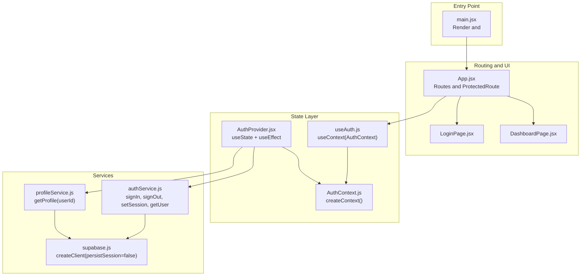
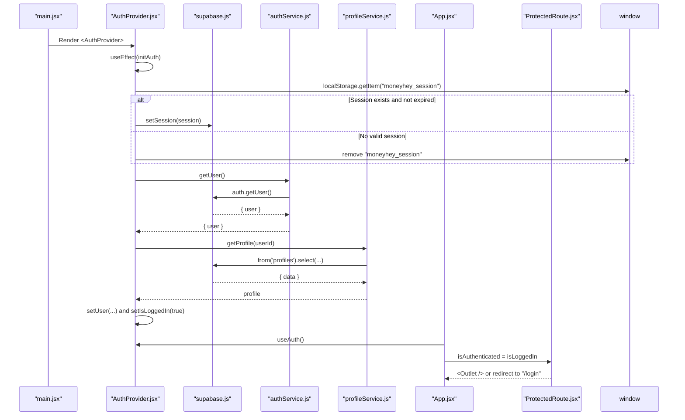
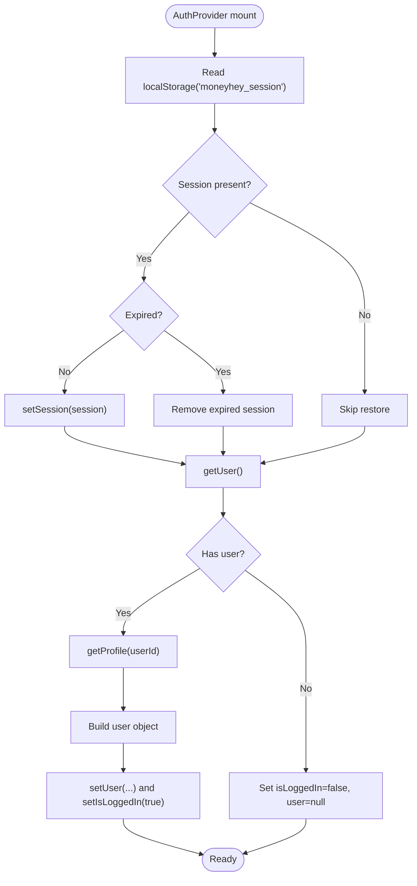
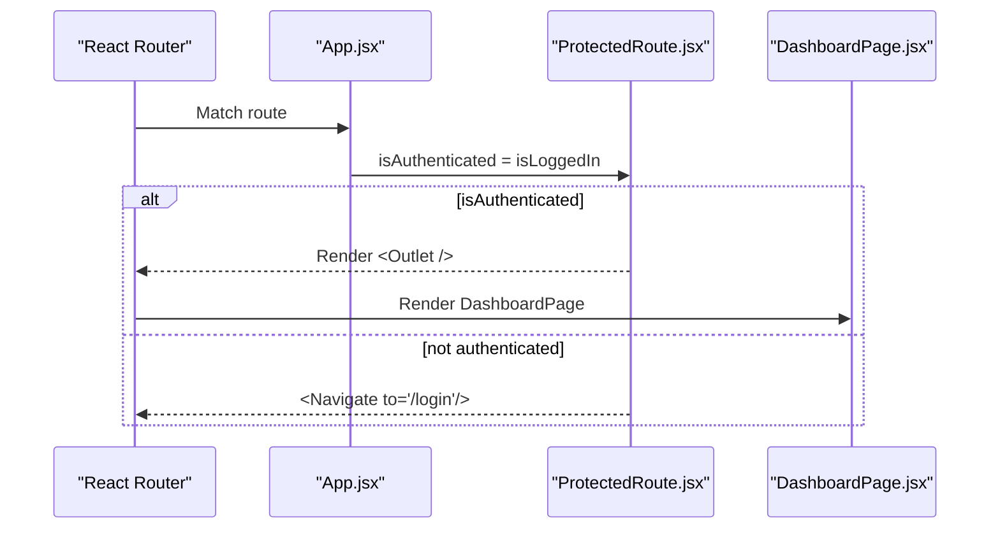
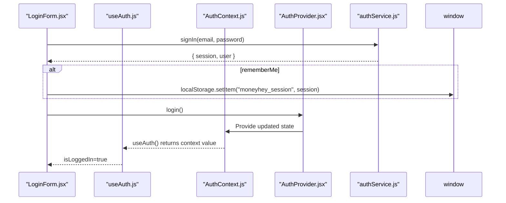
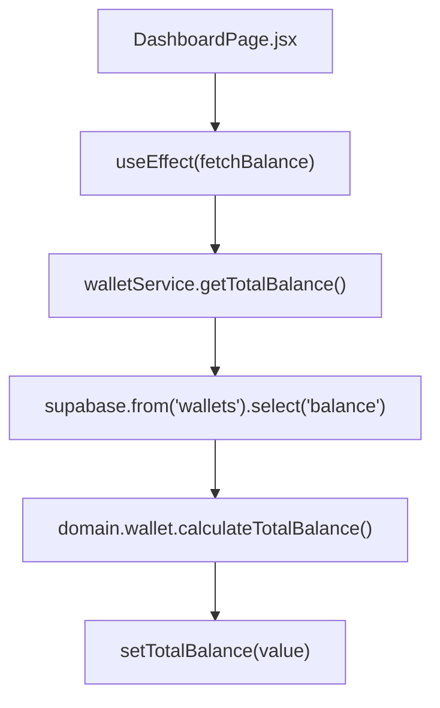
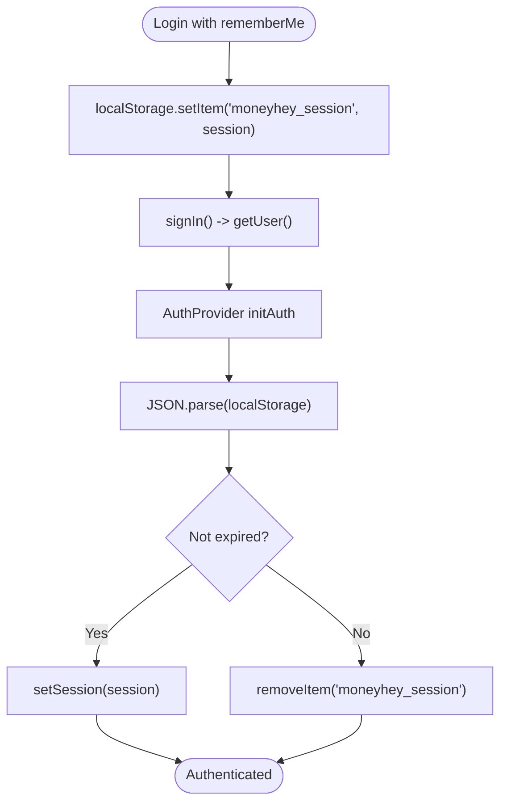
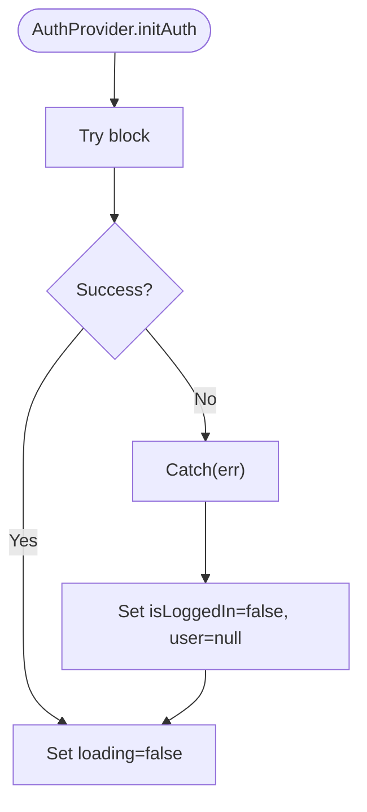
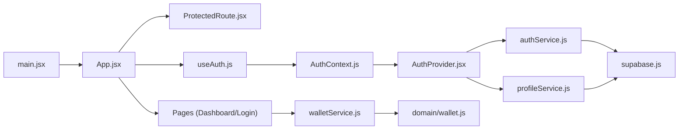

# State Management

<cite>
**Referenced Files in This Document**
- [AuthContext.js](file://MoneyHey/src/context/AuthContext.js)
- [AuthProvider.jsx](file://MoneyHey/src/context/AuthProvider.jsx)
- [useAuth.js](file://MoneyHey/src/hooks/useAuth.js)
- [ProtectedRoute.jsx](file://MoneyHey/src/components/auth/ProtectedRoute.jsx)
- [authService.js](file://MoneyHey/src/services/authService.js)
- [profileService.js](file://MoneyHey/src/services/profileService.js)
- [supabase.js](file://MoneyHey/src/config/supabase.js)
- [main.jsx](file://MoneyHey/src/main.jsx)
- [App.jsx](file://MoneyHey/src/App.jsx)
- [LoginPage.jsx](file://MoneyHey/src/pages/LoginPage.jsx)
- [DashboardPage.jsx](file://MoneyHey/src/pages/DashboardPage.jsx)
- [LoginForm.jsx](file://MoneyHey/src/components/auth/LoginForm.jsx)
- [walletService.js](file://MoneyHey/src/services/walletService.js)
- [wallet.js](file://MoneyHey/src/domain/wallet.js)
</cite>

## Table of Contents
1. [Introduction](#introduction)
2. [Project Structure](#project-structure)
3. [Core Components](#core-components)
4. [Architecture Overview](#architecture-overview)
5. [Detailed Component Analysis](#detailed-component-analysis)
6. [Dependency Analysis](#dependency-analysis)
7. [Performance Considerations](#performance-considerations)
8. [Troubleshooting Guide](#troubleshooting-guide)
9. [Conclusion](#conclusion)
10. [Appendices](#appendices)

## Introduction
This document explains MoneyHey’s state management model with a focus on React Context, custom hooks, and global state synchronization. It covers authentication state lifecycle, user session handling, protected route protection, state update flows, persistence strategies, memory management, performance optimizations, and debugging techniques. The implementation centers around a single AuthProvider that exposes user, login status, and actions via a shared context, while Supabase handles backend authentication and session persistence.

## Project Structure
MoneyHey organizes state management across three layers:
- Context and Provider: Authentication state and actions are centralized in a provider and exposed via a context.
- Hooks: A lightweight custom hook wraps context consumption for components.
- Services: Supabase-backed service functions encapsulate authentication and profile operations.

**Diagram sources**
- [main.jsx:10-19](file://MoneyHey/src/main.jsx#L10-L19)
- [App.jsx:13-40](file://MoneyHey/src/App.jsx#L13-L40)
- [AuthProvider.jsx:6-97](file://MoneyHey/src/context/AuthProvider.jsx#L6-L97)
- [AuthContext.js:1-4](file://MoneyHey/src/context/AuthContext.js#L1-L4)
- [useAuth.js:4-6](file://MoneyHey/src/hooks/useAuth.js#L4-L6)
- [authService.js:1-11](file://MoneyHey/src/services/authService.js#L1-L11)
- [profileService.js:1-12](file://MoneyHey/src/services/profileService.js#L1-L12)
- [supabase.js:1-11](file://MoneyHey/src/config/supabase.js#L1-L11)

**Section sources**
- [main.jsx:10-19](file://MoneyHey/src/main.jsx#L10-L19)
- [App.jsx:13-40](file://MoneyHey/src/App.jsx#L13-L40)
- [AuthProvider.jsx:6-97](file://MoneyHey/src/context/AuthProvider.jsx#L6-L97)
- [AuthContext.js:1-4](file://MoneyHey/src/context/AuthContext.js#L1-L4)
- [useAuth.js:4-6](file://MoneyHey/src/hooks/useAuth.js#L4-L6)
- [authService.js:1-11](file://MoneyHey/src/services/authService.js#L1-L11)
- [profileService.js:1-12](file://MoneyHey/src/services/profileService.js#L1-L12)
- [supabase.js:1-11](file://MoneyHey/src/config/supabase.js#L1-L11)

## Core Components
- AuthProvider: Initializes authentication state, synchronizes with Supabase, hydrates from localStorage when available, and exposes login/logout actions.
- AuthContext: Holds the context object created for sharing authentication state across components.
- useAuth: A minimal custom hook that returns the current context value for convenience.
- ProtectedRoute: A route guard that renders child routes only when the user is authenticated.
- authService and profileService: Thin wrappers around Supabase client for authentication and profile retrieval.
- Supabase configuration: Configures the Supabase client with session persistence disabled at the SDK level.

Key responsibilities:
- Global state: user, isLoggedIn, loading, and actions (login, logout).
- Synchronization: On mount, provider reads persisted session, validates expiration, sets session with Supabase, and loads profile.
- Persistence: Optional localStorage persistence of session for “remember me”.
- Routing protection: ProtectedRoute enforces authentication at the routing level.

**Section sources**
- [AuthProvider.jsx:6-97](file://MoneyHey/src/context/AuthProvider.jsx#L6-L97)
- [AuthContext.js:1-4](file://MoneyHey/src/context/AuthContext.js#L1-L4)
- [useAuth.js:4-6](file://MoneyHey/src/hooks/useAuth.js#L4-L6)
- [ProtectedRoute.jsx:1-7](file://MoneyHey/src/components/auth/ProtectedRoute.jsx#L1-L7)
- [authService.js:1-11](file://MoneyHey/src/services/authService.js#L1-L11)
- [profileService.js:1-12](file://MoneyHey/src/services/profileService.js#L1-L12)
- [supabase.js:6-10](file://MoneyHey/src/config/supabase.js#L6-L10)

## Architecture Overview
The authentication flow begins at the provider initialization and integrates with Supabase and local storage. Protected routes depend on the global authentication state to decide whether to render content.

**Diagram sources**
- [main.jsx:10-19](file://MoneyHey/src/main.jsx#L10-L19)
- [AuthProvider.jsx:11-59](file://MoneyHey/src/context/AuthProvider.jsx#L11-L59)
- [authService.js:10](file://MoneyHey/src/services/authService.js#L10)
- [profileService.js:3-11](file://MoneyHey/src/services/profileService.js#L3-L11)
- [App.jsx:14](file://MoneyHey/src/App.jsx#L14)
- [ProtectedRoute.jsx:3-5](file://MoneyHey/src/components/auth/ProtectedRoute.jsx#L3-L5)

## Detailed Component Analysis

### Authentication State Lifecycle and Provider Architecture
- Initialization: On mount, the provider attempts to restore a session from localStorage, validates expiration, and sets it with Supabase. It then retrieves the current user and loads profile data to construct the user object.
- State fields: user, isLoggedIn, loading.
- Actions: login (hydrates state after successful auth), logout (clears localStorage, signs out via Supabase, resets state).
- Exposed via context: value includes user, isLoggedIn, setIsLoggedIn, loading, login, logout.

**Diagram sources**
- [AuthProvider.jsx:11-59](file://MoneyHey/src/context/AuthProvider.jsx#L11-L59)
- [authService.js:10](file://MoneyHey/src/services/authService.js#L10)
- [profileService.js:3-11](file://MoneyHey/src/services/profileService.js#L3-L11)

**Section sources**
- [AuthProvider.jsx:6-97](file://MoneyHey/src/context/AuthProvider.jsx#L6-L97)
- [authService.js:1-11](file://MoneyHey/src/services/authService.js#L1-L11)
- [profileService.js:1-12](file://MoneyHey/src/services/profileService.js#L1-L12)

### Protected Route Protection Mechanism
- ProtectedRoute receives isAuthenticated and either renders child routes (<Outlet>) or redirects to /login.
- App wires up nested routes under ProtectedRoute and passes the current authentication state from useAuth.

**Diagram sources**
- [App.jsx:25-29](file://MoneyHey/src/App.jsx#L25-L29)
- [ProtectedRoute.jsx:3-5](file://MoneyHey/src/components/auth/ProtectedRoute.jsx#L3-L5)

**Section sources**
- [App.jsx:13-40](file://MoneyHey/src/App.jsx#L13-L40)
- [ProtectedRoute.jsx:1-7](file://MoneyHey/src/components/auth/ProtectedRoute.jsx#L1-L7)

### Custom Hook Implementation and Component Subscriptions
- useAuth returns the current context value, enabling components to subscribe to authentication state without manual context imports.
- LoginForm uses useAuth to call login after a successful sign-in, and optionally persists the session to localStorage when “remember me” is selected.
- DashboardPage subscribes to authentication state via App and uses local state for UI toggles and balance computation.

**Diagram sources**
- [LoginForm.jsx:47-68](file://MoneyHey/src/components/auth/LoginForm.jsx#L47-L68)
- [useAuth.js:4-6](file://MoneyHey/src/hooks/useAuth.js#L4-L6)
- [AuthContext.js:1-4](file://MoneyHey/src/context/AuthContext.js#L1-L4)
- [AuthProvider.jsx:61-76](file://MoneyHey/src/context/AuthProvider.jsx#L61-L76)
- [authService.js:3-4](file://MoneyHey/src/services/authService.js#L3-L4)

**Section sources**
- [useAuth.js:4-6](file://MoneyHey/src/hooks/useAuth.js#L4-L6)
- [LoginForm.jsx:1-137](file://MoneyHey/src/components/auth/LoginForm.jsx#L1-L137)
- [AuthProvider.jsx:61-83](file://MoneyHey/src/context/AuthProvider.jsx#L61-L83)

### State Update Flows and Composition Patterns
- Composition pattern: App composes ProtectedRoute around nested routes, passing isAuthenticated derived from useAuth.
- Local vs global state: DashboardPage maintains local UI state (sidebarOpen) and fetches global data (totalBalance) via walletService, which queries Supabase and computes totals using domain logic.
- Domain logic: wallet.js reduces wallet balances into a total using a money conversion utility.

**Diagram sources**
- [DashboardPage.jsx:24-35](file://MoneyHey/src/pages/DashboardPage.jsx#L24-L35)
- [walletService.js:4-10](file://MoneyHey/src/services/walletService.js#L4-L10)
- [wallet.js:3-5](file://MoneyHey/src/domain/wallet.js#L3-L5)

**Section sources**
- [DashboardPage.jsx:15-94](file://MoneyHey/src/pages/DashboardPage.jsx#L15-L94)
- [walletService.js:1-21](file://MoneyHey/src/services/walletService.js#L1-L21)
- [wallet.js:1-6](file://MoneyHey/src/domain/wallet.js#L1-L6)

### State Persistence Strategies and Memory Management
- Local storage persistence: LoginForm writes the session to localStorage when “remember me” is enabled. AuthProvider reads and validates it on startup and removes expired sessions.
- Supabase session persistence: Supabase client is configured with persistSession disabled, so MoneyHey controls session lifecycle explicitly.
- Memory hygiene: On logout, provider clears localStorage and resets user state; components should avoid retaining stale references to user data.

**Diagram sources**
- [LoginForm.jsx:63-66](file://MoneyHey/src/components/auth/LoginForm.jsx#L63-L66)
- [AuthProvider.jsx:15-26](file://MoneyHey/src/context/AuthProvider.jsx#L15-L26)
- [supabase.js:8](file://MoneyHey/src/config/supabase.js#L8)

**Section sources**
- [LoginForm.jsx:47-68](file://MoneyHey/src/components/auth/LoginForm.jsx#L47-L68)
- [AuthProvider.jsx:11-59](file://MoneyHey/src/context/AuthProvider.jsx#L11-L59)
- [supabase.js:6-10](file://MoneyHey/src/config/supabase.js#L6-L10)

### Concurrency, Error Boundaries, and Reset Procedures
- Concurrency: AuthProvider performs asynchronous operations during initialization. Updates are atomic per effect; login and logout are single-purpose actions that update state consistently.
- Error handling: AuthProvider catches errors during initialization and ensures loading completes. LoginForm logs and surfaces authentication errors to the user.
- Reset procedures: logout clears localStorage, signs out via Supabase, and resets user state. On initialization failure, state is reset to logged-out.

**Diagram sources**
- [AuthProvider.jsx:49-55](file://MoneyHey/src/context/AuthProvider.jsx#L49-L55)

**Section sources**
- [AuthProvider.jsx:49-83](file://MoneyHey/src/context/AuthProvider.jsx#L49-L83)
- [LoginForm.jsx:54-67](file://MoneyHey/src/components/auth/LoginForm.jsx#L54-L67)

## Dependency Analysis
The following diagram shows how modules depend on each other to implement state management and routing.

**Diagram sources**
- [main.jsx:10-19](file://MoneyHey/src/main.jsx#L10-L19)
- [App.jsx:13-40](file://MoneyHey/src/App.jsx#L13-L40)
- [ProtectedRoute.jsx:1-7](file://MoneyHey/src/components/auth/ProtectedRoute.jsx#L1-L7)
- [useAuth.js:4-6](file://MoneyHey/src/hooks/useAuth.js#L4-L6)
- [AuthContext.js:1-4](file://MoneyHey/src/context/AuthContext.js#L1-L4)
- [AuthProvider.jsx:6-97](file://MoneyHey/src/context/AuthProvider.jsx#L6-L97)
- [authService.js:1-11](file://MoneyHey/src/services/authService.js#L1-L11)
- [profileService.js:1-12](file://MoneyHey/src/services/profileService.js#L1-L12)
- [supabase.js:1-11](file://MoneyHey/src/config/supabase.js#L1-L11)
- [walletService.js:1-21](file://MoneyHey/src/services/walletService.js#L1-L21)
- [wallet.js:1-6](file://MoneyHey/src/domain/wallet.js#L1-L6)

**Section sources**
- [AuthProvider.jsx:6-97](file://MoneyHey/src/context/AuthProvider.jsx#L6-L97)
- [authService.js:1-11](file://MoneyHey/src/services/authService.js#L1-L11)
- [profileService.js:1-12](file://MoneyHey/src/services/profileService.js#L1-L12)
- [supabase.js:1-11](file://MoneyHey/src/config/supabase.js#L1-L11)
- [walletService.js:1-21](file://MoneyHey/src/services/walletService.js#L1-L21)
- [wallet.js:1-6](file://MoneyHey/src/domain/wallet.js#L1-L6)

## Performance Considerations
- Minimize re-renders: Keep the context value shape lean. AuthProvider currently exposes user, isLoggedIn, setIsLoggedIn, loading, login, logout. Avoid unnecessary updates by ensuring login/logout are invoked only when needed.
- Avoid redundant network calls: AuthProvider already deduplicates initialization via a single effect. Ensure components do not trigger duplicate getUser calls.
- Local storage I/O: Persisting sessions is O(1) reads/writes; still keep it gated behind a single condition (e.g., rememberMe).
- Lazy initialization: AuthProvider defers work until mount; consider debouncing heavy computations if added later.
- UI responsiveness: DashboardPage fetches balance once on mount; cache results if reused across views.

[No sources needed since this section provides general guidance]

## Troubleshooting Guide
Common issues and resolutions:
- Stuck loading: Ensure AuthProvider finally sets loading to false after initialization regardless of outcome.
- Incorrect login state: Verify that login action is called after successful sign-in and that profile data resolves.
- Redirect loops: Confirm that ProtectedRoute receives the correct isAuthenticated prop from useAuth.
- Session not persisting: Check that “remember me” is selected and that localStorage item is written; ensure AuthProvider reads and validates expiration.
- Supabase session conflicts: Since persistSession is disabled, rely on AuthProvider to manage session state.

**Section sources**
- [AuthProvider.jsx:49-55](file://MoneyHey/src/context/AuthProvider.jsx#L49-L55)
- [LoginForm.jsx:63-67](file://MoneyHey/src/components/auth/LoginForm.jsx#L63-L67)
- [App.jsx:25-29](file://MoneyHey/src/App.jsx#L25-L29)
- [supabase.js:8](file://MoneyHey/src/config/supabase.js#L8)

## Conclusion
MoneyHey’s state management is intentionally simple and robust: a single AuthProvider manages authentication state, a custom hook exposes it, and Supabase handles backend concerns. The design cleanly separates concerns, supports optional session persistence, and protects routes via a dedicated guard. Extending the system involves adding new services and composing them into existing pages while preserving the context and hook patterns.

[No sources needed since this section summarizes without analyzing specific files]

## Appendices

### Example References
- Context creation: [AuthContext.js:1-4](file://MoneyHey/src/context/AuthContext.js#L1-L4)
- Provider implementation: [AuthProvider.jsx:6-97](file://MoneyHey/src/context/AuthProvider.jsx#L6-L97)
- Custom hook usage: [useAuth.js:4-6](file://MoneyHey/src/hooks/useAuth.js#L4-L6)
- Protected route usage: [ProtectedRoute.jsx:1-7](file://MoneyHey/src/components/auth/ProtectedRoute.jsx#L1-L7)
- Authentication service: [authService.js:1-11](file://MoneyHey/src/services/authService.js#L1-L11)
- Profile service: [profileService.js:1-12](file://MoneyHey/src/services/profileService.js#L1-L12)
- Supabase configuration: [supabase.js:1-11](file://MoneyHey/src/config/supabase.js#L1-L11)
- App routing and protection: [App.jsx:13-40](file://MoneyHey/src/App.jsx#L13-L40)
- Login page and form: [LoginPage.jsx:1-56](file://MoneyHey/src/pages/LoginPage.jsx#L1-L56), [LoginForm.jsx:1-137](file://MoneyHey/src/components/auth/LoginForm.jsx#L1-L137)
- Dashboard page and balance computation: [DashboardPage.jsx:15-94](file://MoneyHey/src/pages/DashboardPage.jsx#L15-L94), [walletService.js:1-21](file://MoneyHey/src/services/walletService.js#L1-L21), [wallet.js:1-6](file://MoneyHey/src/domain/wallet.js#L1-L6)