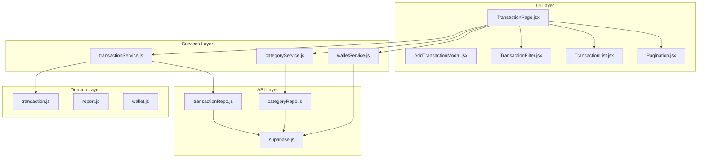
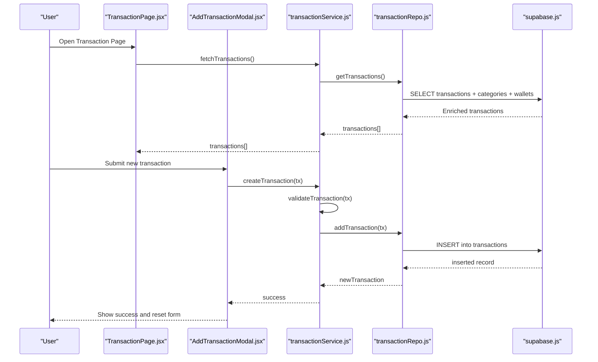
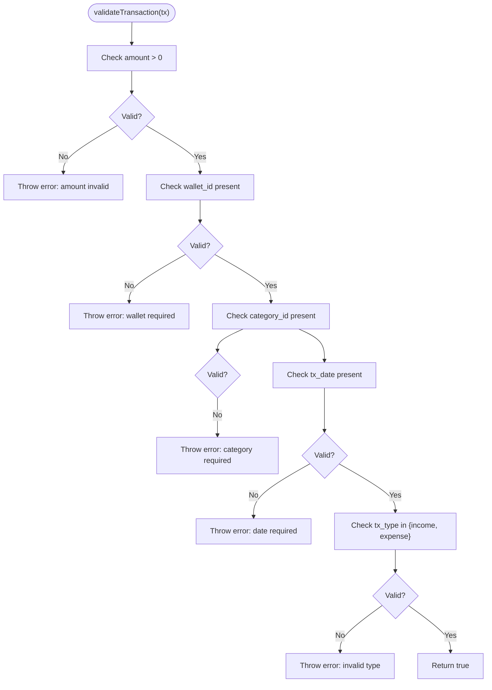
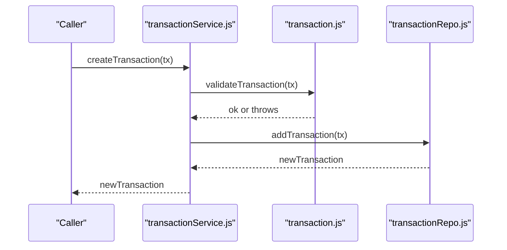
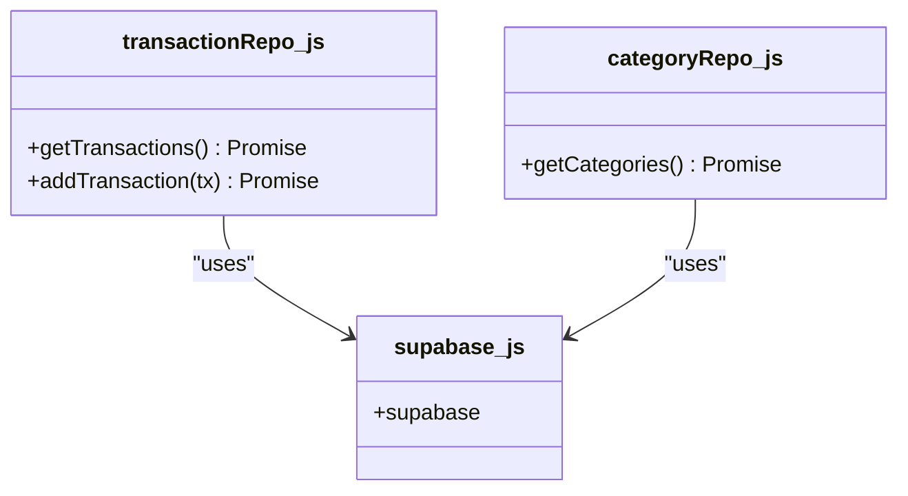
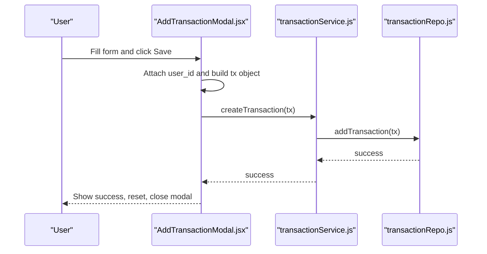
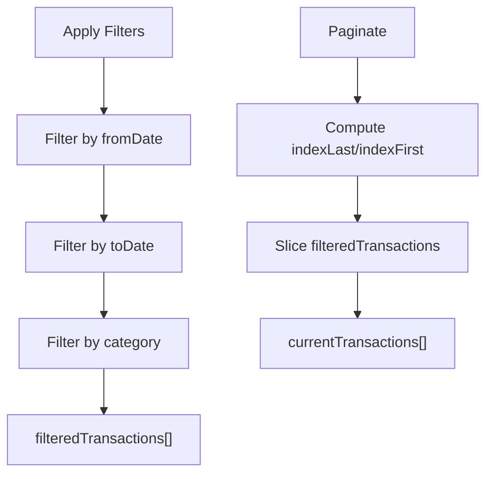
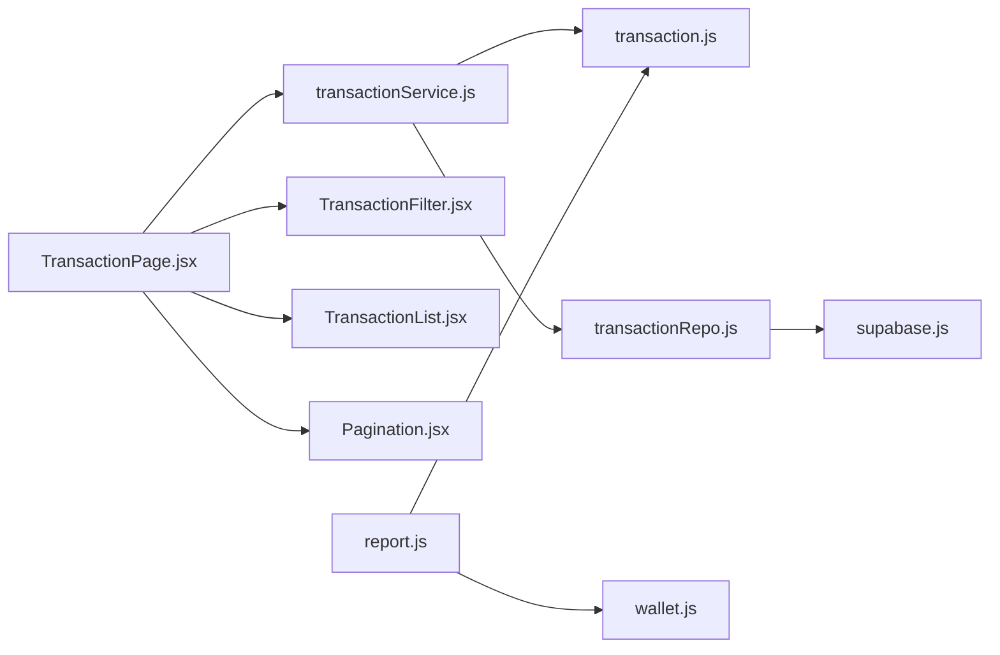

# Transaction Management

<cite>
**Referenced Files in This Document**
- [transaction.js](file://MoneyHey/src/domain/transaction.js)
- [transactionService.js](file://MoneyHey/src/services/transactionService.js)
- [transactionRepo.js](file://MoneyHey/src/api/transactionRepo.js)
- [AddTransactionModal.jsx](file://MoneyHey/src/components/transaction/AddTransactionModal.jsx)
- [TransactionFilter.jsx](file://MoneyHey/src/components/transaction/TransactionFilter.jsx)
- [TransactionList.jsx](file://MoneyHey/src/components/transaction/TransactionList.jsx)
- [TransactionPage.jsx](file://MoneyHey/src/pages/TransactionPage.jsx)
- [Pagination.jsx](file://MoneyHey/src/components/common/Pagination.jsx)
- [supabase.js](file://MoneyHey/src/config/supabase.js)
- [walletService.js](file://MoneyHey/src/services/walletService.js)
- [categoryService.js](file://MoneyHey/src/services/categoryService.js)
- [categoryRepo.js](file://MoneyHey/src/api/categoryRepo.js)
- [report.js](file://MoneyHey/src/domain/report.js)
- [wallet.js](file://MoneyHey/src/domain/wallet.js)
</cite>

## Table of Contents
1. [Introduction](#introduction)
2. [Project Structure](#project-structure)
3. [Core Components](#core-components)
4. [Architecture Overview](#architecture-overview)
5. [Detailed Component Analysis](#detailed-component-analysis)
6. [Dependency Analysis](#dependency-analysis)
7. [Performance Considerations](#performance-considerations)
8. [Troubleshooting Guide](#troubleshooting-guide)
9. [Conclusion](#conclusion)
10. [Appendices](#appendices)

## Introduction
This document describes MoneyHey’s transaction management system end-to-end. It covers the transaction lifecycle from creation to listing, validation rules, business logic, and persistence via Supabase. It also documents the transaction modal interface, filtering, pagination, categorization, amount processing, and date handling. Finally, it outlines CRUD operations, bulk processing, import/export scenarios, search and performance optimization techniques.

## Project Structure
MoneyHey organizes transaction concerns across domain, services, APIs, and UI components:
- Domain: Validation, filtering, and amount/sign logic
- Services: Orchestration of domain rules and API calls
- API: Supabase repository for transactions and categories
- UI: Transaction page, modal, filter bar, and list grid
- Shared: Supabase client, pagination, and wallet/category services

**Diagram sources**
- [TransactionPage.jsx:1-128](file://MoneyHey/src/pages/TransactionPage.jsx#L1-L128)
- [transactionService.js:1-24](file://MoneyHey/src/services/transactionService.js#L1-L24)
- [transactionRepo.js:1-26](file://MoneyHey/src/api/transactionRepo.js#L1-L26)
- [transaction.js:1-50](file://MoneyHey/src/domain/transaction.js#L1-L50)
- [TransactionFilter.jsx:1-65](file://MoneyHey/src/components/transaction/TransactionFilter.jsx#L1-L65)
- [TransactionList.jsx:1-66](file://MoneyHey/src/components/transaction/TransactionList.jsx#L1-L66)
- [Pagination.jsx:1-31](file://MoneyHey/src/components/common/Pagination.jsx#L1-L31)
- [categoryService.js:1-6](file://MoneyHey/src/services/categoryService.js#L1-L6)
- [categoryRepo.js:1-11](file://MoneyHey/src/api/categoryRepo.js#L1-L11)
- [walletService.js:1-21](file://MoneyHey/src/services/walletService.js#L1-L21)
- [supabase.js:1-11](file://MoneyHey/src/config/supabase.js#L1-L11)
- [report.js:1-32](file://MoneyHey/src/domain/report.js#L1-L32)
- [wallet.js:1-6](file://MoneyHey/src/domain/wallet.js#L1-L6)

**Section sources**
- [TransactionPage.jsx:1-128](file://MoneyHey/src/pages/TransactionPage.jsx#L1-L128)
- [transactionService.js:1-24](file://MoneyHey/src/services/transactionService.js#L1-L24)
- [transactionRepo.js:1-26](file://MoneyHey/src/api/transactionRepo.js#L1-L26)
- [transaction.js:1-50](file://MoneyHey/src/domain/transaction.js#L1-L50)
- [TransactionFilter.jsx:1-65](file://MoneyHey/src/components/transaction/TransactionFilter.jsx#L1-L65)
- [TransactionList.jsx:1-66](file://MoneyHey/src/components/transaction/TransactionList.jsx#L1-L66)
- [Pagination.jsx:1-31](file://MoneyHey/src/components/common/Pagination.jsx#L1-L31)
- [categoryService.js:1-6](file://MoneyHey/src/services/categoryService.js#L1-L6)
- [categoryRepo.js:1-11](file://MoneyHey/src/api/categoryRepo.js#L1-L11)
- [walletService.js:1-21](file://MoneyHey/src/services/walletService.js#L1-L21)
- [supabase.js:1-11](file://MoneyHey/src/config/supabase.js#L1-L11)
- [report.js:1-32](file://MoneyHey/src/domain/report.js#L1-L32)
- [wallet.js:1-6](file://MoneyHey/src/domain/wallet.js#L1-L6)

## Core Components
- Domain validation and helpers:
  - Transaction types, amount normalization, type validation, filtering, and signed amount computation
- Transaction service:
  - Fetches and validates transactions before persistence
- API repository:
  - Reads/writes transactions and enriches with category and wallet names
- UI components:
  - Modal for adding transactions
  - Filter controls for date range and category
  - Transaction list grid with currency formatting and type badges
  - Pagination component
- Supporting services:
  - Categories and wallets loaded for selection and display

**Section sources**
- [transaction.js:1-50](file://MoneyHey/src/domain/transaction.js#L1-L50)
- [transactionService.js:1-24](file://MoneyHey/src/services/transactionService.js#L1-L24)
- [transactionRepo.js:1-26](file://MoneyHey/src/api/transactionRepo.js#L1-L26)
- [AddTransactionModal.jsx:1-171](file://MoneyHey/src/components/transaction/AddTransactionModal.jsx#L1-L171)
- [TransactionFilter.jsx:1-65](file://MoneyHey/src/components/transaction/TransactionFilter.jsx#L1-L65)
- [TransactionList.jsx:1-66](file://MoneyHey/src/components/transaction/TransactionList.jsx#L1-L66)
- [Pagination.jsx:1-31](file://MoneyHey/src/components/common/Pagination.jsx#L1-L31)
- [categoryService.js:1-6](file://MoneyHey/src/services/categoryService.js#L1-L6)
- [categoryRepo.js:1-11](file://MoneyHey/src/api/categoryRepo.js#L1-L11)
- [walletService.js:1-21](file://MoneyHey/src/services/walletService.js#L1-L21)

## Architecture Overview
The transaction lifecycle follows a layered architecture:
- UI triggers actions (open modal, apply filters, paginate)
- Services orchestrate domain validations and API calls
- API repositories interact with Supabase
- Domain utilities enforce business rules and compute derived values
- Reports and summaries consume transaction data

**Diagram sources**
- [TransactionPage.jsx:1-128](file://MoneyHey/src/pages/TransactionPage.jsx#L1-L128)
- [AddTransactionModal.jsx:1-171](file://MoneyHey/src/components/transaction/AddTransactionModal.jsx#L1-L171)
- [transactionService.js:1-24](file://MoneyHey/src/services/transactionService.js#L1-L24)
- [transactionRepo.js:1-26](file://MoneyHey/src/api/transactionRepo.js#L1-L26)
- [supabase.js:1-11](file://MoneyHey/src/config/supabase.js#L1-L11)

## Detailed Component Analysis

### Domain Model and Validation
- Transaction types: expense and income
- Amount normalization: numeric coercion with finite checks
- Validation rules:
  - Amount must be a positive number
  - Wallet ID required
  - Category ID required
  - Transaction date required
  - Type must be expense or income
- Filtering:
  - Date range filters (from/to)
  - Category filter (including “all”)
- Amount sign:
  - Income is positive; expense is negative for net balance calculations

**Diagram sources**
- [transaction.js:15-32](file://MoneyHey/src/domain/transaction.js#L15-L32)

**Section sources**
- [transaction.js:1-50](file://MoneyHey/src/domain/transaction.js#L1-L50)

### Transaction Service Implementation
- Fetch transactions:
  - Calls repository to retrieve enriched records
  - Returns raw array for UI consumption
- Create transaction:
  - Validates input via domain rules
  - Inserts into Supabase
  - Propagates errors for UI handling

**Diagram sources**
- [transactionService.js:1-24](file://MoneyHey/src/services/transactionService.js#L1-L24)
- [transaction.js:15-32](file://MoneyHey/src/domain/transaction.js#L15-L32)
- [transactionRepo.js:17-26](file://MoneyHey/src/api/transactionRepo.js#L17-L26)

**Section sources**
- [transactionService.js:1-24](file://MoneyHey/src/services/transactionService.js#L1-L24)

### Repository Pattern and Data Persistence
- Transactions:
  - Select with joins to categories and wallets
  - Enrich with readable names and defaults for missing relations
  - Insert new transaction payload
- Categories:
  - Load selectable categories for filter and modal
- Supabase client configured centrally

**Diagram sources**
- [transactionRepo.js:1-26](file://MoneyHey/src/api/transactionRepo.js#L1-L26)
- [categoryRepo.js:1-11](file://MoneyHey/src/api/categoryRepo.js#L1-L11)
- [supabase.js:1-11](file://MoneyHey/src/config/supabase.js#L1-L11)

**Section sources**
- [transactionRepo.js:1-26](file://MoneyHey/src/api/transactionRepo.js#L1-L26)
- [categoryRepo.js:1-11](file://MoneyHey/src/api/categoryRepo.js#L1-L11)
- [supabase.js:1-11](file://MoneyHey/src/config/supabase.js#L1-L11)

### Transaction Modal Interface (Add)
- Fields:
  - Type: expense/income
  - Amount: numeric input
  - Wallet: dropdown populated from wallets
  - Category: dropdown populated from categories
  - Date: date input
  - Note: optional text
- Behavior:
  - On submit, attaches current user ID, validates, persists, resets form, and closes modal
  - Error handling alerts user to missing/invalid fields

**Diagram sources**
- [AddTransactionModal.jsx:1-171](file://MoneyHey/src/components/transaction/AddTransactionModal.jsx#L1-L171)
- [transactionService.js:14-23](file://MoneyHey/src/services/transactionService.js#L14-L23)
- [transactionRepo.js:17-26](file://MoneyHey/src/api/transactionRepo.js#L17-L26)

**Section sources**
- [AddTransactionModal.jsx:1-171](file://MoneyHey/src/components/transaction/AddTransactionModal.jsx#L1-L171)

### Filtering Capabilities and List Display
- Filters:
  - From date, to date, category (with “all” option)
  - Reset button clears filters
- List:
  - Displays note, date, category badge, wallet badge, amount with color-coded sign
  - Empty state messaging
- Pagination:
  - Items per page constant
  - Current page tracked
  - Total pages computed from filtered length

**Diagram sources**
- [TransactionFilter.jsx:1-65](file://MoneyHey/src/components/transaction/TransactionFilter.jsx#L1-L65)
- [TransactionList.jsx:1-66](file://MoneyHey/src/components/transaction/TransactionList.jsx#L1-L66)
- [TransactionPage.jsx:20-77](file://MoneyHey/src/pages/TransactionPage.jsx#L20-L77)
- [Pagination.jsx:1-31](file://MoneyHey/src/components/common/Pagination.jsx#L1-L31)

**Section sources**
- [TransactionFilter.jsx:1-65](file://MoneyHey/src/components/transaction/TransactionFilter.jsx#L1-L65)
- [TransactionList.jsx:1-66](file://MoneyHey/src/components/transaction/TransactionList.jsx#L1-L66)
- [TransactionPage.jsx:20-77](file://MoneyHey/src/pages/TransactionPage.jsx#L20-L77)
- [Pagination.jsx:1-31](file://MoneyHey/src/components/common/Pagination.jsx#L1-L31)

### Transaction Categorization, Amount Processing, and Date Handling
- Categorization:
  - Enriched category name included in fetched transactions
  - Category dropdowns for selection
- Amount processing:
  - Normalized to number and validated
  - Signed amounts used for net balance
  - Currency formatting applied in list view
- Date handling:
  - Date inputs for filtering and creation
  - Localized display in list

**Section sources**
- [transactionRepo.js:12-15](file://MoneyHey/src/api/transactionRepo.js#L12-L15)
- [transaction.js:6-49](file://MoneyHey/src/domain/transaction.js#L6-L49)
- [TransactionList.jsx:26-47](file://MoneyHey/src/components/transaction/TransactionList.jsx#L26-L47)
- [TransactionFilter.jsx:23-39](file://MoneyHey/src/components/transaction/TransactionFilter.jsx#L23-L39)

### Examples: CRUD, Bulk, Import/Export, Search, and Pagination
- Create:
  - Use Add Transaction modal to submit a new transaction payload
  - Service validates and inserts via repository
- Read:
  - Fetch all transactions and render filtered/paginated list
- Update/Delete:
  - UI buttons present for edit/delete in list rows
  - No update/delete handlers currently implemented in the list; implement repository methods and service wrappers as needed
- Bulk:
  - Not implemented in current code
  - Suggested approach: batch insert/update/delete via repository methods and service wrappers
- Import/Export:
  - Not implemented in current code
  - Suggested approach: export list to CSV/XLSX; import via batch insert after parsing
- Search:
  - Implemented via filter bar (date range and category)
  - Extend to note/title search by adding a text filter field and updating domain filter function
- Pagination:
  - Implemented with fixed items per page and page navigation

**Section sources**
- [AddTransactionModal.jsx:31-50](file://MoneyHey/src/components/transaction/AddTransactionModal.jsx#L31-L50)
- [transactionService.js:4-23](file://MoneyHey/src/services/transactionService.js#L4-L23)
- [TransactionPage.jsx:27-77](file://MoneyHey/src/pages/TransactionPage.jsx#L27-L77)
- [TransactionList.jsx:50-57](file://MoneyHey/src/components/transaction/TransactionList.jsx#L50-L57)

## Dependency Analysis
- UI depends on services for data loading and on domain for filtering
- Services depend on domain validation and repositories
- Repositories depend on Supabase client
- Reports depend on domain utilities for totals and balances

**Diagram sources**
- [TransactionPage.jsx:1-128](file://MoneyHey/src/pages/TransactionPage.jsx#L1-L128)
- [transactionService.js:1-24](file://MoneyHey/src/services/transactionService.js#L1-L24)
- [transactionRepo.js:1-26](file://MoneyHey/src/api/transactionRepo.js#L1-L26)
- [transaction.js:1-50](file://MoneyHey/src/domain/transaction.js#L1-L50)
- [report.js:1-32](file://MoneyHey/src/domain/report.js#L1-L32)
- [wallet.js:1-6](file://MoneyHey/src/domain/wallet.js#L1-L6)
- [supabase.js:1-11](file://MoneyHey/src/config/supabase.js#L1-L11)

**Section sources**
- [TransactionPage.jsx:1-128](file://MoneyHey/src/pages/TransactionPage.jsx#L1-L128)
- [transactionService.js:1-24](file://MoneyHey/src/services/transactionService.js#L1-L24)
- [transactionRepo.js:1-26](file://MoneyHey/src/api/transactionRepo.js#L1-L26)
- [transaction.js:1-50](file://MoneyHey/src/domain/transaction.js#L1-L50)
- [report.js:1-32](file://MoneyHey/src/domain/report.js#L1-L32)
- [wallet.js:1-6](file://MoneyHey/src/domain/wallet.js#L1-L6)
- [supabase.js:1-11](file://MoneyHey/src/config/supabase.js#L1-L11)

## Performance Considerations
- Client-side filtering and pagination:
  - Suitable for small to medium datasets
  - For larger datasets, offload filtering to server (Supabase RLS/selective fields) and implement server-side pagination
- Currency formatting:
  - Applied in UI; keep localized formatting consistent
- Network requests:
  - Batch reads/writes where possible
  - Debounce filter inputs to reduce re-renders
- Supabase:
  - Use indexed columns for date/category filters
  - Limit selected fields to only those needed

[No sources needed since this section provides general guidance]

## Troubleshooting Guide
- Validation errors:
  - Amount not positive, missing wallet/category/date, or invalid type
  - Service logs and re-throws errors for UI alerts
- Fetch errors:
  - Repository logs and throws on select failures
- Insert errors:
  - Repository logs and throws on insert failures
- UI feedback:
  - Modal shows success and resets form; errors show user-friendly alerts

**Section sources**
- [transactionService.js:8-22](file://MoneyHey/src/services/transactionService.js#L8-L22)
- [transactionRepo.js:8-25](file://MoneyHey/src/api/transactionRepo.js#L8-L25)
- [AddTransactionModal.jsx:46-49](file://MoneyHey/src/components/transaction/AddTransactionModal.jsx#L46-L49)

## Conclusion
MoneyHey’s transaction management is structured around a clean separation of concerns: domain validation, service orchestration, repository persistence, and UI components. The system supports robust validation, filtering, and display while leaving room for future enhancements such as server-side pagination, bulk operations, and import/export.

[No sources needed since this section summarizes without analyzing specific files]

## Appendices

### Transaction CRUD Operations
- Create: Modal → Service validation → Repository insert
- Read: Service fetch → Repository select with joins → UI list
- Update/Delete: Present in UI rows; implement service/repository methods as needed
- Bulk: Not implemented; design batch endpoints and UI flows
- Import/Export: Not implemented; design CSV/XLSX handlers and batch APIs

**Section sources**
- [AddTransactionModal.jsx:31-50](file://MoneyHey/src/components/transaction/AddTransactionModal.jsx#L31-L50)
- [transactionService.js:4-23](file://MoneyHey/src/services/transactionService.js#L4-L23)
- [transactionRepo.js:2-16](file://MoneyHey/src/api/transactionRepo.js#L2-L16)
- [TransactionList.jsx:50-57](file://MoneyHey/src/components/transaction/TransactionList.jsx#L50-L57)

### Search and Pagination
- Search: Date range and category filters; extend to text search
- Pagination: Fixed items per page with previous/next navigation

**Section sources**
- [TransactionFilter.jsx:1-65](file://MoneyHey/src/components/transaction/TransactionFilter.jsx#L1-L65)
- [TransactionPage.jsx:73-77](file://MoneyHey/src/pages/TransactionPage.jsx#L73-L77)
- [Pagination.jsx:1-31](file://MoneyHey/src/components/common/Pagination.jsx#L1-L31)