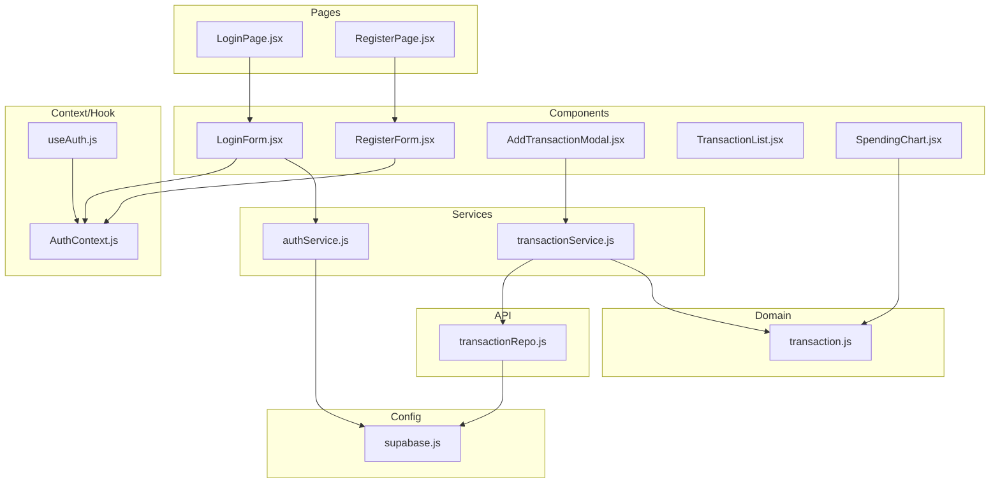
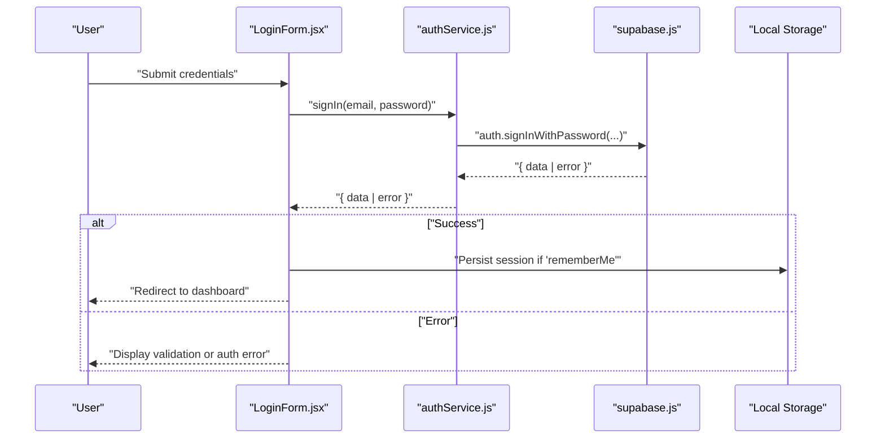
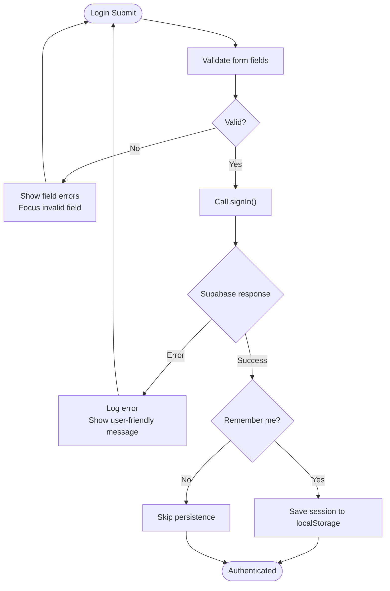
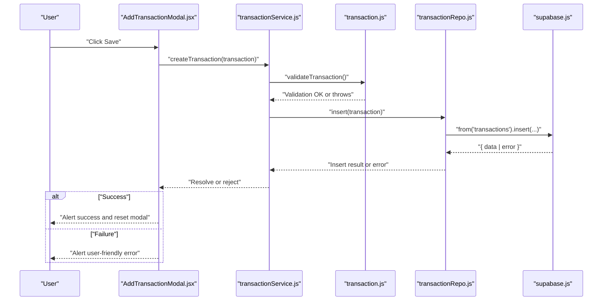
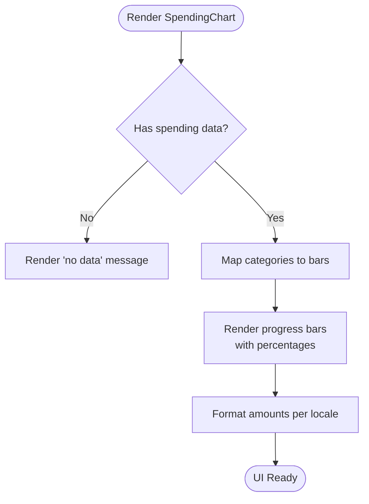

# Troubleshooting and FAQ

<cite>
**Referenced Files in This Document**
- [README.md](file://README.md)
- [package.json](file://package.json)
- [vite.config.js](file://vite.config.js)
- [supabase.js](file://src/config/supabase.js)
- [authService.js](file://src/services/authService.js)
- [LoginForm.jsx](file://src/components/auth/LoginForm.jsx)
- [RegisterForm.jsx](file://src/components/auth/RegisterForm.jsx)
- [LoginPage.jsx](file://src/pages/LoginPage.jsx)
- [RegisterPage.jsx](file://src/pages/RegisterPage.jsx)
- [useAuth.js](file://src/hooks/useAuth.js)
- [AuthContext.js](file://src/context/AuthContext.js)
- [transactionService.js](file://src/services/transactionService.js)
- [transactionRepo.js](file://src/api/transactionRepo.js)
- [transaction.js](file://src/domain/transaction.js)
- [AddTransactionModal.jsx](file://src/components/transaction/AddTransactionModal.jsx)
- [TransactionList.jsx](file://src/components/transaction/TransactionList.jsx)
- [SpendingChart.jsx](file://src/components/dashboard/SpendingChart.jsx)
- [LoginForm.css](file://src/css/LoginForm.css)
</cite>

## Table of Contents
1. [Introduction](#introduction)
2. [Project Structure](#project-structure)
3. [Core Components](#core-components)
4. [Architecture Overview](#architecture-overview)
5. [Detailed Component Analysis](#detailed-component-analysis)
6. [Dependency Analysis](#dependency-analysis)
7. [Performance Considerations](#performance-considerations)
8. [Troubleshooting Guide](#troubleshooting-guide)
9. [Conclusion](#conclusion)
10. [Appendices](#appendices)

## Introduction
This document provides comprehensive troubleshooting and Frequently Asked Questions for MoneyHey. It focuses on diagnosing and resolving common issues such as authentication problems, transaction processing errors, UI rendering issues, performance bottlenecks, environment configuration problems, dependency conflicts, build failures, user experience and accessibility concerns, and cross-browser compatibility. It also includes debugging techniques, error message interpretation, and solution workflows grounded in the repository’s codebase.

## Project Structure
MoneyHey is a React + Vite application with Supabase integration for authentication and data persistence. The structure separates concerns into:
- Pages: Route-level containers for Login, Register, and other views
- Components: Reusable UI elements (auth forms, charts, lists, modals)
- Services: Business logic wrappers around APIs
- Domain: Validation and business rules
- API: Supabase client interactions
- Config: Supabase client initialization
- Hooks and Context: Authentication state management
- Styles: Component-specific CSS

**Diagram sources**
- [LoginPage.jsx](file://src/pages/LoginPage.jsx)
- [RegisterPage.jsx](file://src/pages/RegisterPage.jsx)
- [LoginForm.jsx](file://src/components/auth/LoginForm.jsx)
- [RegisterForm.jsx](file://src/components/auth/RegisterForm.jsx)
- [AddTransactionModal.jsx](file://src/components/transaction/AddTransactionModal.jsx)
- [TransactionList.jsx](file://src/components/transaction/TransactionList.jsx)
- [SpendingChart.jsx](file://src/components/dashboard/SpendingChart.jsx)
- [authService.js](file://src/services/authService.js)
- [transactionService.js](file://src/services/transactionService.js)
- [transaction.js](file://src/domain/transaction.js)
- [transactionRepo.js](file://src/api/transactionRepo.js)
- [supabase.js](file://src/config/supabase.js)
- [AuthContext.js](file://src/context/AuthContext.js)
- [useAuth.js](file://src/hooks/useAuth.js)

**Section sources**
- [README.md](file://README.md)
- [package.json](file://package.json)
- [vite.config.js](file://vite.config.js)

## Core Components
- Authentication pipeline: Supabase-backed login and registration forms, session handling, and protected routes
- Transaction management: Creation, validation, retrieval, and display of transactions
- UI rendering: Charts, modals, lists, and responsive styles
- Environment: Vite build tooling, React runtime, and third-party libraries

Key implementation references:
- Authentication service and Supabase client initialization
- Login and registration form validation and submission
- Transaction creation, validation, and data mapping
- UI components for charts and lists

**Section sources**
- [supabase.js](file://src/config/supabase.js)
- [authService.js](file://src/services/authService.js)
- [LoginForm.jsx](file://src/components/auth/LoginForm.jsx)
- [RegisterForm.jsx](file://src/components/auth/RegisterForm.jsx)
- [transactionService.js](file://src/services/transactionService.js)
- [transactionRepo.js](file://src/api/transactionRepo.js)
- [transaction.js](file://src/domain/transaction.js)
- [SpendingChart.jsx](file://src/components/dashboard/SpendingChart.jsx)
- [TransactionList.jsx](file://src/components/transaction/TransactionList.jsx)

## Architecture Overview
The application follows a layered architecture:
- Presentation layer: Pages and Components
- Service layer: Business logic and orchestration
- Domain layer: Validation and business rules
- API layer: Supabase client interactions
- Configuration: Supabase client setup

**Diagram sources**
- [LoginForm.jsx](file://src/components/auth/LoginForm.jsx)
- [authService.js](file://src/services/authService.js)
- [supabase.js](file://src/config/supabase.js)

## Detailed Component Analysis

### Authentication Flow and Troubleshooting
Common issues:
- Incorrect credentials or account lockouts
- Network connectivity to Supabase
- Session persistence and local storage availability
- Form validation errors

Debugging steps:
- Inspect network requests to Supabase in browser DevTools
- Verify Supabase URL and API key correctness
- Confirm “remember me” logic and local storage permissions
- Review form validation messages and focus behavior

**Diagram sources**
- [LoginForm.jsx](file://src/components/auth/LoginForm.jsx)
- [authService.js](file://src/services/authService.js)
- [supabase.js](file://src/config/supabase.js)

**Section sources**
- [LoginForm.jsx](file://src/components/auth/LoginForm.jsx)
- [RegisterForm.jsx](file://src/components/auth/RegisterForm.jsx)
- [LoginPage.jsx](file://src/pages/LoginPage.jsx)
- [RegisterPage.jsx](file://src/pages/RegisterPage.jsx)
- [authService.js](file://src/services/authService.js)
- [supabase.js](file://src/config/supabase.js)
- [useAuth.js](file://src/hooks/useAuth.js)
- [AuthContext.js](file://src/context/AuthContext.js)

### Transaction Processing Pipeline
Common issues:
- Validation failures (missing amount, category, wallet, date)
- Supabase insert errors
- Data mapping and missing joins
- UI feedback on success/error

**Diagram sources**
- [AddTransactionModal.jsx](file://src/components/transaction/AddTransactionModal.jsx)
- [transactionService.js](file://src/services/transactionService.js)
- [transaction.js](file://src/domain/transaction.js)
- [transactionRepo.js](file://src/api/transactionRepo.js)
- [supabase.js](file://src/config/supabase.js)

**Section sources**
- [AddTransactionModal.jsx](file://src/components/transaction/AddTransactionModal.jsx)
- [TransactionList.jsx](file://src/components/transaction/TransactionList.jsx)
- [transactionService.js](file://src/services/transactionService.js)
- [transactionRepo.js](file://src/api/transactionRepo.js)
- [transaction.js](file://src/domain/transaction.js)

### UI Rendering and Chart Components
Common issues:
- Missing data causing empty states
- Currency formatting and locale-dependent display
- Progress bars and chart rendering
- Responsive styles and layout shifts

**Diagram sources**
- [SpendingChart.jsx](file://src/components/dashboard/SpendingChart.jsx)
- [TransactionList.jsx](file://src/components/transaction/TransactionList.jsx)
- [transaction.js](file://src/domain/transaction.js)

**Section sources**
- [SpendingChart.jsx](file://src/components/dashboard/SpendingChart.jsx)
- [TransactionList.jsx](file://src/components/transaction/TransactionList.jsx)
- [LoginForm.css](file://src/css/LoginForm.css)

## Dependency Analysis
External dependencies and their roles:
- @supabase/supabase-js: Backend-as-a-Service for auth and database
- react, react-dom: UI framework
- react-router-dom: Routing
- recharts: Charting library
- bootstrap: UI components and modal behavior

Build and tooling:
- Vite: Build tool and dev server
- React plugin for Vite

Potential conflicts and misconfigurations:
- Mismatched React versions between peer dependencies
- Conflicting CSS frameworks affecting styles
- Missing polyfills for older browsers

**Section sources**
- [package.json](file://package.json)
- [vite.config.js](file://vite.config.js)

## Performance Considerations
- Slow loading times
  - Analyze bundle size and chunking via Vite preview
  - Defer non-critical resources
  - Minimize heavy computations in render paths
- Memory leaks
  - Avoid retaining references in long-lived components
  - Clean up timers and subscriptions
- Chart rendering issues
  - Ensure data normalization and finite values
  - Debounce frequent updates
  - Prefer virtualized lists for large datasets

[No sources needed since this section provides general guidance]

## Troubleshooting Guide

### Authentication Problems
Symptoms:
- Login fails immediately with generic messages
- “Email or password incorrect” appears after submission
- Session not persisted despite “remember me”

Root causes and fixes:
- Supabase authentication endpoint unreachable
  - Verify network connectivity and Supabase project status
  - Confirm Supabase URL and API key correctness
- Incorrect credentials
  - Validate input fields and show targeted error messages
  - Focus invalid fields and prevent submission until valid
- Local storage disabled or blocked
  - Fallback to ephemeral sessions when persistence fails
  - Warn users if “remember me” cannot save session

Debugging checklist:
- Open browser DevTools Network tab and inspect Supabase auth requests
- Check console logs for thrown errors
- Verify Supabase auth settings (e.g., anonymous access, email confirmations)

**Section sources**
- [LoginForm.jsx](file://src/components/auth/LoginForm.jsx)
- [authService.js](file://src/services/authService.js)
- [supabase.js](file://src/config/supabase.js)

### Transaction Processing Errors
Symptoms:
- “Please enter valid and complete transaction info” alert
- Validation errors when saving transactions
- No data shown in transaction list

Root causes and fixes:
- Validation failures
  - Ensure amount is a positive number
  - Require wallet, category, and date
  - Enforce transaction type as expense or income
- Supabase insert errors
  - Inspect returned error object and surface user-friendly messages
  - Validate foreign keys and constraints
- Data mapping issues
  - Confirm joins with categories and wallets
  - Provide defaults for missing related records

Debugging checklist:
- Log transaction payload before insert
- Inspect Supabase error codes and messages
- Verify domain validation rules and error messages

**Section sources**
- [AddTransactionModal.jsx](file://src/components/transaction/AddTransactionModal.jsx)
- [transactionService.js](file://src/services/transactionService.js)
- [transaction.js](file://src/domain/transaction.js)
- [transactionRepo.js](file://src/api/transactionRepo.js)

### UI Rendering Issues
Symptoms:
- Empty transaction list or chart
- Incorrect currency formatting
- Layout shifts or broken styles

Root causes and fixes:
- Empty state handling
  - Render explicit “no data” messaging
- Currency formatting
  - Use locale-aware formatting and fallbacks
- Responsive styles
  - Test breakpoints and adjust CSS accordingly
  - Ensure Bootstrap utilities are loaded for modals

Debugging checklist:
- Verify data props passed to components
- Inspect computed values (e.g., signed amounts)
- Validate CSS class names and media queries

**Section sources**
- [TransactionList.jsx](file://src/components/transaction/TransactionList.jsx)
- [SpendingChart.jsx](file://src/components/dashboard/SpendingChart.jsx)
- [LoginForm.css](file://src/css/LoginForm.css)

### Performance Troubleshooting
Symptoms:
- Slow page load
- UI lag during navigation
- Chart rendering delays

Root causes and fixes:
- Large datasets
  - Paginate or lazy-load data
  - Memoize expensive computations
- Excessive re-renders
  - Use React.memo and useMemo
  - Split components to reduce update scope
- Heavy chart updates
  - Debounce user interactions
  - Normalize data before rendering

[No sources needed since this section provides general guidance]

### Environment Configuration Problems
Symptoms:
- Build fails locally or in CI
- Missing environment variables
- Dependency resolution errors

Root causes and fixes:
- Node/npm/pnpm mismatch
  - Align package manager and Node version
- Missing or incorrect Vite configuration
  - Validate plugins and aliases
- Conflicting dependencies
  - Run dependency checks and resolve conflicts

**Section sources**
- [package.json](file://package.json)
- [vite.config.js](file://vite.config.js)

### Cross-Browser Compatibility
Symptoms:
- Charts not rendering
- Modals not functioning
- Styling inconsistencies

Root causes and fixes:
- Polyfills for legacy browsers
  - Add necessary polyfills for older environments
- Feature detection
  - Gracefully degrade unsupported features
- CSS vendor prefixes
  - Ensure styles work across browsers

[No sources needed since this section provides general guidance]

### Accessibility and UX
Symptoms:
- Buttons lack labels
- Keyboard navigation issues
- Low contrast or readability problems

Root causes and fixes:
- ARIA attributes
  - Add aria-labels for icon buttons
- Focus management
  - Ensure focus trapping in modals
- Contrast and readability
  - Audit color contrast and font sizes

[No sources needed since this section provides general guidance]

## Conclusion
This guide consolidates actionable troubleshooting steps and FAQs for MoneyHey, focusing on authentication, transactions, UI rendering, performance, environment setup, and UX. By following the diagnostic flows and applying the recommended fixes, most issues can be resolved quickly while maintaining a robust and user-friendly application.

## Appendices

### Frequently Asked Questions
- Why does login fail?
  - Check credentials, network connectivity to Supabase, and console errors.
- Why is my transaction not saved?
  - Ensure amount, category, wallet, and date are provided and valid.
- Why does the chart not show data?
  - Verify data is present and mapped correctly; check for empty states.
- How do I fix build errors?
  - Align Node and package manager versions; review Vite configuration and dependencies.
- How can I improve performance?
  - Optimize rendering, debounce updates, and paginate large lists.

[No sources needed since this section provides general guidance]