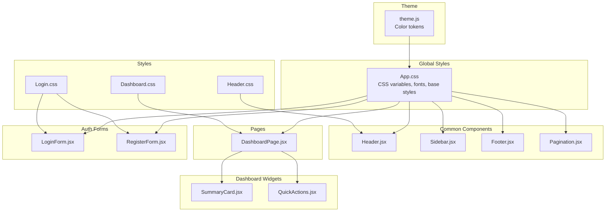
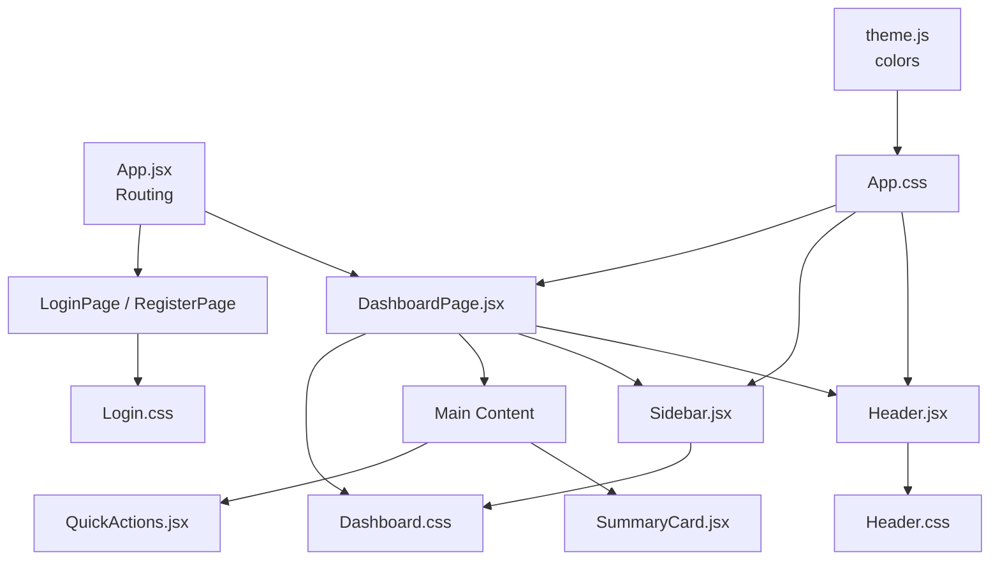
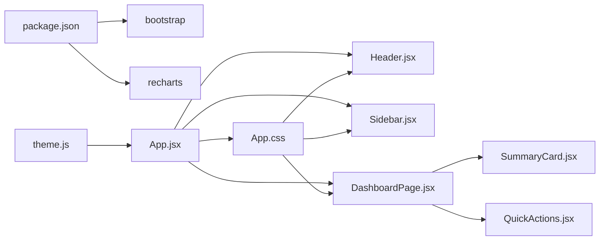

# UI Components and Styling

<cite>
**Referenced Files in This Document**
- [theme.js](file://MoneyHey/src/theme/theme.js)
- [App.jsx](file://MoneyHey/src/App.jsx)
- [App.css](file://MoneyHey/src/App.css)
- [Header.jsx](file://MoneyHey/src/components/common/Header.jsx)
- [Footer.jsx](file://MoneyHey/src/components/common/Footer.jsx)
- [Sidebar.jsx](file://MoneyHey/src/components/common/Sidebar.jsx)
- [Pagination.jsx](file://MoneyHey/src/components/common/Pagination.jsx)
- [DashboardPage.jsx](file://MoneyHey/src/pages/DashboardPage.jsx)
- [QuickActions.jsx](file://MoneyHey/src/components/dashboard/QuickActions.jsx)
- [SummaryCard.jsx](file://MoneyHey/src/components/dashboard/SummaryCard.jsx)
- [Dashboard.css](file://MoneyHey/src/css/Dashboard.css)
- [Header.css](file://MoneyHey/src/css/Header.css)
- [Login.css](file://MoneyHey/src/css/Login.css)
- [LoginForm.jsx](file://MoneyHey/src/components/auth/LoginForm.jsx)
- [RegisterForm.jsx](file://MoneyHey/src/components/auth/RegisterForm.jsx)
- [package.json](file://MoneyHey/package.json)
</cite>

## Table of Contents
1. [Introduction](#introduction)
2. [Project Structure](#project-structure)
3. [Core Components](#core-components)
4. [Architecture Overview](#architecture-overview)
5. [Detailed Component Analysis](#detailed-component-analysis)
6. [Dependency Analysis](#dependency-analysis)
7. [Performance Considerations](#performance-considerations)
8. [Troubleshooting Guide](#troubleshooting-guide)
9. [Conclusion](#conclusion)
10. [Appendices](#appendices)

## Introduction
This document describes the UI components and styling architecture of MoneyHey. It covers the component library structure, reusable UI elements, responsive design, theme system, Bootstrap integration, and CSS customization options. It also explains component composition patterns, prop interfaces, styling best practices, and provides examples for customization, theme modification, and responsive breakpoint handling. Accessibility, cross-browser compatibility, and performance optimization are addressed throughout.

## Project Structure
MoneyHey follows a feature-based component organization with a dedicated theme module and CSS files scoped per component/page. The application integrates Bootstrap utilities and Recharts for charts, while maintaining a custom CSS layer for branding and layout.

**Diagram sources**
- [theme.js:1-53](file://MoneyHey/src/theme/theme.js#L1-L53)
- [App.css:1-32](file://MoneyHey/src/App.css#L1-L32)
- [Header.jsx:1-80](file://MoneyHey/src/components/common/Header.jsx#L1-L80)
- [Sidebar.jsx:1-41](file://MoneyHey/src/components/common/Sidebar.jsx#L1-L41)
- [Footer.jsx:1-18](file://MoneyHey/src/components/common/Footer.jsx#L1-L18)
- [Pagination.jsx:1-31](file://MoneyHey/src/components/common/Pagination.jsx#L1-L31)
- [DashboardPage.jsx:1-94](file://MoneyHey/src/pages/DashboardPage.jsx#L1-L94)
- [SummaryCard.jsx:1-22](file://MoneyHey/src/components/dashboard/SummaryCard.jsx#L1-L22)
- [QuickActions.jsx:1-27](file://MoneyHey/src/components/dashboard/QuickActions.jsx#L1-L27)
- [LoginForm.jsx:1-137](file://MoneyHey/src/components/auth/LoginForm.jsx#L1-L137)
- [RegisterForm.jsx:1-115](file://MoneyHey/src/components/auth/RegisterForm.jsx#L1-L115)
- [Dashboard.css:1-335](file://MoneyHey/src/css/Dashboard.css#L1-L335)
- [Header.css:1-120](file://MoneyHey/src/css/Header.css#L1-L120)
- [Login.css:1-14](file://MoneyHey/src/css/Login.css#L1-L14)

**Section sources**
- [App.jsx:1-43](file://MoneyHey/src/App.jsx#L1-L43)
- [package.json:12-19](file://MoneyHey/package.json#L12-L19)

## Core Components
Reusable UI building blocks used across the application:

- Header: Top navigation with menu toggle, branding, and user dropdown.
- Sidebar: Collapsible navigation drawer with active state highlighting.
- Footer: Simple legal links and copyright.
- Pagination: Bootstrap-powered pagination controls.
- SummaryCard: Metric card with icon, value, and trend indicator.
- QuickActions: Action buttons with themed icons and hover effects.
- LoginForm and RegisterForm: Form components with validation and social login placeholders.

Prop interfaces (descriptive):
- Header: onToggleSidebar(), onLogout()
- Sidebar: open (boolean)
- SummaryCard: label, value, change, positive (boolean), icon, color
- QuickActions: none (uses internal constants)
- Pagination: currentPage, totalPages, onPageChange()

Styling best practices:
- Prefer CSS custom properties for theming (--emerald-*).
- Use Bootstrap utility classes for layout and spacing.
- Keep component-specific styles in dedicated CSS files.
- Apply media queries for responsive breakpoints.

**Section sources**
- [Header.jsx:5-79](file://MoneyHey/src/components/common/Header.jsx#L5-L79)
- [Sidebar.jsx:3-40](file://MoneyHey/src/components/common/Sidebar.jsx#L3-L40)
- [Footer.jsx:4-15](file://MoneyHey/src/components/common/Footer.jsx#L4-L15)
- [Pagination.jsx:3-30](file://MoneyHey/src/components/common/Pagination.jsx#L3-L30)
- [SummaryCard.jsx:3-19](file://MoneyHey/src/components/dashboard/SummaryCard.jsx#L3-L19)
- [QuickActions.jsx:10-24](file://MoneyHey/src/components/dashboard/QuickActions.jsx#L10-L24)
- [LoginForm.jsx:6-68](file://MoneyHey/src/components/auth/LoginForm.jsx#L6-L68)
- [RegisterForm.jsx:4-48](file://MoneyHey/src/components/auth/RegisterForm.jsx#L4-L48)

## Architecture Overview
The UI architecture centers around a shared theme and global styles, with page-level containers composing common components and widgets. Bootstrap utilities and CSS custom properties unify layout and theming.

**Diagram sources**
- [App.jsx:13-40](file://MoneyHey/src/App.jsx#L13-L40)
- [DashboardPage.jsx:15-91](file://MoneyHey/src/pages/DashboardPage.jsx#L15-L91)
- [Header.jsx:24-75](file://MoneyHey/src/components/common/Header.jsx#L24-L75)
- [Sidebar.jsx:23-38](file://MoneyHey/src/components/common/Sidebar.jsx#L23-L38)
- [Dashboard.css:1-100](file://MoneyHey/src/css/Dashboard.css#L1-L100)
- [Header.css:10-19](file://MoneyHey/src/css/Header.css#L10-L19)
- [Login.css:1-14](file://MoneyHey/src/css/Login.css#L1-L14)
- [theme.js:1-53](file://MoneyHey/src/theme/theme.js#L1-L53)
- [App.css:5-32](file://MoneyHey/src/App.css#L5-L32)

## Detailed Component Analysis

### Theme System and CSS Variables
- CSS variables define brand tokens in :root and are consumed by components and pages.
- The theme module exports color tokens for programmatic use (e.g., chart colors).
- Components reference variables for consistent theming across light/dark modes if extended.

Customization examples:
- Modify --emerald-primary to change primary branding.
- Adjust --surface-bg to alter base background.
- Override component-specific variables (e.g., --qa-color) for quick-action buttons.

**Section sources**
- [App.css:5-32](file://MoneyHey/src/App.css#L5-L32)
- [theme.js:1-53](file://MoneyHey/src/theme/theme.js#L1-L53)
- [QuickActions.jsx:17-319](file://MoneyHey/src/components/dashboard/QuickActions.jsx#L17-L319)
- [Dashboard.css:169-172](file://MoneyHey/src/css/Dashboard.css#L169-L172)

### Header Component
Responsibilities:
- Toggle sidebar via onToggleSidebar().
- Display user avatar or initials.
- Show user dropdown with logout action.
- Uses material-symbols-outlined for icons.
- Integrates with Bootstrap utility classes for alignment and spacing.

Props:
- onToggleSidebar(): Function
- onLogout(): Function

Accessibility:
- Avatar button is focusable; dropdown toggled via click.
- Social buttons include aria-label attributes.

Responsive behavior:
- Uses d-flex, gap utilities and d-none/d-md-block for visibility changes.

**Section sources**
- [Header.jsx:5-79](file://MoneyHey/src/components/common/Header.jsx#L5-L79)
- [Header.css:10-19](file://MoneyHey/src/css/Header.css#L10-L19)
- [Header.css:71-91](file://MoneyHey/src/css/Header.css#L71-L91)
- [Header.css:94-120](file://MoneyHey/src/css/Header.css#L94-L120)

### Sidebar Component
Responsibilities:
- Renders navigation items with icons.
- Highlights active item based on current route.
- Navigates using react-router-dom.

Props:
- open: Boolean controlling expanded/collapsed state.

Responsive behavior:
- On small screens, sidebar becomes fixed-position with backdrop overlay and constrained width.

**Section sources**
- [Sidebar.jsx:3-40](file://MoneyHey/src/components/common/Sidebar.jsx#L3-L40)
- [Dashboard.css:16-51](file://MoneyHey/src/css/Dashboard.css#L16-L51)

### Footer Component
Responsibilities:
- Displays copyright and legal links.
- Uses small text and muted colors for subtle presentation.

Props:
- None

**Section sources**
- [Footer.jsx:4-15](file://MoneyHey/src/components/common/Footer.jsx#L4-L15)

### Pagination Component
Responsibilities:
- Renders previous/next and numbered page buttons.
- Disables edges when on first/last page.
- Calls onPageChange with integer page number.

Props:
- currentPage: Number
- totalPages: Number
- onPageChange(page): Function

**Section sources**
- [Pagination.jsx:3-30](file://MoneyHey/src/components/common/Pagination.jsx#L3-L30)

### SummaryCard Component
Responsibilities:
- Displays metric label, value, and trend direction.
- Applies color variants via class modifiers.
- Uses material-symbols-outlined for icons.

Props:
- label: String
- value: String
- change: String
- positive: Boolean
- icon: String (material-symbols icon name)
- color: String (e.g., emerald)

**Section sources**
- [SummaryCard.jsx:3-19](file://MoneyHey/src/components/dashboard/SummaryCard.jsx#L3-L19)
- [Dashboard.css:136-206](file://MoneyHey/src/css/Dashboard.css#L136-L206)

### QuickActions Component
Responsibilities:
- Provides quick-access buttons with themed colors.
- Uses CSS variable --qa-color to customize per action.

Props:
- None (uses internal constants)

**Section sources**
- [QuickActions.jsx:10-24](file://MoneyHey/src/components/dashboard/QuickActions.jsx#L10-L24)
- [Dashboard.css:297-325](file://MoneyHey/src/css/Dashboard.css#L297-L325)

### LoginForm Component
Responsibilities:
- Handles email/password input with client-side validation.
- Submits credentials and triggers authentication flow.
- Integrates with Bootstrap form utilities and custom form-control styles.

Props:
- None

Validation highlights:
- Real-time clearing of errors on input.
- Focus management after validation failures.

**Section sources**
- [LoginForm.jsx:6-68](file://MoneyHey/src/components/auth/LoginForm.jsx#L6-L68)
- [Login.css:1-14](file://MoneyHey/src/css/Login.css#L1-L14)

### RegisterForm Component
Responsibilities:
- Collects email, password, and confirm password.
- Validates inputs and shows feedback.
- Placeholder for social registration buttons.

Props:
- None

**Section sources**
- [RegisterForm.jsx:4-48](file://MoneyHey/src/components/auth/RegisterForm.jsx#L4-L48)

### DashboardPage Composition
Responsibilities:
- Orchestrates Header, Sidebar, and main content area.
- Manages sidebar expansion state and applies layout classes.
- Composes SummaryCard and QuickActions widgets.

Props:
- onLogout(): Function

Layout classes:
- dashboard-shell, dashboard-body, dashboard-main, sidebar-expanded/sidebar-collapsed.

**Section sources**
- [DashboardPage.jsx:15-91](file://MoneyHey/src/pages/DashboardPage.jsx#L15-L91)
- [Dashboard.css:2-101](file://MoneyHey/src/css/Dashboard.css#L2-L101)

## Dependency Analysis
Bootstrap is included as a dependency and is used extensively for layout and form utilities. CSS custom properties bridge theme tokens with component styles. Charting is handled by Recharts for dashboard visuals.

**Diagram sources**
- [package.json:12-19](file://MoneyHey/package.json#L12-L19)
- [App.jsx:13-40](file://MoneyHey/src/App.jsx#L13-L40)
- [DashboardPage.jsx:15-91](file://MoneyHey/src/pages/DashboardPage.jsx#L15-L91)
- [Header.jsx:24-75](file://MoneyHey/src/components/common/Header.jsx#L24-L75)
- [Sidebar.jsx:23-38](file://MoneyHey/src/components/common/Sidebar.jsx#L23-L38)
- [Dashboard.css:1-100](file://MoneyHey/src/css/Dashboard.css#L1-L100)
- [theme.js:1-53](file://MoneyHey/src/theme/theme.js#L1-L53)
- [App.css:5-32](file://MoneyHey/src/App.css#L5-L32)

**Section sources**
- [package.json:12-19](file://MoneyHey/package.json#L12-L19)

## Performance Considerations
- Minimize inline styles; prefer CSS custom properties and component classes.
- Use CSS transitions sparingly; keep durations short for smooth UX without jank.
- Avoid excessive repaints by animating transform and opacity where possible.
- Lazy-load heavy chart components only when needed.
- Consolidate CSS into fewer files to reduce HTTP requests; leverage Vite’s bundling.

[No sources needed since this section provides general guidance]

## Troubleshooting Guide
Common styling issues and resolutions:
- Sidebar overlaps content on small screens: Ensure sidebar-open class is applied and backdrop is present when expanded.
- Header dropdown not visible: Verify z-index stacking context and that dropdown is rendered conditionally.
- Pagination disabled states: Confirm currentPage and totalPages are integers and onPageChange receives a number.
- Form validation feedback: Clear error messages on input; ensure is-invalid class is toggled correctly.
- Responsive breakpoints: Check media queries in Dashboard.css and Login.css for max-width thresholds.

Accessibility checks:
- Buttons and links have appropriate focus states.
- Icons have meaningful aria-labels for social buttons.
- Dropdown menus are keyboard navigable and focus-trapped when open.

Cross-browser compatibility:
- Use unprefixed CSS properties where possible; test on latest Chrome, Firefox, Safari, Edge.
- Validate material-symbols rendering across browsers; provide fallbacks if needed.

**Section sources**
- [Dashboard.css:31-51](file://MoneyHey/src/css/Dashboard.css#L31-L51)
- [Header.css:94-120](file://MoneyHey/src/css/Header.css#L94-L120)
- [Pagination.jsx:8-24](file://MoneyHey/src/components/common/Pagination.jsx#L8-L24)
- [LoginForm.jsx:33-68](file://MoneyHey/src/components/auth/LoginForm.jsx#L33-L68)
- [Login.css:8-14](file://MoneyHey/src/css/Login.css#L8-L14)

## Conclusion
MoneyHey’s UI system combines a centralized theme and CSS variables with reusable components and Bootstrap utilities. The dashboard layout composes common elements with widget components, while forms adhere to validation and accessibility patterns. The responsive design leverages media queries and Bootstrap’s grid, and customization is achieved primarily through CSS variables and component props.

[No sources needed since this section summarizes without analyzing specific files]

## Appendices

### Responsive Breakpoints and Patterns
- Small breakpoint: max-width 767px (mobile-first adjustments).
- Medium breakpoint: min-width 768px (tablet/desktop enhancements).
- Examples:
  - Sidebar transforms to fixed drawer on small screens.
  - Summary cards switch to single-column layout on small screens.
  - Login card adapts height and shadows for mobile.

**Section sources**
- [Dashboard.css:31-51](file://MoneyHey/src/css/Dashboard.css#L31-L51)
- [Dashboard.css:327-335](file://MoneyHey/src/css/Dashboard.css#L327-L335)
- [Login.css:8-14](file://MoneyHey/src/css/Login.css#L8-L14)

### Component Composition Patterns
- Container components (e.g., DashboardPage) orchestrate children and pass props.
- Presentational components (e.g., SummaryCard, QuickActions) are data-driven and styled.
- Utility components (e.g., Pagination) encapsulate behavior and render UI.

**Section sources**
- [DashboardPage.jsx:15-91](file://MoneyHey/src/pages/DashboardPage.jsx#L15-L91)
- [SummaryCard.jsx:3-19](file://MoneyHey/src/components/dashboard/SummaryCard.jsx#L3-L19)
- [QuickActions.jsx:10-24](file://MoneyHey/src/components/dashboard/QuickActions.jsx#L10-L24)
- [Pagination.jsx:3-30](file://MoneyHey/src/components/common/Pagination.jsx#L3-L30)