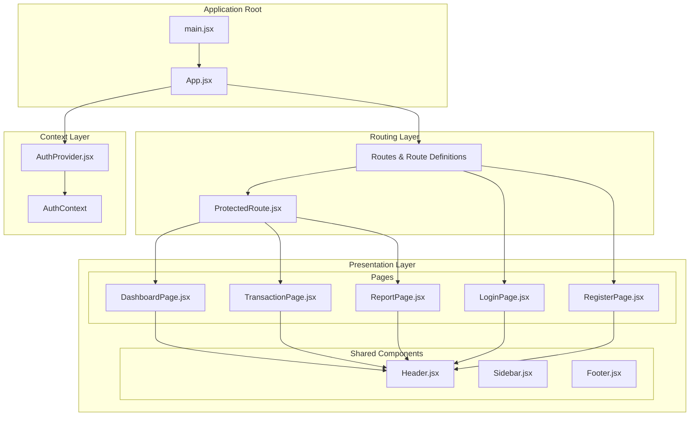
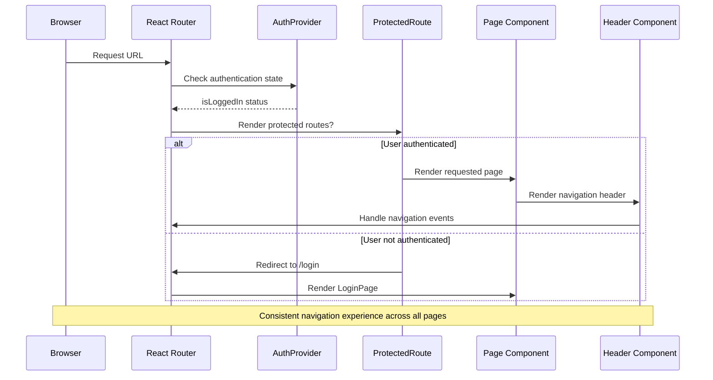
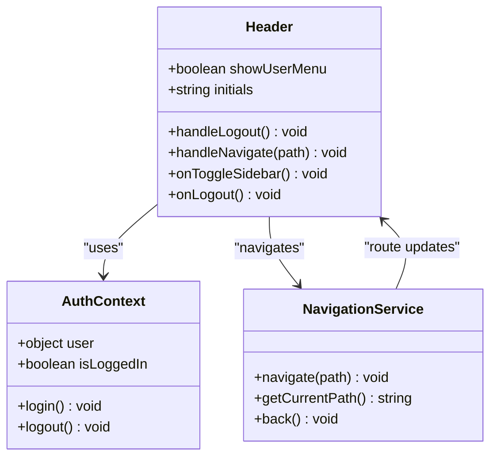
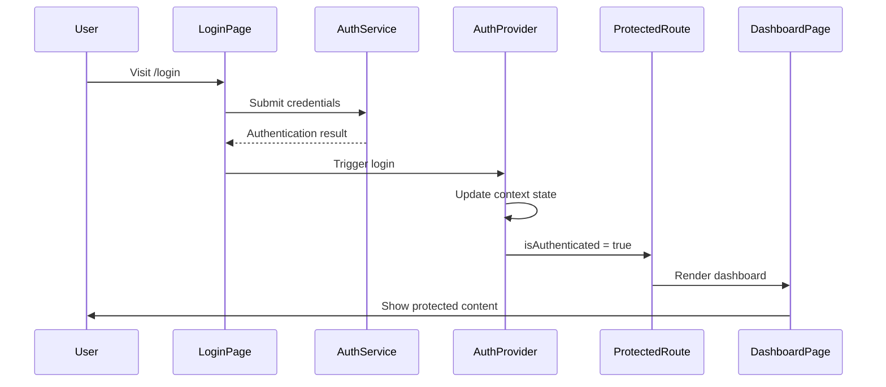
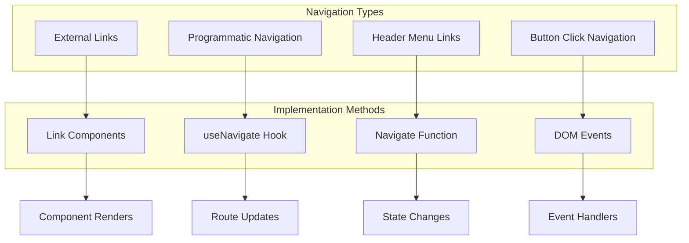
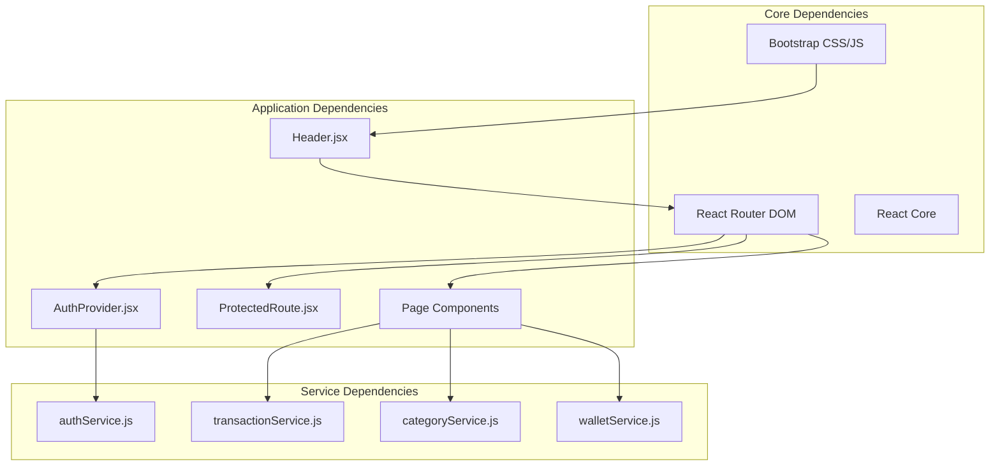

# Screen Flow and Navigation Documentation

<cite>
**Referenced Files in This Document**
- [App.jsx](file://src/App.jsx)
- [main.jsx](file://src/main.jsx)
- [DashboardPage.jsx](file://src/presentation/pages/DashboardPage.jsx)
- [LoginPage.jsx](file://src/presentation/pages/LoginPage.jsx)
- [RegisterPage.jsx](file://src/presentation/pages/RegisterPage.jsx)
- [TransactionPage.jsx](file://src/presentation/pages/TransactionPage.jsx)
- [ReportPage.jsx](file://src/presentation/pages/ReportPage.jsx)
- [Header.jsx](file://src/presentation/components/common/Header.jsx)
- [ProtectedRoute.jsx](file://src/presentation/components/auth/ProtectedRoute.jsx)
- [AuthProvider.jsx](file://src/presentation/context/AuthProvider.jsx)
</cite>

## Table of Contents
1. [Introduction](#introduction)
2. [Project Structure](#project-structure)
3. [Core Components](#core-components)
4. [Architecture Overview](#architecture-overview)
5. [Detailed Component Analysis](#detailed-component-analysis)
6. [Navigation Flow Analysis](#navigation-flow-analysis)
7. [Dependency Analysis](#dependency-analysis)
8. [Performance Considerations](#performance-considerations)
9. [Troubleshooting Guide](#troubleshooting-guide)
10. [Conclusion](#conclusion)

## Introduction

This document provides comprehensive documentation for the screen flow and navigation system of the MoneyHey financial management application. The application follows a modern React-based architecture with React Router for client-side navigation, implementing protected routes for authenticated users and structured page components for different functional areas.

The navigation system is designed around four primary user flows: authentication (login/register), dashboard overview, transaction management, and reporting. Each flow maintains consistent navigation patterns through shared header components and sidebar navigation.

## Project Structure

The MoneyHey application follows a presentation-layer architecture pattern with clear separation between routing, page components, and shared UI elements:



**Diagram sources**
- [main.jsx:1-20](file://src/main.jsx#L1-L20)
- [App.jsx:17-62](file://src/App.jsx#L17-L62)
- [AuthProvider.jsx:1-84](file://src/presentation/context/AuthProvider.jsx#L1-L84)

**Section sources**
- [main.jsx:1-20](file://src/main.jsx#L1-L20)
- [App.jsx:17-62](file://src/App.jsx#L17-L62)

## Core Components

The navigation system consists of several key components working together to provide seamless user experience:

### Authentication Context Provider
The AuthProvider component manages user authentication state across the entire application, providing centralized authentication logic and user data management.

### Protected Route System
The ProtectedRoute component ensures that only authenticated users can access premium pages while allowing anonymous users to access public pages like login and registration.

### Page Components
Each page component serves as a container for specific functionality:
- DashboardPage: Main overview with financial summaries
- TransactionPage: Comprehensive transaction management
- ReportPage: Financial analytics and charts
- LoginPage/RegisterPage: Authentication interfaces

**Section sources**
- [AuthProvider.jsx:7-82](file://src/presentation/context/AuthProvider.jsx#L7-L82)
- [ProtectedRoute.jsx:3-5](file://src/presentation/components/auth/ProtectedRoute.jsx#L3-L5)
- [DashboardPage.jsx:19-151](file://src/presentation/pages/DashboardPage.jsx#L19-L151)
- [TransactionPage.jsx:30-330](file://src/presentation/pages/TransactionPage.jsx#L30-L330)
- [ReportPage.jsx:37-186](file://src/presentation/pages/ReportPage.jsx#L37-L186)

## Architecture Overview

The navigation architecture implements a hierarchical structure with clear separation of concerns:



**Diagram sources**
- [App.jsx:35-61](file://src/App.jsx#L35-L61)
- [AuthProvider.jsx:12-46](file://src/presentation/context/AuthProvider.jsx#L12-L46)
- [ProtectedRoute.jsx:3-5](file://src/presentation/components/auth/ProtectedRoute.jsx#L3-L5)

## Detailed Component Analysis

### Application Bootstrap and Routing Configuration

The application bootstraps through main.jsx which sets up the React Router environment with proper context providers:

```mermaid
flowchart TD
Start([Application Start]) --> BrowserRouter[BrowserRouter Setup]
BrowserRouter --> AuthProvider[AuthProvider Initialization]
AuthProvider --> CheckUser[getUser() Call]
CheckUser --> HasUser{User Exists?}
HasUser --> |Yes| GetProfile[getProfile() Call]
HasUser --> |No| SetAnonymous[Set Anonymous State]
GetProfile --> BuildUser[Build User Object]
BuildUser --> SetLoggedIn[Set isLoggedIn = true]
SetAnonymous --> Ready[Ready State]
SetLoggedIn --> Ready
Ready --> App[App Component Mount]
App --> Routes[Route Configuration]
```

**Diagram sources**
- [main.jsx:10-19](file://src/main.jsx#L10-L19)
- [AuthProvider.jsx:12-46](file://src/presentation/context/AuthProvider.jsx#L12-L46)

**Section sources**
- [main.jsx:10-19](file://src/main.jsx#L10-L19)
- [AuthProvider.jsx:12-46](file://src/presentation/context/AuthProvider.jsx#L12-L46)

### Route Configuration and Navigation Patterns

The App.jsx component defines the complete routing structure with clear navigation patterns:

```mermaid
graph LR
subgraph "Public Routes"
Login[/login -> LoginPage]
Register[/register -> RegisterPage]
Explore[/explore -> ExplorePage]
end
subgraph "Protected Routes"
Dashboard[/dashboard -> DashboardPage]
Transactions[/transactions -> TransactionPage]
Reports[/reports -> ReportPage]
Settings[/settings -> SettingsPage]
Budget[/budget -> BudgetPage]
Profile[/profile -> ProfilePage]
end
subgraph "Default Routes"
Root[/ -> Auto redirect]
end
Root --> LoginCheck{Is Logged In?}
LoginCheck --> |Yes| Dashboard
LoginCheck --> |No| Login
Login --> Dashboard
Register --> Dashboard
```

**Diagram sources**
- [App.jsx:35-61](file://src/App.jsx#L35-L61)

**Section sources**
- [App.jsx:35-61](file://src/App.jsx#L35-L61)

### Header Navigation Component

The Header component provides consistent navigation across all authenticated pages:



**Diagram sources**
- [Header.jsx:6-115](file://src/presentation/components/common/Header.jsx#L6-L115)

**Section sources**
- [Header.jsx:6-115](file://src/presentation/components/common/Header.jsx#L6-L115)

### Page-Specific Navigation Patterns

Each page implements specific navigation patterns tailored to its functionality:

#### Dashboard Navigation Pattern
The DashboardPage demonstrates primary navigation flow with quick action buttons and sidebar integration.

#### Transaction Management Navigation
The TransactionPage implements complex filtering, pagination, and modal-based CRUD operations with sophisticated navigation patterns.

#### Report Navigation Pattern
The ReportPage focuses on data visualization with summary cards and chart navigation.

**Section sources**
- [DashboardPage.jsx:96-147](file://src/presentation/pages/DashboardPage.jsx#L96-L147)
- [TransactionPage.jsx:260-326](file://src/presentation/pages/TransactionPage.jsx#L260-L326)
- [ReportPage.jsx:104-181](file://src/presentation/pages/ReportPage.jsx#L104-L181)

## Navigation Flow Analysis

### Authentication Flow

The authentication flow follows a secure pattern ensuring users cannot access protected routes without proper authentication:



**Diagram sources**
- [LoginPage.jsx:8-53](file://src/presentation/pages/LoginPage.jsx#L8-L53)
- [AuthProvider.jsx:48-63](file://src/presentation/context/AuthProvider.jsx#L48-L63)
- [ProtectedRoute.jsx:3-5](file://src/presentation/components/auth/ProtectedRoute.jsx#L3-L5)

### Internal Navigation Patterns

Internal navigation within the application follows consistent patterns:



**Diagram sources**
- [DashboardPage.jsx:24-25](file://src/presentation/pages/DashboardPage.jsx#L24-L25)
- [Header.jsx:8-28](file://src/presentation/components/common/Header.jsx#L8-L28)
- [LoginPage.jsx:38-40](file://src/presentation/pages/LoginPage.jsx#L38-L40)

**Section sources**
- [DashboardPage.jsx:24-25](file://src/presentation/pages/DashboardPage.jsx#L24-L25)
- [Header.jsx:8-28](file://src/presentation/components/common/Header.jsx#L8-L28)
- [LoginPage.jsx:38-40](file://src/presentation/pages/LoginPage.jsx#L38-L40)

## Dependency Analysis

The navigation system exhibits clean dependency relationships with minimal coupling:



**Diagram sources**
- [App.jsx:2-13](file://src/App.jsx#L2-L13)
- [AuthProvider.jsx:2-4](file://src/presentation/context/AuthProvider.jsx#L2-L4)

**Section sources**
- [App.jsx:2-13](file://src/App.jsx#L2-L13)
- [AuthProvider.jsx:2-4](file://src/presentation/context/AuthProvider.jsx#L2-L4)

## Performance Considerations

The navigation system implements several performance optimizations:

### Lazy Loading Implementation
- Route-based lazy loading through React Router
- Conditional component rendering based on authentication state
- Efficient state management preventing unnecessary re-renders

### Memory Management
- Proper cleanup of effects and event listeners
- Controlled modal lifecycle management
- Optimized data fetching with cancellation support

### Bundle Optimization
- Tree-shaking enabled through modular imports
- Minimal dependencies reducing bundle size
- Dynamic imports for non-critical features

## Troubleshooting Guide

### Common Navigation Issues

#### Authentication State Synchronization
**Issue**: Users remain stuck on login despite successful authentication
**Solution**: Verify AuthProvider initialization and context propagation

#### Route Protection Failures
**Issue**: Unauthenticated users accessing protected routes
**Solution**: Check ProtectedRoute implementation and authentication state

#### Navigation Loop Issues
**Issue**: Infinite redirects between login and dashboard
**Solution**: Validate authentication state and route guards

#### State Management Problems
**Issue**: Navigation state not updating properly
**Solution**: Ensure proper context usage and state synchronization

**Section sources**
- [AuthProvider.jsx:12-46](file://src/presentation/context/AuthProvider.jsx#L12-L46)
- [ProtectedRoute.jsx:3-5](file://src/presentation/components/auth/ProtectedRoute.jsx#L3-L5)

## Conclusion

The MoneyHey navigation system demonstrates a well-architected approach to client-side routing with clear separation of concerns, robust authentication handling, and consistent user experience patterns. The implementation successfully balances functionality with maintainability through:

- Clean architectural separation between routing, context, and presentation layers
- Robust authentication state management with proper context providers
- Consistent navigation patterns across all page components
- Efficient performance optimizations and memory management
- Comprehensive error handling and troubleshooting mechanisms

The system provides a solid foundation for future enhancements while maintaining code quality and developer experience. The modular design allows for easy extension of navigation features and addition of new page components without disrupting existing functionality.