# Wallet Management

<cite>
**Referenced Files in This Document**
- [walletRepository.js](file://src/infrastructure/repositories/walletRepository.js)
- [wallet.js](file://src/domain/wallet.js)
- [walletCalculations.js](file://src/domain/wallets/walletCalculations.js)
- [transaction.js](file://src/domain/transaction.js)
- [transactionRepository.js](file://src/infrastructure/repositories/transactionRepository.js)
- [transactionService.js](file://src/application/services/transactionService.js)
- [walletService.js](file://src/application/services/walletService.js)
- [DashboardPage.jsx](file://src/pages/DashboardPage.jsx)
- [TransactionPage.jsx](file://src/pages/TransactionPage.jsx)
- [RecentTransactions.jsx](file://src/components/dashboard/RecentTransactions.jsx)
- [TransactionList.jsx](file://src/components/transaction/TransactionList.jsx)
- [AddTransactionModal.jsx](file://src/components/transaction/AddTransactionModal.jsx)
- [supabase.js](file://src/config/supabase.js)
</cite>

## Table of Contents
1. [Introduction](#introduction)
2. [Project Structure](#project-structure)
3. [Core Components](#core-components)
4. [Architecture Overview](#architecture-overview)
5. [Detailed Component Analysis](#detailed-component-analysis)
6. [Dependency Analysis](#dependency-analysis)
7. [Performance Considerations](#performance-considerations)
8. [Troubleshooting Guide](#troubleshooting-guide)
9. [Conclusion](#conclusion)

## Introduction
This document describes MoneyHey's wallet management system, focusing on multi-wallet support, wallet creation and configuration, balance calculation algorithms, and transaction-to-wallet associations. It also covers wallet-specific analytics, currency handling, balance synchronization across transactions, workflows for transfers and deletions, security considerations, data integrity, and performance optimization for large transaction histories.

## Project Structure
MoneyHey organizes wallet-related logic across three layers:
- Domain layer: Pure business logic for money amounts, transaction types, and wallet balance calculations.
- Application layer: Services orchestrating domain logic and coordinating with repositories.
- Infrastructure layer: Data access via Supabase client for wallets and transactions.

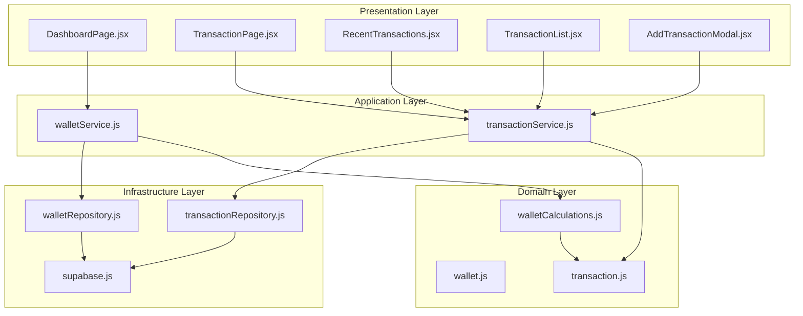

**Diagram sources**
- [walletRepository.js:1-107](file://src/infrastructure/repositories/walletRepository.js#L1-L107)
- [wallet.js:1-6](file://src/domain/wallet.js#L1-L6)
- [walletCalculations.js:1-26](file://src/domain/wallets/walletCalculations.js#L1-L26)
- [transaction.js:1-50](file://src/domain/transaction.js#L1-L50)
- [transactionRepository.js](file://src/infrastructure/repositories/transactionRepository.js)
- [transactionService.js](file://src/application/services/transactionService.js)
- [walletService.js](file://src/application/services/walletService.js)
- [DashboardPage.jsx](file://src/pages/DashboardPage.jsx)
- [TransactionPage.jsx](file://src/pages/TransactionPage.jsx)
- [RecentTransactions.jsx](file://src/components/dashboard/RecentTransactions.jsx)
- [TransactionList.jsx](file://src/components/transaction/TransactionList.jsx)
- [AddTransactionModal.jsx](file://src/components/transaction/AddTransactionModal.jsx)
- [supabase.js](file://src/config/supabase.js)

**Section sources**
- [walletRepository.js:1-107](file://src/infrastructure/repositories/walletRepository.js#L1-L107)
- [wallet.js:1-6](file://src/domain/wallet.js#L1-L6)
- [walletCalculations.js:1-26](file://src/domain/wallets/walletCalculations.js#L1-L26)
- [transaction.js:1-50](file://src/domain/transaction.js#L1-L50)
- [transactionRepository.js](file://src/infrastructure/repositories/transactionRepository.js)
- [transactionService.js](file://src/application/services/transactionService.js)
- [walletService.js](file://src/application/services/walletService.js)
- [DashboardPage.jsx](file://src/pages/DashboardPage.jsx)
- [TransactionPage.jsx](file://src/pages/TransactionPage.jsx)
- [RecentTransactions.jsx](file://src/components/dashboard/RecentTransactions.jsx)
- [TransactionList.jsx](file://src/components/transaction/TransactionList.jsx)
- [AddTransactionModal.jsx](file://src/components/transaction/AddTransactionModal.jsx)
- [supabase.js](file://src/config/supabase.js)

## Core Components
- Wallet domain model and balance aggregation:
  - Total balance calculation across wallets uses a safe numeric conversion and summation across wallet entries.
- Transaction domain model:
  - Defines transaction types, validates required fields, filters transactions, and computes signed amounts for balance deltas.
- Wallet calculations:
  - Provides functions to compute per-wallet balance deltas from transactions, aggregate deltas by wallet, and apply deltas to current balances.
- Wallet repository:
  - CRUD operations for wallets, including balance updates and deletions.
- Transaction repository:
  - Data access for transactions associated with wallets.
- Application services:
  - Orchestrate domain logic and repository calls for wallet and transaction operations.

**Section sources**
- [wallet.js:1-6](file://src/domain/wallet.js#L1-L6)
- [walletCalculations.js:1-26](file://src/domain/wallets/walletCalculations.js#L1-L26)
- [transaction.js:1-50](file://src/domain/transaction.js#L1-L50)
- [walletRepository.js:1-107](file://src/infrastructure/repositories/walletRepository.js#L1-L107)
- [transactionRepository.js](file://src/infrastructure/repositories/transactionRepository.js)
- [walletService.js](file://src/application/services/walletService.js)
- [transactionService.js](file://src/application/services/transactionService.js)

## Architecture Overview
The wallet management architecture follows a layered pattern:
- Presentation components trigger actions (e.g., adding transactions, viewing dashboards).
- Application services coordinate domain logic and repository access.
- Domain utilities encapsulate business rules for money amounts and balance computations.
- Infrastructure repositories abstract database operations using Supabase.

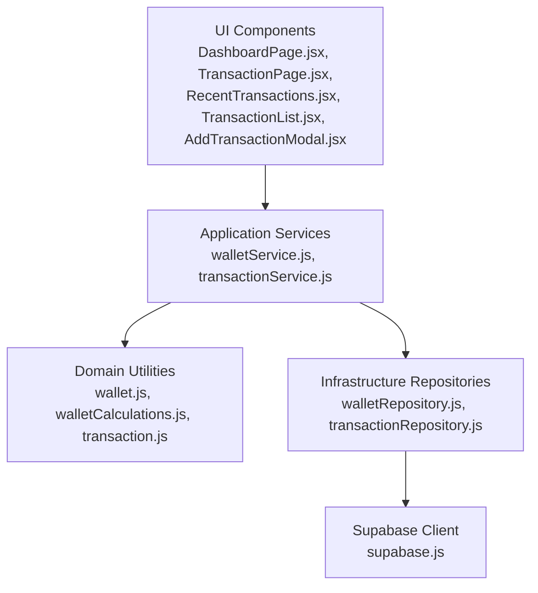

**Diagram sources**
- [DashboardPage.jsx](file://src/pages/DashboardPage.jsx)
- [TransactionPage.jsx](file://src/pages/TransactionPage.jsx)
- [RecentTransactions.jsx](file://src/components/dashboard/RecentTransactions.jsx)
- [TransactionList.jsx](file://src/components/transaction/TransactionList.jsx)
- [AddTransactionModal.jsx](file://src/components/transaction/AddTransactionModal.jsx)
- [walletService.js](file://src/application/services/walletService.js)
- [transactionService.js](file://src/application/services/transactionService.js)
- [wallet.js:1-6](file://src/domain/wallet.js#L1-L6)
- [walletCalculations.js:1-26](file://src/domain/wallets/walletCalculations.js#L1-L26)
- [transaction.js:1-50](file://src/domain/transaction.js#L1-L50)
- [walletRepository.js:1-107](file://src/infrastructure/repositories/walletRepository.js#L1-L107)
- [transactionRepository.js](file://src/infrastructure/repositories/transactionRepository.js)
- [supabase.js](file://src/config/supabase.js)

## Detailed Component Analysis

### Wallet Domain Model and Balance Aggregation
- Purpose: Provide safe numeric conversions and total balance computation across multiple wallets.
- Key behaviors:
  - Convert wallet balance values to numbers safely.
  - Sum balances across wallets to produce a total portfolio value.

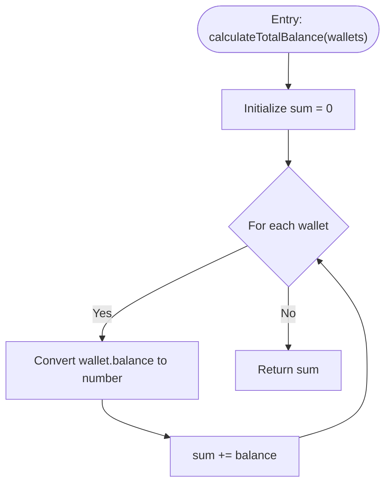

**Diagram sources**
- [wallet.js:1-6](file://src/domain/wallet.js#L1-L6)

**Section sources**
- [wallet.js:1-6](file://src/domain/wallet.js#L1-L6)

### Transaction Domain Model and Validation
- Purpose: Define transaction semantics, enforce business rules, and compute signed amounts for balance updates.
- Key behaviors:
  - Enumerates transaction types and validates inputs.
  - Ensures amount positivity, presence of wallet_id, category_id, and tx_date.
  - Computes signed amounts for income/expense scenarios.

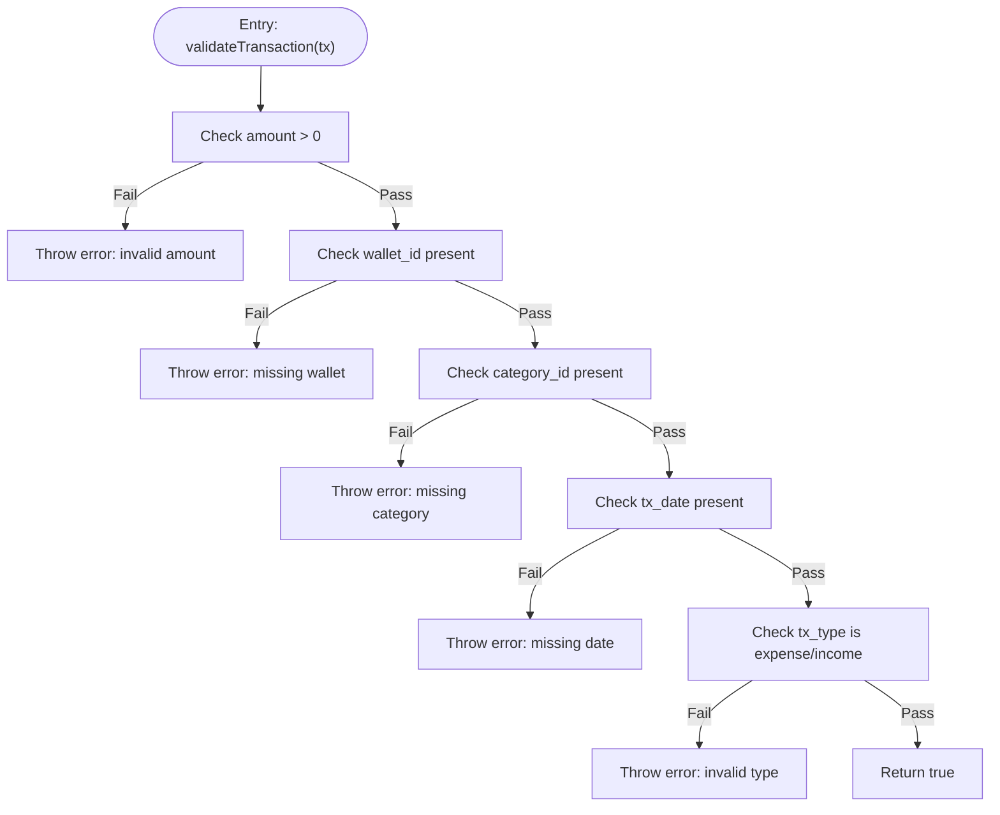

**Diagram sources**
- [transaction.js:15-32](file://src/domain/transaction.js#L15-L32)

**Section sources**
- [transaction.js:1-50](file://src/domain/transaction.js#L1-L50)

### Wallet Calculations and Delta Aggregation
- Purpose: Compute per-transaction balance deltas and aggregate them by wallet for batch reconciliation.
- Key behaviors:
  - Convert amounts to numbers safely.
  - Determine delta sign based on transaction type.
  - Build a Map of wallet_id to accumulated balance delta across transactions.
  - Apply a delta to a current balance.

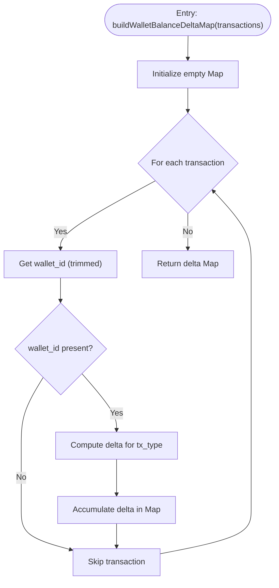

**Diagram sources**
- [walletCalculations.js:11-22](file://src/domain/wallets/walletCalculations.js#L11-L22)

**Section sources**
- [walletCalculations.js:1-26](file://src/domain/wallets/walletCalculations.js#L1-L26)

### Wallet Repository Operations
- Purpose: Encapsulate database interactions for wallets using Supabase.
- Key operations:
  - Fetch wallets by user or by ID.
  - Create, update, and delete wallets.
  - Update wallet balances atomically.

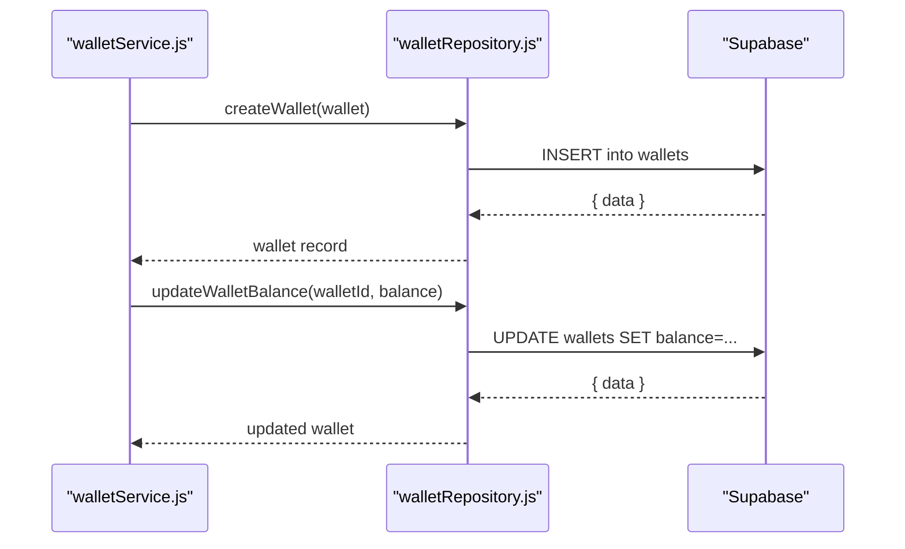

**Diagram sources**
- [walletRepository.js:49-94](file://src/infrastructure/repositories/walletRepository.js#L49-L94)
- [walletService.js](file://src/application/services/walletService.js)

**Section sources**
- [walletRepository.js:1-107](file://src/infrastructure/repositories/walletRepository.js#L1-L107)

### Transaction Repository and Association
- Purpose: Retrieve and manage transactions linked to wallets.
- Key operations:
  - Fetch transactions for wallet filtering and analytics.
  - Support pagination and filtering by date/category.

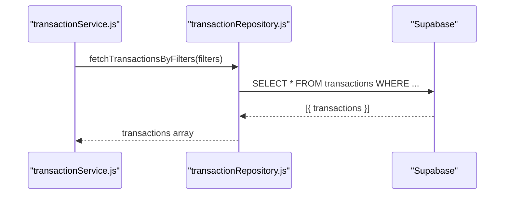

**Diagram sources**
- [transactionRepository.js](file://src/infrastructure/repositories/transactionRepository.js)
- [transactionService.js](file://src/application/services/transactionService.js)

**Section sources**
- [transactionRepository.js](file://src/infrastructure/repositories/transactionRepository.js)
- [transactionService.js](file://src/application/services/transactionService.js)

### Multi-Wallet Dashboards and Analytics
- Purpose: Present aggregated wallet totals and per-wallet analytics.
- Key behaviors:
  - Calculate total portfolio balance across wallets.
  - Render recent transactions per wallet.
  - Provide transaction lists filtered by wallet.

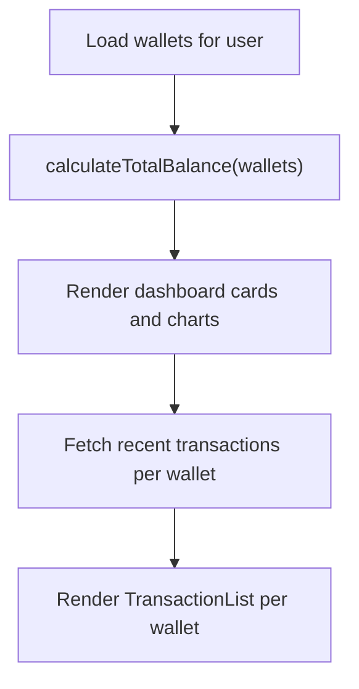

**Diagram sources**
- [wallet.js:1-6](file://src/domain/wallet.js#L1-L6)
- [DashboardPage.jsx](file://src/pages/DashboardPage.jsx)
- [RecentTransactions.jsx](file://src/components/dashboard/RecentTransactions.jsx)
- [TransactionList.jsx](file://src/components/transaction/TransactionList.jsx)

**Section sources**
- [wallet.js:1-6](file://src/domain/wallet.js#L1-L6)
- [DashboardPage.jsx](file://src/pages/DashboardPage.jsx)
- [RecentTransactions.jsx](file://src/components/dashboard/RecentTransactions.jsx)
- [TransactionList.jsx](file://src/components/transaction/TransactionList.jsx)

### Transfer Operations Across Wallets
- Purpose: Move funds between wallets while maintaining balance integrity.
- Workflow:
  - Validate source and destination wallets exist and user has access.
  - Validate transfer amount and ensure sufficient funds in source.
  - Create two transactions: one income for destination and one expense for source.
  - Recalculate affected wallet balances and persist changes.

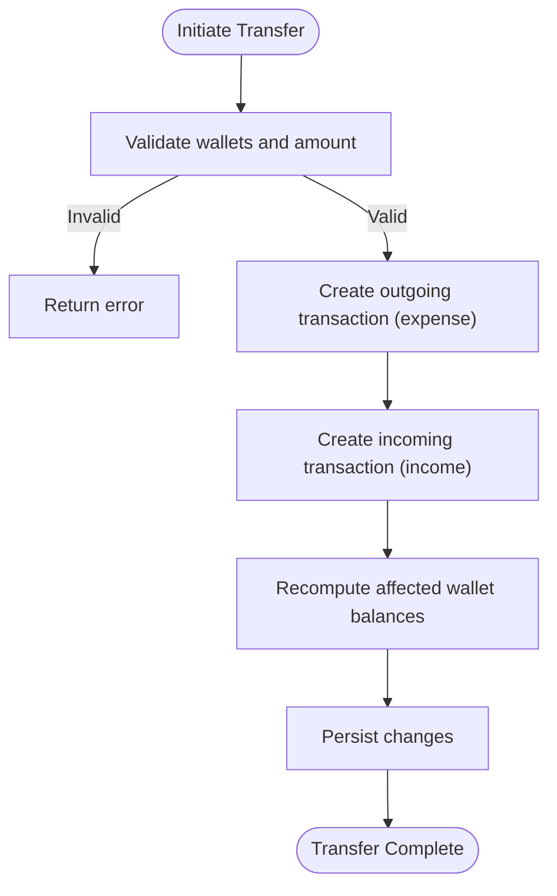

[No sources needed since this diagram shows conceptual workflow, not actual code structure]

### Wallet Deletion Procedures
- Purpose: Safely remove a wallet and reconcile dependent transactions.
- Workflow:
  - Verify wallet exists and belongs to the user.
  - Ensure wallet has zero balance before deletion.
  - Delete wallet record and cascade dependent transaction records if applicable.

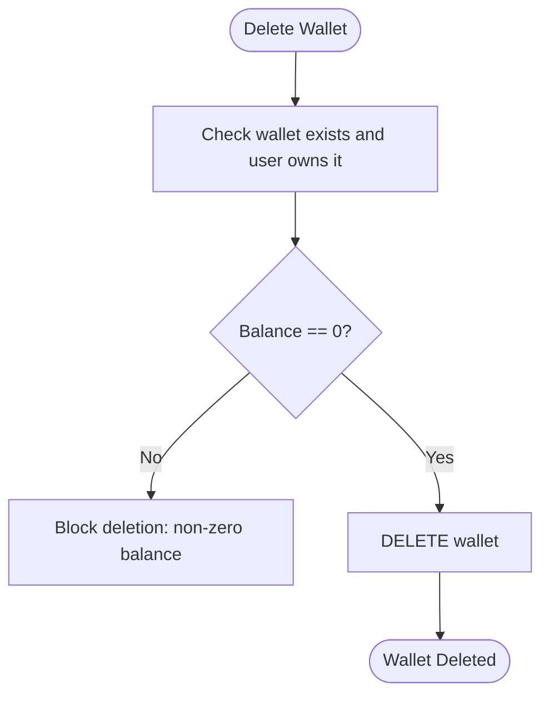

[No sources needed since this diagram shows conceptual workflow, not actual code structure]

## Dependency Analysis
- Cohesion:
  - Domain utilities are cohesive around money and balance computations.
  - Application services orchestrate domain and repository concerns cleanly.
- Coupling:
  - Application services depend on domain utilities and repositories.
  - Repositories depend on the Supabase client abstraction.
- External dependencies:
  - Supabase client provides database operations for wallets and transactions.

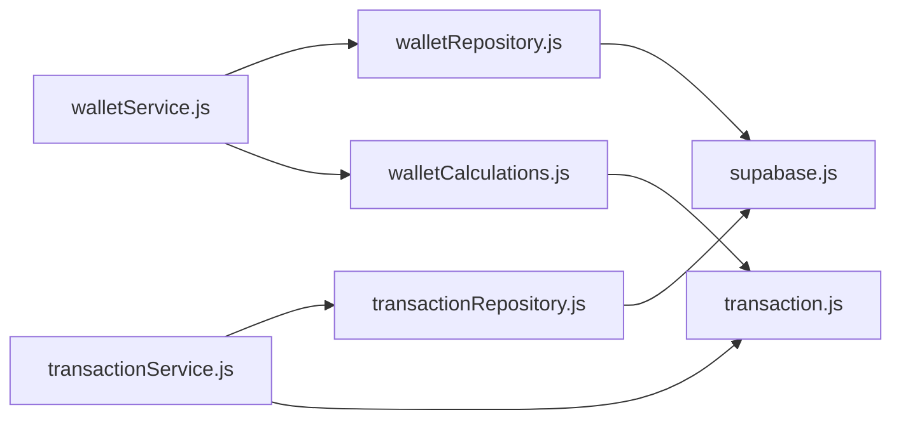

**Diagram sources**
- [walletService.js](file://src/application/services/walletService.js)
- [walletRepository.js:1-107](file://src/infrastructure/repositories/walletRepository.js#L1-L107)
- [transactionService.js](file://src/application/services/transactionService.js)
- [transactionRepository.js](file://src/infrastructure/repositories/transactionRepository.js)
- [walletCalculations.js:1-26](file://src/domain/wallets/walletCalculations.js#L1-L26)
- [transaction.js:1-50](file://src/domain/transaction.js#L1-L50)
- [supabase.js](file://src/config/supabase.js)

**Section sources**
- [walletService.js](file://src/application/services/walletService.js)
- [walletRepository.js:1-107](file://src/infrastructure/repositories/walletRepository.js#L1-L107)
- [transactionService.js](file://src/application/services/transactionService.js)
- [transactionRepository.js](file://src/infrastructure/repositories/transactionRepository.js)
- [walletCalculations.js:1-26](file://src/domain/wallets/walletCalculations.js#L1-L26)
- [transaction.js:1-50](file://src/domain/transaction.js#L1-L50)
- [supabase.js](file://src/config/supabase.js)

## Performance Considerations
- Batch reconciliation:
  - Use delta aggregation to minimize repeated database reads when recalculating balances after bulk transaction updates.
- Indexing and filtering:
  - Ensure database indexes on user_id, wallet_id, and tx_date to optimize transaction queries.
- Pagination:
  - Implement server-side pagination for transaction lists to avoid loading large histories into memory.
- Caching:
  - Cache recent wallet totals and frequently accessed transaction lists to reduce database load.
- Numeric safety:
  - Always convert amounts to numbers safely to prevent floating-point errors and invalid operations.

[No sources needed since this section provides general guidance]

## Troubleshooting Guide
- Validation errors:
  - Amount must be positive, wallet_id must be present, category_id required, tx_date required, and tx_type must be income or expense.
- Repository errors:
  - Wallet and transaction operations log and rethrow errors; check logs for SQL exceptions or constraint violations.
- Balance discrepancies:
  - Recompute deltas per wallet and compare against stored balances to detect inconsistencies.

**Section sources**
- [transaction.js:15-32](file://src/domain/transaction.js#L15-L32)
- [walletRepository.js:27-29](file://src/infrastructure/repositories/walletRepository.js#L27-L29)
- [walletRepository.js:41-43](file://src/infrastructure/repositories/walletRepository.js#L41-L43)
- [walletRepository.js:88-90](file://src/infrastructure/repositories/walletRepository.js#L88-L90)
- [walletRepository.js:102-104](file://src/infrastructure/repositories/walletRepository.js#L102-L104)

## Conclusion
MoneyHey’s wallet management system combines domain-driven design with practical application services and robust infrastructure access. The system supports multi-wallet portfolios, precise balance calculations, and transaction-to-wallet associations. By leveraging delta-based reconciliation, strict validation, and layered architecture, it ensures correctness, maintainability, and scalability for large transaction histories.