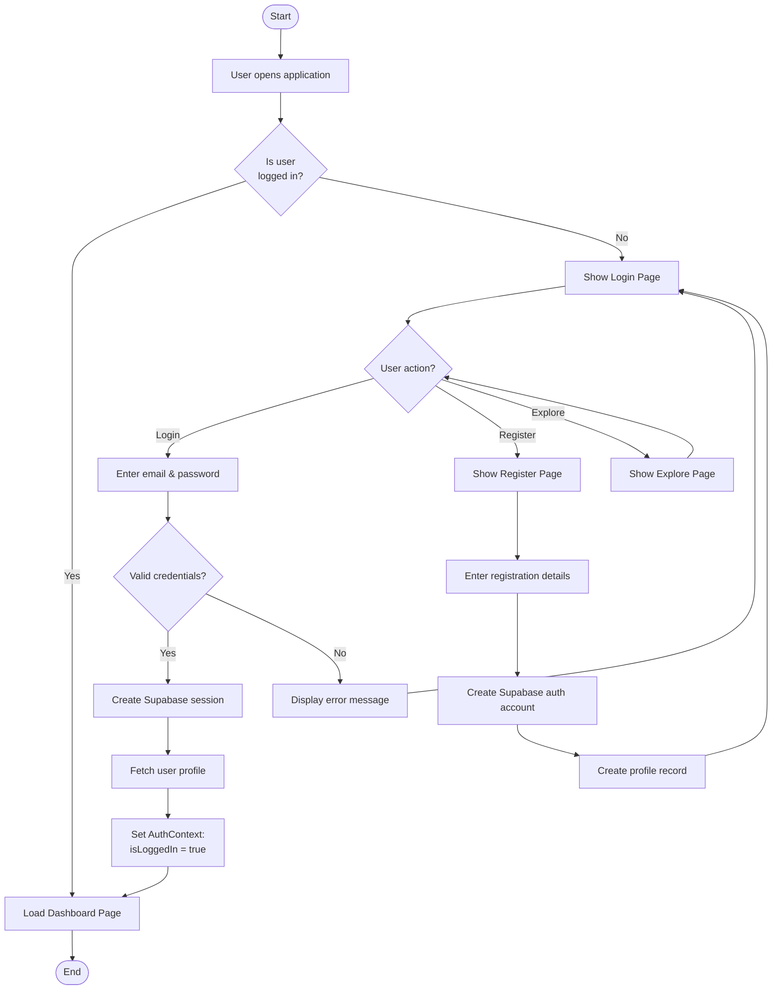
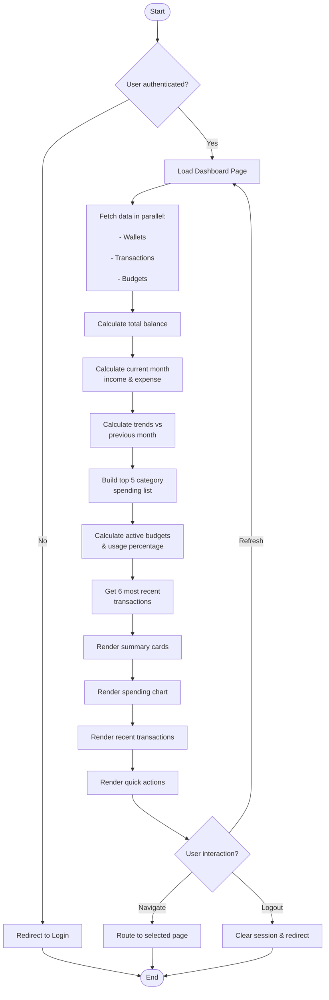
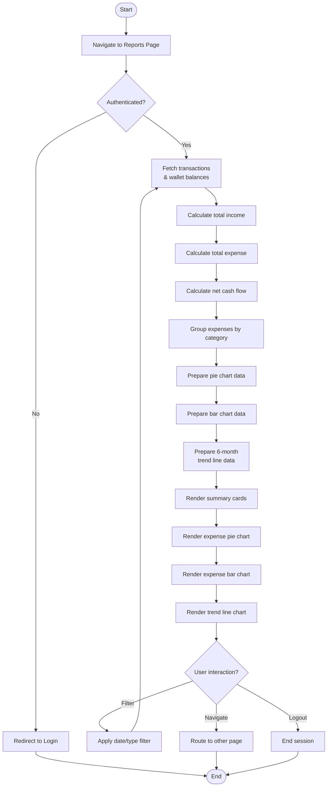
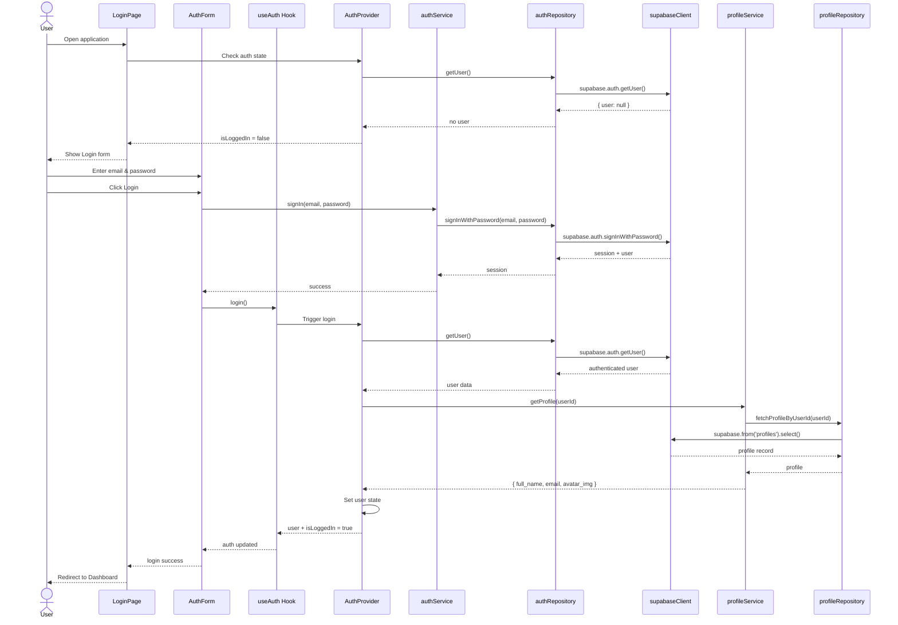
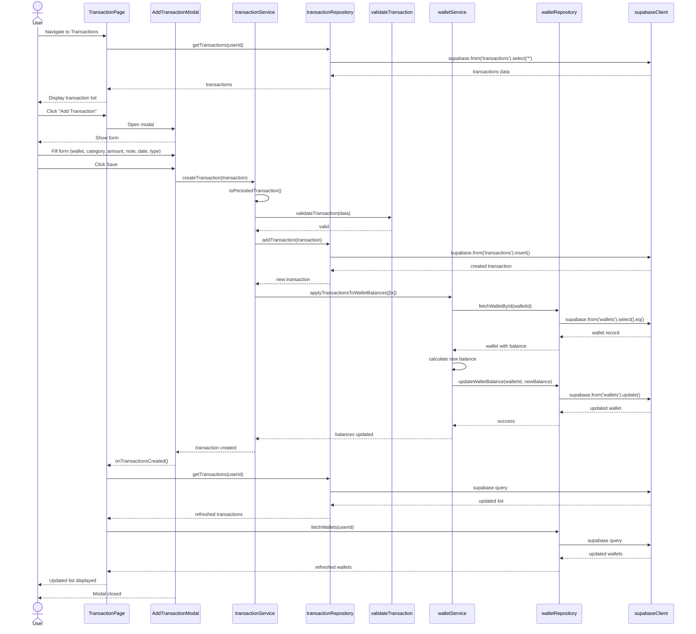
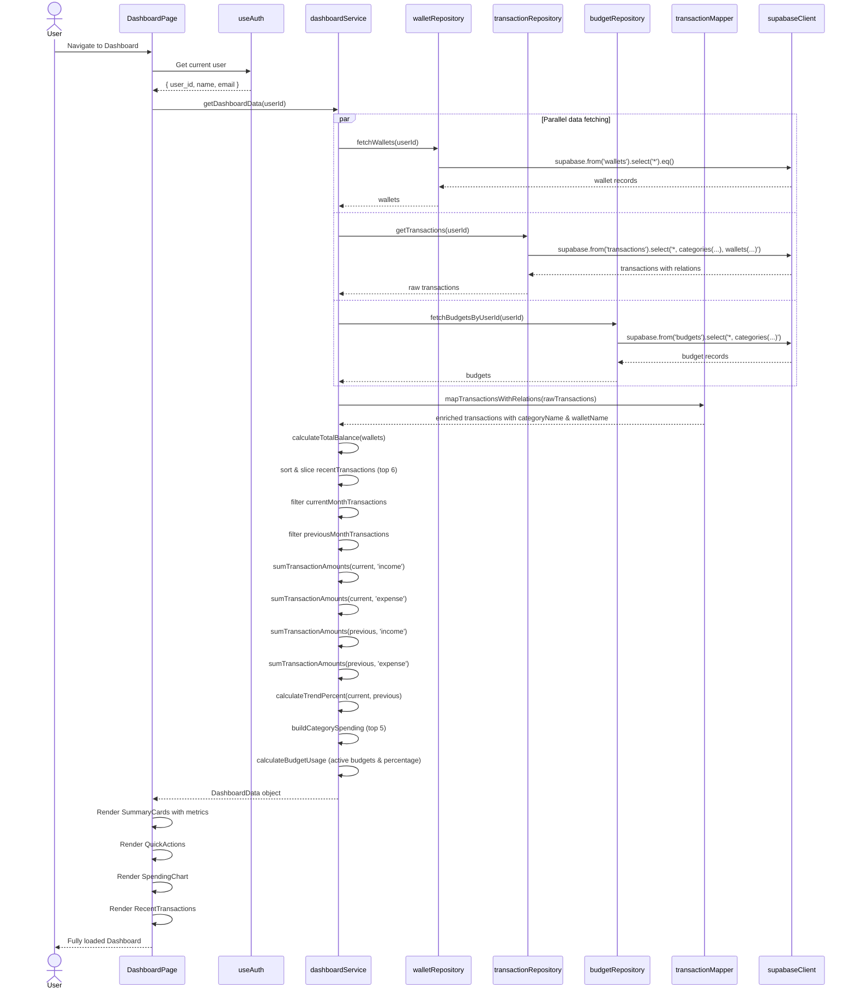
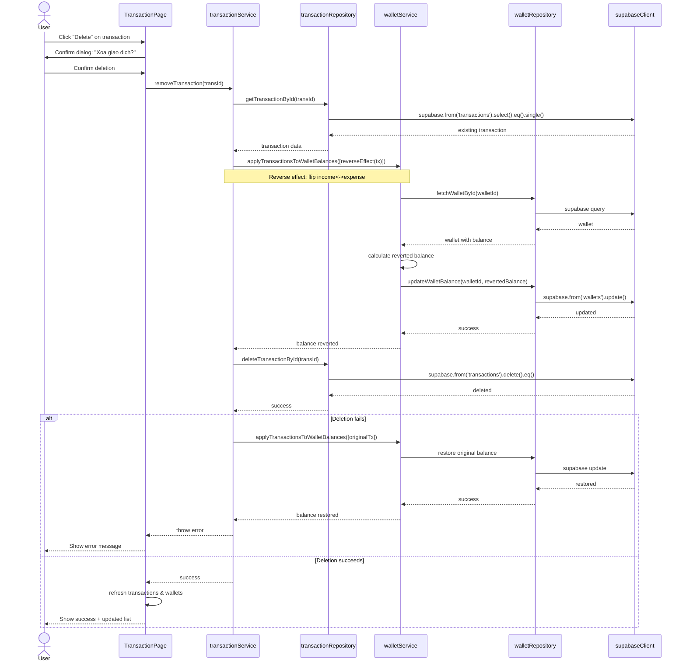
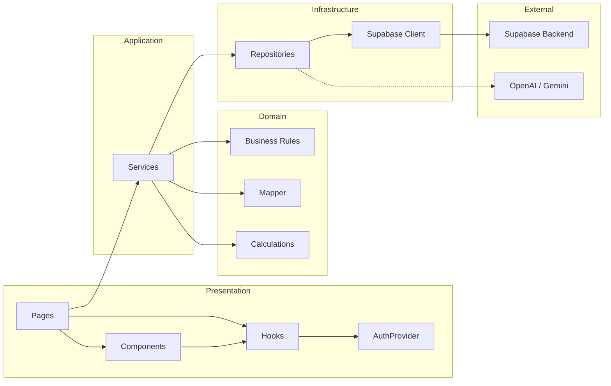

# MoneyHey Activity and Sequence Diagrams

---

## 1. Activity Diagrams

### 1.1 User Authentication Flow



### 1.2 Add Transaction Flow (Manual)

```mermaid
graph TD
    START_TX([Start]) --> NAV_TX[Navigate to Transactions Page]
    NAV_TX --> CLICK_ADD[Click "Add Transaction" button]
    CLICK_ADD --> OPEN_MODAL[Open Add Transaction Modal]
    OPEN_MODAL --> ENTER_DATA[Enter transaction data:<br/>- Wallet<br/>- Category<br/>- Amount<br/>- Note<br/>- Date<br/>- Type]
    
    ENTER_DATA --> VALIDATE{Validate input?}
    VALIDATE -- Invalid --> SHOW_VALIDATION[Show validation errors]
    SHOW_VALIDATION --> ENTER_DATA
    
    VALIDATE -- Valid --> SAVE_TX[Save transaction to Supabase]
    SAVE_TX --> UPDATE_WALLET[Update wallet balance]
    UPDATE_WALLET --> SUCCESS{Save successful?}
    
    SUCCESS -- Yes --> REFRESH_LIST[Refresh transaction list]
    REFRESH_LIST --> REFRESH_WALLETS[Refresh wallet balances]
    REFRESH_WALLETS --> CLOSE_MODAL[Close modal]
    CLOSE_MODAL --> END_TX([End])
    
    SUCCESS -- No --> ROLLBACK[Rollback wallet balance]
    ROLLBACK --> SHOW_SAVE_ERROR[Show save error]
    SHOW_SAVE_ERROR --> ENTER_DATA
```

### 1.3 AI Quick Parse Transaction Flow

```mermaid
graph TD
    START_AI([Start]) --> OPEN_AI_TAB[Open AI Quick Parse tab]
    OPEN_AI_TAB --> ENTER_TEXT[Enter unstructured text:<br/>e.g., "uong phuc long het 65k, an my cay het 79k"]
    ENTER_TEXT --> CLICK_PARSE[Click "Parse" button]
    
    CLICK_PARSE --> CHECK_CONFIG{AI configured?}
    CHECK_CONFIG -- Yes --> CALL_AI[Call AI provider API]
    CALL_AI --> AI_RESPONSE{AI response<br/>successful?}
    
    AI_RESPONSE -- Yes --> PARSE_JSON[Parse JSON response]
    PARSE_JSON --> NORMALIZE[Normalize transactions]
    NORMALIZE --> DISPLAY_PREVIEW[Display parsed transactions preview]
    
    AI_RESPONSE -- No --> FALLBACK[Use fallback heuristic parser]
    FALLBACK --> EXTRACT_AMOUNTS[Extract amounts with<br/>Vietnamese unit normalization]
    EXTRACT_AMOUNTS --> INFER_TYPE[Infer income/expense<br/>from keywords]
    INFER_TYPE --> MATCH_CATEGORY[Match categories by<br/>keyword scoring]
    MATCH_CATEGORY --> DISPLAY_PREVIEW
    
    CHECK_CONFIG -- No --> FALLBACK
    
    DISPLAY_PREVIEW --> USER_REVIEW{User reviews?}
    USER_REVIEW -- Edit --> MODIFY_TX[Modify transactions]
    MODIFY_TX --> DISPLAY_PREVIEW
    
    USER_REVIEW -- Confirm --> SAVE_ALL[Save all transactions]
    SAVE_ALL --> UPDATE_BALANCES[Update all affected<br/>wallet balances]
    UPDATE_BALANCES --> END_AI([End])
    
    USER_REVIEW -- Cancel --> END_AI
```

### 1.4 View Dashboard Flow



### 1.5 Generate Report Flow



---

## 2. Sequence Diagrams

### 2.1 User Authentication Sequence



### 2.2 Add Transaction Sequence



### 2.3 AI Quick Parse Sequence

```mermaid
sequenceDiagram
    actor U as User
    participant ATM as AddTransactionModal
    participant TIS as transactionIntelligenceService
    participant TAR as transactionAiRepository
    participant FP as Fallback Parser
    participant OP as OpenAI API / Gemini API

    U->>ATM: Switch to "AI Quick Parse" tab
    U->>ATM: Paste text:<br/>"uong phuc long het 65k, an my cay het 79k"
    U->>ATM: Click Parse

    ATM->>TIS: parseQuickTransactions({ rawText, categories })
    TIS->>TAR: getTransactionAiConfig()
    TAR-->>TIS: { provider, model, endpoint, ... }

    alt Custom endpoint configured
        TIS->>TAR: requestFromCustomEndpoint(endpoint, payload)
        TAR->>OP: POST custom endpoint
        OP-->>TAR: JSON response
        TAR-->>TIS: parsed transactions
    else Provider is Gemini
        TIS->>TAR: requestFromGemini(payload)
        TAR->>OP: POST generativelanguage.googleapis.com
        OP-->>TAR: JSON response
        TAR-->>TIS: parsed transactions
    else Provider is OpenAI (default)
        TIS->>TAR: requestFromOpenAI(payload)
        TAR->>OP: POST api.openai.com/v1/responses
        OP-->>TAR: JSON response
        TAR-->>TIS: parsed transactions
    end

    TIS->>TIS: normalizeAiTransactions()

    alt AI returns valid transactions
        TIS-->>ATM: { source: 'ai', transactions: [...] }
    else AI fails or returns empty
        TIS->>FP: parseFallbackTransactions({ rawText, categories })
        FP->>FP: Split by delimiters [\n,;]
        FP->>FP: parseAmount() with unit normalization
        FP->>FP: inferType() from income keywords
        FP->>FP: inferCategory() by keyword scoring
        FP-->>TIS: fallback transactions
        TIS-->>ATM: { source: 'fallback', reason, transactions: [...] }
    end

    ATM-->>U: Display parsed transactions with confidence scores
    U->>ATM: Review and confirm
    ATM->>ATM: Save each transaction
    ATM-->>U: Success message
```

### 2.4 Dashboard Data Loading Sequence



### 2.5 Delete Transaction Sequence (with Compensation)



---

## 3. Component Interaction Overview


