# MoneyHey Application Screen Flow

```mermaid
graph TD
    subgraph Unauthenticated
        ENTRY["/ - Entry Point"]
        LOGIN["/login - Login Page"]
        REGISTER["/register - Register Page"]
        EXPLORE["/explore - Explore Page"]
    end

    subgraph Authenticated
        DASHBOARD["/dashboard - Dashboard"]
        TRANSACTIONS["/transactions - Transactions"]
        REPORTS["/reports - Reports"]
        BUDGET["/budget - Budget"]
        PROFILE["/profile - Profile"]
        SETTINGS["/settings - Settings"]
    end

    subgraph Modals
        ADD_TX["Add Transaction Modal"]
        EDIT_TX["Edit Transaction Modal"]
    end

    ENTRY -- "Not logged in" --> LOGIN
    ENTRY -- "Already logged in" --> DASHBOARD

    LOGIN -- "Has no account" --> REGISTER
    LOGIN -- "Valid credentials" --> DASHBOARD
    LOGIN -- "Browse public content" --> EXPLORE

    REGISTER -- "Account created" --> LOGIN
    REGISTER -- "Back to login" --> LOGIN

    EXPLORE -- "Login" --> LOGIN
    EXPLORE -- "Register" --> REGISTER

    DASHBOARD -- "Sidebar: Transactions" --> TRANSACTIONS
    DASHBOARD -- "Sidebar: Reports" --> REPORTS
    DASHBOARD -- "Sidebar: Budget" --> BUDGET
    DASHBOARD -- "Sidebar: Profile" --> PROFILE
    DASHBOARD -- "Sidebar: Settings" --> SETTINGS
    DASHBOARD -- "Header: Logout" --> LOGIN
    DASHBOARD -- "Quick Action: Add Expense/Income" --> TRANSACTIONS
    DASHBOARD -- "Quick Action: View Report" --> REPORTS

    TRANSACTIONS -- "Sidebar: Dashboard" --> DASHBOARD
    TRANSACTIONS -- "Sidebar: Reports" --> REPORTS
    TRANSACTIONS -- "Sidebar: Budget" --> BUDGET
    TRANSACTIONS -- "Sidebar: Profile" --> PROFILE
    TRANSACTIONS -- "Sidebar: Settings" --> SETTINGS
    TRANSACTIONS -- "Header: Logout" --> LOGIN
    TRANSACTIONS -- "Button: Add Transaction" --> ADD_TX
    TRANSACTIONS -- "Action: Edit" --> EDIT_TX
    TRANSACTIONS -- "Action: Delete" --> TRANSACTIONS
    ADD_TX -- "Saved / Closed" --> TRANSACTIONS
    EDIT_TX -- "Saved / Closed" --> TRANSACTIONS

    REPORTS -- "Sidebar: Dashboard" --> DASHBOARD
    REPORTS -- "Sidebar: Transactions" --> TRANSACTIONS
    REPORTS -- "Sidebar: Budget" --> BUDGET
    REPORTS -- "Sidebar: Profile" --> PROFILE
    REPORTS -- "Sidebar: Settings" --> SETTINGS
    REPORTS -- "Header: Logout" --> LOGIN

    BUDGET -- "Sidebar: Dashboard" --> DASHBOARD
    BUDGET -- "Sidebar: Transactions" --> TRANSACTIONS
    BUDGET -- "Sidebar: Reports" --> REPORTS
    BUDGET -- "Sidebar: Profile" --> PROFILE
    BUDGET -- "Sidebar: Settings" --> SETTINGS
    BUDGET -- "Header: Logout" --> LOGIN

    PROFILE -- "Sidebar: Dashboard" --> DASHBOARD
    PROFILE -- "Sidebar: Transactions" --> TRANSACTIONS
    PROFILE -- "Sidebar: Reports" --> REPORTS
    PROFILE -- "Sidebar: Budget" --> BUDGET
    PROFILE -- "Sidebar: Settings" --> SETTINGS
    PROFILE -- "Header: Logout" --> LOGIN

    SETTINGS -- "Sidebar: Dashboard" --> DASHBOARD
    SETTINGS -- "Sidebar: Transactions" --> TRANSACTIONS
    SETTINGS -- "Sidebar: Reports" --> REPORTS
    SETTINGS -- "Sidebar: Budget" --> BUDGET
    SETTINGS -- "Sidebar: Profile" --> PROFILE
    SETTINGS -- "Header: Logout" --> LOGIN
```



## Screen Flow Description

### Entry & Authentication Flow

| Step | Screen | Action | Next Screen |
|------|--------|--------|-------------|
| 1 | **Entry Point** (`/`) | User opens app, not logged in | Login Page |
| 1a | **Entry Point** (`/`) | User opens app, already logged in | Dashboard |
| 2 | **Login** (`/login`) | Clicks "Register" | Register Page |
| 2a | **Login** (`/login`) | Enters valid credentials | Dashboard |
| 2b | **Login** (`/login`) | Clicks "Explore" | Explore Page |
| 3 | **Register** (`/register`) | Completes registration | Login Page |
| 3a | **Register** (`/register`) | Clicks "Back to login" | Login Page |
| 4 | **Explore** (`/explore`) | Clicks "Login" or "Register" | Login / Register |

### Authenticated Navigation Flow

All authenticated screens share a **common layout** with:
- **Header** (top bar with sidebar toggle, user info, logout)
- **Sidebar** (collapsible navigation menu)

| From Screen | Navigation Action | To Screen |
|-------------|-------------------|-----------|
| **Dashboard** | Sidebar: Transactions | Transaction Page |
| **Dashboard** | Sidebar: Reports | Report Page |
| **Dashboard** | Sidebar: Budget | Budget Page |
| **Dashboard** | Sidebar: Profile | Profile Page |
| **Dashboard** | Sidebar: Settings | Settings Page |
| **Dashboard** | Quick Action: Add Expense/Income | Transaction Page |
| **Dashboard** | Quick Action: View Report | Report Page |
| **Dashboard** | Header: Logout | Login Page |
| **Transactions** | Sidebar: Dashboard | Dashboard |
| **Transactions** | Sidebar: Reports | Report Page |
| **Transactions** | Sidebar: Budget | Budget Page |
| **Transactions** | Sidebar: Profile | Profile Page |
| **Transactions** | Sidebar: Settings | Settings Page |
| **Transactions** | Button: Add Transaction | Add Transaction Modal |
| **Transactions** | Action: Edit Transaction | Edit Transaction Modal |
| **Transactions** | Action: Delete Transaction | Remains on Transaction Page |
| **Transactions** | Header: Logout | Login Page |
| **Reports** | Sidebar: Dashboard | Dashboard |
| **Reports** | Sidebar: Transactions | Transaction Page |
| **Reports** | Sidebar: Budget | Budget Page |
| **Reports** | Sidebar: Profile | Profile Page |
| **Reports** | Sidebar: Settings | Settings Page |
| **Reports** | Header: Logout | Login Page |
| **Budget** | Sidebar: Dashboard | Dashboard |
| **Budget** | Sidebar: Transactions | Transaction Page |
| **Budget** | Sidebar: Reports | Report Page |
| **Budget** | Sidebar: Profile | Profile Page |
| **Budget** | Sidebar: Settings | Settings Page |
| **Budget** | Header: Logout | Login Page |
| **Profile** | Sidebar: Dashboard | Dashboard |
| **Profile** | Sidebar: Transactions | Transaction Page |
| **Profile** | Sidebar: Reports | Report Page |
| **Profile** | Sidebar: Budget | Budget Page |
| **Profile** | Sidebar: Settings | Settings Page |
| **Profile** | Header: Logout | Login Page |
| **Settings** | Sidebar: Dashboard | Dashboard |
| **Settings** | Sidebar: Transactions | Transaction Page |
| **Settings** | Sidebar: Reports | Report Page |
| **Settings** | Sidebar: Budget | Budget Page |
| **Settings** | Sidebar: Profile | Profile Page |
| **Settings** | Header: Logout | Login Page |

### Modal Flows

| Modal | Trigger | Close Action | Result |
|-------|---------|--------------|--------|
| **Add Transaction** | "Add Transaction" button on Transaction Page | Save or Close | Returns to Transaction Page, refreshes list |
| **Edit Transaction** | "Edit" action on transaction row | Save or Close | Returns to Transaction Page, refreshes list |

### Sidebar Navigation Map

The sidebar provides persistent navigation across all authenticated screens:

```
+----------------------------------+
|  Sidebar Navigation               |
+----------------------------------+
|  [dashboard] Dashboard            |
|  [receipt_long] Transactions      |
|  [bar_chart] Reports              |
|  [account_balance_wallet] Budget  |
|  [person] Profile                 |
|  [settings] Settings              |
+----------------------------------+
```

### Quick Actions Dashboard Shortcuts

From the Dashboard, users can use **Quick Actions** to jump directly to:
- Add Expense → Transaction Page
- Add Income → Transaction Page
- View Report → Report Page
- View Wallet → Transaction Page

### Session Termination Flow

| Action | From | To |
|--------|------|-----|
| Click Logout | Any authenticated screen | Login Page (`/login`) |
| Session expires | Any authenticated screen | Redirected to Login Page |
