# MoneyHey Use Case Diagram

```mermaid
graph LR
    subgraph Actors
        G[Guest]
        U[Authenticated User]
    end

    subgraph Authentication
        UC1[Register Account]
        UC2[Login]
        UC3[Logout]
    end

    subgraph Dashboard
        UC4[View Dashboard]
        UC5[View Summary Cards]
        UC6[View Spending Chart]
        UC7[View Recent Transactions]
    end

    subgraph TransactionManagement
        UC8[Create Transaction]
        UC9[Edit Transaction]
        UC10[Delete Transaction]
        UC11[Filter Transactions]
        UC12[Paginate Transactions]
        UC13[Use AI Quick Parse]
    end

    subgraph WalletManagement
        UC14[Create Wallet]
        UC15[View Wallets]
        UC16[Update Wallet]
        UC17[Delete Wallet]
    end

    subgraph CategoryManagement
        UC18[View Categories]
        UC19[Create Category]
    end

    subgraph BudgetManagement
        UC20[View Budgets]
        UC21[Add Budget]
        UC22[Track Budget Usage]
    end

    subgraph Reporting
        UC23[View Expense Pie Chart]
        UC24[View Expense Bar Chart]
        UC25[View Spending Trend Line Chart]
        UC26[View Financial Summary]
    end

    subgraph UserProfile
        UC27[View Profile]
        UC28[Update Profile]
    end

    subgraph Settings
        UC29[Configure Theme]
        UC30[Manage Preferences]
    end

    G --> UC1
    G --> UC2
    G --> UC31[Explore Public Page]

    U --> UC2
    U --> UC3
    U --> UC4
    U --> UC5
    U --> UC6
    U --> UC7
    U --> UC8
    U --> UC9
    U --> UC10
    U --> UC11
    U --> UC12
    U --> UC13
    U --> UC14
    U --> UC15
    U --> UC16
    U --> UC17
    U --> UC18
    U --> UC19
    U --> UC20
    U --> UC21
    U --> UC22
    U --> UC23
    U --> UC24
    U --> UC25
    U --> UC26
    U --> UC27
    U --> UC28
    U --> UC29
    U --> UC30
```

## Actor Descriptions

| Actor | Description |
|-------|-------------|
| **Guest** | Unauthenticated visitor who can register, log in, or explore public content |
| **Authenticated User** | Logged-in user with full access to personal financial data and features |

## Use Case Descriptions

### Authentication
| Use Case | Description |
|----------|-------------|
| Register Account | Create a new user account with email and password via Supabase Auth |
| Login | Authenticate using email/password credentials |
| Logout | End the current session and clear authentication state |

### Dashboard
| Use Case | Description |
|----------|-------------|
| View Dashboard | Access the main dashboard page with all summary widgets |
| View Summary Cards | See total balance, monthly income, monthly expense, and active budgets |
| View Spending Chart | Visualize top spending categories as a horizontal bar chart |
| View Recent Transactions | Browse the 6 most recent transactions |

### Transaction Management
| Use Case | Description |
|----------|-------------|
| Create Transaction | Add a new income or expense transaction with wallet, category, amount, note, and date |
| Edit Transaction | Modify an existing transaction's details |
| Delete Transaction | Remove a transaction with automatic wallet balance rollback |
| Filter Transactions | Search and filter by date range, category, wallet, type, or keyword |
| Paginate Transactions | Navigate through transaction lists with pagination controls |
| Use AI Quick Parse | Paste unstructured Vietnamese text to auto-generate multiple structured transactions |

### Wallet Management
| Use Case | Description |
|----------|-------------|
| Create Wallet | Add a new wallet with a name and initial balance |
| View Wallets | List all personal wallets with current balances |
| Update Wallet | Edit wallet name or balance |
| Delete Wallet | Remove a wallet (only allowed if it has no transactions) |

### Category Management
| Use Case | Description |
|----------|-------------|
| View Categories | Browse available transaction categories |
| Create Category | Add a custom category with type (income/expense) |

### Budget Management
| Use Case | Description |
|----------|-------------|
| View Budgets | See all active budgets with progress bars and status indicators |
| Add Budget | Create a new budget with amount, date range, and optional category |
| Track Budget Usage | Monitor spending against budget limits |

### Reporting
| Use Case | Description |
|----------|-------------|
| View Expense Pie Chart | Interactive donut chart showing expense distribution by category |
| View Expense Bar Chart | Bar chart comparing absolute spending per category |
| View Spending Trend Line Chart | Line chart showing expense trends over the last 6 months |
| View Financial Summary | See total income, total expense, net cash flow, and wallet balance |

### User Profile
| Use Case | Description |
|----------|-------------|
| View Profile | Display user profile information (name, email, avatar) |
| Update Profile | Edit profile details |

### Settings
| Use Case | Description |
|----------|-------------|
| Configure Theme | Toggle between light and dark themes |
| Manage Preferences | Update application preferences stored in localStorage |
